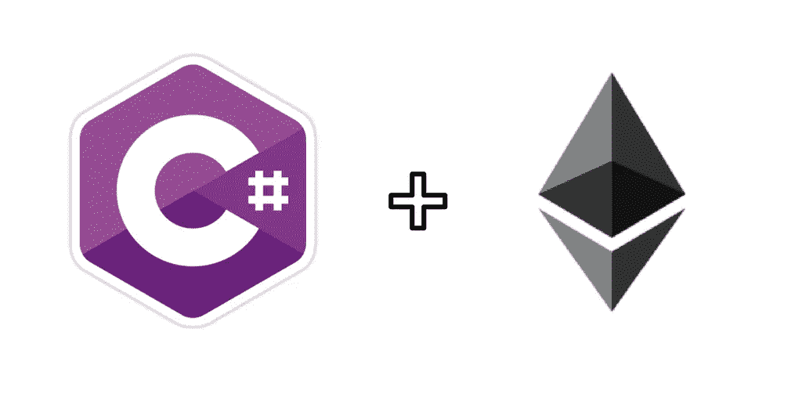

# C#中的以太坊智能合约 EthSharp 简介

> 原文：<https://medium.com/hackernoon/ethereum-smart-contracts-in-c-introducing-ethsharp-12c7a5db0b5>



注意:这有点过时了——EthSharp 最终停产了。然而，这项工作已经在 Stratis 上取得了进展。点击了解更多[。](https://hackernoon.com/a-token-smart-contract-executing-in-native-net-and-92ceaf972713)

[以太坊](https://hackernoon.com/tagged/ethereum)发展生态系统年轻。因此，在以太坊[和区块链](https://hackernoon.com/tagged/blockchain)开始构建去中心化应用的门槛很高。初涉以太坊的开发者受限于使用不熟悉的语言和开发环境，以及几乎所有的命令行工具。

对于发烧友来说，这不是问题，但对于主流采用来说，这是一个障碍，尤其是考虑到开发人员已经不得不学习新框架以跟上的荒谬速度。想要涉足以太坊开发的公司要么雇佣新的人才，要么重新培训他们现有的团队。希望迈出这一步并开始构建自己的宏伟构想的个人，必须先跨越投入时间学习和理解新语法的心理障碍，然后才能开发原型。

这就是为什么我创建了 EthSharp，一个计划让以太坊和区块链开发像 web 开发一样简单的组织。而且是从新(旧？)智能合约开发语言。

# **c#中的以太坊智能合约**

到目前为止，我们已经在 c#--> EVM 编译器上取得了实质性的进展。点击查看源代码并跟踪进度[。**请不要将其用于任何重要的用例**。**它未经测试，也没有为真实世界的用例做好准备。**](https://github.com/EthSharp/ethsharp-compiler)

这将会变得很快很快。如果你不是程序员，这里有一些你需要知道的:现在，你可以用 C#成功地编写真正基本的*契约，这些契约将使用 EthSharp 编译成以太坊字节码。*

这就是当前的 EthSharp 合同的样子。目前功能有限，但这可以编译…

```
using EthSharp.ContractDevelopment;public class SimpleTest : Contract
{
    public UInt256 StoredData { get; private set; } public void Increase()
    {
        StoredData = StoredData + 1;
    }
}
```

对此:

```
6053600C60003960536000F360606040526000357C0100000000000000000000000000000000000000000000000000000000900463FFFFFFFF1680631FB5D01A146043578063FB6F957914604857FE5B600054F35B60005460010160005500
```

随意比较一下类似的 solidity 契约是什么样子的。重要的是，您会注意到 EthSharp 订阅了与 web3 和 solidity 相同的 ABI，因此您可以像使用 solidity 一样与 EthSharp 契约上的函数进行交互。

# 长期的

有太多东西可以写了:

*   设计决策
*   合同会是什么样的？说明块和消息对象
*   为什么用 C#？
*   路线图和时间表—何时可以投入生产？

希望在接下来的几周里，如果有兴趣的话，我可以谈谈上面的一些内容。

最终目标是能够用熟悉的语言编写智能合约，并在一个已知的友好界面中测试和部署它们。类似于… Visual Studio，也许？

EthSharp 编译器还有很长的路要走，但对于生态系统的增长来说，我们认为这是朝着正确方向迈出的一大步。如果你有兴趣使用它，或者想贡献，一定要联系！