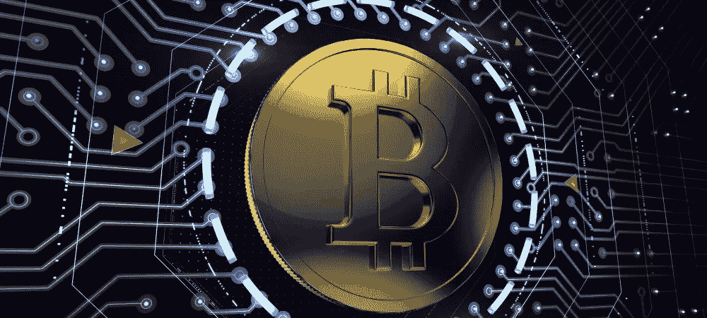

# 什么是以太坊:万能区块链？

> 原文：<https://medium.com/hackernoon/ethereum-the-all-purpose-blockchain-7270f3088a19>

我们今天使用的许多服务有一个共同点:它们由一个中央机构管理。当我们把钱存入银行时，我们相信银行会保管好我们的钱。当我们购买保险时，我们相信保险公司会按照我们同意的条款交付。同样，对于我们的 Gmail 帐户，我们相信谷歌会安全地存储我们的个人信息并维护我们的隐私。数百年来，集中式模型一直是业务标准，但历史证明它有许多缺陷。政府影响第三方信息服务的记录好坏参半(还记得美国政府试图拉拢硅谷吗？).集中化的商业模式提供了便利，但是单点故障使它们容易受到攻击，正如我们在类似[雅虎的安全漏洞中反复看到的那样。黑掉了](https://www.nytimes.com/2016/12/14/technology/yahoo-hack.html?mcubz=0)，最近又黑掉了[的 Equifax](http://money.cnn.com/2017/09/07/technology/business/equifax-data-breach/index.html) 。

以太坊是一个开源的、使用区块链技术的分散平台，支持分散应用程序和智能合约的开发。分散式应用程序没有中间人，用户以点对点的方式进行交互。智能合同是编码到程序中的业务逻辑，能够自动化、促进、执行和实施协议条款。以太坊的区块链连接了世界各地的数千台计算机(称为节点)，形成了一个巨大的、多次镜像的“世界计算机”任何人都可以访问它，上传程序，并在上执行程序。

# 这不仅仅是钱

以太坊旨在将区块链技术应用于支付之外的应用。它的平台是在比特币的基础上改进的，作为一个可编程的通用区块链，它可以做任何其他区块链可以做的事情，甚至更多。以太坊的天才之处在于它的设计支持 1)图灵完全编程语言和 2)丰富的有状态性。更简单地说，“图灵完全”意味着以太坊可以计算任何给定足够资源的可计算事物。“丰富的状态”指的是系统在区块链水平上记忆事物的能力。总之，这些功能支持智能合同和 DApps(分散式应用程序)的实现。

智能合同是生活在区块链的成文协议，当某些事件触发时，可以移动数字资产。这些数字合同可以被指示执行有条件的(“如果这个，那么那个”)交易或功能。如果满足预定义的条件，则执行预定义的功能。例如，旅行保险可以利用智能合同。如果您为这份旅行保险智能合同贡献力量，您的机票详情、旅行信息、保险支付和索赔将在区块链被铭记。这份智能合同将监控您旅行的相关信息。如果您的航班被取消或延迟，合同会自动更新并执行您的保单，向您退款或为您重新预订另一个航班。

如上所述，以太网是构建分散应用程序(或 DApps)的平台。一般来说，DApps 可以指任何建立在区块链之上的应用。这里有一本关于区块链的快速入门书:区块链是一个分布式分类账，其中运行网络的每个节点都有一个相同的副本。未记录的事务被分组到块中，供挖掘者处理。矿工的任务是解决一个复杂的数学难题，以验证交易的有效性，并将其记录在链上。一旦交易记录在区块链，交易就是永久的。

分散应用继承了区块链技术令人兴奋的特点:

**防篡改**:数据一旦在区块链
上就不可更改**透明:**可完全审核
可信:协商一致验证([工作证明](https://en.wikipedia.org/wiki/Proof-of-work_system))*即将更改为[股权凭证](http://boxmining.com/ethereum-proof-of-stake/)
**安全:**分布式网络，加密

# 以太博物馆是用来做什么的？

以太网开发人员可以自由构建任何东西。比特币作为电子现金支付只是区块链技术的一个特殊应用。以太网将区块链技术的密码证明和分布式共识的概念扩展到了无信任协议。以下是一些强大的颠覆性使用案例:

## 释放物联网的潜力

到 2020 年，全球将有超过 200 亿台联网设备。物联网生态系统的增长带来了识别、连接和保护这些设备等挑战。当前的基础设施无疑需要最大限度地发挥智能设备的潜力。分散的应用可以支持机器对机器(M2M)通信的经济性。

总部位于以太坊的初创公司 Chronicled 正在开发一个开源注册表和协议，使物理财产能够安全地链接到区块链。Chronicled 还在开发具有独特身份的微芯片，这种微芯片可以将不可变的时间戳交易写入区块链，用于广泛的用例，如产品认证、产品跟踪、基于邻近的商务、物联网互操作性、逐项保险和军事应用。

物联网领域另一家基于以太坊的初创公司是 Slock.it。这家公司正在建立一个名为“通用共享网络”的基础设施，允许用户以类似于 Airbnb 的方式从他人那里租赁互联网连接的对象。Slock .它希望让用户能够从你的智能手机上找到并租赁任何未充分利用的资产，如空置房屋、办公空间以及机器。

## 版权管理

版权管理长期以来一直是文化和艺术行业的一个难题——美术、音乐、出版、电影等等。艺术家依靠版税和许可费来获得内容补偿，但互联网使得追踪受版权保护的材料的非法发行变得不可能。以太坊可以始终确保内容的真实所有权，智能合同可以实时支付版税。艺术家将能够通过消除像管理和分发他们的内容的第三方机构来最大化他们的收入。

Ujo 正在建立一个“权利和支付基础设施”，允许艺术家管理他们的音乐许可和发行。艺术家可以简单地利用 Ujo 的平台来完成同样的事情，而不是注册版权并与出版商签约以强制使用艺术家作品的人付款。

## 身份验证系统

我们向他人证明身份的方式仍然依赖于纸质/塑料文件、身体接触和手写签名。我们的数字身份是分散的，分布在世界各地，因为今天几乎所有的服务都需要我们注册，从网上购物到看医生。随着数据库的增长和共享这些数据的动机的增加，这些集中化的公司变得对我们的数据漠不关心。我们的生活变得越来越数字化，保持我们的个人信息安全并在需要时共享是很困难的。uPort 是一款 DApp，旨在让您重新掌控自己的身份，并轻松证明自己的身份。它是一个基于以太坊的自我主权身份系统，允许人们完全控制其个人信息的流动，并在各种环境中验证自己。

## 保险

智能合同实现了保险单的自动化，以简化条款。保险合同可以支付一份保单，而不需要投保人和保险代理人采取行动的缓慢、多步骤的过程，这一想法令人兴奋和诱人。Dynamis 是一个运行在以太坊平台上的点对点保险智能合约。它通过使用 LinkedIn 社交网络作为声誉系统来提供补充失业保险。我在本文前面使用的关于旅游保险的例子是真实的。Etherisc 是一个分散的航班延误保险应用程序，它可以完全自主地发布保单并支付有效的索赔。

## 未来(分散的自治组织)

想象一辆可以自理的自动驾驶汽车；它将有一个数字货币预算来获得汽油，当它的传感器检测到问题时支付维护费用，并且它可以从一个位置到另一个位置。它将加入一个类似优步的拼车网络，本质上是一台为自己工作的机器。为了让它不那么奇怪，给汽车一些个性可能是个好主意，比如友好的声音或穿着司机服装的木偶。机器成为我们经济成员的想法正在慢慢接近现实。虽然这听起来像科幻小说，以太坊使这种分散自治组织(Dao)完全成为可能。

DAO 是一个完全独立的实体，它是分布式的、透明的、自我维持的，并且完全由规则成员编程控制。在最基本的形式下，一个组织可以简化为一组合同。工人们明白他们的角色，并获得雇佣合同中规定的薪水。供应商和客户有维护供应链关系的商业合同。办公场所、机器、知识产权都有租赁协议。理论上，这些合同可以通过智能合同来替代。一个 DAO 不仅仅是将区块链技术应用于一个组织——代码本身就是整个公司。以太坊为下一代互联网技术铺平了道路，这些技术将改善我们今天拥有的基础设施，如托管服务、政府、p2p 市场、社交网络、保险、汇款服务、身份系统、文件存储、医疗记录、房地产、智能财产等。

*原载于 2017 年 11 月 10 日*[*【crypt0bits.com】*](http://crypt0bits.com/2017/11/10/what-is-ethereum/)*(那是带零的加密)。*