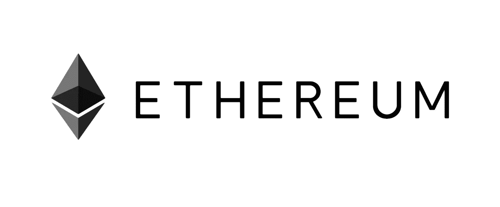

# 以太坊将成为下一个脸书

> 原文：<https://medium.com/hackernoon/ethereum-will-be-the-next-facebook-4fd7e28b3909>

## 基本分析

2017 年对于以太坊来说是令人惊叹的一年。价格创下了 800 美元的历史新高，现在每天处理的比特币交易数量接近两倍，达到 100 万。

随着我们进入 2018 年，我认为以太坊将成为下一个脸书，因为我在主要行业中发现了大量从去中心化和透明度中受益匪浅的用例。

以太坊基本上是区块链的应用商店。它允许创作者构建和运行应用程序，而不必像苹果一样担心底层的“操作”系统。

以下是一些需要注意的地方:

**筹款和 ICOs**

ico 是以太坊最大的真实用例。传统上，要为你的想法提供资金，你必须向银行借钱，向风投放弃大量股权，或者从贷款网站获得高额贷款。基本上，ICOs 是一个类固醇 kickstarter。

作为 fundyourselfnow.com 的创始人，我曾与世界各地的企业家合作开发他们的产品，为他们的 ico 做好准备。许多人来自发展中国家，如印度尼西亚( [EagleCoin](http://eaglepay.io/) )和印度( [WandX](http://www.wandx.co/) )，由于缺乏当地投资者，他们很难为自己的想法筹集到大量资金。

ico 正在使资金民主化，并从全世界渴望创新的年轻企业家中催生下一波创新浪潮，他们最终将为当地社区做出贡献，创造更美好的未来。

**支付&借贷**

目前，加密货币很难消费。TenX、 [Monaco](https://www.google.com.sg/url?sa=t&rct=j&q=&esrc=s&source=web&cd=3&cad=rja&uact=8&ved=0ahUKEwjN5eSt4pzYAhWMvY8KHXn0B74QFgg6MAI&url=https%3A%2F%2Fmona.co%2F&usg=AOvVaw17_z6PlnYtdvXDJAOgqPfJ) 、 [Tokencard](http://tokencard.io) 等加密信用卡公司正在填补这一空白。都是建立在以太坊网络上的。我个人持有一张 TenX 卡，并使用它使用比特币在日常商品和服务上消费。

特别是摩纳哥，已经得到了 VISA 的官方批准，可以向新加坡居民发放信用卡。预计到 2018 年，随着许多加密卡公司获得 VISA 或 MasterCard 的官方批准，加密货币的实际支出将大幅增加。

基于以太坊的贷款解决方案也在兴起，如 [SALT](http://saltlending.com) lending 和 [ETHLend](https://ethlend.io/en/) 。预计利率将比从银行获得的利率更公平，全球人民即使没有银行账户也可以获得融资。

我预计 2018 年将是我们帮助[许多没有银行账户的人](https://www.techinasia.com/talk/438m-unbanked-southeast-asia-fintech)融入这个新的数字世界的一年。

**赌博**

博彩业被颠覆的时机已经成熟。2017 年从一个非常简单的骰子游戏开始， [etheroll](http://etheroll.com/) 。你发送以太网到智能合同，奖金在几分钟内就会送到你手中。到目前为止，Etheroll 已经下注超过 260，000 ethers(约 2000 万美元)，考虑到这个游戏是如此简单和基本，这是令人难以置信的。

密切关注 2018 年的[无边缘](http://edgeless.io/)和[游乐场](https://funfair.io/)，因为其中一个有可能成长为最大的全球在线赌场。与传统的现实世界赌场相比，它们具有显著的优势:

1.  没有资本管制
2.  匿名，钱不通过银行系统流动
3.  不可信的智能合同处理支出，并确保游戏的公平性。

**游戏**

游戏的虚拟本质非常适合区块链。许多成功的游戏公司已经开始在他们的游戏/产品中包含代币来资助他们的游戏生态系统。

以下是一些有趣的令牌使用方式(并非详尽):

分散土地在他们的虚拟世界中购买土地。虚拟世界自 2003 年第二人生问世以来就一直存在，以太坊可能是推动它最终腾飞的燃料

engin Coin——用于创建人们可以在市场上交易的虚拟商品。不要在大多数游戏中使用“黄金”，预计 2018 年的游戏会要求你使用自己的以太坊游戏令牌来制作和交易物品。

[CryptoKitties](https://www.cryptokitties.co/) — Tokens 代表区块链的一只数码猫。自 12 月初推出以来，已有超过 1700 万只猫成交，其中最贵的猫[售价超过 10 万美元。](http://kittysales.herokuapp.com)

更有趣的是，随着以太币在游戏中的使用，这可能意味着你最终可以在游戏中交易物品。例如，你可以使用 ENJ/马纳交易对，通过分散交易，用一枚金恩硬币交换分散大陆的土地。目前“孤岛式”的虚拟世界经济可能会随着跨世界“交易”的能力而改变。

**遗言**

我认为流入以太坊和整个加密货币市场的资金是积极的。支撑以太坊的技术在现实世界中有很多应用尚未被发现，资金正以令人难以置信的速度通过 ico 流入创新的以太坊项目。

大约 13 年前，马克·扎克伯格在 20 岁时创立了 facebook，它彻底改变了我们与朋友和家人互动的方式。

以太坊的创始人 Vitalik 大约 3 年前也是在 20 岁的时候创立了以太坊。我坚信，在未来 10 年内，以太坊将彻底改变我们与世界的互动。

**祝大家圣诞快乐，新年快乐！**

肯尼斯·谭，

联合创始人，FundYourselfNow

渴望了解更多关于 FundYourselfNow 的信息吗？在我们的 [Telegram](https://t.me/fundyourselfnow) 群组上加入我们的众筹革命对话，或者在 [Twitter 上关注我们。](https://twitter.com/fundyourselfnow)