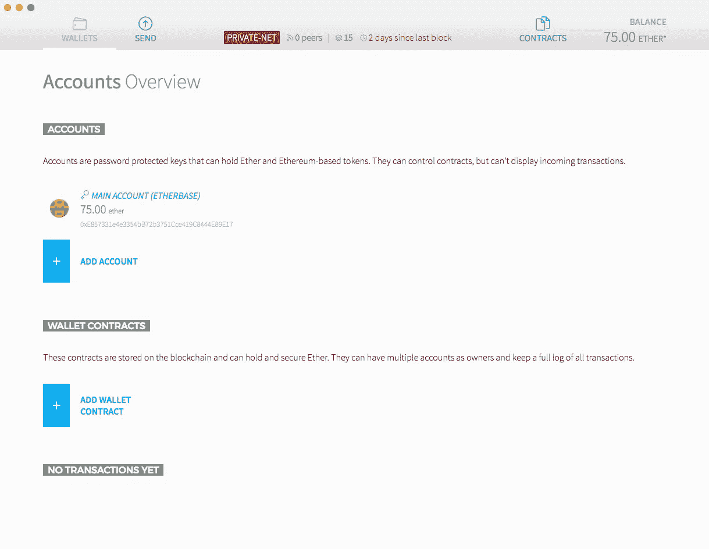
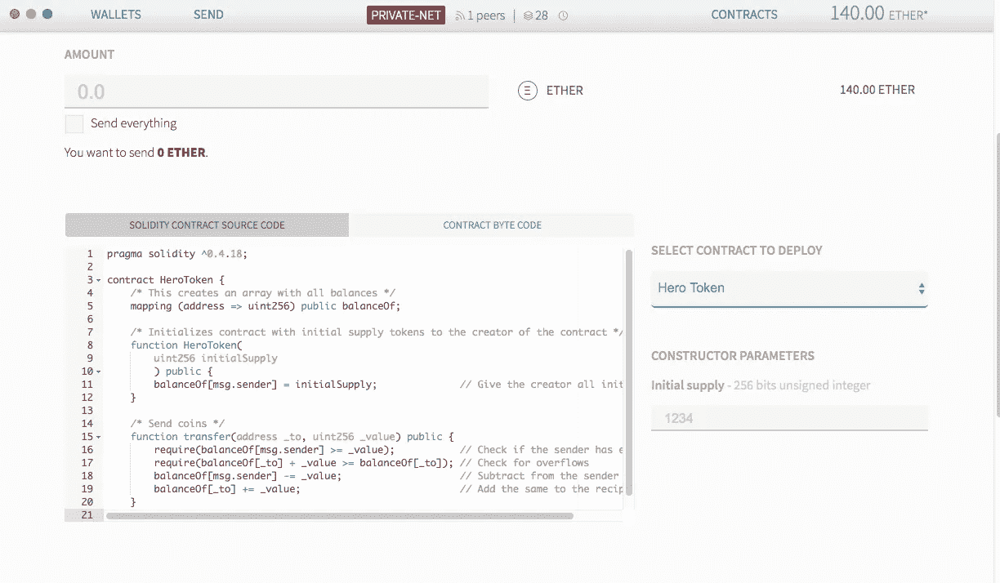
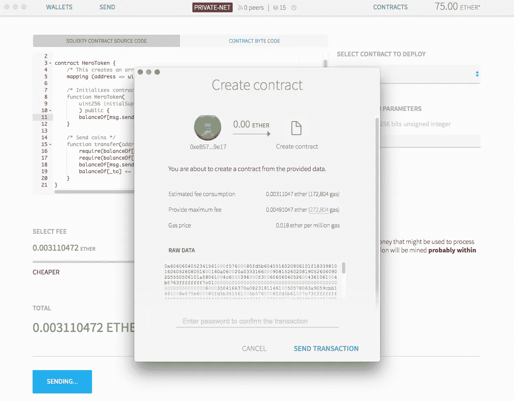
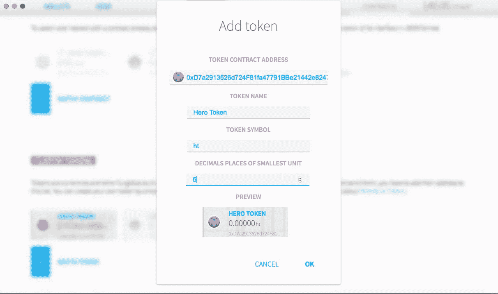
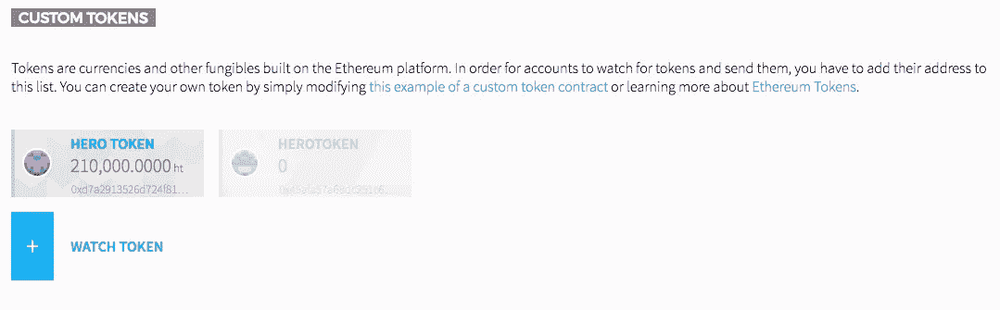
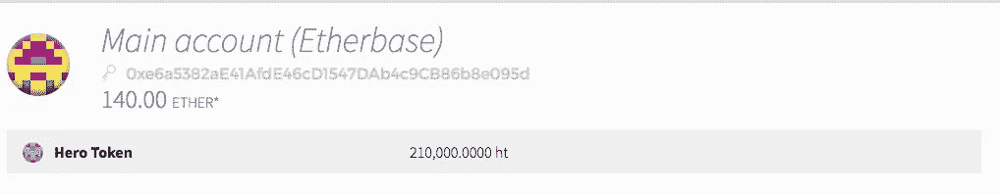

# 以太坊零到英雄:开发我们的第一份合同

> 原文：<https://medium.com/hackernoon/ethereum-zero-to-hero-developing-our-first-contract-d8578c040475>

这是我们以太坊零到英雄指南的第三部分。如果你还没有阅读前一篇文章，我强烈建议你在阅读前先看看。

在这篇文章中，我们将继续讨论，并开始开发一个基本的智能合同，学习更多关于可靠性和合同如何工作的知识。

以太坊区块链最有趣的特性之一是**创建数字代币**的能力。代币是数字资产，可以代表任何东西，从**硬币**、**忠诚度积分**到现实世界中的实际**物品**。令牌还可以用于与其他**智能合约**进行交互。

代币在以太坊网络中作为加密货币出售和交易，并允许用户支付智能合约交易费用，对于我们的第一个合约，我们将创建部署在我们的私有网络上所需的**最小可行合约**。

## 关于 ERC20 的一句话

通常在处理令牌时，您会看到引用了单词 ERC20。 **ERC20** 是一个令牌标准，描述了以太坊令牌合约必须实现的功能和事件，通过遵循该标准，我们保证令牌将立即与以太坊钱包和任何其他使用相同**标准**的客户端或合约兼容。

为了使令牌符合 ERC20 标准，它必须实现以下功能:

有关 ERC20 标准的更多详情，请查看以下链接:

*   [ERC20 令牌标准](https://theethereum.wiki/w/index.php/ERC20_Token_Standard)
*   [ERC20 改进建议(EIP)](https://github.com/ethereum/EIPs/blob/master/EIPS/eip-20-token-standard.md)

## 以太坊钱包

> 以太坊钱包是以太坊区块链去中心化应用的入口。它允许你持有和保护以太和其他建立在以太坊上的加密资产，以及撰写、部署和使用智能合同。

到目前为止，我们一直直接在 **Geth** 控制台上工作，虽然我强烈建议**以太坊开发者**熟悉和了解 **Geth** 以便了解一些**以太坊**的内部运作方式，从而更快地移动和更智能地工作，但我们将切换到官方以太坊钱包:

在继续之前，请确保下载并安装以太坊钱包。

## 将钱包连接到我们的私人测试网

默认情况下，**以太坊钱包**会尝试连接到主网络，它也允许你连接到一个测试网络。

出于我们的目的，我们希望它自动开始连接到我们的 testnet，因此在打开钱包之前，请执行以下操作:

> **免责声明**:以下操作将覆盖主网络的任何本地信息，这可能会导致以太网丢失，请小心并理解您正在运行的命令。

1.  停止正在运行的 geth 节点
2.  运行以下命令

`geth --datadir ./TestNetData --identity "HeroNode1" --ipcpath ~/Library/Ethereum/geth.ipc --networkid 24 --maxpeers 1 console`

现在，我们可以打开我们的以太坊钱包，它应该会自动连接到测试网络，我们所做的是重新启动我们的 Geth 节点，并在钱包的默认位置设置 IPC(进程间通信)管道，这样钱包将直接建立到我们的 Geth 节点的连接，而不是创建到主网络的连接。

继续操作之前，请确保钱包显示的网络名称为 **Private-Net** 。

# 最小可行令牌

正如我们在本系列的第一篇文章中了解到的，合同是使用 **Solidity** 语言编程的；有几个工具可用于**编译**、**调试**和**编写**实体合同，目前我们将使用以太坊钱包附带的实体合同编辑器。

以下是我们最小可行令牌的代码:

现在从上面抓取源代码并粘贴到 **Solidity 合同源代码字段**。钱包将自动检查代码**是否编译了**，如果编译了，您将在右侧看到一个“选择合同”下拉列表，如下所示:

值得注意的一件有趣的事情是，还有一个构造函数参数，在这个例子中，是一个初始供应的**英雄令牌**，这将是一个关于契约创建的问题。

如果你继续向下滚动，你会看到该合同的计算成本的**估计，你可以选择你愿意为此支付多少费用。不要忘记设置我们将颁发的令牌的初始数量，现在继续并单击“部署”按钮。**

接下来，您将看到如下确认对话框:

提交合同后，您应该会在下面的最新交易中看到它，等待确认。通常，应该需要 30 秒左右的时间来确认合同，但在这一点上，我们可以等啊等，什么也不会发生。

这是因为网络中没有其他节点，也没有人在采矿，以太坊现在就像比特币一样，作为一个**工作证明**网络，我不会进入细节，但你可以阅读下面的文章获得详细解释:

[解释区块链——工作证明如何促成不可信的共识](https://keepingstock.net/explaining-blockchain-how-proof-of-work-enables-trustless-consensus-2abed27f0845)

让我们进入节点控制台，键入以下命令来验证我们的合同:

`miner.start()`

大约需要 12 次交易来确认合同，完成后，我们可以通过键入以下命令来停止采矿:

`miner.stop()`

查看最近的交易，我们的合同现在应该得到验证，我们可以通过进入“**Contracts**”选项卡进行确认，我们应该会看到我们新创建的合同。

点击它进入它的页面。点击“复制地址”并将合同地址粘贴到文本编辑器中，您将很快需要它。

如果你点击你的钱包地址，没有迹象表明那些代币在那里，是不是出了什么问题？不，钱包只跟踪它知道的令牌，我们没有告诉我们的钱包跟踪我们的新令牌。

## 跟踪令牌

1.  转到合同页面
2.  单击“监视令牌”按钮
3.  将出现一个弹出窗口，复制合同的地址，并确保输入所有的细节
4.  单击确定

现在，如果你回到你的钱包，你应该看到这是跟踪令牌，如下图所示。

恭喜你！您成功创建了第一个令牌。

# 后续步骤

虽然我们成功地创建了一个基本令牌，但现在并不十分有用。在下一篇文章中，我们将改进我们的 HeroToken 合同，并添加更多高级功能。

*本文原帖* [*在我自己的网站*](https://coderoncode.com/blockchain/2017/12/24/ethereum-zero-to-hero-developing-our-first-contract.html) *。*