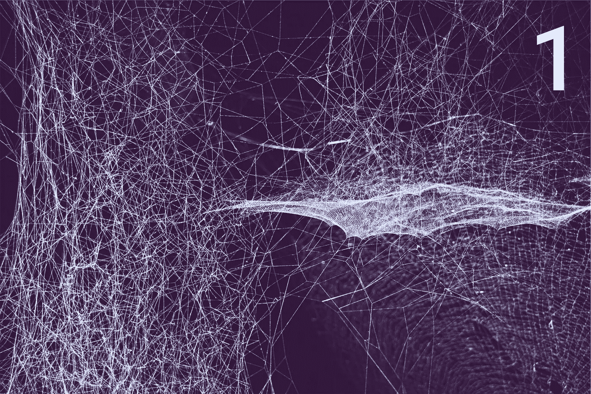

# 以太坊零到英雄:游戏攻略

> 原文：<https://medium.com/hackernoon/ethereum-zero-to-hero-introduction-4a2930d636a>

2017 年可以说是加密货币年，比特币成为最受关注的焦点；比特币的核心是**区块链**。

区块链技术的应用远远超出了数字货币，最好的例子之一是**以太坊**，这是一个运行智能合同的去中心化平台。

这使得开发人员可以构建非常强大的分散式应用程序，在这一点上，区块链和以太坊仍然有很多活跃的开发和创新。

所有这些不断创新和开发的缺点是教程、文档和资源很快就会过时，这使得像我(或你)这样的开发人员很难在开始时有一个坚实的基础。

**本指南并不意味着全部结束或全部结束**，而是一个快速介绍，可以让你快速开始，希望足够不可知论，不会太快过时。话虽如此，让我们从回顾一些核心概念开始:

## 智能合同

> 合同以以太坊特有的二进制格式(EVM 字节码)存在于区块链上。

智能合约是驻留在**以太坊**区块链上的一个软件。与传统合同一样，智能合同不仅定义了协议的规则和处罚，还强制执行这些义务。

## 以太坊虚拟机

> 它的核心是以太坊虚拟机(“EVM”)，它可以执行任意算法复杂性的代码。用计算机科学的术语来说，以太坊就是“图灵全集”。

这是以太坊项目背后的核心和首要创新。**以太坊**网络的每个参与者运行一个虚拟机实例，其目的是在一个完全隔离的环境中执行智能合约，这意味着不能访问网络、文件系统或其他进程。

## 气体

Gas 是以太坊平台特有的概念，是限制给定智能合约可用资源的一种方式。对于在 EVM 中执行的每条指令，都有一个与之相关联的固定气体成本。

## 固态

Solidity 是一种面向联系的高级语言，用于实现智能合约。语法类似 javascript，受 C++和 Python 等语言的影响，直接编译成 EVM 汇编。

## 区块链

> “区块链是一个不朽的经济交易数字账本，可以通过编程不仅记录金融交易，还记录几乎所有有价值的东西。”— Don & Alex Tapscott,《区块链革命》作者(2016 年)

考虑区块链的最佳方式是分散的**不可变数据库**或分类帐，它可以永久存储任何类型的数据。

这项技术的潜在商业应用仍在被发现和实验，但网上有大量的例子，仅举几个例子:

*   众筹
*   管理
*   文件存储器
*   知识产权保护
*   身份管理
*   财产登记

在本系列的下一篇文章中，我们将建立一个本地开发环境来创建我们的第一个**智能契约。**

*本文原帖* [*在我自己的网站*](https://coderoncode.com/blockchain/2017/12/24/ethereum-zero-to-hero-introduction.html) *。*