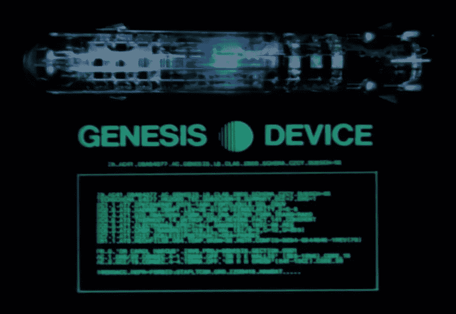

# 以太坊零到英雄:设置开发环境

> 原文：<https://medium.com/hackernoon/ethereum-zero-to-hero-setting-a-development-environment-d45e11532105>

这是我们以太坊零到英雄指南的第二部分。如果你还没有阅读第一部分，我强烈推荐你在开始阅读之前阅读。

在这篇文章中，我们将为以太坊的开发和实验建立一个基本的私有测试网络环境。

# 步骤 0:需求

*   你用的是 **MacOS**
*   你对软件开发有一个基本的了解
*   你知道以太坊是什么，理解它的基本用法。
*   你对 **MacOS 终端使用**有了基本的了解。
*   你已经安装了**自制软件**

# 步骤 1:设置测试网络

当我们学习以太坊开发的细节时，我们可能不想用真实的以太网来测试真实的生产网络。

有几个以太坊测试网在野外用于这个目的，例如 Rinkeby 和 Morden；然而，与这个网络互动仍然需要我们通过采矿或从其他用户那里获得以太。

虽然我们最终将与公共测试网络合作，但对于像我们这样刚刚起步的初学者来说，这远远不是理想的，而且很难获得大量的乙醚。

一个更好的选择是建立我们的**私有测试网**，我们可以弯曲和扭曲；同时，它将让我们对以太坊网络的内部运作有更深入的了解。

## 我们走吧

我们需要安装 geth，这是一个 go CLI 客户端，允许我们在本地运行一个完整的以太坊节点。

`brew tap ethereum/ethereum brew install ethereum`

我们可以通过键入以下命令来验证所有安装是否正确:

`geth version`

这应该会产生类似如下的输出:

# 第二步:创世纪街区

为了启动我们的私有测试网，我们需要一个 Genesis 块。每个区块链都需要一个 genesis 块，它本质上是我们的区块链的配置文件。

> genesis 块是区块链的起点，即第一个块，即块 0，也是唯一不指向前一个块的块。该协议确保没有其他节点会同意你的区块链版本，除非他们有相同的起源块，所以你可以做尽可能多的私有测试网区块链！

1.  创建一个项目目录，例如`ethereum_0hero`
2.  打开您喜欢的编辑器，创建一个名为`HeroGenesis.json`的文件
3.  复制以下内容并保存文件:

正如您所看到的，文件内容是 json 格式的，大部分内容都是不言自明的，但是让我们快速浏览一下每个参数，以阐明它们的用途。

*   **coin base**:160 位地址，成功开采该区块所获得的所有奖励(以太)已被转移至该地址。这可以是 Genesis 块中的任何值，因为该值是在创建新块时由 miner 设置的。
*   **时间戳**:一个标量值，等于 Unix time()函数在这个块开始时的合理输出。最后两个块之间的更小的周期导致难度级别的增加，从而需要额外的计算来找到下一个有效块。
*   **难度**:定义了挖掘目标，可以根据前一个方块的难度和时间戳计算出来。难度越高，矿工为了发现一个有效区块，统计上必须执行的计算就越多。该值用于控制区块链的区块生成时间，将区块生成频率保持在目标范围内。在测试网络上，我们将该值保持较低，以避免在测试期间等待，因为在区块链上执行交易需要发现有效的区块。
*   **gasLimit** :一个标量值，等于每个区块天然气消耗的当前全链限制。高，以避免在测试过程中受到这个阈值的限制。

最后，配置参数确保某些**协议升级**从一开始就是可用的。

如需完整解释，请查看[堆栈交换](https://ethereum.stackexchange.com/questions/2376/what-does-each-genesis-json-parameter-mean)中的答案

接下来，我们需要通过运行以下命令来初始化我们的链:

`geth --datadir ./TestNetData init HeroGenesis.json`

设置数据目录很重要，因为否则我们将覆盖**真实以太网**的默认数据目录。

输出应返回类似于以下内容的内容:

# 步骤 3:运行本地节点

既然我们已经创建了初始链，我们可以通过执行以下命令来运行它:

`geth --datadir ./TestNetData --identity "HeroNode1" --rpc --rpcport "8080" --rpccorsdomain "*" --port "30303" --nodiscover --rpcapi "db,eth,net,web3" --maxpeers 0 --networkid 24 console`

该命令执行几项操作:

1.  利用我们之前创建的**创世纪模块**
2.  它使用自定义数据目录，而不是默认目录
3.  将网络 id 设置为 24，以防止我们从主网络中的节点进行通话
4.  禁用**对等发现**
5.  通过将 maxpeers 设置为 0 来禁用网络
6.  启动 geth 控制台，以便我们可以与区块链/节点进行交互

输出应该类似于以下内容:

此时，您应该已经启动并运行了，并且在 geth 控制台中准备做一些事情，但是什么呢？

好吧，让我们把注意力转移到下面的警告上:

> 警告没有以太基础集，也没有找到默认帐户

我们已经启动并运行了 node，但是如果没有任何帐户，它将没有多大用处。

# 第 4 步:创建帐户

由于我们已经在 Geth 控制台中，因此更容易直接从那里创建帐户，请在终端中键入以下内容:

`personal.newAccount()`

控制台将要求输入密码**不要丢失！**，而 return a 已经像下面这样了:

`0xe857331e4e3354bb72b3751cce419c8444e89e17`

让我们通过运行以下命令来验证该帐户是否存在:

`> eth.getBalance("0xe857331e4e3354bb72b3751cce419c8444e89e17") 0`

现在，让我们往账户里放些乙醚。

# 第五步:让我们开始采矿

快速回顾:

*   我们有一个工作专用网络，其中有一个节点在本地运行
*   我们在上述专用网络上创建一个测试帐户
*   我们的账户里没有乙醚，我们需要解决这个问题

现在，虽然我们可以使用 **Genesis block** 轻松地向我们的帐户发送以太，但还是让我们找点乐子，在我们的专用网络上开采以太吧。

打开新的终端选项卡并运行以下命令:

`get attach ./<DirectoryName>/geth.ipc`

这将把我们的第二个终端连接到现有的 geth 实例，并打开 **Javascript** 控制台。在控制台内运行以下程序:

`miner.setEtherbase("0xe857331e4e3354bb72b3751cce419c8444e89e17") miner.start()`

如果我们回到我们的第一个终端，我们应该看到以下情况:

让我们回到第二个终端，停止采矿机并检查我们的平衡:

`miner.stop() eth.getBalance('0xe857331e4e3354bb72b3751cce419c8444e89e17') 75000000000000000000`

恭喜你！我们现在已经创建了我们的私有网络并开采了我们的少量以太网，我们有一个有效的网络可以用来开发我们的**智能合同**和**dapp**。

在本系列的下一篇文章中，我们将开始开发可靠性和智能合同。

*本文原帖* [*在我自己的网站*](https://coderoncode.com/blockchain/2017/12/24/ethereum-zero-to-hero-setting-a-development-environment.html) *。*