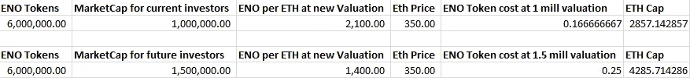
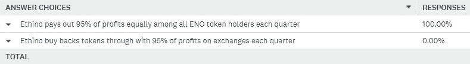

# 伦理|融资路线图变更

> 原文：<https://medium.com/hackernoon/ethino-funding-roadmap-changes-84a1cdc15716>

[www.ethino.com](http://www.ethino.com)

推出 ICO 后，我们学到了一些非常宝贵的经验。我们相信我们令人印象深刻的阿尔法将足以刺激投资者。不幸的是，我们是不正确的，我们在进行 ICO 之前缺乏社区关注，这对我们提出的 ETH 产生了负面影响。此外，由于法律原因，我们无法披露阻碍我们以我们希望的方式参与和建立信任的团队。我们要感谢我们目前的投资者相信我们的项目，这是基于我们投入了数百个小时的工作，包括我们令人敬畏的阿尔法。反馈非常好，我们计划在主版本发布前对 Alpha 版本进行必要的修改。我们很高兴地说，到目前为止，在测试中没有发现任何严重的错误，还有一些小的视觉问题需要解决。

# [**Ethino**](http://www.ethino.com) **ICO 截止 10 月 30 日下午 6 点 UTC。**

# 我们将何去何从？

我们相信 Ethino，并想出了确保我们达到融资目标的方法。项目规模将略有缩小，但我们仍然能够完成白皮书中列出的所有任务，尽管速度会慢一些。

# **1。降低市值**

新的 Ethino 市值将达到 150 万美元。与我们的竞争对手相比，这是非常有竞争力的价格。

* 10 月 16 日的估值基于硬币市场市值。

($124，320，000)[https://funfair.io/](https://funfair.io/)—世界上最快的以太坊赌场平台。

($42，964，195)[https://edgeless.io/#!/index](https://edgeless.io/#!/index)—体验完全透明、零风险的在线赌博。

($25，427，723)[https://etheroll.com/](https://etheroll.com/)——我们的以太坊骰子游戏被证明是公平的，有 1%的低门槛，没有注册或存款。

($ 8009679)[http://www.vslice.io/](http://www.vslice.io/)——以太坊游戏平台代币

($ 7619913)[https://dao.casino/](https://dao.casino/)—[区块链](https://hackernoon.com/tagged/blockchain)协议赌博

[https://ethbet.io/](https://ethbet.io/)——Ethbet 是第一个去中心化的、点对点的、可证明公平的、基于以太坊的、没有边界的划片游戏。

[http://www.etherflip.co/](http://www.etherflip.co/)——一种扭曲的骰子游戏

# **2。Ethino** 价值 100 万美元的空投代币

**这将如何运作？
* * * ICO 有一周的期限供所有投资者申请退款。***** 一周后，所有剩余投资者将以 100 万美元的估值空投 Ethino tokens，这比我们 150 万美元的新总市值低 50%。(您将获得 50%的额外代币)例如:**每位投资者每投资一个 ETH，就会被空投大约 2100 个 ENO 代币。**

**Excel 计算:**

只有我们 ICO 结束时的 ENO 持有者和 ICO 之后的大型私人投资者才能获得低得多的 100 万美元估值。对 Ethino 来说，未来筹集的任何资本的估值为 150 万美元。

在达到 150 万美元的上限之前，Ethino ENO 的持有者还可以在未来以 100 万美元的价格购买更多的 ENO 代币。

# 3.**以 100 万美元的估值向大型私人投资者开放 Ethino**

我们将通过 https://0xproject.com/portal 或以太三角洲私下向私人投资者出售 ENO 代币。**除 BTC、BCH 和 LTC 之外，Ethino 还可以通过手工下单。**最低投资额为 5k 美元。任何更小的估价都是 150 万美元。

# 4.**返工令牌奖励**

*编辑:在与我们的投资者沟通并进行调查后，我们决定再次回到股息支付模式。

# **5。联系交易所上市**

我们已经在 Etherdelta 上市，并将利用筹集的资金在其他主要交易所上市。Radar Relay 也与 Ethino 接洽上市事宜，并将寻求在 Liqui、hitbtc、币安、bittrex 等公司上市。我们的代币奖励的修改应该允许我们在交易所上市。

# **6。代币战**

Ethino 计划通过我们的 Ethino 战争游戏首次发行代币来筹集资金！我们称这种新的令牌分发方法为令牌战争。**在 Ethino 的传统众筹期结束后，我们将利用代币战来筹集 ETH 的剩余金额，使市值达到 150 万美元。通过我们的 Token Wars 智能合约，我们允许下注赢取我们的 ENO 代币。获胜将给予玩家他们的 ETH 和免费的 ENO 代币。任何损失都将导致一些 ENO 代币被送出。无论哪种方式，ENO 代币都是给玩家的，因为这是我们的 ICO 模型，被严格视为筹款。进一步的细节将在接近 Token Wars 发布日期时公布。**

# 我们的链接:

*Ethino 网站:*【https://ethino.com 

【https://twitter.com/Ethino_Casino】推特: [推特](https://twitter.com/Ethino_Casino)

*Reddit:*[https://www.reddit.com/r/ethino/](https://www.reddit.com/r/ethino/)

*中等:*https://medium.com/@Ethino_Casino

*电报*:[https://t.me/joinchat/Gw2mJBEVeULdXrJn7WPhZQ](https://t.me/joinchat/Gw2mJBEVeULdXrJn7WPhZQ)

*白皮书:【https://www.ethino.com/files/ethino-whitepaper-en.pdf】T22*

*林克比测试网上的阿尔法:*[https://www.ethino.com/alpha/](https://www.ethino.com/alpha/)

*Ethino 邮箱:*contact@ethino.com