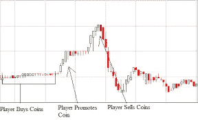

# 评估令牌和 ico

> 原文：<https://medium.com/hackernoon/evaluating-tokens-and-icos-e6c22c1885bb>

## **我评估区块链生态系统内项目的框架**

ICOs，在这一点上我们都很清楚。首次公开募股(ICO)是一种“新项目出售其底层加密令牌的筹资机制。”当我写这篇文章的时候，[ico 已经筹集了 12 亿美元，现在已经超过了早期风险投资。](https://www.cnbc.com/2017/08/09/initial-coin-offerings-surpass-early-stage-venture-capital-funding.html)

也就是说，并不是所有的 ico 都是平等的，如果你打算投资这个领域，你必须接受好的和坏的。随着越来越多的 ico 进入这个市场，拥有正确的框架来评估开源项目变得非常重要。

当我开始在这个领域投资时，我找不到可用的框架，所以我创建了自己的框架。这个框架由 7 个问题组成，我称之为 7 T。每个 T 都有自己的例子和危险信号。通过权衡这些因素，我可以评估一个 ICO 是否能带来长期价值，或者它是否是一个“[泵和转储](https://venturebeat.com/2017/08/26/the-ico-world-is-full-of-pump-and-dump-schemes-dont-be-a-victim/)计划的一部分。

“Pump and dump” scheme

# **从哪里开始:**

一切从该项目的白皮书开始。为了理解一本好的白皮书，我推荐阅读[比特币](https://bitcoin.org/bitcoin.pdf)或[以太坊](https://github.com/ethereum/wiki/wiki/White-Paper)。如果一个项目没有白皮书，那就是一个大的危险信号。当我阅读每个项目的白皮书时，我关注以下几点:

# **1。论文**

它是否符合我现在投资的主题之一？

许多成功的投资者都有一个理论来指导他们的投资。就拿 USV 的[论文](https://twitter.com/aweissman/status/676568250210082817?ref_src=twsrc%5Etfw)来说吧:

> “随着市场的成熟，我们寻找不太明显的网络效应、新经济的基础设施以及开放的分散数据的推动者。”联合广场投资公司

我的论文告诉我什么时候说不，什么时候坚定地投资。在 crypto 内部，有很多关于新兴主题的文章，比如 Web3 和 [fat 协议](http://www.usv.com/blog/fat-protocols)。

以下是在这些主题下可以投资的项目列表:

*   云计算
*   数据存储
*   分散交易所
*   投资解决方案
*   预测市场
*   身份协议
*   管理
*   智能合同框架
*   声誉系统
*   社交网络
*   和许多其他人

危险信号:dApps 希望通过建立一个分散的网络来与谷歌和脸书竞争。我不相信消费者会关心基础设施是建立在亚马逊还是 T2 区块链上。这种去中心化是一种独立的竞争优势，将会颠覆这些巨头。

# 2.令牌网络效应

***代币是否能让激励同时加速增长和代币价值？***

我以前写过关于令牌网络效应的文章。这是评估令牌最重要的组成部分之一。代币应作为一种激励机制，并广泛分发到 kickstart 网络效应。

为了实现这一点，需要有少量的令牌。随着网络的发展，令牌增加了平台的价值并加速了网络效应，这增加了需求和价格。

危险信号:如果不清楚代币如何随时间增值，该项目很可能具有弱代币网络效应。这些项目经常使用代币作为筹集资金的一种方式。对这种动态的项目要非常谨慎。

# **3。团队&领导**

***有没有可以规模化开源网络的强大团队？***

我倾向于寻找具有区块链经验或大规模构建开源社区或平台经验的团队。

在 crypto 内部，团队可以有一个类似比特币的隐形领袖，也可以有一个类似以太坊的可见领袖。但是同样的规则也适用:

**领导者描绘了一个令人信服的愿景，并招募了一个强大的社区来帮助实现这一愿景。**

危险信号:如果一个项目的顾问多于团队成员，这通常是一个危险信号。William Mougayar 在这篇[文章](http://startupmanagement.org/2017/07/21/icos-are-like-startups-but-advisors-are-not-like-mentors/)中简要介绍了这一点:

> “许多顾问是为了营销目的而招募的。也许这可以通过可见性服务于 ICO 流程，但要取得成功，创业公司需要身边有可以指导他们并为他们提供建议的人，而这些人需要有经验并有资格这样做，通常是企业家本人或见过许多创业公司并与之合作的投资者。”

# **4。技术&开发者生态系统**

***支持开发者采用的开源代码存在吗？***

为了使这些项目成功，技术需要是可靠的，并且需要有一个围绕项目的不断增长的开发人员社区。该协议的存在还需要一个强有力的技术理由。

研究:浏览项目周围的开发社区。查看 Github 上的提交数量并查看源代码。

红旗:Github 上没有。

# **5。透明度&信任度**

***团队与社区的透明程度如何？***

透明度建立信任，这是任何伟大社区的基础。团队对社区的透明度如何？他们是否不断改变方向而不顾及他人？他们在发送更新吗？他们可以回答来自社区的问题吗？

例如， [Iconomi](https://www.reddit.com/r/ICONOMI/comments/6mkw3j/iconomi_ama_july_2017/) 在 Reddit 上的月度 ama 上做得很好，提供了透明度。公开发布他们每天的单口相声，供任何人观看。

你可以在 Telegram、Slack、Reddit、subreddits、Discourse、Twitter、Medium、脸书或微信等地方搜索社区互动。

危险信号:团队在没有明确解释的情况下改变 ICO 术语。如果团队愿意做出这些改变，他们很可能会在未来再次这样做。

# **6。牵引力&路线图**

***团队是否证明了执行能力？***

到目前为止，这个团队建立了什么样的牵引力？路线图的下一步是什么？有基于该协议的应用吗？什么是开发者采用？

对于项目来说，达到一些里程碑来展示执行能力是很重要的。

危险信号:团队在职业生涯中从未推出过任何东西。这个团队没有一个清晰的路线图，或者有一个他们想要做的 100 件事情的长列表。

# **7。条款**

***ICO 有哪些条款？***

我寻找的一些术语包括**延迟创始人股权**、**限量供应**和**受控释放资金**。

*   资金在一个多签名的钱包里吗？
*   团队是否会销毁或重新分配很大一部分未售出的代币？
*   令牌分发是否直接来自智能合约？
*   募集资金有上限吗？
*   ICO 在你的国家是符合的吗？

> “创始团队应拥有 10-50%的令牌，并且在项目的前 3 年不应获得流动性。”尼克·托迈诺

# **外卖**

当我刚开始从事技术工作时，仅凭一个想法就筹集一个天使或种子资金并不疯狂。但是，随着时间的推移，门槛变得越来越高。

同样的事情也会发生在加密货币上。虽然今天可能是狂野的西部，但不要投资低质量的项目。

像许多投资一样，投资好加密货币始于你支持的项目，坚持你的论点，并带着信念进行这些投资。

[*Michael Karnjanaprakorn*](http://mikekarnj.com)*是*[*Skillshare*](http://skillshare.com)*和* [*图灵资本*](http://turing.capital) *的创始人。感谢*[*Julian mon cada*](/@julianmoncada)*和 Herbert Lui 通读了本文的初稿。*

*喜欢这篇文章吗？请花点时间“鼓掌”一次或多次(最多 50 次)。*