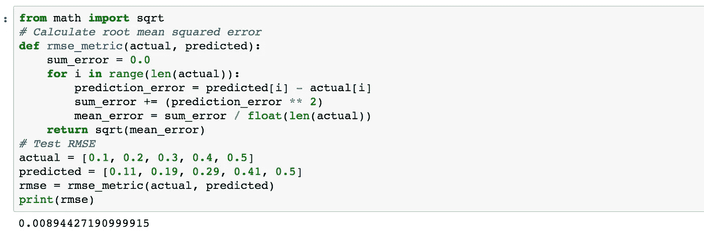

# ML 的评估指标

> 原文：<https://medium.com/hackernoon/evaluation-metrics-for-the-ml-2a61f64e5340>

今天，我们将讨论评估指标的重要性。然而，在深入评估指标之前。首先，我们需要了解问题陈述，以及它在监督回归或分类中属于哪个类别。在监督二分类问题中，我们使用混淆矩阵来评估模型。

**混乱矩阵:**

Image source: Data school

让我在这里放一些数学公式。

**1。准确度= TP+TN/总量**

**2。误差/误分类率= 1-准确度**

**3。假阳性率= FP/实际无(60)**

**4。假阴性率= FN/实际是(105)**

**5。真阳性率/灵敏度= TP/实际是**

**回归问题:**

1.  **平均绝对误差**
2.  **均方根误差**

我们将看到如何定义函数来测量平均月收入和 RMSE。

**Python 代码为 MAE:-**

从上面的代码中，我们可以根据实际值和预测值计算 MAE。

**RMSE 的 Python 代码:**

**结论:**

我们可以使用不同的评估指标来评估模型，但最终它完全取决于行业和客户对模型的期望。然而，选择正确的评估指标来评估模型是非常重要的。

请跟着我上[https://www.linkedin.com/in/aniket-kale-45a29954/](https://www.linkedin.com/in/aniket-kale-45a29954/)

参考:

[机器学习](https://hackernoon.com/tagged/machine-learning)精通书