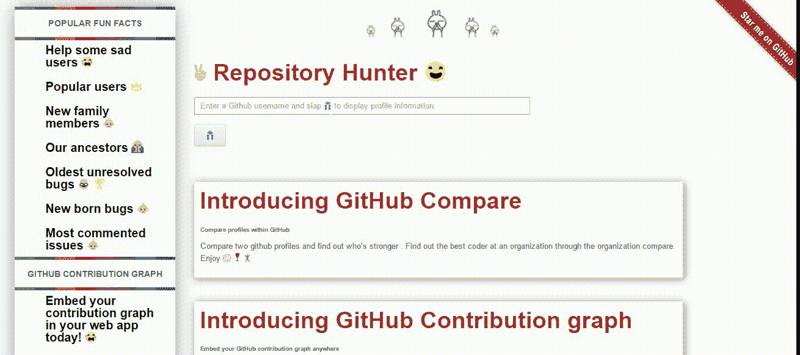

# 即使是 GitHub 的无辜章鱼也有一张隐藏的脸

> 原文：<https://medium.com/hackernoon/even-githubs-innocent-octocat-has-an-hidden-face-d3eb3599c3ff>

[GitHub](https://hackernoon.com/tagged/github) 一直是许多人的游乐场，但由于其贡献的性质，它一直是一个充满惊人艺术和恶意的地方。

> GitHub 很神秘吗？

在一个晴朗的日子🌞一天，我愉快地在荒野中浏览，一个 16 年前的问题引起了我的注意。什么？我以为我知道 [*章鱼*](https://hackernoon.com/tagged/octocat) *已经 9 岁了。*

GitHub 在开源荒野的伪装下隐藏了几个有趣的事实。

因此，[存储库](https://github.com/AdiChat/Repository-Hunter)的“*有趣事实*”功能试图突出一些见解。以下是一些例子:

*   **评论最多的问题**有大约 **16565 条评论**，但令人难过的是，这是自动化的结果。看这里。这是化名为 *peej 的人的成果。*
*   最老的**未解决的 bug** 是 16 岁左右的*。讽刺的是 GitHub 是 **9 岁**。问题是:“*JNI 图层*中的不透明指针类型为“int”。看这里[看这里](https://github.com/cyrusimap/cyrus-sasl/issues/25)。*
*   *最受欢迎的用户是***Linus Torvalds***，拥有超过 **55489 *个关注者*** ，而他却一个关注者也没有(与“`*more users I follow, the more users will follow me*`”的假设相反)。*
*   *一个看似真实的问题有超过 1915 个评论这是一个讨论💭over iCloudin，这是一个绕过 iCloud 的工具，另一个解决同一问题的问题有超过 1279 条评论。奇怪的是，只有大约 130 名参与者，与其他问题相比，这个数字很小。看这里。*
*   *一个赢得中国的项目引发的争议🌍2014 年国家科学技术奖有超过 **1426 条评论，超过 997 人参与**。
    而且观察永远继续下去。▶️*

**

*Enjoy the application “Repository Hunter”*

*在[**GitHub.com/AdiChat/Repository-Hunter**](https://github.com/AdiChat/Repository-Hunter)享受其他令人兴奋的事实和见解*

*您可以通过[问题](https://github.com/AdiChat/Repository-Hunter/issues/new)或拉取请求在存储库中随意添加您的见解。*

> *甚至无辜的章鱼也有一张隐藏的脸！*

*我们无辜的章鱼:*

**

*Our innocent octocat*

*实际上，很聪明。*

**

*Our clever octocat*

> *事实上，我们无辜的章鱼很聪明。*

******

> *[黑客中午](http://bit.ly/Hackernoon)是黑客如何开始他们的下午。我们是 [@AMI](http://bit.ly/atAMIatAMI) 家庭的一员。我们现在[接受投稿](http://bit.ly/hackernoonsubmission)并乐意[讨论广告&赞助](mailto:partners@amipublications.com)机会。*
> 
> *如果你喜欢这个故事，我们推荐你阅读我们的[最新科技故事](http://bit.ly/hackernoonlatestt)和[趋势科技故事](https://hackernoon.com/trending)。直到下一次，不要把世界的现实想当然！*

**