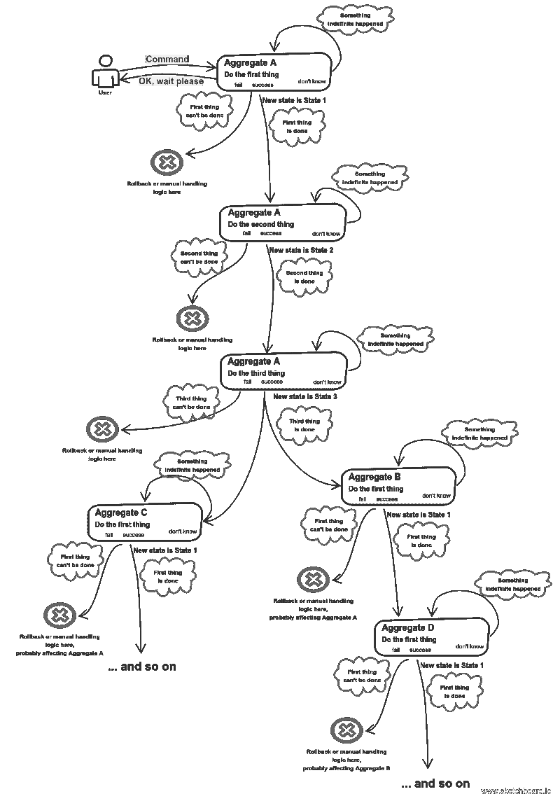
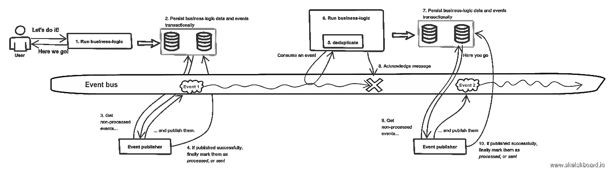
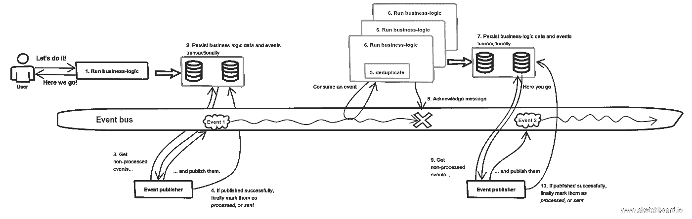
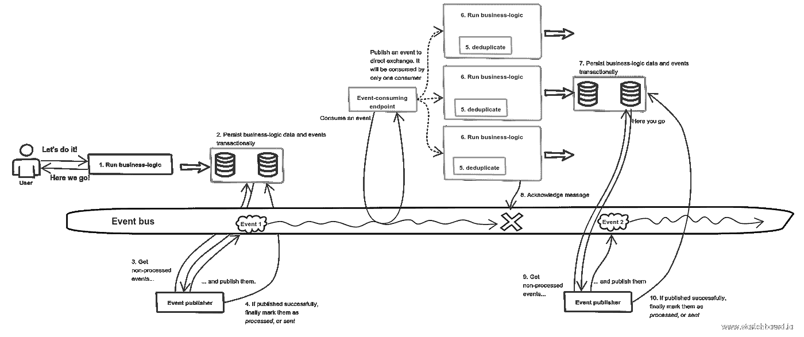
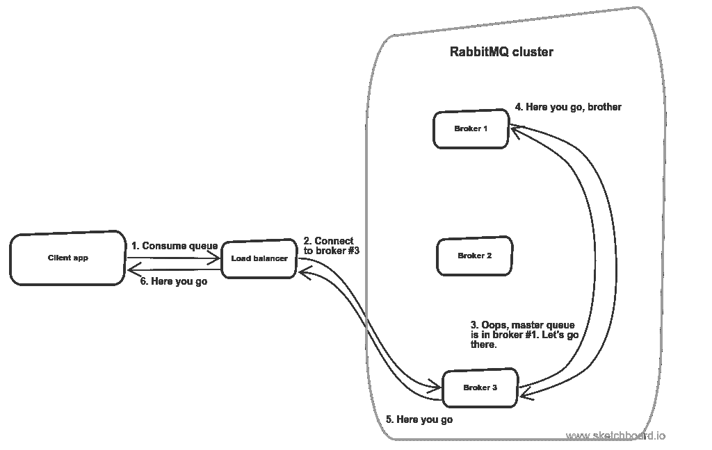
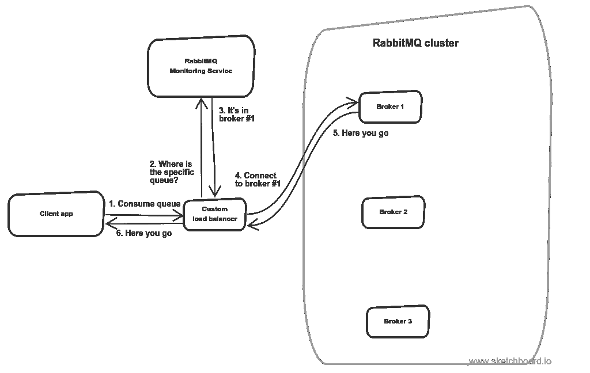
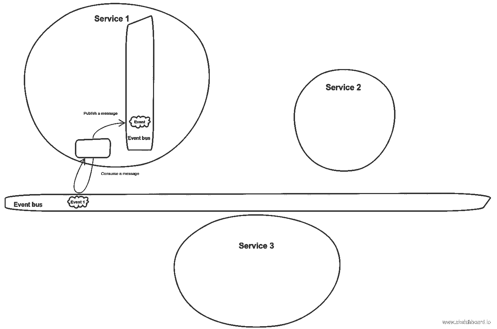

# 事件驱动的架构实现

> 原文：<https://medium.com/hackernoon/event-driven-architecture-implementation-140c51820845>

## 一些 RabbitMQ 的细节

在我[确定了服务边界](/@wrong.about/how-to-define-service-boundaries-251c4fc0f205)(在这里查看这种方法的[示例](/@wrong.about/service-boundaries-identification-example-in-e-commerce-a2c01a1b8ee9))之后，是时候谈谈我在事件驱动系统中采取的具体步骤以及需要记住的一些事情了。

## 高级心理实现模型

正如我已经提到的，我所涉及的几乎所有领域的心理实现模型看起来都是这样的:

My basic implementation model — [Sagas](https://lostechies.com/jimmybogard/2013/03/11/saga-implementation-patterns-observer/) interaction

因此，我需要以这样一种方式定义操作，以便在第一次出错时可以自然地重试。

## 为什么这么多箭？

我不希望我的整个业务流程(例如，在“对账服务中的事务传奇”图中描述的那个)驻留在一个请求和/或事务范围内。至少有两个原因。

***我的资源有限*** 而且我的业务流程可能需要很长时间。比方说，在某个步骤中，在同一个 pic 上表示为“不知道”的状态可能需要不确定的时间。这就是为什么我用单独的进程处理所有的步骤(在 PHP 的情况下),并且我不使用本地[观察者](https://en.wikipedia.org/wiki/Observer_pattern)模式。因此，Jimmy Bogard 描述的非常流行的方法在这种情况下根本不起作用。

***万一失败从哪里恢复？*** 比方说，在某个阶段出现了数据库故障或一些关键的 http 请求中断。我的逻辑应该从哪一步恢复？从一开始？真是浪费时间！我想从尽可能接近失败的地方恢复。

顺便说一句，在 DDD 众所周知的经验法则是，在一个事务中不应该有超过一个聚合发生变化——无论是[蓝皮书](https://www.amazon.com/Domain-Driven-Design-Tackling-Complexity-Software/dp/0321125215)还是[红皮书(实现领域驱动设计)](https://www.amazon.com/Implementing-Domain-Driven-Design-Vaughn-Vernon/dp/0321834577)。但是他们没有解释。

## 仔细看看事件处理逻辑

以下是我在处理事件时实现的步骤:

Basic event flow

为了充分描述正在发生的事情，我从最开始说起。某人或某事启动了一个业务流程。它可能是一个人，一个脚本，一个调度程序。

1.  业务逻辑正在运行。
2.  它的结果——业务数据和业务逻辑产生的事件——以事务方式保存到数据库中。该事件尚未发布，只是持续存在。
3.  其他一些线程或进程定期挑选未发布的事件并发布它们。
4.  如果发布的消息[被确认为](https://www.rabbitmq.com/confirms.html)，脚本会在数据库中将它们标记为*发送的*或*处理的*或*发布的*，这样它就不会再次选择它们。
5.  订户挑选一个事件并检查它是否已经被处理。
6.  如果没有，那么就运行业务逻辑。
7.  结果是持久的—与步骤 2 相同。但与此同时，当前订户接受的事件也会被持久化，以便进行重复数据删除检查。
8.  该消息已从队列中移除或被确认，因此不会被该使用者再次处理。
9.  检索未发布的事件并发布它们。
10.  如果发布成功，标记为*已处理*。

如果流程在步骤 5–7 终止，则事件仍在队列中，因此它将被再次使用。如果 message broker 或消息总线在步骤 8 中失效，由于重复数据删除，业务逻辑将不会再次运行。如果 TCP 连接或消息代理在第 9 步终止，发布将不会被确认。这导致事件在数据库中保持不变，即仍然标记为未处理。如果流程在步骤 10 终止，检索到的消息将被发送两次，这不是问题，因为您有一个重复数据删除逻辑。

哦，如果你使用 Apache Kafka，它支持[恰好一次语义](/@jaykreps/exactly-once-support-in-apache-kafka-55e1fdd0a35f)，那么你就不需要重复数据删除逻辑。

## 如何扩展以实现高可用性

***消费者伸缩*** 比如说，我有一个逻辑消费者，但是有不止一个物理机器。但是我希望每条消息只被处理一次。以下是这一点的说明:

Scaling consumers number

[企业整合模式](https://www.amazon.com/Enterprise-Integration-Patterns-Designing-Deploying/dp/0321200683)已经[有了解决方案](http://www.enterpriseintegrationpatterns.com/patterns/messaging/CompetingConsumers.html)。这意味着利用一个[点对点](http://www.enterpriseintegrationpatterns.com/patterns/messaging/PointToPointChannel.html)通道。RabbitMQ 有一个[直接交换](https://www.rabbitmq.com/tutorials/amqp-concepts.html)用于此。如果消息有[命令语义](http://www.enterpriseintegrationpatterns.com/patterns/messaging/CommandMessage.html)就可以了。但是如果是[事件](http://www.enterpriseintegrationpatterns.com/patterns/messaging/EventMessage.html)呢？这意味着使用[发布-订阅](http://www.enterpriseintegrationpatterns.com/patterns/messaging/PublishSubscribeChannel.html)通道，或者用 RabbitMQ 的术语来说，[扇出交换](https://www.rabbitmq.com/tutorials/tutorial-three-python.html)。在这种情况下，我如何让单个逻辑服务有多个物理消费者？如果在扇出交换中发布一个事件，并且将有一个对应于单个逻辑服务的单个端点，则可以实现这一点。该端点将接收一个事件，并将其发布到与多个竞争消费者的直接交换中:

Competing consumers in event-driven architecture

***经纪人定标*** 第二点是关于经纪人定标。在 RabbitMQ 中，它是通过[集群](https://www.rabbitmq.com/clustering.html)实现的，但它并不复制队列。因此，您需要设置[队列镜像](https://www.rabbitmq.com/ha.html)。为了做到这一点，我需要安装一些负载平衡工具，如 [HAProxy](http://www.haproxy.org/) 。但是有一个警告。比方说，您有三个复制的 RabbitMQ 节点。您在节点#1 上创建了一个队列。所以它是一个主队列。因此，它会在所有节点上复制。但是这里有一个问题:当一个消费者连接到节点，比如说#3，rabbit 会在内部将这个请求路由到创建具体队列的节点。

Highly available, but chatty queue replication scheme

因此，这种机制对于故障转移非常有效，但是在正常工作中却显得过于繁琐。

要解决这个问题，我知道有两个选择。我首先想到的是在每个节点上创建三个不同的队列，这样每个节点都有自己的主队列和两个复制队列。然后，我希望有一些钩子将每个复制队列的内容合并到一个主分支中。听起来不错，但太复杂了。

因此，第二个选项只是一种监视服务，它查看兔子节点，哪些节点正在运行，哪些节点已经死亡，主队列在哪里，等等。显然，应该用这个服务创建新的队列。

Tailor-made RabbitMQ monitoring service

因此，这个服务为一个定制的负载平衡器提供了一个要连接哪个节点的信息，这样我的应用程序代码就不需要弄乱 rabbit 配置。

但是在大脑分裂的情况下，即 RabbitMQ 集群内的网络分区，我们就有麻烦了。有些消息很可能会被丢弃，而有些消息会被手动(痛苦地)合并。

## 高性能提示

***铲插件***
说你不希望你的服务共享任何基础设施，不管什么原因。可能您的总线负载很高，您想将一些负载转移到另一个总线，可能您不希望您的资源在服务之间共享。无论如何，在 RabbitMQ 中有一个[铲插件](https://www.rabbitmq.com/shovel.html)可以作为客户端将消息从一个代理移动到另一个代理。这就是它的解释:

Shovel plugin in action

***使用 prefetch_count*** 不要让 rabbit 在新消息到达时将其推入通道，也不要使通道过载。消费者的资源不是无穷无尽的。使用 [*预取 _ 计数*](https://www.rabbitmq.com/confirms.html) 设置:

> 该值定义了通道上允许的未确认交付的最大数量。一旦数量达到配置的计数，RabbitMQ 将停止在通道上传递更多的消息，除非至少有一个未完成的消息得到确认。

请注意，默认情况下，缓冲区是无限的！

*prefetch_count* 应该占用的最大数量显然是消费者允许的进程(就 PHP 而言)或线程(Java)的最大数量。不要定得太低。如果将其设置为 1，无论部署了多少资源，您的使用者一次只能处理一条消息。当然，有时这也有道理。[这里的](https://mariuszwojcik.wordpress.com/2014/05/19/how-to-choose-prefetch-count-value-for-rabbitmq/)是一些取决于消费者本性的其他策略。

它还将帮助您对并发消费者使用[公平分派](https://www.rabbitmq.com/tutorials/tutorial-two-php.html)。比如说，你有两个消费者，他们可以处理两种消息。第一个消息处理几乎不花时间，而第二个确实非常繁重。因此，结果可能是所有轻量级消息都被循环传递给一个消费者，而所有重量级消息都被传递给第二个消费者。因此，繁重的消息开始堆积，因为它们一到达队列就被推到通道中。所以*预取计数*防止了这种情况。

***空队列是快速队列***
确保你的队列不会不堪重负。RabbitMQ 的队列在空的时候速度最快。

## 系统启动运行后弹出新服务怎么办？

因为我所有的消息都是持久的，所以我只是强迫他们发布。重复数据删除逻辑将在每个端点上运行，新服务将使用它感兴趣的所有内容。

但事情可能会更复杂。消息排序中可能存在复杂的逻辑。因此，另一种方法是简单地检索新服务感兴趣的所有数据，并将其插入新服务的数据库中。

## 消息排序

消息排序功能总是有一些限制。例如，在 RabbitMQ 中，消息排序仅在一个[特定队列和一个消费者](https://www.rabbitmq.com/semantics.html)中受支持:

> AMQP 0–9–1 核心规范解释了保证排序的条件:在一个通道中发布的消息，经过一个交换、一个队列和一个传出通道，将按照它们发送的顺序被接收。

类似地，Kafka 在分区内维护[排序:](https://kafka.apache.org/documentation/#intro_consumers)

> Kafka 只提供了一个分区内记录的总顺序，而不是一个主题中不同分区之间的顺序。

如果我对 sagas 使用事件驱动的方法(或者，按照企业集成模式，使用[流程管理器](http://www.enterpriseintegrationpatterns.com/patterns/messaging/ProcessManager.html))，使用事件的订户，即 saga，知道每个事件的语义。因此，传奇可以(也应该)实现，这样就根本没有秩序可言。这意味着他们不应该对消息排序施加限制。就拿我的[电子商务例子](/@wrong.about/service-boundaries-identification-example-in-e-commerce-a2c01a1b8ee9)来说吧。让我们假设订单传奇是在用户实际下订单之后创建的——因此，有一个事件 *OrderPlaced* 。让我们还假设在用户下订单后，他支付了订单。于是发布了一个事件 *OrderPayed* 。如果它是在 *OrderPlaced* 事件之后发布的，这并不意味着它将以相同的顺序被消费。所以我的 saga 实现应该为此做好准备。例如，saga 应该能够用两个事件创建，检查它是否已经存在。这意味着事件应该是独立的，但是没有太多的数据。请记住，事件是用于一些重要的通知，而不是用于传递数据。

## 最后

我非常喜欢事件驱动的方法。如果你尝试过——听听你的体验会很棒。