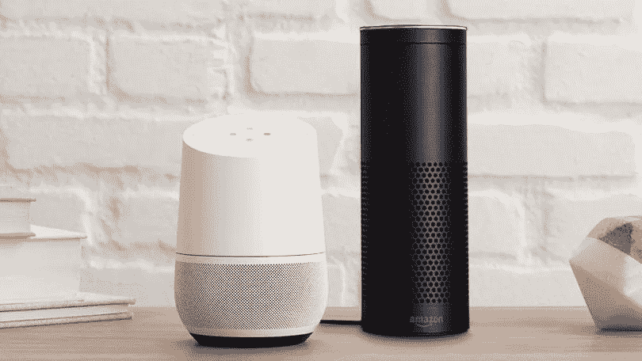
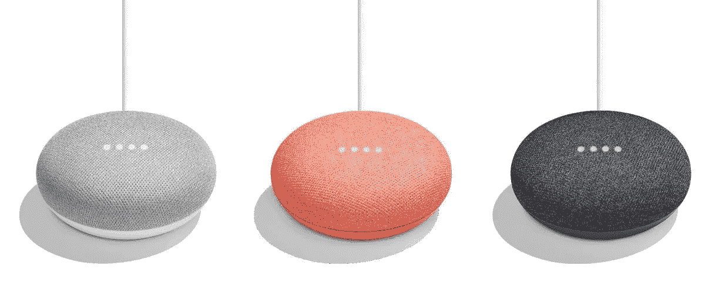
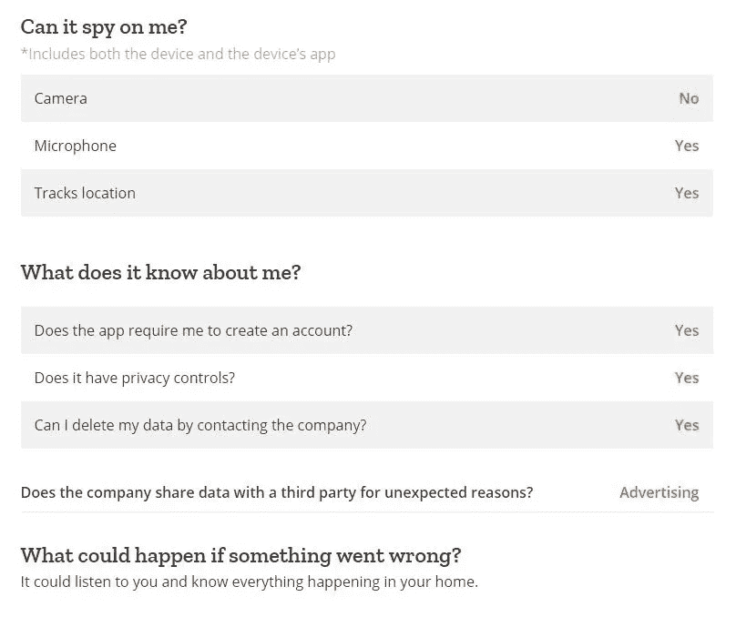

# 每个消费物联网设备都应该免费

> 原文：<https://medium.com/hackernoon/every-consumer-iot-device-should-be-free-d16219f66a45>

## 为什么我们要付费来提供我们的数据呢？

设备变得越来越智能。从手机到冰箱，一切都与互联网相连。到 2020 年，全球将有超过 200 亿个物联网单元。世界上物联网设备的数量最近超过了世界人口。

> 电视、冰箱和安全摄像头等难以保护的智能设备的安装基数预计今年将增长 31%，达到 84 亿台，比世界总人口多 10 亿左右。

# 物联网连接设备为什么要免费？

物联网设备被描绘成方便的家用小工具，有助于让用户的生活更加轻松。事实是，这些设备*使用起来既方便又有趣。然而，与这些设备收集的数据给公司带来的好处相比，用户获得的好处相形见绌。*

Source: [TechCrunch](https://techcrunch.com/2017/07/11/siri-usage-and-engagement-dropped-since-last-year-as-alexa-and-cortana-grew/) (11 July 2017)

苹果的 Siri、微软的 Cortana、亚马逊的 Alexa、谷歌的 Assistant 都是其用户的友好帮手。虽然他们看起来很有帮助和友好，但实际上他们只是这些公司获取更多数据的一个渠道。Siri 和 Alexa 以及其他数字助理都是伪装成可靠助手的间谍。

Siri 向苹果报告，Alexa 向亚马逊报告，提供一大堆关于你提出的问题和对话主题的信息。在 [Google Home](http://bgr.com/2017/10/11/google-home-mini-spying-on-user-fix/) 的例子中，它记录了一切，不管你是否要求它记录。

谷歌将你与谷歌主页的互动存储在[我的活动](https://myactivity.google.com/myactivity)中，其中包括你所提问题的录音或该设备制作的任何其他录音。

## 人们付钱给谷歌来收集他们的信息

像尼尔森这样的数据收集和分析公司每年花费数百万美元从消费者那里获取信息。尽管谷歌不需要购买信息，因为人们愿意把信息交给他们。

在谷歌 Home 和谷歌的其他物联网设备的情况下，人们向谷歌支付费用来收集他们的数据。大多数智能家居设备都是如此，人们向公司付费。然后，除了钱，该公司还从其“智能”数据海绵设备接收信息。

# Mozilla 的物联网设备礼物指南

 [## 不包括隐私

### 这个假期，使用 Mozilla 的联网礼物买家指南，了解哪些小工具带有隐私。

advocacy.mozilla.org](https://advocacy.mozilla.org/en-US/privacynotincluded?utm_source=Online&utm_content=General%20Sharing) 

Mozilla 是互联网[安全](https://hackernoon.com/tagged/security)的领导者。它的目标是“捍卫自由开放的网络”。它出版了这份礼物指南，来解释这一季一些最受欢迎的礼物的隐私含义。

在[的这篇文章](/mozilla-internet-citizen/why-we-made-a-holiday-buyers-guide-for-connected-toys-and-gifts-5459b22d62db)中，Mozilla 列出了在考虑物联网设备时应该问自己的问题:

*   ***它能监视我吗？***
*   ***它知道我什么？***
*   ***如果出了问题会发生什么？***

Google Home Privacy Information Source: [Mozilla](https://advocacy.mozilla.org/en-US/privacynotincluded/category/homehubs/googlehome)

然而，它随后解释说，生产这些设备的公司并没有让这些问题的答案显而易见。在回答这些问题时， [Mozilla](https://medium.com/u/95f4ec6ae6f6?source=post_page-----d16219f66a45--------------------------------) [说](/mozilla-internet-citizen/why-we-made-a-holiday-buyers-guide-for-connected-toys-and-gifts-5459b22d62db)，“需要顶尖的隐私研究技能以及一些高水平的技术技能。”

# 物联网安全问题

安全问题可能会对这个假期的设备销售产生比预期更大的影响。咨询公司 Deloitte [在 11 月发布了一项调查](http://www.businessinsider.com/consumers-holding-off-on-smart-home-gadgets-thanks-to-privacy-fears-2017-11)，其中 40%的受访者表示他们担心家用设备会跟踪他们的使用情况。如果人们担心在家中被跟踪，他们可能会等到物联网安全赶上其他行业后再购买设备。

# 物联网安全改进

随着物联网在商业和其他大规模基础设施中的应用越来越多，对安全的担忧将会大大增加。这应该导致消费设备也采用更好的安全性。

 [## 智能城市可能是安全灾难-搜索加密博客

### 任何对近期科技趋势略知一二的人都可能注意到了一切事物的连通性。几乎每个…

blog.searchencrypt.com](https://blog.searchencrypt.com/tech/smart-cities-could-be-security-disasters/) 

到目前为止，对单个物联网设备的黑客攻击可能只会导致单个用户个人数据的泄露。但是，如果整个城市的交通灯系统都被连接起来，并且出现了一个漏洞，它可能会产生非常昂贵的影响。对于数字助理用户来说，最主要的隐私问题可能是应用于大型系统时的安全问题。

# 物联网设备有风险，为什么要花钱买？

将更多联网设备带入家中，只会让你更容易受到攻击。这些设备是黑客获取你的数据的另一个途径。其中一些设备，如亚马逊的 Echo Show，有摄像头和麦克风，可能会导致严重侵犯隐私。

如果亚马逊、谷歌和苹果都将从大量涌入的用户数据中受益，为什么消费者必须冒着丢失私人数据的风险，为使他们易受攻击的设备付费？