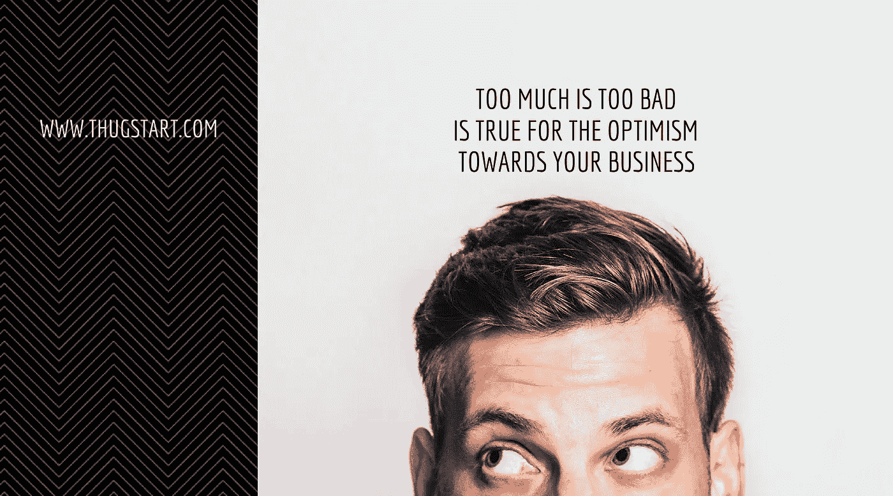

# 对你的事业的乐观情绪来说，太多太坏是真的

> 原文：<https://medium.com/hackernoon/every-kind-of-literature-in-all-languages-advocate-positive-thinking-which-is-the-means-to-197e37f114bd>

[Too much is Too Bad is true for the Optimism towards Your Business](http://www.thugstart.com/too-much-is-too-bad-is-true-for-the-optimism-towards-your-business/) — Originally published at — [www.thugstart.com](http://www.thugstart.com)

所有语言的每一种文学都提倡‘积极思考’，这是达到幸福的手段。同样，要想在事业上取得成功，你肯定需要有一定程度的乐观，因为没有乐观，你甚至不敢尝试自己创业。乐观主义者通常被定义为那些看到杯子半满而不是半空的人，因为他们总是试图在每件事情中发现好的一面，从而减少压力，减少焦虑，并为生活提供一种激励的方法，而这正是悲观主义者所缺乏的。

然而，尽管研究已经证明积极的思考和乐观主义多年来帮助人类获得了更好的生活质量，但极端的乐观主义有时会让你对现实视而不见，尤其是在商业和金融事务方面。如果你拒绝处理出错的事情，只是继续把积极的观点推向理智的边缘，那么过于积极会让你看起来非常消极。

研究人员知道，过于乐观也有不好的一面，它可能真的对企业不利。即使你已经知道你离冰山太近了，但保持微笑并希望好事发生是不明智的。不要把冒险者和这些极端乐观主义者混为一谈，因为尽管冒险者有一个积极的前景，让他们去冒险，但他们拥抱现实，不会把积极性发挥到极致。

极端乐观主义者没有 B 计划

商业模式、经济和环境在当今世界变化迅速，如果你认为一切都会变好，因为你有最好的想法和最好的团队，那么请三思。乐观主义者通常不会为不利因素做打算，因为他们认为自己永远也不会需要不利因素。如果你正面临所在行业、商业模式甚至财务方面的问题，那么拥有一个充满乐观主义者的团队会让你变得更加迟钝。

**极端乐观主义者忽视自己的健康**

乐观主义者只有把他们的积极性运用到自己身上时，才会把这种积极性运用到商业中。研究人员发现，乐观主义者以一切最终都会好起来为借口，忽视了自己的健康。他们不太倾向于睡得好、吃得健康和锻炼，这最终会损害他们的健康。他们相信，积极思考会帮助他们解决问题。

因此，简而言之，乐观应该有一定的限度，因为如果你希望你的企业朝着你想要的方向发展，那么你需要解决你的极端乐观主义态度，这种态度会促使你接受糟糕的赌注。成为一个乐观主义者一点也不坏，但只有当它更上一层楼时，事情才开始分崩离析。重要的是要面对现实，从而远离不明智的决定和某些类型的失败。因此，如果你认为自己是一个极端乐观主义者，那么你需要接受下面的现实，这将束缚你疯狂的乐观主义。

1.  让每个顾客都开心是不可能的:当然，我们希望所有的顾客都开心，但不幸的是这是不可能的。简单的目标是让那些客户开心，这是你的企业成功的必要条件。如果客户不适合这种策略，那么就让他们走，因为如果你试图追逐他们，那么你可能无法实现你的目标。
2.  **承认你的挫折:**即使是成功的企业家也会经历艰难时期，你也不例外，无论你的战略制定得多好，你有多优秀，都会遇到挫折。虽然你的乐观不会让你失去控制和冷静，但你也有必要承认这些失败，并从中吸取教训，以免重复错误。
3.  **知道何时收起你的牌:**的确，每个人都抱着“永不放弃”的态度开始创业，但事情并不总是按照你想要的方式发展，因此你应该知道何时放弃。如果 3 年后你还没有盈利，那么这就是一个信号，是时候离开了。你的乐观可能会让你继续留在这里，在极少数情况下，这可能会奏效，但知道何时停止下注不仅对你自己，对企业也很重要。
4.  至少要有一点恐惧:对于一个过于积极的人来说，可能很难陷入恐惧，因为焦虑不是他会考虑的事情。尽管人们宣扬要成为伟大的企业家要无所畏惧，但保持适度的恐惧对每个人都有好处。这不仅会让你三思而后行，权衡你的选择，还会让你不敢贸然进入新的机会。让恐惧明智地引导你，而不是把你困在它的网中。
5.  注意你公司的财务状况:不要因为你对公司财务真实状况的极度乐观而幻想破灭。定期检查你的财务状况，并与之前的进行比较，以了解你的状况。关注你的销售、收入、利润和增长模式，清楚地了解你的业务现实。

这里的关键是保持乐观主义者和现实主义者之间的平衡。当然，积极的思考可以让你到达意想不到的地方，但是正如我们一直被告知的，太多的好就是太多的坏。因此，不要让你的极端乐观主义驱使你或你的企业走下坡路，而是要与现实保持联系，这样你才能做出明智的决定。

# 如果你喜欢这个并且想要更多:

帮我一个坚实的❤心吧，💬评论它，和/或关注我😀

此外，如果你想通过我的定期帖子阅读更多关于创业、[营销、](https://hackernoon.com/tagged/marketing)、社交媒体、领导力、[技术、](https://hackernoon.com/tagged/technology)、创新和风险投资等话题的精彩内容，请点击“关注”，并通过 [SlideShare](http://www.slideshare.net/abhishekshah) 、 [Twitter](https://twitter.com/abhishekshah) 、[脸书](https://www.facebook.com/Maillands)和 [LinkedIn](https://www.linkedin.com/in/findingnewlands) 随时联系。

请继续吧，这是我最棒的博客！请不要错过这个！

附:这是我其他关于媒体的文章。

> 黑客中午是黑客如何开始他们的下午。我们是这个家庭的一员。我们现在[接受投稿](http://bit.ly/hackernoonsubmission)并乐意[讨论广告&赞助](mailto:partners@amipublications.com)机会。
> 
> 如果你喜欢这个故事，我们推荐你阅读我们的[最新科技故事](http://bit.ly/hackernoonlatestt)和[趋势科技故事](https://hackernoon.com/trending)。直到下一次，不要把世界的现实想当然！

