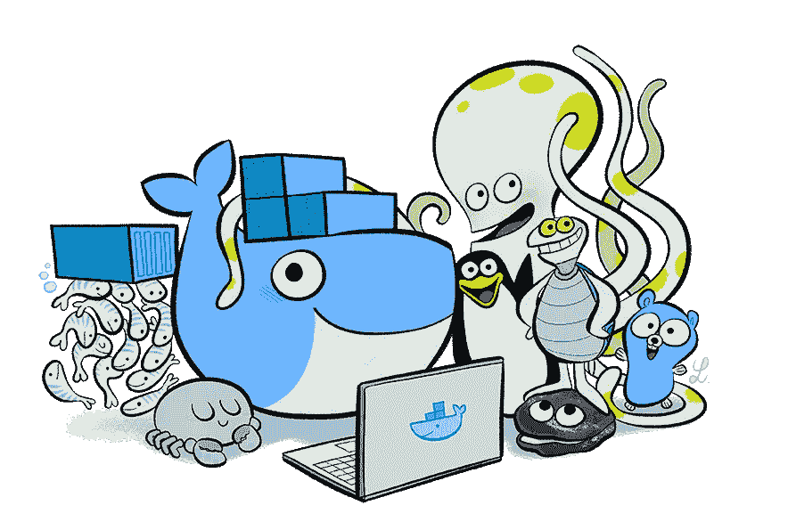

# 码头工人的日常生活

> 原文：<https://medium.com/hackernoon/everyday-hacks-for-docker-37e92188d9e8>

> 在这篇文章中，我决定与你分享一些我在使用令人敬畏的 Docker 技术时经常使用的有用命令和工具。每一个*“黑”都没有特定的顺序或*酷等级*。*我将简单介绍用例，以及具体的命令或工具如何帮助我的工作。



## 清理

在与 Docker 共事一段时间后，你开始积累开发垃圾:未使用的卷、网络、退出的容器和未使用的映像。

***一人指挥“统治一切”***

```
$ docker system prune
```

`prune`是一个非常有用的命令(也适用于`volume`和`network`子命令)，但它只适用于 [Docker 1.13](https://blog.docker.com/2017/01/whats-new-in-docker-1-13/) 。因此，如果您正在使用旧版本的 Docker，以下命令可以帮助您替换`prune`命令。

***清除悬空卷***

`dangling`卷是没有被任何容器使用的卷。要删除它们，组合两个命令:首先，列出`dangling`卷的卷 id，然后删除它们。

```
$ docker volume rm $(docker volume ls -q -f “dangling=true”)
```

***移除退出的容器***

同样的原理在这里也适用。首先列出你要移除的容器(只有 id)(用过滤器)然后移除(考虑`rm -f`强制移除)。

```
$ docker rm $(docker ps -q -f “status=exited”)
```

***去除悬空图像***

`dangling`图像是未标记的图像，是图像树的叶子(不是中间层)。

```
docker rmi $(docker images -q -f “dangling=true”)
```

***自动移除交互式容器***

当你运行一个新的交互容器，并希望在它退出后避免输入`rm`命令时，使用`--rm`选项。然后当你退出已创建的容器时，它将被自动销毁。

```
$ docker run -it --rm alpine sh
```

## 检查码头资源

[jq](https://stedolan.github.io/jq/) — `jq`是一个轻量级且灵活的命令行`JSON`处理器。对于 JSON 数据来说就像`sed`。您可以使用它来切片和过滤，以及映射和转换结构化数据，就像`sed`、`awk`、`grep`和朋友让您玩文本一样轻松。

`[docker info](https://docs.docker.com/engine/reference/commandline/info/)`和`[docker inspect](https://docs.docker.com/engine/reference/commandline/inspect/)`命令可以产生`JSON`格式的输出。用`jq`处理器组合这些命令。

***漂亮的 JSON 和 jq 处理***

```
# show whole Docker info 
$ docker info --format “{{json .}}” | jq . # show Plugins only 
$ docker info --format “{{json .Plugins}}” | jq . # list IP addresses for all containers connected to ‘bridge’ network $ docker network inspect bridge -f ‘{{json .Containers}}’ \
    | jq ‘.[] \
    | {cont: .Name, ip: .IPv4Address}’
```

## 观察容器生命周期

有时，当您运行某些 docker 命令或尝试不同的重启策略时，您希望看到容器被激活和退出。结合了`[docker ps](https://docs.docker.com/engine/reference/commandline/ps/)`的`[watch](http://man7.org/linux/man-pages/man1/watch.1.html)`命令在这里会非常有用。我发现`docker stats`命令(即使有`--format`选项)对此没有用，因为它不允许您看到与`docker ps`命令相同的信息。

***显示活动集装箱的“ID 图像状态”表，每 2 秒刷新一次***

```
$ watch -n 2 ‘docker ps --format \
    “table {{.ID}}\t {{.Image}}\t {{.Status}}”’
```

## 进入主机/容器名称空间

有时候你想连接到 Docker 主机。`ssh`命令是默认选项，但由于安全设置、防火墙规则或其他未记录的问题，该选项可能不可用(只需尝试谷歌“how to `ssh` into Docker for Mac VM”以了解我的意思)。

jérme Petazzoni 开发的`[nsenter](https://github.com/jpetazzo/nsenter)`是一个小型且非常有用的[工具](https://hackernoon.com/tagged/tool)用于这个用例。`nsenter`命令允许你`enter`进入`n` ame `s`步伐。我喜欢用极简(`580 kB`)[walker lee/n center](https://hub.docker.com/r/walkerlee/nsenter/)Docker 形象。

***进入 Docker 主机***

您可以使用`--pid=host`进入 Docker 主机名称空间。

```
# get a shell into Docker host 
$ docker run --rm -it --privileged --pid=host \
     walkerlee/nsenter -t 1 -m -u -i -n sh
```

***进入任意容器***

也可以进入任何带有`nsenter`和`--pid=container:[id OR name]`的容器。但是在大多数情况下，最好使用标准的`[docker exec](https://docs.docker.com/engine/reference/commandline/exec/)`命令。主要区别在于`nsenter`不进入 *cgroups* ，因此避开了资源限制(这对调试很有用)。

```
# get a shell into ‘redis’ container namespace 
$ docker run --rm -it --privileged --pid=container:redis \
     walkerlee/nsenter -t 1 -m -u -i -n sh
```

## Heredoc 码头集装箱

有时你想得到一些工具作为 Docker 图像，但是你不想搜索一个合适的图像或者创建一个新的`Dockerfile`(例如，不需要保留它以备将来使用)。有时候，在一个文件中存储 Docker 图像定义看起来有点矫枉过正——你需要决定如何编辑、存储和共享这个 Docker 文件。有时最好有一个单行命令，您可以复制、共享、嵌入到 shell 脚本中或创建特殊命令`alias.`
因此，当您想要用一个命令创建一个新的专用容器时，请尝试一种 [Heredoc](http://www.tldp.org/LDP/abs/html/here-docs.html) 方法。

***使用“htop”工具*** 创建基于 Alpine 的容器

```
$ docker build -t htop — << EOF 
FROM alpine 
RUN apk --no-cache add htop 
EOF
```

## Docker 命令完成

Docker CLI 语法非常丰富，并且在不断增加:添加新命令和新选项。很难记住每一个可能的命令和选项，所以为终端提供一个好的命令完成是**必须具备的**。

命令完成是一种终端插件，让你通过点击*标签*键自动完成或自动建议下一步输入什么。Docker 命令完成功能适用于命令和选项。Docker 团队为`docker`、`docker-machine`和`docker-compose`命令、为`Bash`和`Zsh`外壳准备了命令完成。

如果你正在使用 Mac 和[家酿](http://brew.sh/)，那么安装 Docker 命令完成是非常简单的。

```
# Tap homebrew/completion to gain access to these 
$ brew tap homebrew/completions # Install completions for docker suite 
$ brew install docker-completion 
$ brew install docker-compose-completion 
$ brew install docker-machine-completion
```

如果您没有使用 Mac，请阅读 Docker 官方文档以获得安装说明: [docker 引擎](https://github.com/docker/docker/tree/master/contrib/completion)、 [docker-compose](https://docs.docker.com/compose/completion/) 和 [docker-machine](https://docs.docker.com/machine/completion/) 。

## 自动启动容器

当在 Docker 容器中运行一个流程时，失败可能是由多种原因造成的。在某些情况下，您可以通过重新运行失败的容器来修复它。如果您使用的是 Docker 编排引擎，如 Swarm 或 Kubernetes，失败的服务将自动重启。
如果没有，那么你可能想要根据容器主进程的*退出代码*重启容器，或者总是重启(不管*退出代码*)。Docker 1.12 引入了`docker run`命令:[重启](https://docs.docker.com/engine/reference/run/#restart-policies-restart#restart-policies---restart)用于这个用例。

***重启总***

使用重启策略 **always** 重启`redis`容器，这样如果容器退出，Docker 将重启它。

```
$ docker run --restart=always redis
```

***故障时重启容器***

使用重启策略 **on-failure** 和最大重启计数`10`重启`redis`容器。

```
$ docker run --restart=on-failure:10 redis
```

## 网络诡计

有时，您可能希望创建一个新的容器，并将其连接到现有的网络堆栈。这可能是 Docker 主机网络或另一个容器的网络。这在调试和审计网络问题时很有帮助。
`docker run --network/net`选项允许你这样做。

***使用 Docker 主机网络栈***

```
$ docker run --net=host …
```

新容器将连接到与 Docker 主机相同的网络接口。

***使用另一个容器的网络堆栈***

```
$ docker run --net=container:<name|id> …
```

新容器将连接到与另一个容器相同的网络接口。目标容器可以通过`id`或`name`指定。

***可附着叠加网络***

使用在**群模式**下运行的 Docker 引擎，你可以在一个管理节点上创建一个多主机`overlay`网络。当您创建一个新的*群服务*时，您可以将它附加到之前创建的`overlay`网络。

有时你需要附加一个新的 Docker 容器(装满不同的网络工具)，到现有的`overlay`网络上，以便检查网络配置或调试网络问题。为此，您可以使用`docker run`命令，这样就不需要创建一个全新的“调试服务”。

Docker 1.13 为`docker network create`命令带来了一个新选项:`attachable`。`attachable`选项允许手动连接容器。

```
# create an attachable overlay network 
$ docker network create --driver overlay --attachable mynet # create net-tools container and attach it to mynet overlay network $ docker run -it --rm --net=mynet net-tools sh
```

我希望这篇文章对你有用。如果你自己有更多的小技巧，请在评论框里留下！

*原载于 2017 年 1 月 5 日*[*code fresh . io*](https://codefresh.io/blog/everyday-hacks-docker/)*。*

[](http://bit.ly/HackernoonFB)[](https://goo.gl/k7XYbx)[](https://goo.gl/4ofytp)

> [黑客中午](http://bit.ly/Hackernoon)是黑客如何开始他们的下午。我们是 [@AMI](http://bit.ly/atAMIatAMI) 家庭的一员。我们现在[接受投稿](http://bit.ly/hackernoonsubmission)并乐意[讨论广告&赞助](mailto:partners@amipublications.com)机会。
> 
> 如果你喜欢这个故事，我们推荐你阅读我们的[最新科技故事](http://bit.ly/hackernoonlatestt)和[趋势科技故事](https://hackernoon.com/trending)。直到下一次，不要把世界的现实想当然！

