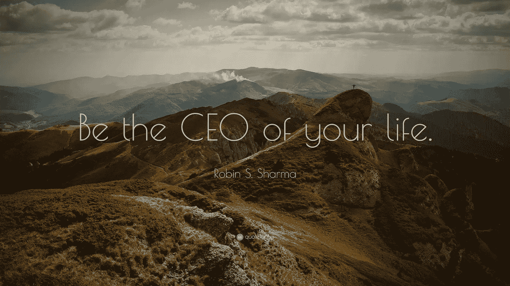

# 每个人都是 CEO

> 原文：<https://medium.com/hackernoon/everyone-is-a-ceo-971d0d2e3a89>

Photo Credit: [quotefancy.com](https://quotefancy.com/quote/249318/Robin-S-Sharma-Be-the-CEO-of-your-life)

我是我生命中的 CEO。

*   我决定是在 6 点还是上班前一小时醒来。
*   我决定是去慢跑还是滚动无休止的脸书饲料。
*   我决定吃还是不吃早餐。
*   我决定是追随我的激情还是做我不喜欢的工作。
*   我决定是保持冷静还是对别人的错误感到焦虑。
*   我决定是原谅和忘记还是怨恨别人。
*   我决定是吃有机食品还是罐头食品。
*   我决定是走几分钟还是坐出租车。
*   我决定是读一本书还是在聚会上浪费时间。
*   我决定是珍惜这段关系还是欺骗她。
*   分手后我决定是继续前进还是变得沮丧。
*   我决定是睡 8 个小时还是整晚看网飞。
*   我决定是改正我的错误，还是为自己的糟糕感到难过。

你也是。

相信你对生活中发生的每件事都有 100%的责任。

> 我们是自己生活的首席执行官——丹·艾瑞里在他的新书《回报》中写道。

> [黑客中午](http://bit.ly/Hackernoon)是黑客如何开始他们的下午。我们是 [@AMI](http://bit.ly/atAMIatAMI) 家庭的一员。我们现在[接受投稿](http://bit.ly/hackernoonsubmission)并乐意[讨论广告&赞助](mailto:partners@amipublications.com)机会。
> 
> 如果你喜欢这个故事，我们推荐你阅读我们的[最新科技故事](http://bit.ly/hackernoonlatestt)和[趋势科技故事](https://hackernoon.com/trending)。直到下一次，不要把世界的现实想当然！

