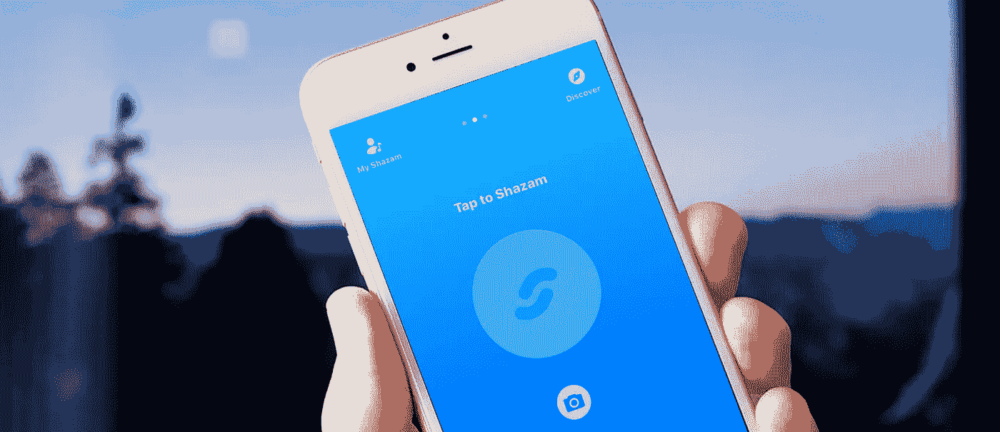

# 每个人都想得到一点认可——包括苹果

> 原文：<https://medium.com/hackernoon/everyone-wants-a-little-recognition-including-apple-c0fd103ffe85>

“她是谁？”

我的朋友转过身，继续在超市里向后走，试图回答自己的问题。那是 2009 年 12 月的一个深夜。我们俩在街对面的 UCB 剧院看即兴表演前消磨时间。

*“我希望我能只是 Shazam 一个人的脸”*他继续说道。

2009 年，一个看似荒谬的想法，我继续取笑我的朋友，以及那种不可避免的更尴尬的社交互动。那时*在公共场合仍然要求你找到一个说话的人，然后要求方圆 50 英尺内的每个人礼貌地“闭嘴！”*

Shazam 远非完美，但使用该应用的核心功能感觉就像是在表演魔术。

昨天，[苹果宣布](https://techcrunch.com/2017/12/11/apple-shazam-deal/)他们对英国音乐识别初创公司的收购已经进入最后阶段。收购的消息让大多数人无动于衷，只有极少数人会问:“好吧，但是为什么？”

显而易见的答案是:苹果音乐和 iTunes。

Shazam 仅仅通过做一个探索应用就为自己开拓了一个市场。他们的名字已经成为一首歌曲的代名词，并希望保留它以供重复欣赏。Shazam 的唯一目的是找出正在播放的歌曲，然后将你指向其他地方，无论是 Apple Music、Spotify 还是亚马逊。随着苹果收购的宣布，如果你打赌后两者将从 discovery 服务中被切断，赔率对你有利。

但是音乐发现和 iTunes 收入不可能是苹果唯一的激励因素。毕竟，自 2014 年以来，Shazam 一直是 Siri 的内置功能。

虽然 Shazam 一直在努力寻找一种能够充分满足投资者的长期商业模式，但他们已经开始拓展业务。2015 年，他们公布了 [Shazam Visual](https://www.shazam.com/news/visual) 。这对公司来说应该是一个全新的领域。用户现在可以扫描任何带有 Shazam 徽标的图像或视频，并识别他们看到的内容。这一举动明显是针对广告客户的，应用程序不需要了解这一转变的意图。

然后在 2017 年初，Shazam 宣布他们进军增强现实。快进三个月，到苹果的 WWDC，你会听到这个科技巨头对增强现实的非常相似的推动。

但是，即使在 AR，也不是我们问题的答案所在。苹果不需要报道的 4 亿美元账单来推动他们的议程；他们有足够的理由独自改变现实。

要真正理解苹果公司在一次明显的收购背后的动机，我们必须看一看背景。衡量他们的竞争对手。为此，我们求助于字母表和脸书。

2017 年，仅这两家就占了全球广告收入的 25%。在一个近 5500 亿美元的行业中，其中四分之一由两家公司分享。毫不奇怪，其他人现在正看着这个数字，试图找出如何获得他们的份额。

这对苹果来说，说起来容易做起来难。2010 年夏天，他们宣布了一个名副其实的 iOS 广告平台， [iAds](https://en.wikipedia.org/wiki/IAd) 。结果喜忧参半，但从未产生任何足以让这家科技巨头实际获利的实质性内容。六年后苹果关闭了 iAds。

但是年复一年，广告费一直在增长。与此同时，从传统印刷媒体转向数字媒体的美元数量让任何人都不容易坐以待毙，更不用说苹果了。

在过去的几年里，苹果已经在他们的产品中实现了类似 Shazam 的发现功能，首先是与 Siri 的集成。发现一直是 Siri 成功的关键因素。为此，有一天晚上我在看电影，发现自己在问我的苹果电视“那个演员是谁？”我很快意识到，那种程度的图像识别是不可能的。我的苹果电视将无法猜测哪个演员刚刚出现在屏幕上。但随着昨天消息的公布，这只是时间问题。

如果我们退后一步，看看苹果现在是如何定位自己的，那么与 Shazam 的这笔交易是显而易见的。仅音乐流量一项，就足以弥补 4 亿美元的价格。

真正的收入来源和增长在于他们能够提供的延伸广告。苹果不再局限于一个屏幕或浏览器同步，它将能够为品牌提供真正身临其境的广告体验。cookies 将会跟随你从一个设备到另一个设备的日子已经一去不复返了。你将能够在苹果电视上展示广告，并让它在一个人的 iPhone 或 iPad 上触发 AR 执行。广告商将“入侵”这些设备，而不需要采取狡猾的策略。他们会让你拍一张著名地标的照片，然后自动提供品牌内容。或者更极端的是，在你正常的浏览圈子里给你投放广告。

听我说完；我不是在试图阐明文明的衰落或预言一个反乌托邦的、少数派报告的未来。但是认为苹果购买 Shazam 的唯一理由是它的音乐识别能力是对两家公司的严重低估。

虽然两家公司都没有明确列出收购背后的原因，但像 Face ID 这样的功能已经实现了我们所知道的——我们能够 Shazam 人们的脸只是时间问题。