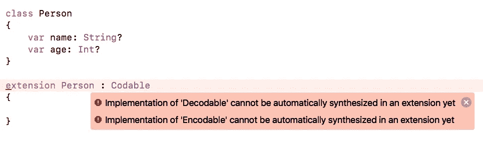
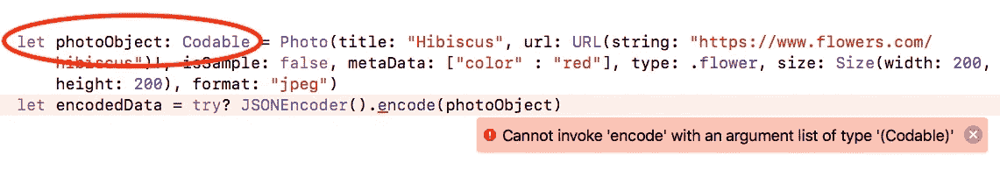

# Swift 4 中关于 Codable 的一切

> 原文：<https://medium.com/hackernoon/everything-about-codable-in-swift-4-97d0e18a2999>

去掉那些沉重的编码代码..！！！🤗


众所周知，为了支持 iOS 中实例的编码和解码，一个类必须采用 *NSCoding* 协议并实现其方法:

1.  ***init(编码器:)*** —返回一个从给定的解压缩器中的数据初始化的对象。
2.  ***encode(with:)***—使用给定的归档程序对接收器进行编码。

**示例:**

Code Snippet — 1

*init(coder:)* 和 *encode(with:)* 必须包含需要编码或解码的每个属性的代码。😲

嗯，看起来你必须写这么多多余的代码😖只是属性名称发生了变化。**复制粘贴..复制粘贴..！！！😕😴**

但是我为什么要这么做呢？🙇‍♀️:如果属性名与键名相同，并且我没有任何特定的要求，为什么 *NSCoding* 不在自己的一端处理所有的事情呢？🤷‍♀️:为什么我要写这么多代码？不，不..！！！😼

我的天啊..！！！另一个问题🤦‍♀️.它甚至不支持*结构和枚举*。👺这意味着每当我需要序列化数据时，我都必须创建一个*类*，即使我没有任何特定于类的要求。🤒

真是浪费时间🤢。帮我..！！！🙏

良好的..良好的..良好的..别担心。苹果又来拯救你了。🤠

## Swift 4 有什么新功能？

在 Swift 4 的发布中，*苹果*展示了一种全新的数据编码和解码方式🤓通过使您的自定义类型符合一些易于采用的协议，

1.  ***可编码*** —用于编码
2.  ***可解码*** —用于解码
3.  ***可编码***——用于编码和解码

它也为*类、结构和枚举*提供支持。👌👌

所以，让我们来看看这对我们有什么好处。

## 可编码协议

一种可以将自身编码为外部表示形式的类型。它由可编码的类型使用。

它包含一个方法:

*编码(to:) —* 将该值编码到给定的编码器中。

## 可解码协议

一种可以从外部表示中自我解码的类型。它由可解码的类型使用。

它还包含一个方法:

*init(from:)* —通过从给定解码器解码来创建新实例。

## 可编码协议

一种可以将自身转换为外部表示形式或从外部表示形式转换出来的类型。它由既可以编码也可以解码的类型使用。

```
typealias Codable = Decodable & Encodable
```

它包括在*可编码*和*可解码中声明的方法。*

在接下来的章节中，您将了解更多关于*编码(to:)* 和*初始化(from:)* 的内容👽。

## 可编码类型

为了编码和解码一个自定义类型，我们需要使它*可编码*。

> 使类型可编码的最简单的方法是使用已经是*可编码的类型来声明它的属性。*

1.  内置*可编码*类型— *String、Int、Double、Data、URL*
2.  *数组、字典、可选*如果包含*可编码*类型，则为*可编码*

Code Snippet — 2

所以，现在我们已经看到了什么是*可编码的*，让我们看看如何实际使用它来编码和解码我们自己的自定义类型。我们开始吧..🙂

## 编码— JSONEncoder

您可以使用 ***JSONEncoder*** 将您的*可编码* *类型*转换为*数据*。

*JSONEncoder 的****encode(_:)****方法返回*可编码类型*的 JSON 编码表示。*

*Code Snippet — 3*

*什么……！！！😱只有一行代码？就这样？你在开玩笑吧？一定还有别的什么..一些捕捉..这不可能..🤯*

*😂😎是的，这是你唯一需要写的代码来让它工作。是不是很牛逼👏？。只需两个简单的步骤，你就完成了。有了这么多的开销，再也不需要那么多代码了。Hi5 ✋.*

**

*像编码一样，你也可以很容易地得到解码。你还在等什么？🤓继续吧..🤗*

## ***解码—** JSONDecoder*

*就像 *JSONEncoder* 一样，还有 ***JSONDecoder*** 可以用来将你的 JSON 数据解码回你的*可编码类型*。*

**JSONDecoder 的****decode(_:from:)****方法返回您指定的*可编码类型*的值，从 JSON 对象解码。**

**Code Snippet — 4**

**就是这样。这就是你如何编码/解码你的可编码类型。**只需两步:****

1.  **使您的自定义类型符合*可编码协议。***
2.  **使用*JSON encoder/JSON decoder*编码/解码您的自定义对象。**

## **选择要编码和解码的属性—编码密钥**

**你可能会对❓❓coming 有些疑问，**

1.  **如果我想从序列化过程中省略掉*可编码类型*的一些属性该怎么办？**
2.  **如何编码/解码某些密钥🔑包括的属性名与*可编码类型*的属性名不匹配？**

**嗯，*苹果*也提供了解决方案——***枚举编码键。*****

> **可编码类型可以声明一个名为 CodingKeys 的特殊嵌套枚举，该枚举符合 CodingKey 协议。当此枚举存在时，它的事例充当对可编码类型的实例进行编码或解码时必须包括的属性的权威列表。**

**关于 ***需要注意的事情编码关键字:*****

1.  **它有一个*原始类型——字符串*，并且符合 *CodingKey* 协议。**
2.  **枚举案例的名称应该 ***与*** 完全匹配💯*可编码类型*的属性名。**
3.  ***对第一个问题的回答*如果您想在编码/解码过程中省略 *CodingKeys* 中的属性，✅—会将其省略。从*编码键*中省略的属性需要一个默认值。**
4.  ***第二个问题的答案* ✅ — *原始值*是当*可编码类型*的属性名与序列化数据中的键不匹配时需要的东西。通过将*字符串*指定为 *CodingKeys* 枚举的原始值类型来提供替代键。用作每个枚举情况的原始值的字符串是编码和解码过程中使用的键名。**

****例如:****

**在下面的代码片段中，**

1.  ***var format: String = "png"* 从*编码键*中省略，因此提供默认值。**
2.  **属性*标题*和 *url* 被重命名为*名称*和*链接*使用*原始值*中的*编码关键字—案例标题= "名称"*和*案例 url = "链接"***

**Code Snippet — 5**

## **手动编码和解码✏️**

**有些情况下，你的*可编码类型*的结构与其编码形式*的结构不同，例如*:**

**Code Snippet — 6**

**当您使用上面的*照片*声明对一个*照片*对象进行编码时，您得到的 *JSON* 看起来类似于:**

**Code Snippet — 7**

**如果不希望“*宽度”*、“*高度”*嵌套在“*大小”*中怎么办？🤔也就是说，您的 *JSON* 应该类似于:**

**Code Snippet — 8**

**在这种情况下，您可以提供自己的定制逻辑📝的*可编码的*和*可解码的*来定义自己的编码和解码逻辑。**

**你需要显式实现*可编码*和*可解码*协议的*编码(to:)* 和*初始化(from:)* 方法。**

**遵循以下步骤:**

1.  **更新*枚举编码键*以包括*宽度*和*高度*键，而不是*尺寸*。**
2.  **从*照片*中删除与*代码*的一致性。**
3.  **创建符合*可编码*的*照片扩展*并实现*编码(to:)* 方法。**
4.  **创建一个符合*可解码*的*照片扩展*并实现 *init(from:)* 方法。**

**Code Snippet — 9**

## **限制🚫**

1.  **现在你不能在一个*扩展*中符合*编码*🙅‍♀️.它可能会在以后的版本中提供。**

****

**这个版本中有太多的 yet🙈。我不知道为什么*苹果*这么着急..🤔**

**2.你必须使用一个**具体类型**来编码和解码。**

****

**你可以在这里找到这个场景[的一个很好的用例。](https://stackoverflow.com/questions/46564650/how-to-define-variable-with-type-of-codable/46580238#46580238)**

# **促销**

**别忘了阅读我的其他文章:**

1.  **[拖动&放入收藏&表— iOS 11](/@p.gpt10/drag-it-drop-it-in-collection-table-ios-11-6bd28795b313)**
2.  **[ui table view iOS 11 中领先&拖尾的滑动动作](https://hackernoon.com/uitableview-leading-trailing-swipe-actions-in-ios-11-18cb1f267f8a)**
3.  **[Swift 4.0 迁移—错误..！！错误..！！](https://hackernoon.com/swift-4-0-migration-error-error-8fbf13c2ec2)**
4.  **[关于 iOS 10 中的今日扩展(Widget)你需要知道的一切](https://hackernoon.com/app-extensions-and-today-extensions-widget-in-ios-10-e2d9fd9957a8)**
5.  **[UICollectionViewCell 选择变得简单..！！](https://hackernoon.com/uicollectionviewcell-selection-made-easy-41dae148379d)**

**如果您有任何疑问，请随时发表评论。🙂🙃**