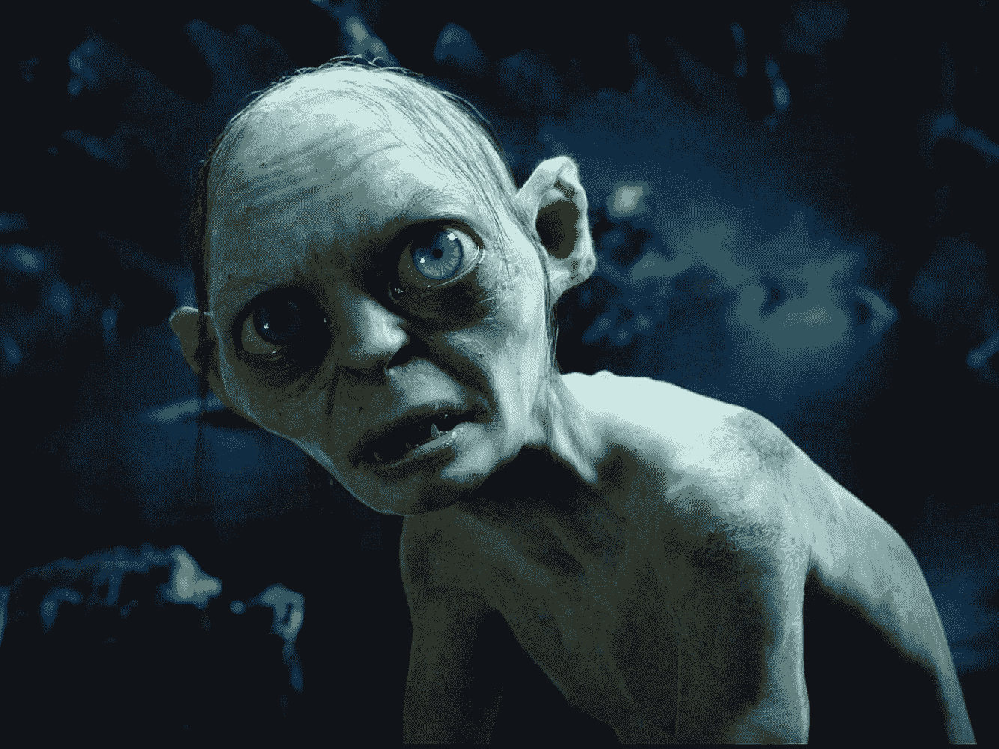

# 一切都是我的导师(包括网络巨魔)

> 原文：<https://medium.com/hackernoon/everything-is-my-guru-including-the-internet-trolls-6df85598a444>

An image of Gollum from “The Hobbit: An Unexpected Journey” from Warner Bros.

我最近一直在和巨魔斗争。他们出现并试图破坏聚会。他们说我自负，或者是精神病，或者对我妻子不忠。他们告诉我，我应该停止教人们使用[冥想](https://hackernoon.com/tagged/meditation)来在生活中获得更大的成功，我应该更多地冥想(或以不同的方式)，更加谦逊，培养同情心，帮助他人，并了解贫穷是什么样的。巨魔为我的生活开出了许多药方:变得更聪明，少一些陈词滥调，多一些付出。

大多数时候，我不明白他们在回应什么。往往好像他们没看我的文章，或者看了完全没有抓住重点。有时他们似乎把我看作是与我截然相反的人。大多数时候，这些几乎不了解我的人似乎认为他们是我的治疗师，或者是我最亲密的朋友。从来都不是关于他们的；总是关于我。他们甚至告诉我:“这都是为了你，嗯？”

昨天我感到受伤了。我曾被称为一个控制欲强的反社会者，他无视周围人的感受，背着妻子自私地玩弄自己的女儿。当我认为这些攻击是针对我个人的时候，它们很伤人。它们伤人是因为它们不是真的。他们和我的生活没有任何关系。事实上，我非常忠诚，为同理心而痛苦，并且非适应性无私。

事情是这样的，我已经在这个世界上有了很多曝光率，我还会有更多，更多的曝光率。我意识到我必须学会适应这种内部的诱惑，否则它会毁了我。今天我想起了我在最近一次冥想静修中的一个领悟。

在进行我选择的内省练习([内观](http://dhamma.org))时，我开始意识到我与古鲁或老师之间的关系极度失调。我一生都在寻找一个人来指引我，给我生命的答案，帮我结束痛苦。

我已经被介绍了很多次，进入了许多不同的传统。我甚至去了印度，和一位“古鲁”坐在瓦拉纳西一间昏暗的房间里。我们坐在一起，只有我和他，连续三周每天两小时。我记得他告诉我的一句至理名言是，“男人不应该和其他男人发生性关系。”那好吧。我是一个对与其他男人发生性关系不感兴趣的男人，但我相信其他男人应该与其他同意的男人做他们想做的任何事情。

还有一次，当我在冥想中有了某种体验后，我和一位老师分享了它，因为我想把它放在上下文中。对我脆弱分享的回应是一个愤怒的断言，“你不可能经历过，因为这意味着你是一个圣人！”然而，我还是听从了一个不如我自由的人的指示。

作为对这种毫无结果的寻找古鲁的反应，也因为我被那些我认为对我有精神权威的人所伤害，我经历了一段排斥所有老师的反应期。我相信我不需要把任何人放在我之上，作为我的导师。我相信我内心有我自己的导师。

在最近的冥想静修中，所有这些关于内在和外在权威的斗争达到了顶点，出现的是一种认识，即*一切*都是我的导师。每时每刻的每一次经历都是我的导师。现实总是试图向我展示它自身的一些东西。我对宇宙来说一定很重要，因为它一直在密谋把我从痛苦中解放出来。

所以现在我开始把这种认识应用到这些巨魔和他们写的东西上。人们不会走到街上的其他人面前说:“你走路的样子真滑稽！你怎么了！你需要多打坐，学会谦虚！看看你是多么傲慢地抬起头来！你什么时候不打老婆了？”人们在街上不会这么做，因为这很尴尬。在互联网上，人们有一定的匿名性和正常的社会反馈绝缘。他们认为当他们用书面语言表达他们的反应时，他们看起来不那么疯狂。

对我来说很清楚的是，每次有人带着贬低、负面的框架接近我，这让我感觉很糟糕，这是他们有反应的迹象。他们正处于情绪反应和行动中。与我无关。我写的很 vulnerably，看的人百感交集。有时候很有挑战性。

有一次我被一个家伙骗了，他让我停止播放我的“黑暗诗歌”在我看来并不黑暗。我只是在展示我的内心世界。当他打电话给我，告诉我我分享我的感受，让他觉得他必须告诉人们他在很小的时候就被性虐待时，我更加明白了。他说，“那让你有什么感觉！?"我含着眼泪告诉他，我同情他，我关心他。我并不像他预料的那样讨厌他。

我习惯分享自己的内心世界。这需要勇气，而且感觉有风险。我这样做是因为我相信这是我能为拯救地球所做的最有力的事情之一。我可以树立一个榜样。我可以证明没什么好羞愧的。当人们被激怒了，然后用羞辱的话来回应我，那是因为他们被激怒了，在发泄。与我无关。我不需要承担这些计划。我不用调暗光线。我致力于将这道光照耀到这个世界。

昨天我和一个朋友聊到我们似乎都在“自我点燃”当我们受到攻击时，我们会听到批评性的言论，尽管它们并没有在我们的现实中出现，但我们在我们的思想和心灵中给了它们过多的播放时间。我们质疑:我真的是反社会者吗？我真的想和我成年的女儿做爱吗？我是不是真的通过编造一个灵修经历的故事来装圣人？我是不是产生了幻觉？我真的在某种程度上彻底绝望了吗？我所采取的似乎能减轻我痛苦的措施实际上只是我在欺骗自己，我真的很不开心，很失落。等等等等。

那么，网络上和现实生活中的那些“巨魔”想教我什么呢？更准确的说，被 trolled 试图教会我的是什么体验？我的成长优势是什么？对我来说，成长的优势是学会不在乎别人说什么。讽刺的是，这是为了多一点反社会，少一点移情，多一点保护我的感情，我的精力和我的时间。我需要表现得更加尊重和重视自己。

当有人花时间攻击我时，他们这么做是因为他们的按钮被按下了，他们试图在某种程度上让我感受到他们的痛苦。他们正在以一种非常不正常的方式做这件事。他们没有明确地透露他们的伤害和痛苦，也没有承认，而是含蓄地试图通过伤害我来表达。作为一个极度敏感内向的移情者，我就像一个微调过的感觉仪器。他们进来，开始敲打我的琴键，想听听我痛苦的音符。每一次爆炸都通向一个内省的内部回音室，并试图理解它。

“这里有什么教训？”我问。我错过了什么？我怎样才能从中吸取精华呢？我终于了解到，即使呈现在我面前的是真实的核心，它也是以一种我或其他人几乎不可能听到的方式呈现的。事实是，这是他们自己痛苦的一种表达，向外，投射到我身上。

我的教训是要明白:“我按了他们的按钮”，他们没有对自己的情绪反应负责。我不需要做什么。我不需要回应或解释，或试图帮助，或试图引导他们对自己的反应负责。我可以不管它。这是我妻子辛迪一直指导我做的事情，到目前为止几乎不可能做到。

朋友们读了巨魔写的东西，告诉我这些人看起来像疯子。我开始明白，即使通过回应，我也在验证他们的活动。他们为自己的行为负责的唯一希望是不让它着陆。最终，他们投射到我身上是不适应的，当我接受并试图认同他们的投射时，这对他们没有帮助。

有些人会说，我拒绝了这些恶意的反馈，我是一个伪君子，没有说到做到。有人(巨魔)说我似乎没有遵循自己的建议，因为我没有对自己的部分负责。例如，有人说我是一个反社会者，我说，“我遭受了太多的同理心。”显然是我没有承担责任。当有人在我的位置上设置了一个稻草人，比如告诉我，我的冥想方法是体育锻炼，这是被误导的，我应该承认这一点，并解释为什么通过锻炼来冥想是好的。我实际上曾经发现自己在争论那个立场，例如，一个甚至不能引起我共鸣的立场。

问题的关键在于:对你的情绪反应负责。当我被套牢时，会很痛。当人们不理解我时，我很难过。当我打算帮助别人的行为，比如我正在创作的这篇脆弱的[文字](https://hackernoon.com/tagged/writing),被视为傲慢时，这很伤人。我可以分享这一点，或者我可以在内心意识到这一点，然后忽略并离开。当你读到这里，有了情绪反应，但你并不拥有它，而是攻击我，这是你的问题。我不必接受这个事实。我可以找回我的感觉并拥有它们。

我不需要一直让我的脸被揍。当我这么做的时候，我就是这一拳的同谋。当有人带着所有“你”的陈述向我走来时，我不太可能以某种方式支持他们将注意力转向治愈的“我”的观点，一种情感所有权和整合的观点。

这一课的核心是让大家明白，并不是每个人都对拥有自己的情绪反应感兴趣。很多人还在试图通过把那些冲突外化来解决内心的冲突和瓦解。他们还没有意识到所有的整合都发生在内部，所有的冲突都在内部。所有令人烦恼的事和令人愉快的事都在我们内心深处。

这种诱惑教会我不要被那些试图引导我获得更多(或不同)快乐，或其他实践，或以某种方式与众不同的人拉出来。这种诱惑教会我勇敢和自信地面对我的内在真相，并跟随我的灵感去分享它。

矛盾的是，我需要把我的注意力带回到我内心的巨魔，我内心点燃煤气的反社会者；我的一部分无情地贬低我，误解我，让我气馁。我需要理解并同情我的那一部分，并允许它离开。我不需要接受邀请，将这种冲突具体化和永久化。

感谢 99.9%看我文章的人看到我，重视我和我提供的东西。谢谢你让我知道我在激励你，支持你。谢谢你利用我所提供的，并分享你自己的故事和感受。我打算把越来越多的注意力放在你身上。

# 如果你喜欢这篇文章

*   点击心脏💚这样会有更多的人看到/读到这篇文章。
*   在 Medium 上关注我，脸书([关注](https://www.facebook.com/duncan.riach)，[喜欢](https://www.facebook.com/Almost-Dr-Duncan-176704765704342/))， [YouTube](https://www.youtube.com/user/DuncanRiach) ，以及 [Twitter](https://twitter.com/DuncanARiach) 。
*   注册电子邮件更新，获取我的[免费生活方式挑战表格](http://lifebootstrap.com)，以培养适应性习惯。

> [黑客中午](http://bit.ly/Hackernoon)是黑客如何开始他们的下午。我们是阿妹家庭的一员。我们现在[接受投稿](http://bit.ly/hackernoonsubmission)并乐意[讨论广告&赞助](mailto:partners@amipublications.com)机会。
> 
> 如果你喜欢这个故事，我们推荐你阅读我们的[最新科技故事](http://bit.ly/hackernoonlatestt)和[趋势科技故事](https://hackernoon.com/trending)。直到下一次，不要把世界的现实想当然！

