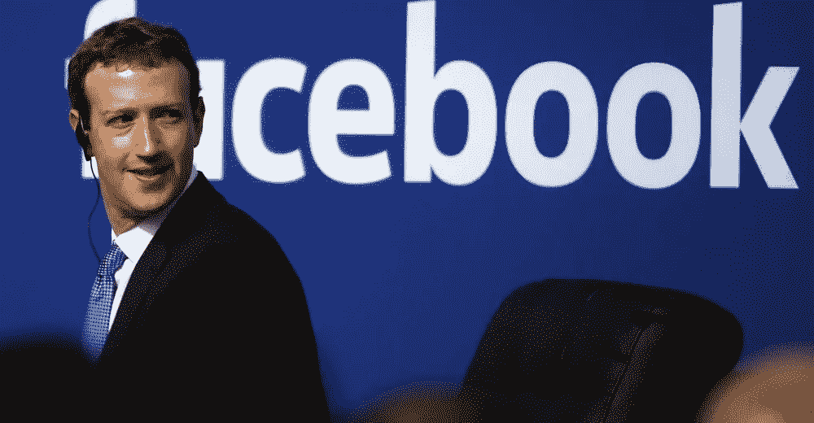
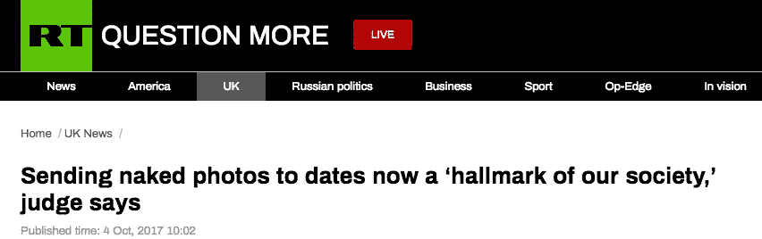
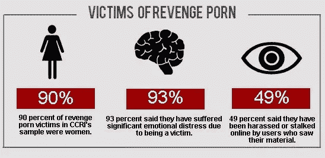
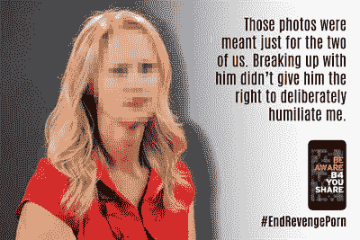
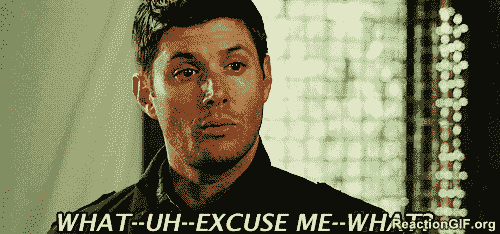
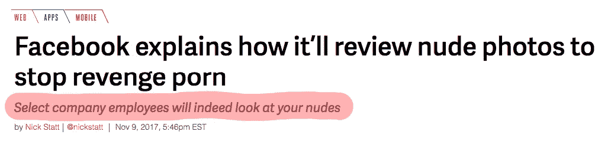
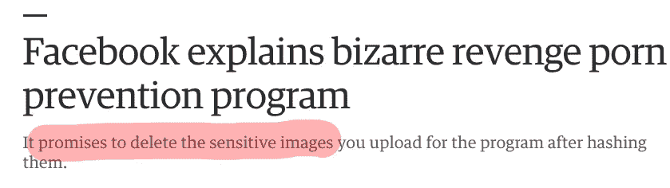
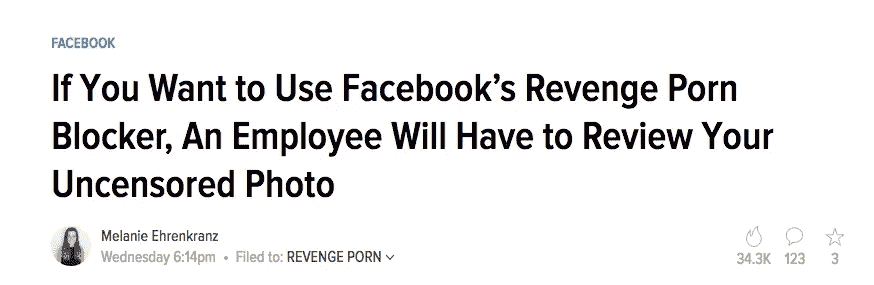

# 脸书对复仇色情的反击有什么问题吗

> 原文：<https://medium.com/hackernoon/everything-wrong-with-facebooks-countermove-on-revenge-porn-9147f805ef96>

## 脸书正在试行一项服务，帮助人们通过“发送裸体”来防止报复色情——自愿的！



Zuckerberg may not have thought it through (img — Stephen Lam / Reuters)

复仇色情！两个既恐怖又恶心的词。老实说，我第一次知道这个术语是通过 HBO 电视连续剧《新闻编辑室》的一集。剧中的一个角色在各方面都经历了很多创伤(*包括在工作场所面临纪律问题*)，因为前男友选择在网站上分享她的亲密照片。*斯隆*最终在那场磨难中变得强大起来(*更不用说打前任的脸了，那只是经典的*)。但是，想象一下这发生在你身上。处在这样一个位置，你总是在想，在办公室里，在教室里，坐在你旁边的人是否看过那些照片，那些视频。在那里你总是等待另一只鞋掉下来。等着有人来问你这件事。想办法让他们下台。

现在脸书来帮你了。但我确实有我的担忧。我会详细地列出它们，但首先让我们稍微详细地看一下事情。

## 真正的问题

毫无疑问，这是一个现实问题。一个应该而且需要解决的问题。有一瞬间，我问自己——“为什么是澳大利亚？”，用了不到 2 分钟的谷歌搜索，我找到了这个:

> 据信多达五分之一的人都经历过所谓的形象虐待，但是这个问题的真实规模是无法估计的。

`Source: [ABC News](http://www.abc.net.au/news/2017-11-10/how-easy-is-it-to-find-and-take-down-revenge-porn/9135836)`



([img](https://www.rt.com/uk/405627-naked-photos-revenge-porn/))



(img src — [left](http://www.independent.co.uk/life-style/health-and-families/features/revenge-porn-enough-still-isnt-being-done-to-stop-it-9578892.html), [right](https://www.gov.uk/government/publications/revenge-porn-be-aware-b4-you-share))

无论你是否遇到过这种——有时是匿名的*——犯罪的受害者，你都不能否认这样的事实，它就发生在我们身边，它让受影响的女性(*有时是男性*)感到被贬低、受到创伤和羞辱。严重！*

## FACEBOOK 和政府一起站出来

显然，脸书正与四个不同的政府合作应对这一挑战。虽然其他三个国家仍然不为人知，但澳大利亚是该项目与政府合作试点的地方。机构安全。

[](https://techcrunch.com/2017/11/07/facebook-revenge-porn-strategy-involes-sending-nudes-to-self/) [## 脸书正在测试一种新的方法来防止报复色情，这种方法需要上传你的裸体

### 据澳大利亚广播公司报道，脸书正在测试一种新的方法来打击澳大利亚的复仇色情

techcrunch.com](https://techcrunch.com/2017/11/07/facebook-revenge-porn-strategy-involes-sending-nudes-to-self/) 

# 问题？

> 该策略需要将你的裸照或视频上传到 Messenger，以帮助脸书将其标记为未经同意的露骨媒体。



你想让人们把他们的裸照发给你，这样他们的裸照就不会出现在互联网上？当然可以！这很有道理，不是吗？

# 你会如何处理人们的恐惧，他们会主动放弃自己的形象，因为可能会被滥用？

当你向某人询问敏感细节时，人们总是担心被滥用。我知道有些人也选择不在电子商务网站上自动保存信用卡信息。想象一下，如果他们向你提供他们的裸体照片和视频，只是为了防止别人这么做，他们会是什么感觉。

公平地说，脸书和 eSafety 都声称你要分享的这些照片不会储存在脸书的服务器上。

> 电子安全专员朱莉·因曼·格兰特对美国广播公司说:“他们不是存储图像，而是存储链接，并使用人工智能和其他照片匹配技术。”“因此，如果有人试图上传相同的图像，这将具有相同的数字足迹或哈希值，它将被阻止上传。”

> 脸书的哈希系统将能够在未来识别这些图像，而不需要将它们存储在其服务器上。

很好，但是我有两点要说明。

1.  这对于克服许多人在决定是否参加这个项目时所面临的心理抑制没有多大作用。
2.  关于这个问题的最终结论——这些图像是否会被存储，或者是否会被任何第三方看到——仍然是粗略的。



([img](https://www.theverge.com/2017/11/9/16630900/facebook-revenge-porn-defense-details))



Promises to delete. Sure, that sounds convincing. ([img](https://www.engadget.com/2017/11/10/facebook-explains-revenge-porn-prevention-trial/))



An employee will have to review your ‘**uncensored**’ photo. Am I the only one who isn’t quite comfortable with how that sounds like? ([img](https://gizmodo.com/if-you-want-to-use-facebook-s-revenge-porn-blocker-an-1820271537))

来自脸书的[官方新闻稿](https://newsroom.fb.com/news/h/non-consensual-intimate-image-pilot-the-facts/)本身谈到了一位经过特殊训练的代表，他将负责审查图片。

顺便说一句，还记得那位离开公司的 twitter 员工吗？他/她在最后一天选择关闭唐纳德·特朗普的 Twitter 页面长达 11 分钟。当然这种性质的东西在这里是不可能的，不是吗？

# 我对整件事的看法？

真他妈的臭！

从我目前读到的故事来看，似乎你选择分享的每一张私密照片都会被赋予一个独特的指纹，标记为“非自愿亲密图像”。但这并不妨碍分享你没有分享过的图片？我不确定是不是这样，但如果是这样的话——天哪，天哪。想象一下，首先与你的男朋友分享一张照片，当他试图在聊天中表现得深情款款时，你正在将这张照片发送到脸书，以标记它是安全的。**每。单身。他妈的。时间。**

> 为什么他们甚至需要你专门发一张裸照？

当谈到机器学习和人工智能的大使、冠军和支持者时，脸书和扎克伯格是最大的。他们真的在说，他们不能结合学习什么可以被认为是亲密的形象和你的脸来正面解决这个问题吗？

在你回答这个问题之前，请理解这一点——对于这两个参数，脸书将面临的唯一问题是数据充足，而不是数据匮乏。同样值得注意的是，现在我们有了人工智能系统，可以让机器人手臂每次都将苹果放入蓝色的碗中(*而不管碗的位置*)。

在无法获取用户私人照片的情况下，实现这一目标真的有那么难吗？真的吗？

这里有一个疯狂的方法:

1.  一个面向所有用户的简单隐私页面，允许他们通过`ANYONE OTHER THAN THEMSELVES`共享*他们的*照片。这可以有不同程度的'*暴露* ' ( *为缺乏更好的词*)。假设我不喜欢别人分享我穿着泳衣的照片，我可以启用这样的设置(*不是泳衣，而是曝光*)。
2.  用户可以上传他们选择的任何图片。但是，如果我启用了一个过滤器，要求我进行身份验证，如果我违反了我启用的一些共享保护，我将需要重新输入我的密码。**防止手机丢失/被盗时被误用。**
3.  脸书已经知道我长什么样了。
4.  互联网上充斥着曝光度不一的图片。脸书训练了一个机器学习算法，接受所有这些图像。*你好 Pornhub！*根据用户设置，任何不应该共享的内容都不会被共享。
5.  瞧啊。

我本人不是数据科学家，所以我向每一位数据科学家提出我的问题:

> 脸书真的不可能遵循和执行这种方法吗？

这不是一个需要员工干预的问题——即使是经过专门培训的社区经理。这是一个机器学习问题。看在上帝的份上，就这样对待吧。

# 今天到此为止；明天见！


```
I am Abhishek. I am here... there.... Everywhere...[**Medium**](/@abyshake) **|** [**Twitter**](http://twitter.com/@abyshake) **|** [**Facebook**](http://facebook.com/abyshake) **|** [**Quora**](http://bit.ly/abyshake) **|** [**LinkedIn**](http://in.linkedin.com/in/abyshake) **|** [**E-mail**](mailto:mail@abyshake.com)
```

[](https://upscri.be/a5ccb9/)

Click here to join the mailing list.

`Disclaimer — Some of the quotes in the story have been taken up from various news stories on Techcrunch, Verge etc. — the links to those news articles are there in the story.`