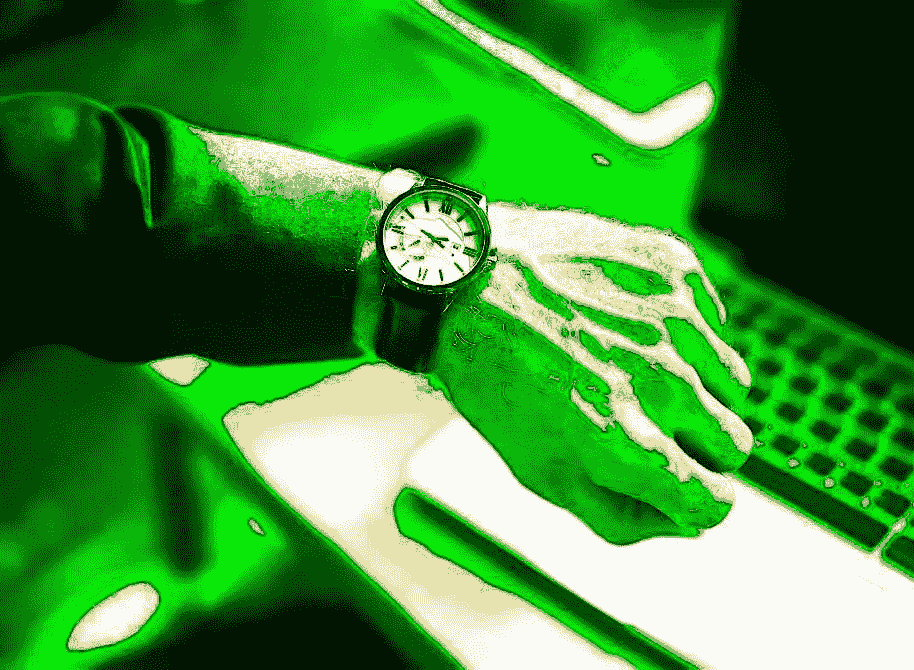

# 4 分钟内你需要知道的关于比特币时间线的一切

> 原文：<https://medium.com/hackernoon/everything-you-need-to-know-about-bitcoins-timeline-in-4-minutes-244a412b9455>

2008 年:这一切开始的一年

**8 月**
Neil Kin、Vladimir Oksman 和 Charles Bry 申请加密专利。他们不仅否认与比特币幕后策划者中本聪有任何联系，还在同一个月注册了 Bitcoin.org 网站，通过 anonymousspeech.com 匿名购买了该域名

尽管金、奥克斯曼和布里试图破坏比特币，中本聪还是发布了他的白皮书，描述了他对纯粹点对点版本的电子现金的想法。他为虚拟货币被复制的问题提供了基本的根本解决方案，为比特币等电子货币的合法增长提供了不可或缺的基础。

**2009 年:创世纪矿业的崛起**

**1 月**
比特币最初的开采始于第一块‘创世纪’的推出。当月晚些时候，第一笔交易在 Satoshi 和 Hal Finney 之间进行，他是一名开发人员和密码艺术家。

**十月**
BTC 收到了其传统的等值货币。新的自由标准将价值确定为 1 美元= 1309 BTC。该方程考虑了运行最初用于创造比特币的计算机所需的电力成本。

**2010–11:混沌理论**

来自佛罗里达州的程序员 Laslo Hanyecz 向英国的一名志愿者发送了 10，000 个比特币，这名志愿者花了大约 25 美元从棒约翰订购了一份比萨饼。比特币历史上最重要的里程碑之一是，今天披萨的价值为 1961034 英镑。

**2010 年 8 月**
系统如何验证比特币价值的漏洞被发现，该组织被黑客窃取了 1840 亿比特币。6 月份升至 1 美元的欧元跌入谷底。

**2010 年 10 月**
随着一个政府间组织发布了一份关于使用新支付方式洗钱的报告，比特币受到了负面的关注。这份报告是在 8 月份的黑客攻击后，于 9 月份发现区块链的其他漏洞后发表的。

2010 年 11 月
BTC 达到 100 万美元大关。根据当时流通的比特币数量，这一估值导致 BTC 价值飙升至 0.50 美元/BTC。

**2011 年 1 月**
丝绸之路，一个使用比特币作为不可追踪的在线毒品买卖方式的非法毒品市场成立了。

2011 年 2 月
比特币有史以来第一次与美元平价。到 2011 年 6 月，1 BTC = 31 美元，这使得该货币的市值接近 2 . 06 亿美元。

**2013 年:

6 月**
在 BTC 市值达到 10 亿美元的历史新高后，比特币论坛创始人阿林万报告称，他的数字钱包中有 25000 BTC 被盗。这标志着第一次重大的 BTC 盗窃案，当时相当于 375，000 美元的美元被盗。

联邦法官 Mazzant 支持比特币，他在针对 Trendon Shavers，即所谓的比特币“伯尼·麦道夫”的案件中表示，“很明显，比特币可以被用作购买商品和服务的货币”。

**11 月**
随着美国参议院就数字货币举行首次听证会，BTC 价格飙升至 700 美元，比特币也得到了美联储主席本·伯南克的认可。

**12 月**
中国人民银行嘲笑比特币作为货币的使用，称其没有“真正的意义”，不应获得与法定现金相同的地位，随后禁止中国金融机构处理 BTC 交易。

**2014 年:BTC 存储增量**

随着美国政府拍卖从丝绸之路上缴获的 29000 多枚比特币，比特币再也不能被视为“罪犯的货币”。比特币的使用往往意味着用户的身份可以确立。

**8 月**
英国财政大臣乔治·奥斯本(George Osborne)和英国财政部(HM Treasury)购买了价值 20 英镑的比特币，确立了他们对 BTC 的积极展望，并宣布了英国财政部对数字货币信息的呼吁。这为数字货币企业提供了一个机会，让他们关注风险和收益，并有机会潜在地影响未来的政府政策。

**12 月**
科技巨头微软开始接受比特币作为支付方式。它们可以用来购买 X-Box 上的游戏和视频，为 Windows 手机添加应用和服务，或者购买微软软件。

**2015-2016 年年中:BTC 缓慢而稳定的崛起**

在这一年半的时间里，BTC 慢慢扩大了图表的规模，到 2016 年 6 月达到了接近 770 美元的价值，而在 2015 年 1 月，它从 177 美元的低值开始。在这一年半的时间里，与比特币相关的矿工、开发者数量呈指数级增长

**2017:比特币热潮！**

到了 2017 年，比特币开始突破玻璃天花板。它在 2017 年上半年就达到了近 2900 美元的高点。随着日本引入新的数字货币规则，中国稍微放松了警惕，全球对数字货币的需求飙升，导致炒作周期，这反过来意味着比特币行业的更大繁荣！

**比特币现金的诞生**

8 月 1 日，一种全新的加密货币诞生了:“比特币现金”，有时被称为“Bcash”，使用的货币代号为“BCH”或“BCC”

比特币现金最初由比特币 ABC 软件实现定义，于 8 月 1 日下午 12:20(UTC)开始分叉。尽管如此，由于比特币节点测量时间的方式，真正的分叉发生得稍微晚了一点。

**BTC 下一站去哪里**

通过更严格的监管，比特币在这一点上有几条路可走，所有这些都指向大型机构合法、广泛的采用。它进入金融主流的旅程已经开始，凸显了数字货币的必要性。

英国财政部的报告鼓励传统金融机构慢慢转向货币数字化，通过数字货币为英国公司引入反洗钱、消费者保护和技术标准化。这将加速区块链技术与金融服务的融合。