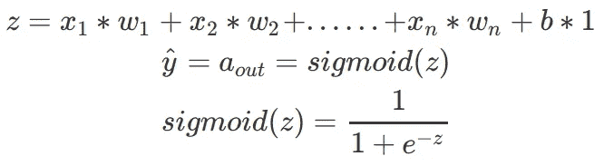
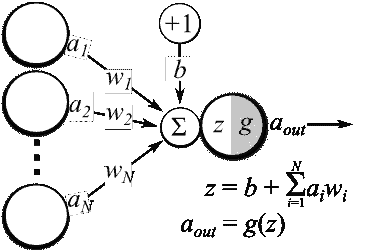
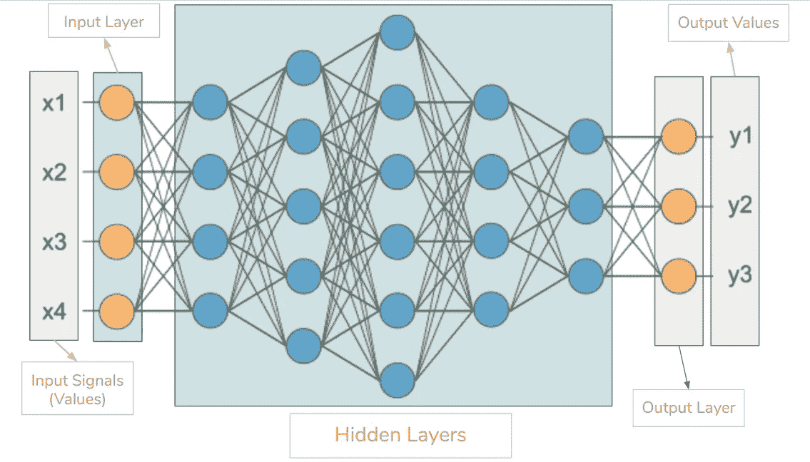
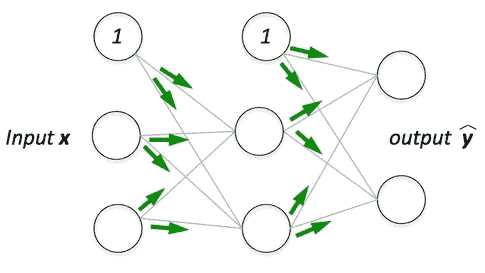
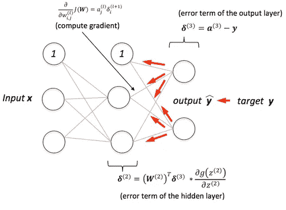
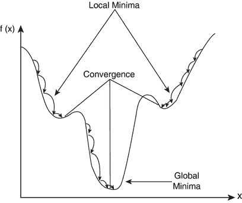
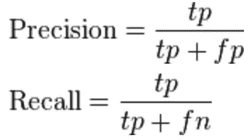
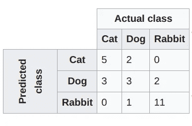
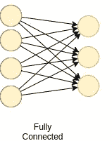

# 关于神经网络你需要知道的一切

> 原文：<https://medium.com/hackernoon/everything-you-need-to-know-about-neural-networks-8988c3ee4491>

*礼遇:* [*凯拉什·阿赫瓦尔*](https://medium.com/u/d0788d91cd9f?source=post_page-----8988c3ee4491--------------------------------) *(联合创始人& CTO、*[*Mate Labs*](http://www.matelabs.in)*)*

## 简介:

理解人工智能是什么，了解机器学习和深度学习如何为它提供动力，是压倒性的体验。我们是一群自学成才的工程师，他们经历了这种经历，并以简化的形式分享我们对它的理解(*通过博客*)以及在这一过程中对我们有所帮助的东西，以便任何对这一领域陌生的人都可以很容易地开始理解这项技术的技术细节。

此外，在我们的这次任务中，我们创建了一个[平台](http://www.matelabs.in)，任何人都可以[构建机器学习&深度学习模型，而无需编写哪怕一行代码](/towards-data-science/how-to-train-a-machine-learning-model-in-5-minutes-c599fa20e7d5)。

**神经元(节点)** —是神经网络的基本单元。它得到一定数量的输入和一个偏差值。当信号(值)到达时，它被乘以一个权重值。如果一个神经元有 4 个输入，它就有 4 个权值，可以在训练期间调整。

Operations at one neuron of a neural network

**连接** —它将一层中的一个神经元连接到另一层或同一层中的另一个神经元。一个连接总是有一个与之相关联的权重值。训练的目标是更新该重量值以减少损失(误差)。

**Bias(Offset)** —它是神经元的额外输入，始终为 1，有自己的连接权重。这确保了即使所有的输入都是零(全是 0 ),神经元中也会有激活。

**激活函数(传递函数)** —激活函数用于向神经网络引入非线性。它压缩了较小范围内的值，即。Sigmoid 激活函数压缩 0 到 1 范围内的值。深度学习行业中使用的激活函数有很多，ReLU、卢瑟和 TanH 比 sigmoid 激活函数更受欢迎。在这篇文章中，我解释了不同的激活功能。

Activation Functions Source — [http://prog3.com/sbdm/blog/cyh_24/article/details/50593400](http://prog3.com/sbdm/blog/cyh_24/article/details/50593400)

Basic neural network layout

**输入层** —这是神经网络中的第一层。它接收输入信号(值)并将它们传递到下一层。它不对输入信号(值)应用任何操作&没有相关的权重和偏差值。在我们的网络中，我们有 4 个输入信号 x1、x2、x3、x4。

**隐藏层—** 隐藏层有神经元(节点),它对输入数据应用不同的变换。一个隐藏层是垂直堆叠的神经元的集合(表示)。在下图中，我们有 5 个隐藏层。在我们的网络中，第一隐藏层有 4 个神经元(节点)，第二隐藏层有 5 个神经元，第三隐藏层有 6 个神经元，第四隐藏层有 4 个神经元，第五隐藏层有 3 个神经元。最后一个隐藏层将值传递给输出层。隐藏层中的所有神经元都连接到下一层中的每个神经元，因此我们有一个完全连接的隐藏层。

**输出层** —该层是网络中的最后一层&接收来自最后一个隐藏层的输入。有了这一层，我们可以在一个期望的范围内获得期望数量的值。在这个网络中，我们在输出层有 3 个神经元，它输出 y1、y2、y3。

**输入形状** —它是我们传递给输入层的输入矩阵的形状。我们的网络的输入层有 4 个神经元，它期望 1 个样本的 4 个值。如果我们一次输入一个样本，我们网络的理想输入形状是(1，4，1)。如果我们输入 100 个样本，输入形状将是(100，4，1)。不同的库期望不同格式的形状。

**权重(参数)** —权重代表单元之间连接的强度。如果从节点 1 到节点 2 的权重具有更大的量级，则意味着神经元 1 对神经元 2 具有更大的影响。权重降低了输入值的重要性。接近零的权重意味着改变这个输入不会改变输出。负权重意味着增加该输入将减少输出。权重决定了输入对输出的影响程度。

Forward Propagation

**前向传播—** 前向传播是一个将输入值输入到神经网络并获得输出的过程，我们称之为预测值。有时我们称正向传播为推理。当我们将输入值输入到神经网络的第一层时，它不进行任何操作。第二层从第一层获取值，应用乘法、加法和激活操作，并将该值传递给下一层。对随后的层重复相同的过程，最后我们从最后一层得到一个输出值。

Backward Propagation

**反向传播** —正向传播后我们得到一个输出值，这个输出值就是*预测值*。为了计算误差，我们将预测值与*实际输出值*进行比较。我们使用一个*损失函数*(下面会提到)来计算*误差值*。然后，我们计算*误差值*相对于神经网络中每个权重的导数。反向传播使用微分学的链式法则。在链式法则中，我们首先计算*误差值*相对于最后一层的*权重值*的导数。我们称这些导数为*梯度*，并使用这些*梯度*值来计算倒数第二层的*梯度*。我们重复这个过程，直到我们得到神经网络中每个权重的*梯度*。然后我们从*权重值*中减去这个*梯度值*以减少*误差值*。这样，我们更接近(下降)到*局部最小值*(意味着最小损失)。

**学习率** —当我们训练神经网络时，我们通常使用*梯度下降*来优化权重。在每次迭代中，我们使用反向传播来计算损失函数相对于每个权重的导数，并将其从该权重中减去。学习率决定了您希望多快或多慢地更新您的*权重*(参数)*值*。学习率应该足够高，这样就不会花很长时间来收敛，也应该足够低，这样就能找到局部最小值。

Precision and Recall

**准确度** —准确度是指测量值与标准值或已知值的接近程度。

**精度** —精度是指两个或多个测量值彼此之间的接近程度。它是测量的可重复性或再现性。

**召回(敏感度)** —召回指的是已经检索到的相关实例在相关实例总数中所占的比例

**困惑矩阵**——正如维基百科所说:

> 在[机器学习](https://en.wikipedia.org/wiki/Machine_learning)领域，特别是[统计分类](https://en.wikipedia.org/wiki/Statistical_classification)问题中，**混淆矩阵**，也被称为误差矩阵，是一种特定的表格布局，允许算法性能的可视化，通常是[监督学习](https://en.wikipedia.org/wiki/Supervised_learning)算法(在[非监督学习](https://en.wikipedia.org/wiki/Unsupervised_learning)中，它通常被称为**匹配矩阵**)。矩阵的每一行代表预测类中的实例，而每一列代表实际类中的实例(反之亦然)。该名称源于这样一个事实，即它可以很容易地看出系统是否混淆了两个类别(即通常将一个类别错标为另一个类别)。

Confusion Matrix

**收敛** —收敛是指随着迭代的进行，输出越来越接近特定值。

**正则化** —用于克服过拟合问题。在正则化中，我们通过在权重向量 *w* 上添加 L1 (LASSO)或 *L* 2(Ridge)范数来惩罚我们的损失项(它是给定算法中学习参数的向量)。

l(损失函数)+ *λN* ( *w* ) —这里λ是你的 ***正则项***N(w)是 L1 或 L2 范数

**标准化** —数据标准化是将一个或多个属性重新调整到 0 到 1 范围内的过程。当您不知道数据的分布或您知道分布不是高斯型(钟形曲线)时，归一化是一种很好的方法。加快学习进程是有好处的。

**全连接层** —当一层中的所有节点激活到下一层中的每个节点时。当第 L 层中的所有节点都连接到第(L+1)层中的所有节点时，我们称这些层为全连接层。

Fully Connected Layers

**损失函数/成本函数—** 损失函数计算单个训练示例的误差。成本函数是整个训练集的损失函数的平均值。

*   *MSE’*:均方误差。
*   *二元 _ 交叉熵’*:针对二元对数损失(logloss)。
*   *categorial _ cross entropy’*:针对多类对数损失(logloss)。

**模型优化器** —优化器是一种搜索技术，用于更新模型中的权重。

*   **SGD** :随机梯度下降，有动量支撑。
*   **rms prop**:Geoff hint on 提出的自适应学习率优化方法。
*   **亚当**:自适应矩估计(Adam)，也使用自适应学习率。

**性能指标** —性能指标用于测量神经网络的性能。准确度、损失、验证准确度、验证损失、平均绝对误差、精确度、召回和 f1 分数是一些性能度量。

**批量** —一次正向/反向传递中训练样本的数量。批量越大，需要的内存空间就越大。

**训练时期** —它是模型暴露于训练数据集的次数。

一个**历元** =所有训练示例的一个正向传递和一个反向传递。

# 关于

> 在[*Mate Labs*](http://matelabs.in/)*我们*已经构建了 [Mateverse](https://www.mateverse.com/) ，一个机器学习平台，在这里你可以在几分钟 s **内构建**定制的 ML 模型，而无需编写一行代码**。[我们的平台](https://www.mateverse.com)使每个人都能够轻松地构建和训练机器学习模型，而无需编写一行代码。**

# 让我们携起手来。

> 在 [**Twitter**](https://twitter.com/matelabs_ai) 上与我们分享你的想法。
> 
> 如果你有新的建议，请告诉我们。我们的耳朵和眼睛总是为真正令人兴奋的事情而张开。