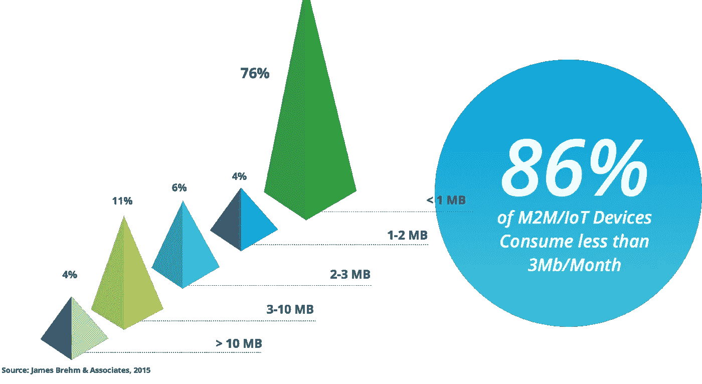
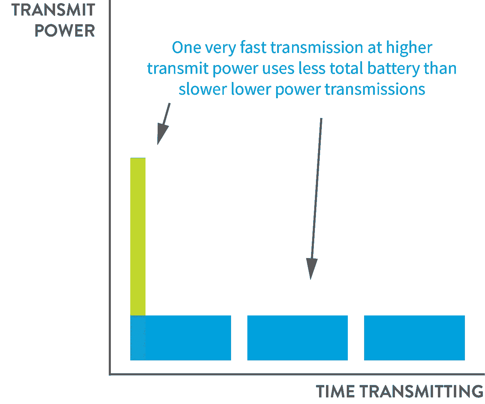
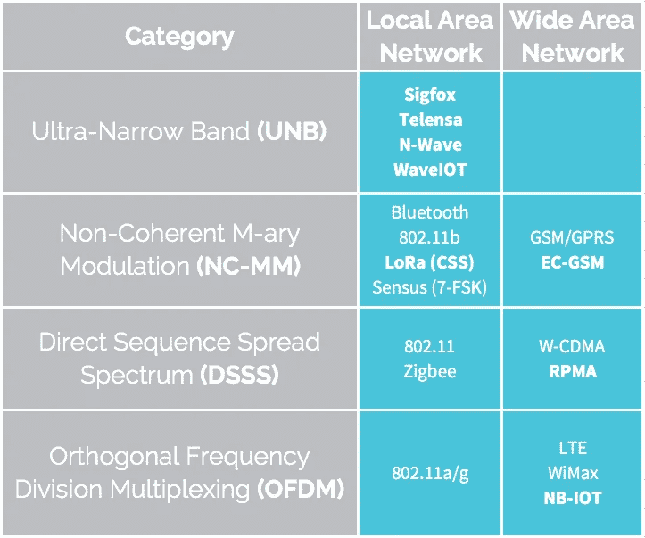
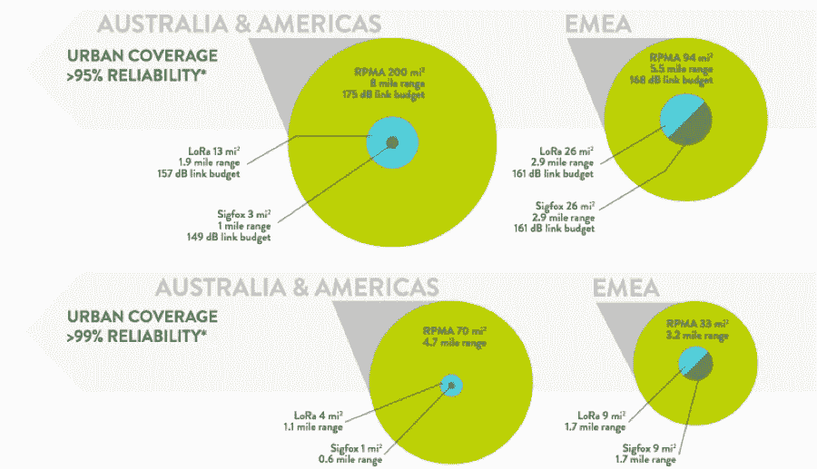
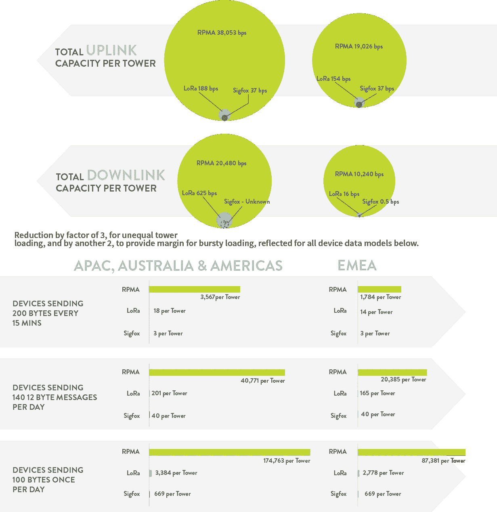
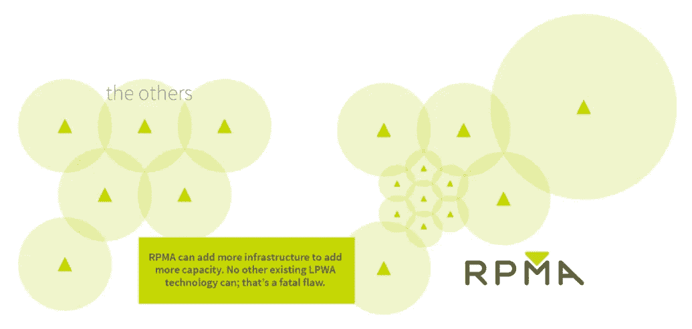
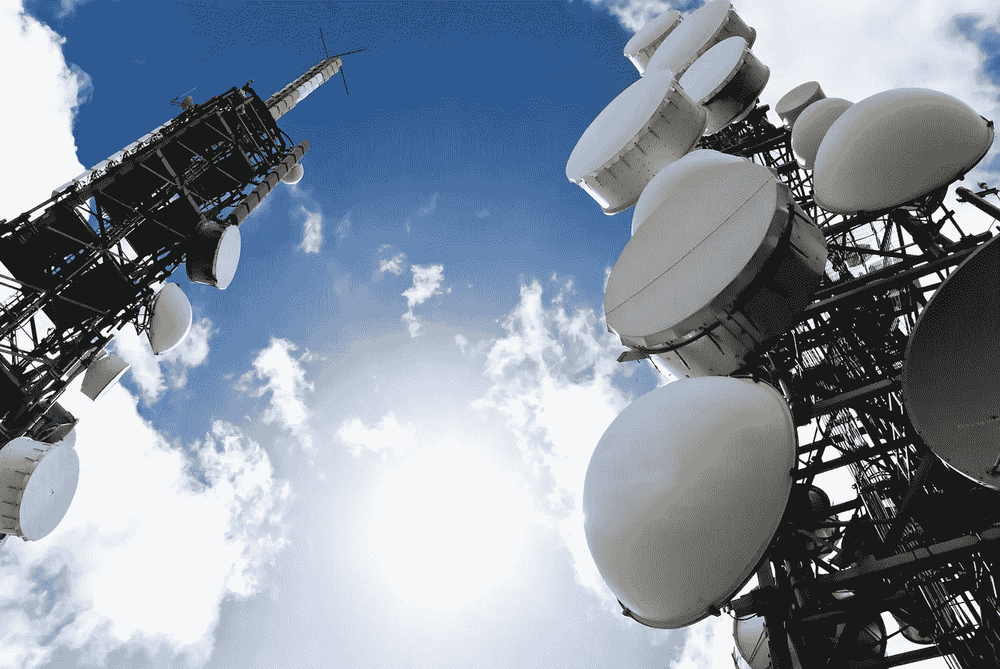

# 关于物联网，你需要知道的一切

> 原文：<https://medium.com/hackernoon/everything-you-need-to-know-about-the-internet-of-things-ce815339c9f9>

by [Michael Vedomske](https://medium.com/u/f0244f176f98?source=post_page-----ce815339c9f9--------------------------------), Principal Data Scientist at [Ingenu](https://medium.com/u/3a8c7e0ce1ae?source=post_page-----ce815339c9f9--------------------------------), and Dr. Ted Myers, CTO at [Ingenu](https://medium.com/u/3a8c7e0ce1ae?source=post_page-----ce815339c9f9--------------------------------)

是的，正如标题所说，这篇文章讨论了你应该知道的关于物联网的知识。在开发应用或考虑无线技术连接设备时，我们提供了了解细节的必备材料。这是一个很高的要求，所以我们会随着新的发展进行更新，我们会收到请求和反馈，以及更多关于技术的披露。简而言之，这是一个活生生的物联网信息来源。

我们将其分为三个基本部分:

1.  **简史**以及物联网无线如何将低功耗广域技术作为广域连接技术的首选。
2.  **评估无线协议的技术审查和基本原则**，包括电池寿命与发射功率、范围与覆盖范围与链路预算、容量与数据速率、物联网安全性等主题。
3.  **商业视角**以及最终盈利能力如何与无线技术的功能紧密结合。

我们试图快速讨论问题，并提供其他详细讨论这些问题的材料的链接。如你所见，有些事情只需要好好谈谈。我们希望您能从中受益，如果您能受益，请点击底部的心形图标，帮助其他人也找到它！尽情享受吧！

## 内容

**通往这里的道路** 进入低功耗广域连接
2015:LPWA 成长之年

**对比物联网无线协议** 我的 app 会有覆盖吗？范围≠覆盖范围
一个衡量标准决定一切:链路预算
在协议完全开发出来之前，你不知道它的电池寿命
物联网安全，没有它就不要连接
数据速率≠容量=链路容量

蜂窝 LPWA: NB-IOT 和 LTE-M
第 1 部分:简介
第 2 部分:蜂窝 LPWA 可用性
第 3 部分:3GPP/GSMA 没有为机器提供优雅的演进路径
第 4 部分:蜂窝 LPWA 复杂度
第 5 部分:上行链路容量
第 6 部分:下行链路容量
第 7 部分:固件下载
第 8 部分:健壮性
第 9 部分:功耗

更深层次的技术探索:低功率、广域调制方案的分类
回到基本原理
是时候认真学习了

**物联网的业务方面** 没有设备寿命，物联网永远不会成为
LPWA 的 L
简单的物联网现实检验

接收器灵敏度和频谱效率的经济学，
或者如何运营物联网业务
搭建舞台:公共网络业务

LPWA 业务始于运营商
覆盖范围
容量
比较特定技术
运营商的增长和未来盈利能力依赖于容量扩展，也就是小区分裂

运营商如何才能既有自己的蛋糕又服务于物联网，或者，
为什么蜂窝 LPWA 永远不会像它应该的那样服务于物联网
这只是很好的商业意义
经济和错位的激励
总是第二梯队

# 通往这里的道路:传统物联网无线

历史上，无线传感器网络由传统蜂窝或局域解决方案的某种组合提供服务，如 WiFi、mesh 和本地 RF(蓝牙、NFC 等)。).由于一些基本原因，这些解决方案未能提供将物联网推向边缘和主流采用所需的催化剂。首先，这些传统方法(Wi-Fi 和 Mesh)需要有线电源或每 1-2 天更换/充电一次电池。这将物联网应用限制在已经有电力线或需要安装电力线的场景中，因此只为最明显和最节省成本的应用提供服务。其次，每个接入点的覆盖范围和深度有限。因此，应用需要停留在无线源周围非常有限的区域内，这使得许多应用无法实现。第三，它们的使用成本很高。即使几年后[超过 10 亿个模块被使用](http://www.fiercewireless.com/europe/story/lte-subscribers-reach-almost-14b-globally-2015/2015-06-12)，LTE 模块的价格仍然超过 40 美元一个。Mesh 要求在使用之前构建完整的网络。本地 RF 解决方案要求每个企业构建、管理和维护无线基础设施，这阻碍了规模经济。

## 进入低功耗广域连接

公开可用的低功率广域(LPWA)连接独特地解决了上述每个问题。低功耗广域连接就像它所说的那样:使用低功耗覆盖广阔区域的无线连接。此外，LPWA 可以通过低成本终端做到这一点。LPWA 与数据和电池密集型 2G、3G 或 LTE 蜂窝无线技术形成鲜明对比。它也与传统蜂窝形成对比，因为它是低带宽的。物联网上的绝大多数设备将不需要传统蜂窝旨在提供的那种数据吞吐量。事实上，根据 James Brehm Associates 的数据，86%的物联网设备每月消耗的能量低于 3MB。

当然，物联网设备将需要更多的带宽，而更高带宽的解决方案将很好地满足这些需求；但是，给我们带来上述效率的传感器只需定期发送几百个字节，就能证明它们的价值。

应该清楚的是，为了实现物联网的宏伟愿景，我们将需要[机器](http://www.ingenu.com/technology/machine-network/?utm_source=medium&utm_medium=blog&utm_campaign=LPWA)和设备的开箱即用连接。

换句话说，媒体和本文中描述的物联网必须通过无处不在的专用于机器的无线服务连接起来(就像今天蜂窝网络用于人类驱动的语音/数据连接一样)。传统蜂窝和 LPWA 都是提议的物联网连接公共网络解决方案。多年来，2G 一直被用来提供物联网设备所需的公共连接。但是随着 [AT & T 在今年(2016)](http://www.business.att.com/content/other/2G_Sunset_FAQs_2014_A1.pdf) 年底完成 2G 关闭，其他公司紧随其后，很明显蜂窝 2G 不是前进的道路。

## 2015 年:LPWA 成长的一年

从很多方面来看，2015 年都是 LPWA 年。三个主要的参与者已经成为潜在的低功耗广域连接提供商: [Ingenu](http://www.ingenu.com/?utm_source=medium&utm_medium=blog&utm_campaign=LPWA) 、 [Sigfox](http://www.sigfox.com/) 和 [LoRa](http://www.semtech.com/) 。这些公司中的每一家都提供不同的技术，这些技术对他们服务于物联网愿景的可行性有着深远的影响。我们将在接下来的文章中讨论这些。

蜂窝提供商也开始通过 3GPP 的最新工作加入 LPWA 运动，以创建符合 LPWA 标准的标准。(尽管有新闻发布，蜂窝 LPWA 还没有完全到位。众所周知，衡量用电量非常棘手，因为它涉及到太多的交互作用；因此，蜂窝电话的最新尝试是否会是低功耗的还有待观察。)**通过开始开发蜂窝 LPWA，蜂窝提供商基本上承认传统蜂窝不是连接物联网的合适技术。**

显而易见的是，LPWA 独特地服务于物联网的愿景。[分析师](http://m2mworldnews.com/2015/02/25/29221-with-3-billion-connections-lpwa-will-dominate-wide-area-wireless-connectivity-for-m2m-by-2023/)和无线运营商一致认为，LPWA 将占据物联网连接的最大份额。

LPWA 连接的确切数量并不重要；我们知道他们将会数以十亿计。重要的是这些连接支持的应用程序的性质:真正有用的、高效的应用程序，简单、可扩展，并直接和间接改善我们的生活。

# 比较物联网无线协议

## 我的应用会有覆盖范围吗？范围≠覆盖范围

经常有人问，“你的协议范围是什么？”这其实是个错误的问题。范围与选择或构建必须具有深度可靠覆盖的无线技术没有直接关系。原因如下。使用理想条件挑选一个系列是非常容易的。但是覆盖范围必须考虑整个地区的实际情况。覆盖范围告诉你在整个*地区*接收信息的概率。Range 告诉你一条消息可能到达的最大距离。比如 Ingenu 的 RPMA，[有超过 88 英里](http://www.ingenu.com/2016/10/88-miles-was-einstein-wrong-about-the-speed-of-light/)的封闭链接。但是挑选这个范围与选择一个必须有深度可靠覆盖的无线协议没有直接关系。我们无法在我们的一个塔式接入点周围画一个半径为 88 英里的圆圈，并可信地声称，通过πr，我们可以用一个塔覆盖 24，000 平方英里。然而，有一个间接的相关性，即允许 RPMA 用于构建深度、可靠的覆盖范围(即链接预算)的同一方面也是允许一些真正令人惊讶的精选结果的同一方面。其他技术宣传他们的精选技术，这是我们的技术之一，但它与选择协议无关。如果你想真正比较两种无线技术的覆盖范围，看看链路预算。要在我们的一个客户网站上阅读更多关于非常棒的 88 英里链接关闭的信息，[请点击这里](http://www.ingenu.com/2016/10/88-miles-was-einstein-wrong-about-the-speed-of-light/)。[我们智利客户的另一个很酷的故事](http://www.ingenu.com/2016/03/spectacular-stories-of-rpmas-robustness/)在当地的一次建筑事故(有视频记录，文章中有 youtube 链接)破坏了最近的接入点后，关闭了一个 30 英里的链接。

## 一个衡量标准来统治他们:链接预算

链路预算是一个单一的指标，以分贝为单位，这是比较任何两种无线技术的最简单的方法。链路预算越大，无线技术的覆盖范围就越广。它考虑了所有其他因素，如路径损耗、频率选择引起的传播损耗(如 900 MHz 与 2.4 GHz)、电缆损耗、调制选择、接收机灵敏度等。科学 FTW！就像平衡你的个人预算一样，当你从你的收入中减去所有费用，你就获得了你的可支配收入，链接预算是在考虑了所有传播损失之后剩下的。链路预算可以“花费”在更广覆盖、更深覆盖和更可靠覆盖之间的各种折衷上。

**TL；要立即知道哪种无线技术覆盖更好，比较他们的链路预算。这个单一的指标说明了一切。[阅读更多请看这篇博文](http://www.ingenu.com/2015/10/link-budget-more-than-how-much-you-spend-on-sausage/)。**

## **你不知道一个协议的电池寿命，直到它完全开发出来**

[电池续航时间长是物联网节省成本和提高效率的关键驱动因素](http://www.ingenu.com/2016/01/iot-roi-reality-check/)。

**了解物联网协议电池寿命的步骤**

1.  在纸上最终确定设计或标准(对于标准机构，这是 100%最终确定的*和*吸收的书面标准。)
2.  根据*完成的*设计或标准制造芯片(通常芯片制造商会尝试通过根据标准的早期版本制造芯片来获得市场领先，但这些版本永远不会与最终版本相同)
3.  构建集成了芯片的实际商业产品
4.  在实验室条件下评估设备中的芯片性能
5.  在真实环境中部署并确认电池寿命性能

直到第步之后的第*步，你才可以真正声称已经达到或未达到规格，并知道无线协议的真正电池寿命。重要的是，不要根据早于第 5 步的步骤得出结论，因为实际条件下的性能通常与规格相差很大。例如，在《高通方程式》一书中，戴夫·莫克讨论了 CDMA 的容量本应是 GSM 的 10 倍，但一旦该技术进入现实世界，CDMA 的容量却只有 GSM 的 3 倍(仍然是一个巨大的优势)。就电池寿命而言，这是 10 年电池寿命和 3 年电池寿命之间的差异——不是一个微不足道的差异。*

不要陷入两种技术之间的单项比较的陷阱。就像你不会为手机或笔记本电脑这么做一样，不要为你的无线设备这么做。这里有一个使用电池寿命的例子。许多人试图将用于发送信号的发射功率作为比较电池寿命的单一指标。电池寿命是一个复杂的问题(不像覆盖率可以用链接预算来总结…这只是科学宝贝！).

当谈到电池寿命时，以较高的功率快速传输比以较低的功率缓慢传输更好。为什么？这就是微积分，我亲爱的朋友！如果电池使用量是曲线下的面积，那么您希望最小化曲线下的面积。因此，以高发射功率非常快速地发送一个确认消息(例如，RPMA)比发送单个消息三次使用少得多的电池，因为它不是使用更少的发射功率来确认的(例如，Sigfox & LoRa technologies)。这里有一张图来演示:

## 物联网安全:没有它就不要连接

物联网的行业级安全性至关重要。大多数用于 LPWA 连接的协议都不太注重安全性。如 16 和 32 位认证，而不是标准的 128 位 AES 认证。这是一个严重的问题，因为其他人可能会受到暴力攻击。大多数不支持符合国家标准，如 NERC CIP 002–009、NIST SP 800–5、FIPS 140–2 Level 2 和 NISTIR-7628。一些业内人士希望所有东西都有 IP 地址。换句话说，他们希望任何东西都可以被二十年来基于 IP 的黑客攻击所破解，任何脚本小子都可以使用。任何无线协议都应该通过设计来保证安全，而不是使用附加方法。安全不仅仅是加密。它需要这些安全保证:

1.  消息机密性
2.  消息完整性和重放保护
3.  相互认证
4.  设备匿名
5.  认证固件升级
6.  安全多播

现场小组讨论物联网安全:

## 数据速率≠容量=链路容量

覆盖率很重要，因为它确保您可以实际连接您的应用程序。但是一旦你连接上了，你能用这个链接做什么呢？这是由无线技术的能力决定的。容量是指通过链接可以实现的所有功能。容量就是在将 MAC 层放在 PHY 层上导致数据速率降低之后，在考虑了开销、安全性、干扰和其他现实因素之后，链路所拥有的*可用*吞吐量。容量是可用的吞吐量，即作为应用程序开发人员，您实际上可以为您的用户使用的数据量。

数据速率是一个 PHY 层指标，任何连接 300 Mbps WiFi 路由器的人都知道，它不是您体验到的*实际*吞吐量。为什么？因为除了物理层之外，还有很多事情要做。但是容量*是*可用的吞吐量，这就是你比较两种无线协议的方式。通常，这最好通过选择一个单一的数据模型来完成——比如一个协议每小时可以发送的 32 字节消息的数量——并查看它们是如何堆积起来的。

上行链路和下行链路的容量也不同。一些 LPWA 协议几乎没有下行链路。例如，Sigfox 在最昂贵的白金封装上只有四个 8 字节的下行链路消息。这是相当微薄的。由于占空比的限制，LoRa 只能支持大约 10%的下行链路，因此只能选择性地确认消息。

[在这里玩一个简单的游戏](http://www.ingenu.com/technology/rpma/capacity/)了解容量在网络技术盈利能力中的作用。请记住，如果一项网络技术不能在财务上自我维持，它将会破产，因此任何建立在它之上的业务也将遭受损失，至少是重新设计他们的应用程序的成本，最多也将失败。

这是一个讨论如何比较无线物联网协议的网络研讨会:

# 蜂窝 LPWA: NB-IOT 和 LTE-M

以下系列文章讨论了低功耗广域(LPWA)连接的蜂窝标准路线图(3GPP/GSMA)解决方案。

*   [第一部分:简介](http://www.ingenu.com/2016/08/is-the-cellular-standard-roadmap-the-answer-to-low-power-wide-area-connectivity-pt-1/)
*   [第 2 部分:蜂窝 LPWA 可用性](http://www.ingenu.com/2016/09/is-the-cellular-standard-roadmap-the-answer-to-lpwa-connectivity-pt-2-cellular-lpwa-availability/)
*   [第 3 部分:3GPP/GSMA 没有为机器提供一个优雅的演进路径](http://www.ingenu.com/2016/09/is-the-cellular-standard-roadmap-the-answer-to-lpwa-connectivity-pt-3-3gppgsma-is-not-providing-a-graceful-evolution-path-for-machines/)
*   [第四部分:。蜂窝 LPWA 复杂度](http://www.ingenu.com/2016/09/is-the-cellular-standard-roadmap-the-answer-to-lpwa-connectivity-pt-4-cellular-lpwa-complexity/)
*   [第 5 部分:蜂窝 LPWA 性能问题 1:上行链路容量](http://www.ingenu.com/2016/09/is-the-cellular-standard-roadmap-the-answer-to-lpwa-connectivity-pt-5-uplink-capacity/)
*   [第 6 部分:蜂窝 LPWA 性能问题 2:下行链路容量](http://www.ingenu.com/2016/09/pt-6-downlink-capacity/)
*   [第 7 部分:蜂窝 LPWA 性能问题 3:固件下载](http://www.ingenu.com/2016/09/is-the-cellular-standard-roadmap-the-answer-to-lpwa-connectivity-pt-7-firmware-download/)
*   [第 8 部分:蜂窝 LPWA 性能问题 4:鲁棒性](http://www.ingenu.com/2016/09/is-the-cellular-standard-roadmap-the-answer-to-lpwa-connectivity-pt-8-robustness/)
*   [第 9 部分:蜂窝 LPWA 性能问题 5:功耗](http://www.ingenu.com/2016/09/is-the-cellular-standard-roadmap-the-answer-to-lpwa-connectivity-pt-9-power-consumption/)

# 更深层次的技术探索:低功率、广域调制方案的分类

乍一看，正在讨论的低功耗、广域(LPWA)网络的通信技术数量可能有点多。从基本面的角度来看潜在的技术，并剔除市场营销的成分，可能会有所帮助。

# 回到基本面

你们中的许多人都知道，传播理论是一个非常成熟的领域，可以追溯到几十年前，有着丰富的知识。在这段时间里，成千上万的书籍、文章和论文已经出版。这个领域有很多巨人——克劳德·香农、哈利·奈奎斯特、拉尔夫·哈特利、艾伦·图灵和安德鲁·维特比(从一开始他就是 Ingenu 的战略顾问),我们可以从他们的作品中了解清楚。大量的工作为我们提供了比较的框架和词汇。一旦营销创新被剔除，这个世界通常会变得更加干燥和无趣——但是请原谅我。

下表显示了针对 LPWA 讨论的各种调制方案的四种分类。粗体表示这些技术被标记为适用于低功率、广域网络。因为这是一个技术处理，我是通过底层技术定义局域网(LAN)和广域网(WAN ),而不是这些方法是如何被营销的。请注意，每个类别中最著名的方法是 Sigfox 技术、LoRa(也称为线性调频扩频(CSS))、窄带 IOT (NB-IOT)和随机相位多址(RPMA)。这些技术往往是那些营销最好的(没错，营销很重要)。

Four categorizations of the various modulation schemes that are being discussed for LPWA. Bold denotes those technologies being branded as applicable to Low-Power, Wide-Area networking.

**从技术角度来看，适合作为广域网的定义是是否考虑了覆盖和容量的多址考虑:**

*   **覆盖范围**。如果您想建立一个广域网，您希望一个单一的网络基础设施(通常在塔或屋顶上)覆盖尽可能多的区域。
*   **容量**。如果你不能支持覆盖区域内所有设备的数据需求，那么覆盖一个大区域并没有太多好处(这也是我们讨论覆盖范围而不是范围的原因，因为我们关心的是为一个区域内的所有*设备提供服务，而不是只挑选一个)。*

给类别增加一点色彩:

*   **超窄带(UNB)。许多公司选择这种方式的原因是进入门槛低的优势。这类公司可以利用商品无线电，跳过任何技术开发。这些公司倾向于认为不需要新技术。我们不同意的原因有很多，包括无法让 LPWA 经济学发挥作用，正如博客 5 中所讨论的:[接收机灵敏度和频谱效率的经济学。](http://www.ingenu.com/2016/07/the-economics-of-receiver-sensitivity-and-spectral-efficiency/)**
*   **非相干多进制调制(NC-MM)。**这是局域网和广域网应用中常用的调制方式。蜂窝 2G 技术基于 GSM/GPRS，它使用一种称为最小频移键控(MSK)的调制方法，并且也正被重新用于扩展覆盖 GSM (EC-GSM)，这是 2G 频谱中的蜂窝 LPWA。LoRa 调制(CSS)就是这一类中的一员(博客 3: [啁啾扩频:非相干多进制调制的果冻](http://www.ingenu.com/2016/07/chirp-spread-spectrum-the-jell-o-of-non-coherent-m-ary-modulation/))。CSS 的“传播”没有明显的优势，事实上，正如博客 4 中所讨论的:[“传播”——一个香农-哈特利漏洞？](http://www.ingenu.com/2016/07/spreading-a-shannon-hartley-loophole/)，在频谱效率方面有一些明显的缺点。
*   **直接序列扩频(DSSS)。我们把 LoRa 描述为“扩散”,原因不明。事实证明 NC-MM 并不垄断这一领域。DSSS 有两项技术也不知为何传播开来——IEEE 802.11(最初的 1 和 2 Mbps 数据速率)和 Zigbee(基于 IEEE 802.15.4)。这只是一个例子来告诉你[标准机构更多的是关于政治而不是技术。我将在以后的博客中更深入地讨论这个问题。](https://www.youtube.com/watch?v=l2r6YK0o5pc)**
*   **正交频分多址(OFDM)。**这是获得极高频谱效率的方法。它非常适合语音高速数据，并使 LTE (4G)成为主导的蜂窝标准。当你试图将这种方法指向 LPWA(比如 NB-IOT)时，重大问题就出现了。我将在以后的博客中更深入地讨论这个问题。

# 是时候放下书呆子气了

在这些资源中，我们访问了通信的构建模块，并在博客 2: [中向书呆子翻译了非常好且直观易懂的术语**覆盖**和**容量**:回到基础——香农-哈特利定理。](http://www.ingenu.com/2016/07/back-to-basics-the-shannon-hartley-theorem/)

*   **覆盖范围**转化为**接收灵敏度**，它是一个叫做 **Eb/No** (相对于热噪声频谱密度的每比特能量)的函数。
*   **容量**转化为称为**频谱效率**的东西，我们需要更深入一层了解 nerd，并给它分配一个希腊字母(当然)，这个希腊字母是… **η** 。

利用这个基本框架，在博客 3:[Chirp Spread Spectrum:The Jell-o of Non-Coherent M-ary Modulation](http://www.ingenu.com/2016/07/chirp-spread-spectrum-the-jell-o-of-non-coherent-m-ary-modulation/)中，我将讨论一类从技术角度来看非常相似的方法，这类方法中有一种非常成功的市场化方法，称为 Chirp Spread Spectrum(也称为 LoRa)。

然后在博客 4: [“传播”——一个香农-哈特利漏洞？](http://www.ingenu.com/2016/07/spreading-a-shannon-hartley-loophole/)中，我们更详细地讨论了使用频谱效率非常低(η<0.1)的链路的技术，并通过三个具体示例说明了容量影响:Sigfox 技术、LoRa 技术和 Ingenu 的 RPMA。

# IOT 的商业一面

# 没有设备寿命，物联网将永远无法实现

## LPWA 的 L

Long means something different to IoT devices than it does to typical consumer handheld devices. For most IoT applications the device life cycle is 10 to 20 years or more.

“低功耗”实际上是无线连接需要为物联网解决的一个更广泛、更普遍的问题的体现:寿命。寿命被定义为长的预期寿命，或者用技术术语来说:长的设备生命周期。当应用于无线技术时，长寿意味着无线技术应该允许并且进一步允许长的设备生命周期。对于物联网设备来说，长意味着不同于普通消费者手持设备的东西。如果你的智能手机使用时间超过两年，甚至一年，你的设备通常被视为“旧”技术。但对于大多数物联网应用来说，如那些支持智能城市的应用，设备生命周期为 10 至 20 年或更长时间。例如，每隔几年就更换智能路灯的无线模块是没有意义的。一旦放置好，支持基础设施和企业资产的设备就需要被搁置，以便获得它们所提供的成本效益。每隔几年就派人开着卡车去修理这些东西，成本实在太高了。

# 简单的物联网投资回报现实检查

为了帮助我们理清思路，让我们来看一个计算设备投资回报率的简单例子。本例中使用的数字完全是假设的，但代表了 LPWA 空间中常见的概念。我们假设在计入所有成本后，这项投资每年可以为我们带来 5 美元的回报(或通过提高效率节省的资金)。

乍一看，这似乎是一项显而易见的投资。但是，让我们考虑一下设备技术的寿命，在本例中我们将从 2 年到 20 年不等。设备寿命包括任何需要卡车滚动的条件变化。卡车卷是昂贵的，并且经常显示为隐性成本。卡车滚动将包括更换电池或更换无线模块，因为这项技术正在衰落(就像蜂窝技术每十年发生一次一样)。预期使用年限表示设备将使用多长时间，包括保持其工作所需的任何卡车辊。卡车转鼓最有可能外包给服务提供商。一个卡车辊的成本大约为每台设备 350 美元，坦白地说，这是保守的。更现实的卡车滚动成本可能高达 500 美元。

第二个表显示了在给定设备和预期生命周期内，拥有一台设备每年可节省的成本。该表显示，每 5 年更换一次电池的设备，预期使用寿命为 15 年，将有两次滚动(一次在 5 年，另一次在 10 年)。以黑色突出显示的单元格显示了在没有卡车卷的情况下每年节省的 5 美元。灰色单元格显示了因需要卡车辊而造成的损失(负节约)(因为设备寿命周期比预期使用年限短)。

显而易见的是，**卡车翻车是物联网投资杀手**。在每种情况下，设备寿命至少需要与预期使用年限一样长，才能盈利。一旦需要卡车滚动，预期的节约就消失了。为了让物联网投资有意义，节省的成本必须增加 28 倍才能被考虑。这个结果是合乎逻辑的，但这个例子确实有助于说明这一点。**美丽的另一面是:鉴于 LPWA 的长寿，投资于每台设备预计节省成本低得多的领域是有意义的。**这正是物联网实现其宣称的效率的方式。

**这里有一个微妙且经常被忽视的点需要强调:长寿不仅仅是物联网的一个好的附带好处或 LPWA 技术的有趣副作用；长寿是物联网整个价值主张的基础。**简而言之，如果没有 LPWA 带来的长寿，物联网将无法实现其目标。

长寿对于获取物联网设备的任何需求都是必要的，因为它能够实现证明投资物联网设备是合理的投资回报率。投资回报在很大程度上取决于物联网设备的可用寿命。它们按预期运行的时间越长，投资回报就越好，总拥有成本(TCO)就越低。由于物联网设备的需求迄今为止被证明对价格极其敏感，因此设备制造商实现规模经济至关重要，这样他们的设备价格才能处于企业和消费者愿意支付的水平。

# 接收机灵敏度和频谱效率的经济学

## 或者说，如何运营物联网业务

Like this picture, any company needs a lot of green to stay in the black. In the wireless world, green comes from receiver sensitivity and spectral efficiency.

# 搭建舞台:公共网络业务

你应该知道公共无线网络(比如蜂窝网络，或者在物联网的情况下，公共 LPWA 网络)是如何赚钱的。原因很简单，一些技术根本无法支持他们建立有利可图的业务所需的设备数量。因此，建立在这些技术上的公司最终会失败。这反过来意味着任何依赖这些网络进行连接的企业都将为产品重新设计付出最小的沉重代价，在最糟糕的情况下，还会破产。所以，开始了。

公共网络业务需要两个通用组件:一个 ***运营商*** 和 ***应用*** 可以从该网络中受益。让我们定义这些角色，并从这些角度来看公共 LPWA 网络:

*   ***运营商*** 拥有并运营 LPWA 网络。运营商投资建设该网络，并对使用该网络的应用程序收费。成功的运营商业务通过收入(来自应用的连接费用)超过运行 LPWA 网络的费用(塔租金、回程费用、建设成本、人力资源等)而获利。)
*   ***应用*** 受益于 LPWA 网络提供的连接。对于加入 LPWA 网络的应用，这种连接必须有正的投资回报(ROI)。换句话说，LPWA 连接提供的价值必须超过支付给运营商的连接费用。此外，如果可以选择，应用程序会选择连接费用最低的 LPWA 网络，从而最大化投资回报。

# LPWA 业务始于运营商。

通常，运营商必须在实现收入之前投资建设网络。让我们介绍几个关键术语来连接 LPWA 经济学和 LPWA 技术:

*   ***覆盖*** —衡量可靠覆盖一个地区需要多少网络基础设施的指标。与运营运营商相关的大部分费用与所需的网络基础设施数量成正比(例如，铁塔租赁、回程费用、建设成本)，尤其是当网络的地理范围变大时。一个网络基础设施(如发射塔)平均覆盖的平方英里数(或平方公里数)代表了运营商建设该网络必须进行的初始投资。
*   ***容量*** —衡量一个网络基础设施平均可以支持多少设备的指标。容量指标与成功的运营商业务的收入方面相关。每个塔给运营商带来的收入通常与该塔所服务的端点数量成正比。

从运营商的角度来看，投资 ***保险*** 在外向现金流方面是一个轻微的“下降”; ***容量*** 代表“上山的路”，根据所支持的设备数量来衡量网络的盈利能力。

## 新闻报道

经济地建设一个网络意味着每个基础设施必须以很高的概率覆盖大量区域。这意味着链路的覆盖范围必须尽可能高，这又意味着接收机的灵敏度必须尽可能高。

在下图中，我们根据对《RPMA 如何运作:RPMA 的形成》第 2.3 节的分析，展示了三种方法的典型可靠覆盖率。自然，如果每个塔能够覆盖 RPMA 所示的大区域，覆盖大区域的运营商的成本要低得多。

## 容量

**对于一项技术来说，允许每台网络设备连接足够数量的端点以实现长期经济效益是非常重要的。**

提供 LPWA 连接是有成本的，包括基础设施成本、部署成本和任何维护成本。这些成本需要在大量设备之间分摊，使得每个设备的负担份额非常低。请记住，这些通常是低价值的设备，只能承担最少的网络费用。如果你看一下下图，你会发现相对于 LoRa 而言，RPMA 支持每件网络基础设施多 60 倍到 1300 倍的数据量(相当于多 60 倍到 1300 倍的设备)(确切的范围取决于我们是在讨论上行链路/下行链路还是特定的监管域)。Sigfox 的技术数据也很相似。不足为奇的是，每台设备连接成本降低 60 到 1300 倍，这是实现网络经济效益和轻松实现网络经济效益之间的差别。

# 让我们把灯打开

Sigfox 技术被认为仅服务于非常低带宽的设备，因此，对于那些相信这一点的人来说，容量对于他们所服务的低端设备来说并不是一个重要的属性。这个论点有两个主要问题:

*   使用率低的设备往往只能证明低连接成本是合理的。如果 Sigfox 技术仅限于低使用率的设备，运营商需要更多这样的设备来建立业务。无论终端分布是更少的高使用率设备还是更多的低使用率设备，容量都在被消耗，因此，了解运营商和应用之间是否存在任何经济价值是一个重要的价值指标。
*   即使在应用程序和采用 Sigfox 技术的运营商之间存在极少量的经济价值，RPMA 运营商也总是能够降低连接成本，因为容量优势非常不公平。RPMA 运营商将能够以很小的成本提供更多的连接能力，而 RPMA 运营商将保持巨大的利润。

**注意每个网络基础设施平均支持的设备数量，如下图所示，想象 Sigfox 技术和 LoRa 的每个终端的收入金额。在我们看来，如果假设每个终端的合理连接成本为收入，这些数字将不支持盈利的运营商商业模式。**

劳拉特别面临的另一个不利因素是缺乏选择性(在[RPMA 如何工作:RPMA 的形成的第 2.10 节中有更深入的讨论)。](https://www.dropbox.com/s/un97zjesqdnk090/RPMA_Technology_v_3_0.pdf?dl=0))其中，部署在私有 LoRa 网络上的端点实际上消耗了重叠公共网络上的容量，事实上，比它们实际连接到公共 LoRa 网络时多得多的容量。

# 运营商的增长和未来的盈利能力依赖于容量扩展，也就是小区分裂

根据上面显示的设备数量，当一个塔达到最大容量时会发生什么？作为运营商，您可能希望增加更多的发射塔位置，以继续提供强大的连接。蜂窝行业对此有一个术语叫做“细胞分裂”，它可以有效地完成。

**然而，并非所有技术都允许通过增加塔来卸载容量。局域网类别中的所有技术都不能通过更多的塔来增加容量，包括 Sigfox 技术和 LoRa。由于缺乏对发射功率控制的支持(以及其他因素)，一旦达到了端点的临界密度，系统就无法正常工作。**

相比之下，RPMA 是作为一个 LPWAN 解决方案从头开始构建的。要做到这一点并不容易，也不容易。这需要相当大的投资，因为必须从头开始开发新技术，以及一种全新类型的芯片，以便以最低的成本和功耗廉价地实施新技术。

# 运营商如何才能既有自己的蛋糕又能服务于物联网，或者为什么蜂窝 LPWA 永远无法服务于物联网

How Carriers Can Have Their Cake and Serve the IoT Too | by [Michael Vedomske](https://www.linkedin.com/in/michael-vedomske-phd-5501bb46)

我们知道[寿命是物联网(IoT)价值主张](/achieving-the-grand-vision-of-the-internet-of/without-device-longevity-the-internet-of-things-will-never-be-58c904703abb)的核心部分，它可能会受到不充分技术的[抑制。但技术限制并不是阻碍物联网成功的唯一因素。在这里，我们将讨论为什么传统无线运营商基于经济和文化力量做出的**良好商业决策也会抵消物联网设备所需的寿命**。我们还将对当前的蜂窝生态系统提出几项关键变化，使他们能够利用这些力量有力地服务于物联网。](/achieving-the-grand-vision-of-the-internet-of/how-success-leads-to-the-iot-s-failure-and-how-to-fix-it-2dcbf04f1ddc)

传统的无线行业由许多参与者组成。手机运营商本身就是技术集成商。他们把技术碎片整合到一个单一的系统中，疯狂地推销它，并让消费者很容易获得。我们去商店，买一部手机，支付服务费用，然后享受。

爱立信、高通和无线世界的其他技术提供商开发(并申请专利)了集成到信号塔(爱立信)或手机(高通)或两者中的技术。他们通过将自己的知识产权(IP)整合到尽可能多的系统组件中来赚钱。这些 IP 是运营商整合的内容，也是最终成为他们成本的一大部分。这种集成过程发生在诸如第三代合作伙伴计划或 3GPP 的标准机构中，该标准机构集成了 3G 和 LTE。

# “这有很好的商业意义”

Infrastructure costs are mostly driven by the technology providers, the Ericssons, Nokias, and Huaweis of the world.

传统无线运营商的资产负债表上有两项成本最为沉重:基础设施和频谱。基础设施包括蜂窝无线电和其他硬件(如果允许)、塔空间租赁、回程和许多其他成本。基础设施成本主要是由技术提供商，即全球的埃里克森和华为推动的。它们提供基站中用于发送和接收蜂窝信号、向运营中心传输回程以及路由流量的硬件。近年来，软件无线电允许基站通过软件升级而不是硬件交换来升级技术。虽然这些技术升级更简单，但技术提供商仍然希望从中获利，因此对这些升级收取高额费用。

> 传统无线运营商的资产负债表上有两项成本最为沉重:基础设施和频谱。

成本压力也来自许可频谱。许可频谱是极其昂贵的资源。2015 年，[传统无线提供商在美国的频谱上花费了 450 亿美元](http://www.fiercewireless.com/story/aws-3-auction-results-att-leads-182b-verizon-104b-dish-10b-and-t-mobile-18b/2015-01-30)。450 亿美元的金额超过了 [100 个国家的 GDP](http://databank.worldbank.org/data/download/GDP.pdf) 。频谱是一种宝贵的资源，这是有原因的:它是无线语音和数据连接的命脉。消费者和企业愿意为这种高数据吞吐量支付高价，而运营商需要获得许可的频谱来提供这种高数据吞吐量。

为了保持盈利，运营商必须将授权频谱用于语音和数据连接，而不是机器连接等其他用途。语音/数据连接为运营商带来最大的每赫兹收入(用于衡量频谱量的单位)。在业内，这一逻辑被分解为每用户平均收入，或 T2 ARPU T3。对于运营商来说，最大化 ARPU 具有良好的商业意义，尤其是在频谱成本巨大的情况下。正是因为这个原因，运营商正在关闭他们的 2G 网络。

Carriers must use precious spectrum for the highest average revenu per user (ARPU).

运营商必须将宝贵的频谱用于最高 ARPU。两个因素将给运营商带来额外的压力。语音和数据用户的整体市场将会增长，每个用户所需的数据量也将增长。这只会加剧将频谱用于最高 ARPU 目的的重要性。这是基本的经济学。任何偏离这一战略的行为都将导致利润损失，并在市场份额和华尔街受到惩罚。因此，最大化 ARPU 会影响他们所有关于频谱使用的商业决策。这是理所应当的。做得好的企业会很好地服务他们最好的客户。

# 经济学和错位激励

但对传统无线运营商来说有商业意义的东西对物联网设备来说没有意义。至少在手机行业的当前形势下是这样的。不属于高 ARPU 的任何人或任何*事物*将自然地、理所当然地被归入较低优先级。ARPU 最低的客户也是 LPWA 适合服务的设备。据 James Brehm & Associates 称，目前 86%的物联网设备每月使用不到 3 MB 的数据——这些几乎都不是超级用户。还有尚未开发的设备，业内人士称之为“绿地应用”，第三代合作伙伴计划(3GPP 标准开发机构)预计每月平均有 32 KB 的数据。更重要的是，同一个 3GPP 标准开发机构已将物联网流量去优先化纳入其 LPWA 候选标准，包括 LTE-M 和其他标准。

Carriers can turn down or turn *off* machine traffic whenever their expensive spectrum gets clogged with higher ARPU traffic, like during sports events.

换句话说，每当他们昂贵的频谱被更高的 ARPU 流量堵塞时，运营商可以调低或关闭*机器流量。这并不需要太多时间。如果你曾经参加过体育赛事，你可能会经历过接收短信的延迟，因为太多人的手机都连接到了该地区的蜂窝塔。*

这种优先级排序会对运营商屏蔽其设备信息的企业产生什么影响？自然，某些部分的延迟消息对业务的影响很小。但是他们中的一部分人*将会受到这些不可预测的干扰的影响。更重要的一点是，你的业务将受到承运人的突发奇想。这些突发奇想是基于运营商合理的商业推理。*

# 总是第二层

由此得出的结论是，连接的机器将*总是*成为使用相同频谱的语音/数据连接的第二层。运营商当前的商业模式依赖于此。他们的成本结构决定了这一点。这些经济力量不仅不会消失，还会继续将机器连接降到底层。

Voice/data needs are what have pushed the cellular generations from 1G to 2G to 3G to 4G, soon 5G and inevitably to 6G and beyond.

物联网连接企业和传统蜂窝运营商之间的错位激励不仅仅是较低优先级的机器连接。因为人类对语音/数据的消费是最大的 ARPU 客户，他们的需求将继续成为未来几年蜂窝技术发展的主要驱动力。语音/数据需求推动了蜂窝一代从 1G 到 2G、3G 到 4G，以及未来几年的 5G。这些细胞世代大约每九年开始一次。

日落对于使用智能手机的语音/数据用户来说是很好的，因为这些设备每隔几年就会升级。但是，不断的蜂窝日落完全违背了物联网设备的长寿需求。当前的蜂窝生态系统将无法提供足够长的物联网设备寿命，因为健全的商业决策会驱动不断的日落周期。

**TL；有两件事阻碍了蜂窝运营商满足物联网设备的需求。1)他们从语音/数据客户身上赚了最多的钱，因此物联网设备将永远是物联网的第二层。2)物联网需要长的技术生命周期，但蜂窝标准机构 3GPP 受到激励，定期更改协议，以便参与的公司可以获得更多的知识产权和由此产生的许可费。这种对知识产权的争夺推动了标准的快速变化，导致网络衰落和物联网生命周期缩短。这导致投资回报率低于达到数十亿台物联网设备所需的投资回报率。**

# 想了解更多？

[下载我们的免费电子书](http://www.ingenu.com/portfolio/how-rpma-works-the-making-of-rpma/)(公平警告，这是在一张表格后面)，它对领先的 LPWA 协议进行了广泛的技术审查和比较。

想要将 RPMA 集成到您的物联网应用中吗？请通过[info@ingenu.com](mailto:info@ingenu.com)联系我们

# 如果这对你有一点点的帮助，请表达你的爱，点击心形推荐给其他人。谢谢大家！

> [黑客中午](http://bit.ly/Hackernoon)是黑客如何开始他们的下午。我们是 [@AMI](http://bit.ly/atAMIatAMI) 家庭的一员。我们现在[接受投稿](http://bit.ly/hackernoonsubmission)，并乐意[讨论广告&赞助](mailto:partners@amipublications.com)机会。
> 
> 如果你喜欢这个故事，我们推荐你阅读我们的[最新科技故事](http://bit.ly/hackernoonlatestt)和[趋势科技故事](https://hackernoon.com/trending)。直到下一次，不要把世界的现实想当然！

