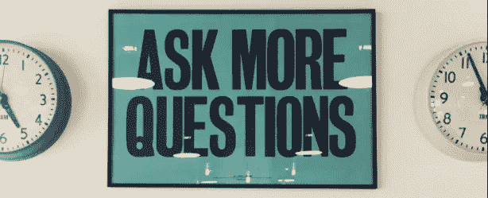
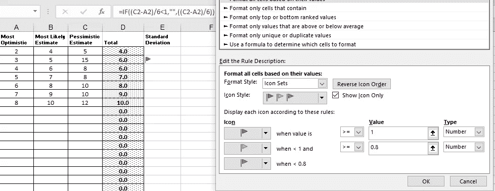
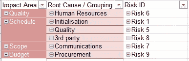

# 你的竞争对手所知道的关于软件项目风险识别的一切

> 原文：<https://medium.com/hackernoon/everything-your-competitor-knows-about-risk-identification-on-software-projects-80f23edc91c0>

> 通过花时间遵循本文中的步骤，您应该能够识别项目中超过 80%的风险。
> 
> 风险=概率*影响

所有项目都有风险。在你最需要的时候，主动解决这些风险会节省你的时间和精力。这是一个指南，详细说明了识别软件项目风险的最有用的方法，不管你是遵循瀑布方法、敏捷、六适马、PMI 还是 PRINCE2。

# 注意:常见风险领域

您的大多数项目风险可能产生于以下优先领域(根据来自 [Tharwon Arnuphaptrairong](http://www.iaeng.org/publication/IMECS2011/IMECS2011_pp732-737.pdf) 的研究):

1.  对要求的误解
2.  缺乏[管理层](https://hackernoon.com/tagged/management)的承诺和支持
3.  缺乏足够的用户参与
4.  未能获得用户承诺
5.  未能管理最终用户期望
6.  要求的变更
7.  缺乏有效的项目管理方法

由 [Kloppenborg，T. J. & Tesch，D. (2004)](https://www.pmi.org/learning/library/risk-management-project-improve-outcome-8331) 所做的这项研究列出了 70 个可以相互参照的风险，其中 745 个分配的策略涉及按流程(56%)和人员(44%)分类的风险

# 风险识别技术

# 采访

最初的一对一访谈(正式或非正式)总是强调超出应记录在商业案例/项目章程文档中的共同知识的项目见解。带着引导性的结构化问题来准备这些面试，不仅要注意风险，还要注意任何业务驱动因素、假设和限制(用于 CAA 流程(如下))。

# 调查表

下面的基本问卷([完整问卷](http://turningwheel.net/ctu/cs465/riskid.doc))遵循 [Boehm 十大软件风险](http://ieeexplore.ieee.org/document/62930/)来识别风险并通过[建议的](http://agile.csc.ncsu.edu/SEMaterials/RiskManagement.pdf)缓解策略来工作。虽然我认为这份问卷最有用，但还有其他值得注意的来自 [Wallace & Keil](https://pdfs.semanticscholar.org/d947/7ec0fcb01e195de2fe4e4221e77cafad7e8d.pdf) 的问卷，这是由 [Schmidt 等人进行的一项国际研究。al](http://dl.acm.org/citation.cfm?id=1289670) 和一个来自[韩&黄](http://www.scirp.org/(S(i43dyn45teexjx455qlt3d2q))/reference/ReferencesPapers.aspx?ReferenceID=133372)所有这些都在[Tharwon arnuphaphtrairong](http://www.iaeng.org/publication/IMECS2011/IMECS2011_pp732-737.pdf)的一篇研究论文中做了很好的记录。

**1。人员短缺**

**问题:**项目时间框架内所需数量的熟练技能是否可用？

**缓解:**配备顶尖人才、工作匹配、团队建设、关键人员协议、交叉培训

**2。不切实际的时间表和预算**

**问题:**所有的需求&任务都是由承担工作的团队评估的吗？

问题:任务之间的所有依赖关系都被识别和考虑了吗？

**缓解:**详细的里程碑成本和进度估计，成本设计，增量开发，软件重用，需求清理

**3。开发错误的功能和属性**

**问题:**对系统的需求是否清晰易懂且稳定？

**问题:**开发人员和定义产品需求的人员之间是否有误解或沟通不畅的历史？

**缓解:**组织分析、任务分析、运营概念制定、用户调查和用户参与、原型制作、早期用户手册

**4。开发错误的用户界面**

**问题:**用户界面是否已经原型化，并在样本用户组上测试过？

问题:用户界面的目标被定义了吗，被记录了吗？

**缓解:**原型、场景、任务分析、用户参与

**5。镀金**

**问题:**在项目开发过程中，是否有不需要的功能被添加的历史？

缓解:关注 MVP，需求清理，原型，成本收益分析，按成本设计

**6。持续的需求变更流**

**问题:**过去的客户历史是否表明需求经常变化？

**问题:**团队是否很好的理解了客户/用户在系统中想要什么？

**缓解:**高变更阈值信息隐藏，增量开发(将变更推迟到以后的增量)

**7。外部供应部件的短缺**

**问题:**该项目所依赖的项目是否存在交付风险？

**缓解:**基准测试、检查、参考调查、兼容性分析

8。外部执行任务的不足

**问题:**该项目或其任何任务是否依赖于外部项目开发工作的完成？

**缓解:**背景调查、授标前审计、授标费用合同、竞争性设计或原型制作、团队建设

9。实时性能不足

**问题:**系统响应时间的要求是否已经定义？

**问题:**是否定义了数据存储、内存&处理速度的要求？

**问:**是否已经定义了用户支持(数量)需求？

**缓解:**模拟、基准测试、建模、原型设计、测试、调优

**10。训练计算机科学能力**

**问题:**组织使用类似的[工具](https://hackernoon.com/tagged/tools)交付过类似的系统吗？

**缓解:**技术分析、成本效益分析、原型设计、参考调查

# 头脑风暴

将不同的利益相关者聚集在一个房间里，试图产生尽可能多的风险。没有不好的建议。最初，在关注一些风险并以此为基础(聚合思维)之前，你会寻找尽可能多的风险(发散思维)。如果团队陷入困境，那么引导他们实现不同的项目目标(进度、范围、质量、预算)和任务(需求、测试等)。)

你可能想利用这个[链接](https://instructionaldesignfusions.wordpress.com/2010/10/23/strategies-and-tools-for-divergent-thinking/)来计划你的头脑风暴会议，并利用这些[最佳实践](https://www.isixsigma.com/tools-templates/brainstorming/brainstorming-rules/)。

# 约束和假设分析(CAA)

每个项目都有已知的假设，不管是否有文档记录。每次需求、功能、任务或用户故事都是建立在潜在的[假设](https://pmstudycircle.com/2012/10/assumptions-and-constraints-in-project-management/)之上的。为了分析将要进行的工作，你应该注意你的依赖性以及业务和技术限制。将这些转变为风险的过程非常简单。简单地说明这些假设和约束都是错误的。这就是风险。现在描述一下后果。这就是影响。首先是处理影响还是减轻风险将在后面的文章中讨论。

一个例子可能是:

**假设**:ACME 支付解决方案提供商将用于在网站上接受支付。

**反向假设**:ACME 支付解决方案提供商不会被用于在网站上接受支付。

为什么会发生这种事？例如，合同不会及时签署，或者您的市场货币不受支持。也许存在阻止部署的法律问题，或者 ACME 的费率太高。

可能会出现许多潜在的问题(可以集思广益)。每一个都是潜在的风险。尽早发现这些问题可以让您采取必要的措施来调查它们发生的可能性和/或采取措施来减轻它们。

# 三点估计的标准偏差

有些做法只是通过经验学来的。这个是我的。我根据这个方法识别出了这么多潜在的风险。这背后有[复杂的逻辑](https://www.interfacett.com/blogs/three-point-estimates-in-six-sigma-and-pmi/)，但可以简单地解释为:在三点( [PERT](http://www.pmknowledgecenter.com/node/59) )估算中，如果最小数字(乐观)和最大数字(悲观)之间的差值很大，那么你已经发现了一个风险。这通常发生在评估任务的人甚至没有意识到的情况下。

未发现风险

*   乐观估计= 3
*   最可能的估计= 5 (+2)
*   悲观估计:= 7 (+4，+2)

已识别的风险

*   乐观估计= 3
*   最可能的估计= 5 (+2)
*   悲观估计:= 12 (+9，+7)

PERT 公式为: *(O+P+4×M)/6，*在 Excel 中 PERT 公式为:

*=ROUND(((A1+(B1*4)+C1)/6)，0)*

Conditional Formatting screenshot

标准差(SD)或σ是*∑=(P-O)/6*，在 Excel 中，我使用此公式和条件格式，如果 SD 大于“1”，则“发出危险信号”:

*=IF((C1-A1)/6 < 1，"，((C1-A1)/6))*

# 力场分析(FAA)

您的项目已经有了已知的目标和驱动力。弱化它们背后的焦点，确定它们为什么被弱化，并确定对项目的影响。您如何缓解这种情况？在[这里](https://www.mindtools.com/pages/article/newTED_06.htm)可以找到更详细的 FAA 概述。

# 优势、劣势、机会和威胁(SWOT)分析

确定终端产品在市场中的优势和劣势，并将这些转化为风险。如果你不相信进行学术分析，这里有一些令人信服的理由让你相信。

# 鱼骨图/石川图(因果图)

风险分析期间通常使用图表，但是在风险识别阶段引入图表有助于识别根本原因以及导致风险的各种因素。由于这个原因，鱼骨图作为一种确定问题根源的方法赢得了很高的声誉。这在集中应对风险时会很有用。一旦确定了根本原因，就可以降低风险。

# 圈复杂度

软件程序的[圈复杂度](https://en.wikipedia.org/wiki/Cyclomatic_complexity)表示源代码的复杂程度。这种方法决定了程序源代码中独立路径的数量。在实现之后，它可以指导您，一个程序是否可能包含问题。

# 故障模式影响分析(FMEA)

[FMEA](http://asq.org/learn-about-quality/process-analysis-tools/overview/fmea.html) 是一个逐步的过程，用于识别软件产品的设计、工程或部署中可能出现的故障。你首先要识别软件的每一个功能，然后识别它可能失败的模式。稍后你会设法解决这些问题。这一过程需要一个跨职能团队来获得最佳结果。

# 德尔菲技术

在进行了一次头脑风暴会议后，你可能想知道使用 Delphi 技术是不是太夸张了。答案是否定的。原因有很多，但最关键的是，你在房间里有相关的熟练专家，技术是正式的和结构化的，他们的反馈是匿名的。为了开始一项德尔菲技术，你要求你的专家小组公开讨论项目，定义问题。在此基础上，向他们提供调查或问卷，以获得他们的匿名反馈，整理并公布他们的结果，征求反馈并重复，直到你得到你需要的一切。一个好的分步指南可以在[这里](https://www.projectsmart.co.uk/delphi-technique-a-step-by-step-guide.php)找到。请记住根据你的发现采取行动！

# 风险分解结构中的观察差距

RBS as a Pivot Table

建议用一个[风险分解结构](https://www.pmi.org/learning/library/risk-breakdown-structure-understand-risks-1042) (RBS)来表示你的风险。(*我在 Excel 中自动生成了一个数据透视表。*)这是通过根据范围、进度、质量和成本对风险进行分类来实现的。我更进一步，创建了一个与项目中的主要领域/主题相关的子类别。然而，我随后用它来观察结构中没有表现的东西，而是没有表现的东西。如果我感觉到时间表是项目中风险最大的部分，但这并没有在 RBS 上表现出来，那么我知道我有差距。类似地，如果我感觉某个主题风险最大，但从 RBS 上看这一点并不明显，那么我知道我必须花更多时间就与该主题相关的风险进行头脑风暴。

# 剩余风险和次要风险

在处理了原始风险之后，二次风险可能会作为风险应对的直接结果而出现。你需要小心提防这些，因为它们有时会比最初的风险更糟糕。最常被引用的例子是为了保护你的家而放了一个动物陷阱(风险)，但是一个家庭成员却被夹住了(次要风险)。如果你用陷阱抓到了野生动物，这会吸引其他不想要的动物，这是一个残留风险。头脑风暴应该梳理出这些类型的风险。

我还发表了一篇[不太详细的](/@david4david4david4/everything-you-should-know-about-risk-identification-on-software-projects-442c6e972656)风险识别文章，你可能会更喜欢这篇文章，因为你不打算花这么多时间试图发现大量的风险。下一次，我们将回顾各种分析技术，这些技术可用于确定您发现的风险的大小和优先级。