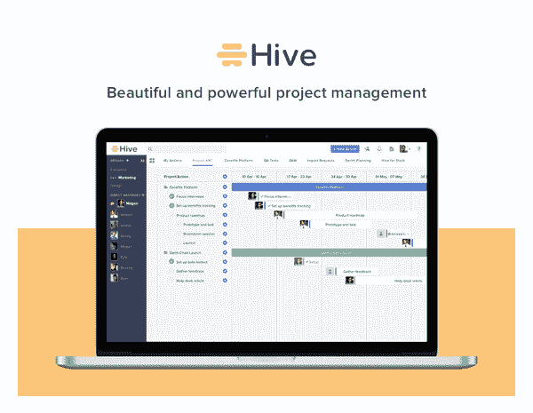
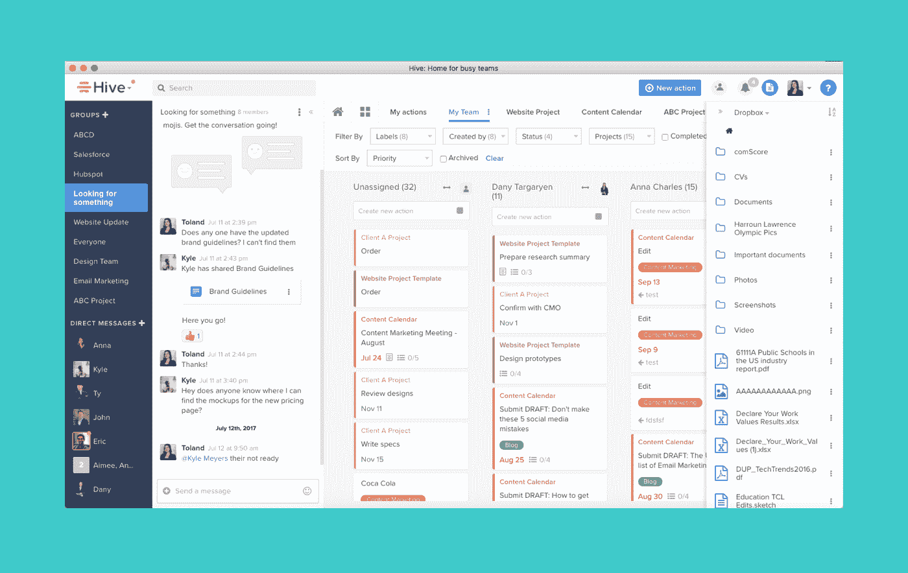
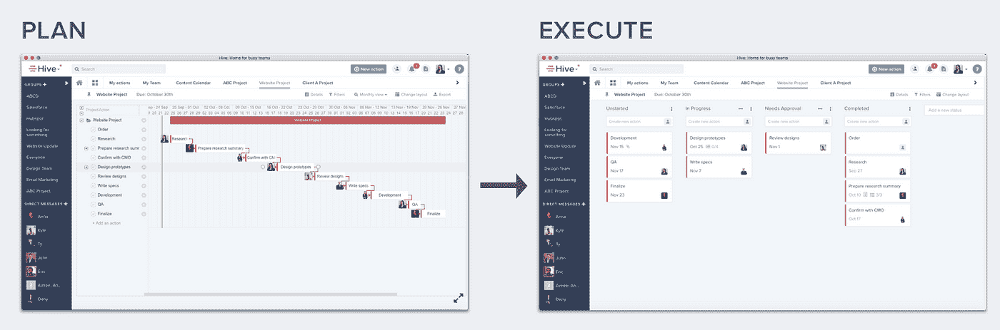
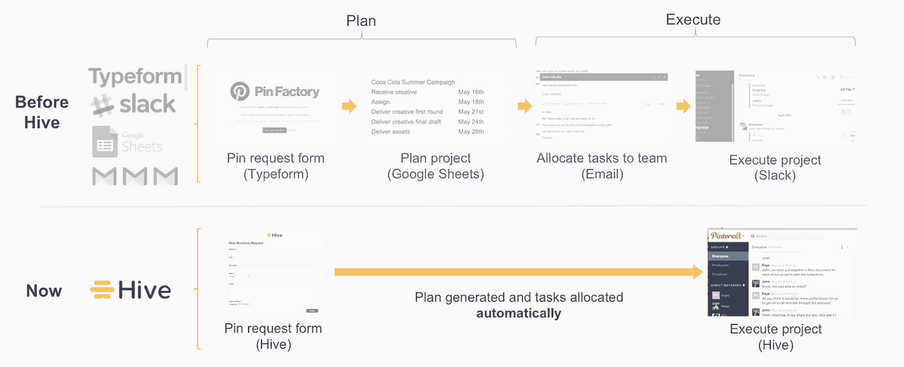

# 您的团队在一页上快速完成工作所需的一切

> 原文：<https://medium.com/hackernoon/everything-your-team-needs-to-get-work-done-faster-on-one-page-dbb7aeb2da5>

Hive 是一款高效的团队工具，可以将你所有的行动、信息和文件放在一个简单的页面上。借助 Hive 的一体化仪表盘，您的团队成员可以自动确定其行动的优先级，并获得完成这些行动所需的一切。

[**凯文威廉大卫**](https://twitter.com/kwdinc) 采访了 [**约翰弗诺**](https://twitter.com/jfurneaux)[**蜂巢**](https://siftery.com/hive) 的 CEO 了解更多。

## 嗨，约翰，给我们讲讲 Hive 吧？

Hive 是一个强大的团队项目管理平台。它将消息传递、项目管理、文件共享整合到一个易于使用的仪表板上。

## 告诉我更多关于你为什么要建立这个的信息？

大多数工具只覆盖协作的一个领域——聊天、计划、文件——并迫使你投资整个生产力栈。这使得团队支离破碎，效率低下。

作为凯捷**的顾问，以及后来在 [**Huddle**](https://siftery.com/huddle) 担任全球客户成功主管，我一次又一次地看到了这一点。因此，我和我的联合创始人埃里克·泰帕多斯开始着手创建一个更加集成的、真正易于使用的平台。**

**这就是我们在蜂巢里建造的东西。**

**管理你的待办事项。检查项目进度。和同事聊天。从 CRM 获取更新。全部。英寸一个。地点。**

****

**它简化了你的工作日。这使得推动项目向前发展变得更加容易。它也非常容易使用，具有很大的灵活性(看板、日历、列表)和可用的集成。**

## **你正在构建的东西有什么独特之处&为什么你认为公司应该使用 Hive？**

**我们的一些主要竞争对手是 [Asana](https://medium.com/u/4fecc4c082c?source=post_page-----dbb7aeb2da5--------------------------------) 、 [Basecamp](https://medium.com/u/3f51e0e5b209?source=post_page-----dbb7aeb2da5--------------------------------) 、 [Trello](https://medium.com/u/fb5dd2d116a1?source=post_page-----dbb7aeb2da5--------------------------------) ，但我们也与更成熟的工具竞争，如 [**微软项目**](https://siftery.com/microsoft-project-online) 。**

**与这些工具不同，Hive 允许团队在一个地方规划和执行他们的项目。**

****

**通常，项目经理会制定出完美的项目计划，但每次有变化时，他们都需要将文件重新发送给团队中的每个人。在 Hive 中，经理可以更改甘特图，团队中的每个人都可以在他们的“我的行动”列表中实时获得更新。**

**更好的是，我们还在您的行动跟踪旁边提供了聊天功能。因此，如果有人在聊天中要求你做一些事情，你所要做的就是将聊天内容拖到你的待办事项列表中，这样你就不会忘记。**

## **你能告诉我们一些使用 Hive 的不同客户群的情况吗？**

**Hive 是一个很棒的地方，适合任何一群寻找更好的方式来组织工作的人。因此，我们有各种各样的客户，从小型科技创业公司到大型保险公司再到营销机构。**

**然而，Hive 最能引起市场营销、运营、项目管理和设计团队的共鸣。这些团队需要同时管理大量项目和人员，而其他工具并没有很好地为他们服务。这些团队也希望在所有面向消费者的应用中获得同样的无摩擦用户体验。我们在一个地方提供他们需要的一切，这就是为什么他们通过他们正在使用的一些其他工具来找我们。**

## **您的客户如何使用 Hive？你能分享一些不同的使用案例吗？**

**Pinterest 的 [**的 Pin Factory 组就是一个很好的用例。Pin 工厂负责为销售活动创建 Pin。以前，销售团队成员会通过一个**](https://siftery.com/company/pinterest)**[类型的表格](https://medium.com/u/f9ec0e0e5d0?source=post_page-----dbb7aeb2da5--------------------------------)提交请求，然后被转移到一个谷歌表单，然后通过电子邮件分配出去。在分配了请求后，团队会在空闲时间进行协作和提问。它们分散在 4 个不同的工具中，这使得很难跟踪所有的工具。****

**Hive 完全简化了他们的工作流程。现在，销售团队使用 Hive 表单请求新的 pin。这些请求直接进入 Pin 工厂的 Hive 工作区，只需点击一个按钮就可以分配出去。他们需要进行的任何讨论都可以在他们的 Hive 仪表板上的聊天中进行。**

**之前，他们使用 4 种不同的工具来完成工作。现在他们用一个。这就是蜂巢的魔力。**

****

## **有什么早期的“成长秘诀”或策略促成了你现在的成功吗？**

**整合是扩大我们业务范围的关键。我们特别自豪能够成为 [**Zenefits**](https://siftery.com/zenefits) 集成合作伙伴之一，并加入 [WeWork](https://medium.com/u/52d87163016d?source=post_page-----dbb7aeb2da5--------------------------------) 服务商店。两个组织都有互补的客户，在这些商店中，我们在决策点抓住他们。**

**对我们来说，另一件重要的事情是确定我们想要关注的关键垂直市场和地区。这帮助我们树立了自己的名声，并获得了更多的客户推荐。**

**我还认为，我们增长的最重要因素之一是我们对客户的关注。我们努力确保客户满意，几乎所有的功能改进都直接来自客户的反馈。通过与客户的讨论，我们许多关于什么会有帮助的假设被证明是错误的。如此多的公司陷入了“我更了解”的态度，我认为放弃这种态度是我们成功的关键。我们完全专注于让您在 Hive 中的工作变得更简单、更有趣。**

## **在早期构建产品时，最大的挑战是什么？你是如何解决的？**

**最大的挑战之一是不断完善客户想要的体验。对我们来说，关键是与我们的早期采用者进行客户访谈，并观看 [**FullStory**](https://medium.com/u/9e9472b4520d?source=post_page-----dbb7aeb2da5--------------------------------) 视频，以了解人们在哪里挣扎，并不断迭代以使其变得更好。我们不断增加新功能或改善用户体验。这绝对是一个持续的过程，将永远是我们公司工作方式的一部分。**

## **你加入的最有趣的整合是什么？有什么对你特别有影响的吗？**

**我们有 100 多种集成产品可以满足所有不同的需求。**

**我们最受欢迎的[**Google Drive**](https://siftery.com/google-drive)[Dropbox](https://medium.com/u/2d2c8f4cb281?source=post_page-----dbb7aeb2da5--------------------------------)和 [Box](https://medium.com/u/64729b1ea670?source=post_page-----dbb7aeb2da5--------------------------------) 用于文件，这使得用户可以在 Hive 中立即访问他们的重要文档。您还可以连接您的 [Slack](https://medium.com/u/26d90a99f605?source=post_page-----dbb7aeb2da5--------------------------------) 帐户，并在您的 Slack 频道中共享配置单元操作。另一个让我们感到兴奋的集成是 Zenefits，这样当一个员工被雇用时，他们会自动被添加到公司的 Hive 工作区。**

## **在我们结束之前，你运营公司所依赖的顶级产品是什么&你如何使用它们？**

**[**Hubspot**](https://siftery.com/hubspot-marketing-platform)**是我们处理所有营销和销售活动的中心。从客户生命周期的开始到结束都在 Hubspot 中处理。****

****我们不能没有对讲机。它的实时聊天支持在帮助我们为客户提供最佳体验方面至关重要，它确实让一个小团队能够轻松提供一流的支持。****

****[**full story**](https://siftery.com/fullstory)**对于帮助用户理解用户行为，并使其容易识别我们需要做出的改变非常有用。******

******[Chargebee](https://medium.com/u/f62218884b1c?source=post_page-----dbb7aeb2da5--------------------------------) 是我们处理所有订阅账单的地方。它使得创建发票和调整计划细节变得容易。******

**********对掌握客户满意度非常有用。我们可以监控反馈，并快速识别任何弱点，以便可以立即处理它们。**********

*******最初发表于*[*siftery.com*](https://siftery.com/stories/everything-your-team-needs-on-one-page-to-get-work-done-faster)*。*******