# 无码头自行车/自行车共享设计的演变及对行业的思考

> 原文：<https://medium.com/hackernoon/evolution-of-the-dockless-bike-bikesharing-designs-and-thoughts-of-the-industry-32e41da1dfaa>

无码头自行车(自行车共享)正在席卷全球。

游戏中最大的两个玩家——Ofo 和 Mobike，进入市场还不到 3 年，但已经占据了中国市场 95%的市场份额。他们超越了这个领域的所有人，从而获得了带着许多战斗伤痕的地位。下面的截图发布于 2017 年 4 月左右，其中许多已经不存在了:

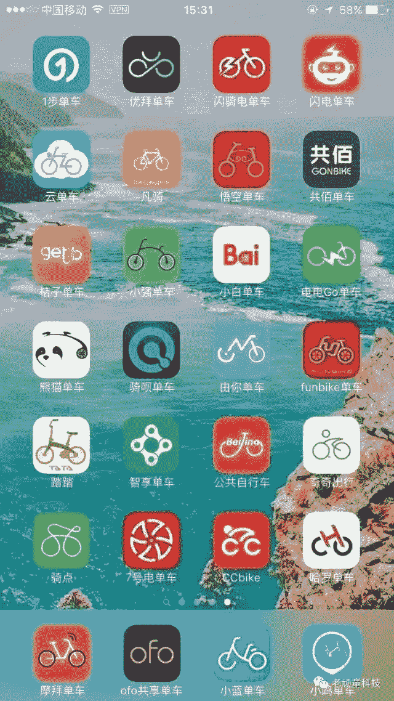

Ofo 和 Mobike 目前正在全球范围内积极推出服务，目标都是到 2017 年底覆盖 200 个城市。虽然还没有盈利，但它给人的印象非常深刻。

对于第一次尝试无人驾驶自行车的人来说，包括《华盛顿邮报》的记者们，这可能是一个疯狂的想法，想想他们看到的东西需要多少次迭代，还有多少空间可以改进设计。

[Ofo](http://36kr.com/p/5095151.html) 和 [Mobike](https://mobike.com/global/blog/post/next-generation-mobike) 最近分别发布了他们下一代自行车的设计。这似乎是一个回顾他们多年来(在中国)推出的不同设计的好时机。[Ofo 和 Mobike 推出策略的差异](http://technode.com/2017/03/21/ofo-northern-china-style-mobike-southern-china-style/)从根本上影响了他们为用户提供的产品。

# **Ofo**

把 Ofo 想象成自行车的机器人。Ofo 以量取胜市场。

这是 Ofo 投放市场的第一批自行车—

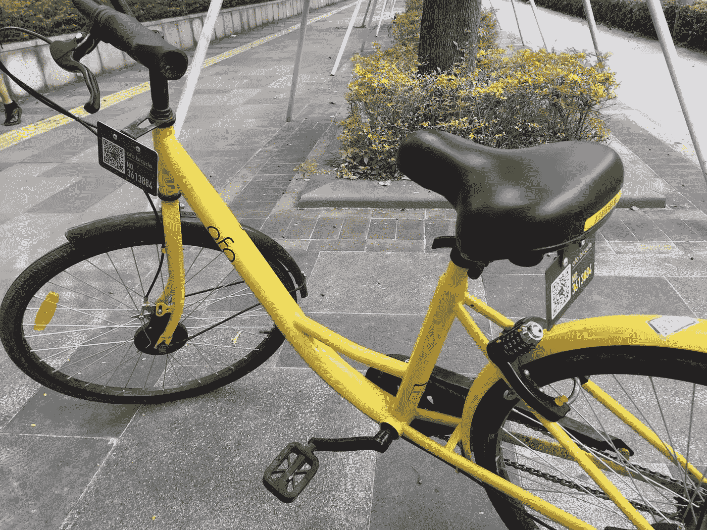

注意 3 件事:前面的编号板，座位下，和锁。

最初的锁非常原始，需要从 Ofo 的数据库中获取 4 位数字的组合。由于组合没有变化，许多人要么涂黑车牌上的二维码/号码，要么干脆把锁一起拆下来，用他们自己的私人锁来“私有化”共享自行车。

也许目标只是为了获得市场份额，所以破坏行为在当时被 Ofo 所容忍。现在在深圳的街道上很难发现这些东西，因为它们在市场上逐渐被淘汰。这种模型也经常遇到许多磨损(有意和无意)，如果有其他选择，大多数车手都会有意识地努力避免。

然后是第二代自行车——

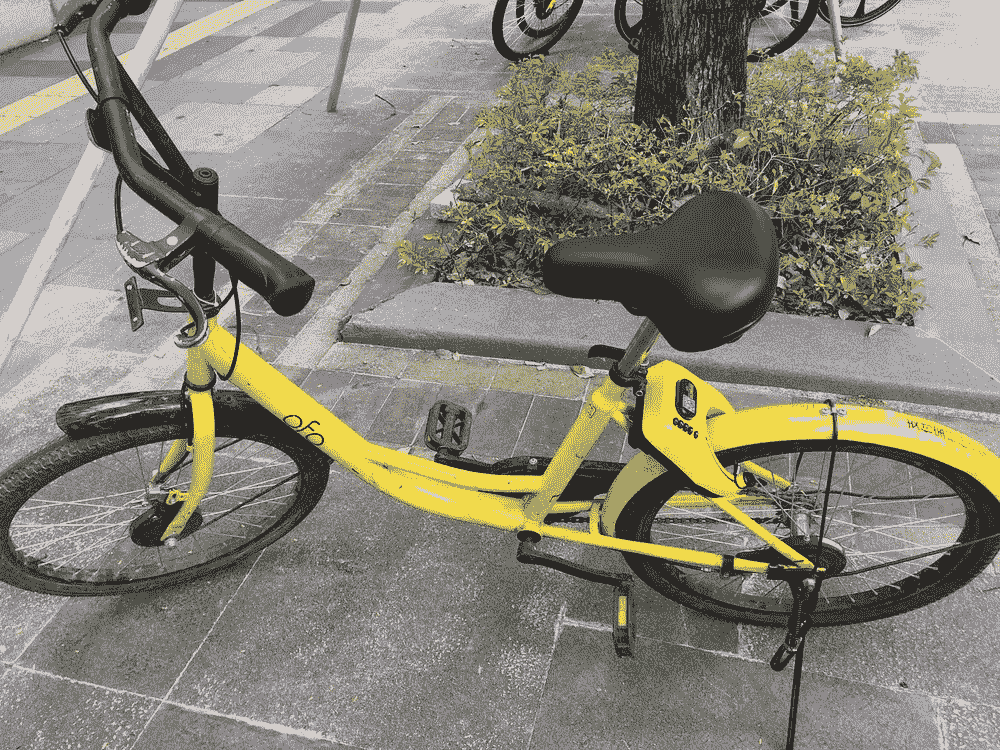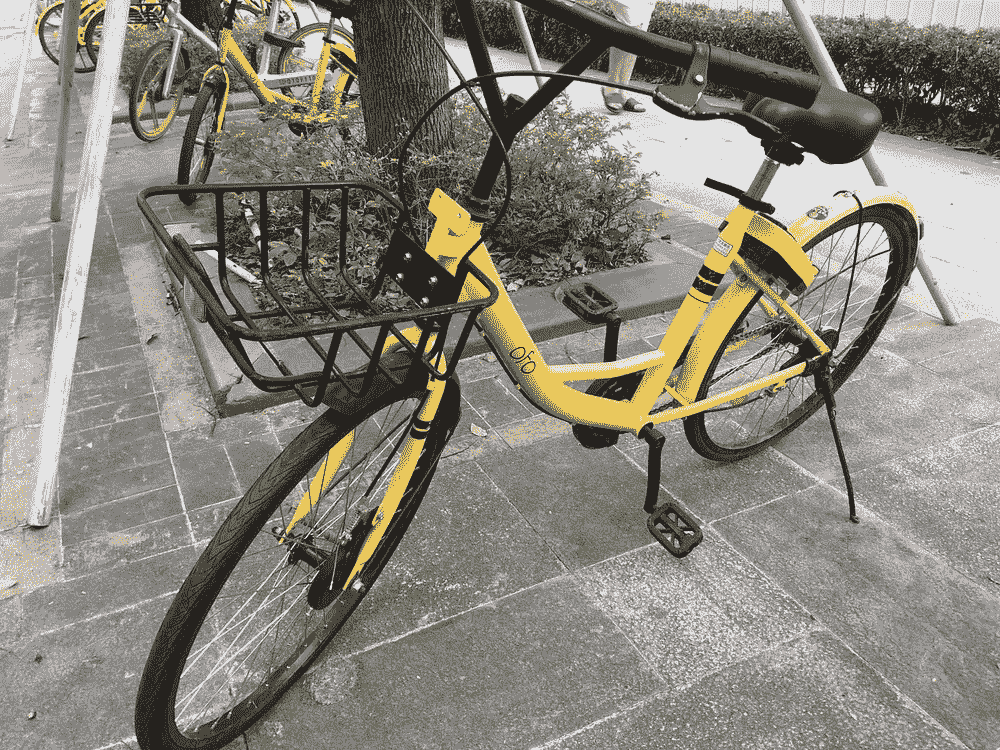

虽然大多数自行车保持不变，有些有车筐，有些没有，但要注意的是锁机制有了多大的改进。该锁系统是摩拜单车锁系统的一个副本，但似乎仍有 2 次迭代，第一次仍需要输入 4 位数字代码才能工作，有些会自动打开，如摩拜单车。

然后是 Ofo 自行车的 3.0 代。这是我在市场上遇到的最新产品—

它不仅有一个光滑的身体设计，请注意新的制动盘附件。自行车上的座位也得到了升级。有了 GPS 定位、SIM 卡和自行车不同位置的条形码/二维码等东西，Ofo 可以采取更好的运营方法来管理效率。

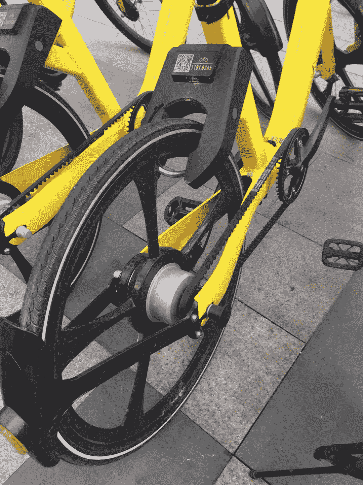

这种锁系统的迭代完全去除了按钮。一旦通过验证，锁会自动打开。还要注意的是，自行车链条也得到了改造。Ofo 抛弃了传统的金属链条，选择了塑料同步带设计。

除了 1.0/2.0/3.0 版本，Ofo 还出于营销目的推出了少量外观有趣的自行车:

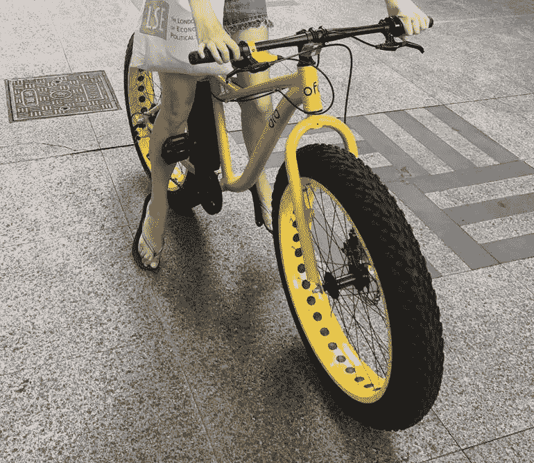

# **摩拜单车**

我认为摩拜单车是自行车领域的苹果 iOS，他们从第一天起就非常注重产品设计。

(注:本部分包含来自 www.shejipi.com 的[照片)](http://www.shejipi.com)

1.0“经典版”从一开始就对 convent 提出了挑战:智能锁、SIM 卡、GPS 定位、机械发电，包括应用程序上的远程 15 分钟预订功能—

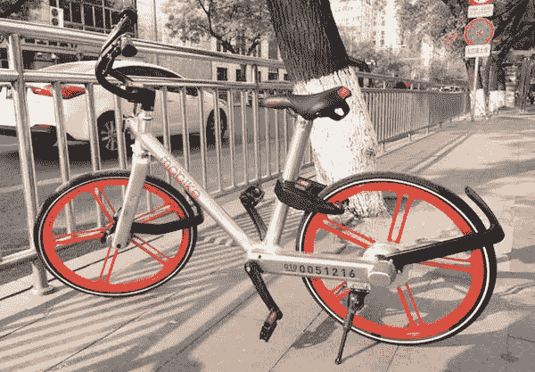

不难看出，考虑单侧车架和车轮安装组件的寿命和整体持续维护花费了多少时间——

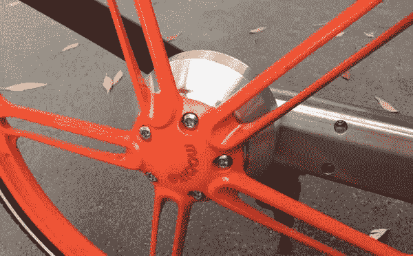

然而，所有的艰苦工作并不是一帆风顺的:座位太低，无法调整，座垫太硬，没有篮子，最重要的是由于重量很难操作。此外，由于每辆自行车的价格为 3000 元人民币(约 450 美元)，摩拜单车感受到了竞争对手的压力，在下一个版本的设计之前，平行推出了摩拜单车 Lite

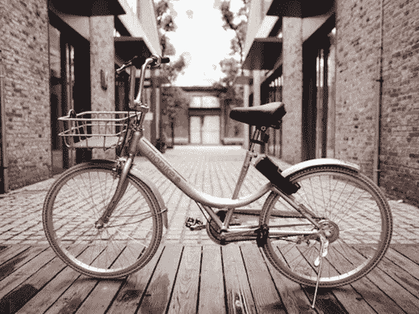

相比之下，Mobike Lite 每辆仅花费数百元人民币(45-60 美元)。与传统的车轮设计，传统的金属自行车链，但仍然坚定地与智能锁。最有趣的部分是塑料非充气轮胎

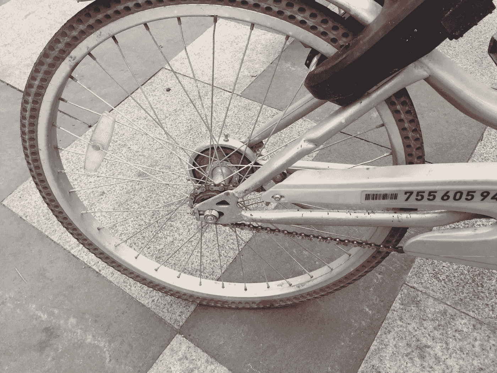

2016 年 11 月 16 日，摩拜单车 Classic 和摩拜单车 Lite 都获得了升级。虽然升级后的摩拜单车经典版 2.0(左)保持了类似的外观，但摩拜单车精简版 2.0(右)进行了一些翻新—

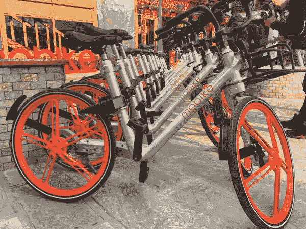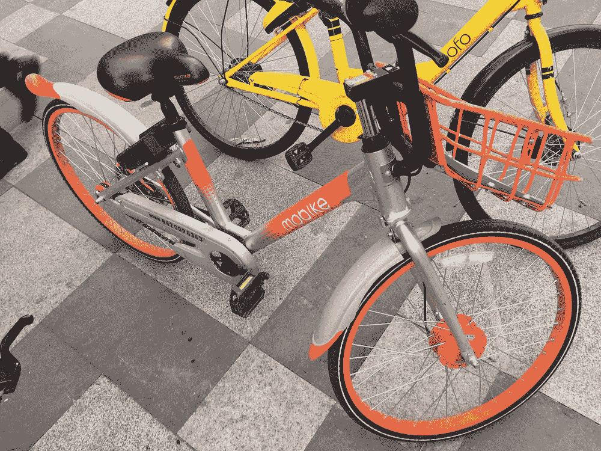

非充气轮胎在其他美学变化中被放弃。(摩拜单车 Lite 左，摩拜单车 Lite 2.0 右)

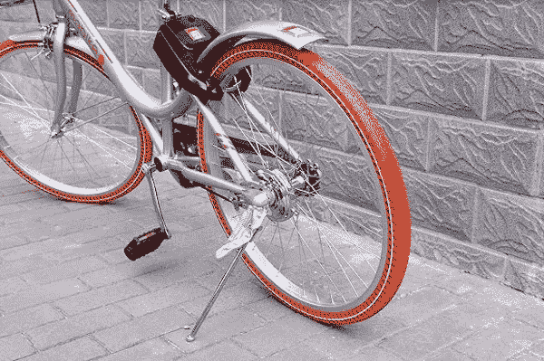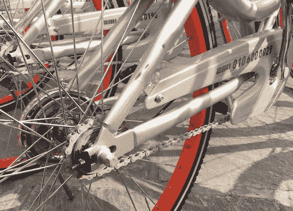

现在，升级后的 Mobike Classic 的亮点是新的可调节座椅:

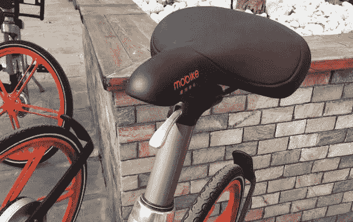

新的通风篮子:

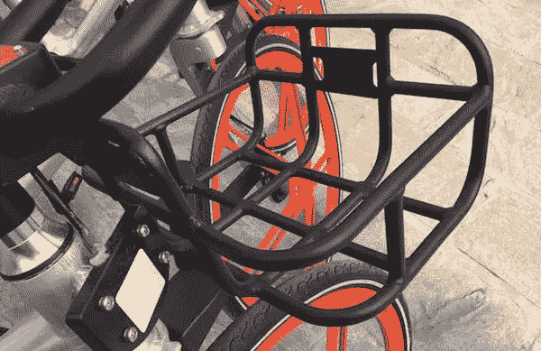

通过可见的新制动盘和新踢腿支架减轻重量，而不可见的其他设计减轻了总重量的 30%(左侧为旧设计，右侧为新设计):

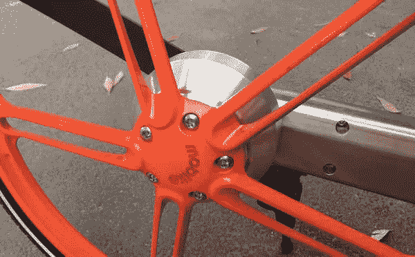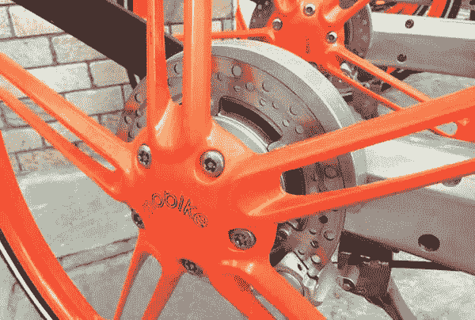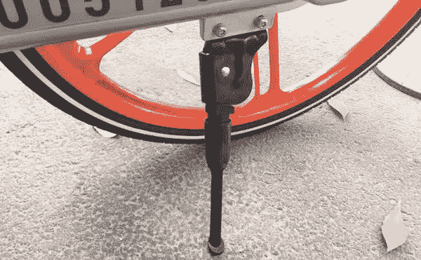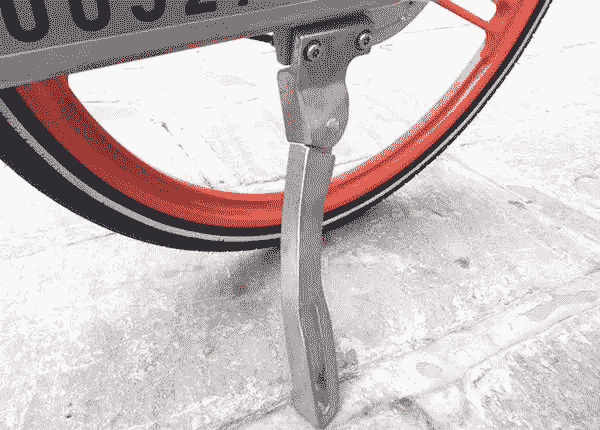

# 主要观察结果

在做了分析之后，令我非常惊讶的是自行车的生命周期是如此之短。每 9-12 个月发布一款新设计的自行车。亲身体验自行车的新版本在地面上推出的速度有多快，大约需要 4-6 个月，替换率为 60-70%。

为了跟上推出频率的类型，需要相当高的操作效率。这需要一个相当复杂的供应链，并且可能必须靠近生产源才能跟上迭代的步伐。

由于 Ofo 没有表现出任何放缓全球扩张的迹象，比如与 Rihanna 的合作，摩拜单车也是如此。至少对 Ofo 和 Mobike 来说，海外市场可能不会以中国市场的频率循环库存。中国可能仍将是推出新自行车的试验场。

简单计算一下，假设以每辆 250-3000 元人民币(40-450 美元)的价格生产 10 万辆新自行车，这意味着 400-450 万美元的资本支出(取决于每辆自行车的制造价格)。不是每个公司都有能力花这么多钱。

最后，随着 Ofo 和 Mobike 开始进入美国市场并加剧竞争，我不禁质疑像 [Spin](https://medium.com/u/fa970d2a0255?source=post_page-----32e41da1dfaa--------------------------------) (成立于 2016 年 11 月，居住在美国 3 个城市(？)、融资 800 万美元)和 [LimeBike](https://medium.com/u/881e39a1e63a?source=post_page-----32e41da1dfaa--------------------------------) (成立于 2017 年 3 月(？)，住在美国 8 个城市，筹集了 1200 万美元)。他们将如何实现规模经济并产生足够的收入来生存？人口密度是一个重要因素。中国有 60 多个 500 人/公里(1300 人/英里)的城市，美国有大约 10 个，所以这将极大地影响可能发生的事情。

与超本地化相比，新加坡玩家 Obike 正在使用超国际化扩张战略(成立于 2017 年 1 月，拥有 20 多个城市，横跨 11 个国家，筹集了 4500 万美元)，并选择人口密度高的城市。

该行动的目标是收购还是大规模国际整合/联盟？ [Ofo 正在谈判筹集 1B 美元](http://www.reuters.com/article/ofo-fundraising/corrected-chinas-ofo-in-talks-to-raise-new-financing-of-more-than-1-bln-co-founder-idUSR4N1LV01Y)和 [Mobike 在 2017 年 6 月完成了一轮 6 亿美元的融资](http://www.financeasia.com/News/437341,tencent-leads-600m-mobike-fundraising.aspx)，其他参与者将很难参与竞争，因为与传统软件产品相比，本地化变化非常有限。

最终，从全球范围来看，当考虑无码头自行车/自行车共享行业时，Ofo 和 Mobike 将成为领先的第一和第二名，而第三名在可预见的未来将远远落后。一个非常相似的赢家拿走了共享经济领域的大部分场景。