# 服务边界标识示例

> 原文：<https://medium.com/hackernoon/example-of-service-boundaries-identification-e9077c513560>

在[上一篇文章](/@wrong.about/how-to-define-service-boundaries-251c4fc0f205)中，我谈到了如何识别服务边界。如前所述，这里我考虑一个例子。

# 支付服务提供商分解

## 介绍

我的第一个例子是一家[支付服务提供商](https://en.wikipedia.org/wiki/Payment_service_provider)。姑且称之为“超级 PSP”。它整合了来自[这个列表](https://en.wikipedia.org/wiki/List_of_online_payment_service_providers)的每一个 psp，以及数百家银行和移动运营商，从而成为一个[支付聚合器](https://www.payfirma.com/payments-101/what-is-an-aggregator/)。我们的客户是网上商店，他们不想与所有的支付系统、银行和移动运营商等整合，所以他们去超级 PSP，与它整合，就是这样。他们可以调用我们的 API，让整个支付系统为他们所用。此外，超级 PSP 有一个网络界面，客户可以在那里查看和操作支付，更改一些设置，获得报告，获得各种统计数据等。此外，他们可以有一个网络界面，在那里他们的客户可以选择支付系统，并支付他们的订单。

所以让我们开门见山，考虑它的业务功能，或者业务能力。有了这样一种声明性的方法，您使用什么具体的技术并不重要，所以我在这里不会严格地坚持使用它们中的任何一种。

## 更高层次的服务

***全局观*** 这一切都始于营销活动。这是超级 PSP 获得客户的主要方式。如果一家公司感兴趣，并希望与我们一起处理付款，他们的下一站是销售服务。销售服务基本上是关于客户想要使用什么功能以及价格多少。然后客户离开去处理支付——向处理支付服务或支付处理服务问好，如果你更喜欢它的话。离 it 客户支持或服务很近的地方。如果你有任何问题，它随时可以帮助你。到月底，我们会将我们的付款与支付系统端注册的付款进行对账。然后我们实际上向我们的客户收费。因此，我们的高级服务视图可以是这样的:

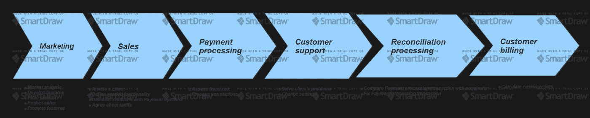

PSP Value chain

随着我们对每一个问题的深入研究，它可能会有进一步的变化。

***营销***
和其他公司一样，超级 PSP 需要从事业务开发的人。所以相应的工作人员做市场分析。他们最关心的是顾客需要什么。所以他们识别产品特征。然后，他们推广即将推出或现有的产品。他们可能决定定价策略，如果他们这样做，他们也做一些销售预测。
那么命名呢？什么名字最适合上述活动？它可能是产品开发或业务开发。或者我们可以使用相当常见的名称，如营销。
因此，我们有以下营销服务层级:

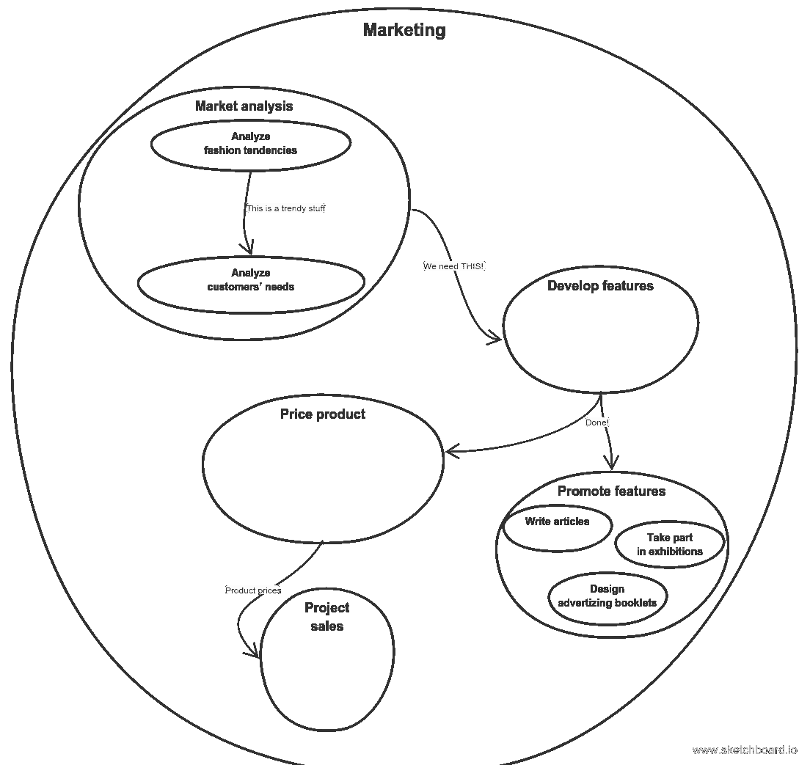

Marketing service

***销售***
然后超级 PSP 销售他们的产品，就是 [SAAS](https://en.wikipedia.org/wiki/Software_as_a_service) 。通过销售的过程，我理解了长期互利合作的建立，这意味着通常频繁的沟通和帮助。它包括客户咨询——甚至在一开始，当客户还不是法律意义上的客户时。在这个阶段，他们被告知业务是如何运作的，为什么 Super PSP 比其他人做得更好，他们到底哪里更好，哪里更弱，以及 Super PSP 是否真正解决了客户的问题。之后，他需要更详细的咨询:客户想使用什么支付系统，除了支付处理之外，他还想获得什么超级 PSP 的功能，等等。接下来，Super PSP 需要与客户将要工作的外部支付系统讨论条件。根据客户经营的业务种类，它们会有很大的不同。然后超级 PSP 和它的客户需要就资费达成协议。它会有固定利率还是利率？客户必须多久支付一次？
所以，总结一下，从事销售的商业服务是这样的:

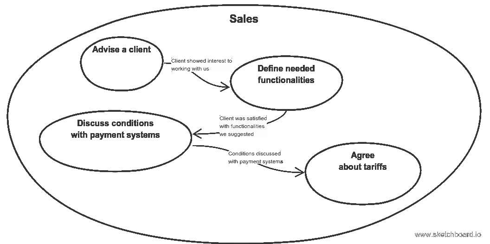

Sales service

所以我们称这种商业服务为销售服务。

***技术支持，或客户支持，或服务***
技术支持可以参与几项活动。首先，它在客户端集成到我们的系统的过程中回答技术问题。例如，当向我们的客户机发送事务通知时，我们期望在 http-response 中有什么样的头。或者为什么客户端请求没有通过验证。或者为什么支付货币不同于客户请求中发送到超级 PSP 网关的货币。其次，当客户端已经集成并通过超级 PSP 处理支付时，设置会发生变化。例如，客户有一个新的交易通知端点，他要求超级 PSP 更改系统中设置的 URL。或者客户要求每月给他发送交易报告，而不是每周。或者更改支付应用程序的生命周期。第三，回答客户在工作中遇到的问题，解决客户在工作中遇到的问题。例如，为什么某些特定的交易被拒绝。或者为什么没有关于某些交易的通知。

在尝试定义它是一个更高层次的整体服务，还是包含在某个服务中，或者它的不同部分属于其他服务之前，您应该与您的业务专家和利益相关者进行讨论。他们如何看待五年后的客户整合过程？销售与技术支持的联系有多紧密？这些服务有不同的逻辑政府吗？

因此，从一方面来说，这种能力是更高层次销售服务的实施细节，尤其是如果您将销售理解为长期合作的话。所以它可能包含在销售服务中。比如 [SAP](https://www.sap.com) 就是这种情况。此外，从更实际的角度来看，今天的设置由专门的技术专家更改，明天将由主要客户经理完成，因为网络界面将变得更简单，工作人员更懂技术，后天将由客户自己使用超级 PSP 的设置 API 来完成。

另一方面，它可能是独立的更高层次的服务，称为[服务](https://en.wikipedia.org/wiki/Service_(business))，就像在[波特的价值链](https://en.wikipedia.org/wiki/Value_chain)中一样。因此，如果关键客户经理进行技术集成，并回答客户的技术问题，通常是非常相似的，并且不需要深入了解任何技术领域，那么采用这种方法是有意义的。因此，技术支持部门承担了上述服务活动的责任:“在产品/服务售出并交付后，保持产品/服务有效地为买方服务”。如果有很多客户，并且 Super PSP 有很多功能，这种关注点的分离甚至更有意义，所以文档在某些地方可能不正确，有时观察到的行为是正确还是错误并不明显，所以技术支持服务可以与开发人员合作来解决客户的问题。

所以我采用第二种方法:我暗示销售服务人员填写处理支付和计算客户费用所需的数据。考虑到这一点，我的技术支持服务是这样的:

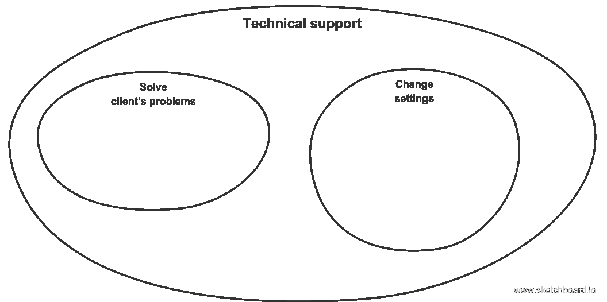

Technical support service

***处理支付服务*** 该服务应该做两件事:确保支付是由应该被借记的银行卡的所有者发起的(如果我们谈论的是卡支付的话)以及实际的支付处理:向银行发送请求，然后执行所有必要的逻辑。正如我已经提到的，我的对象和服务有很多共同点。他们包含一些数据，但他们(通常)不会公开这些数据。他们揭露行为。它们通过消息相互通信:事件或命令。
这里有两个较低级的服务。第一个负责执行支付，第二个负责欺诈风险评估。以异步请求-应答方式用命令消息请求，即异步期望评估结果。它的职责是完全上下文无关的—它只是欺诈风险评估，因此命令消息在这里是有效的。实际上，这里不需要消息传递基础设施。我们可以用 http 安全地实现这种通信，但是要用前面提到的异步方式。

因此，在最普通的情况下，只有一家银行与我们的系统集成，支付操作不涉及 [3d-secure](https://www.sagepay.co.uk/support/12/36/3d-secure-explained) 。它看起来可能是这样的:

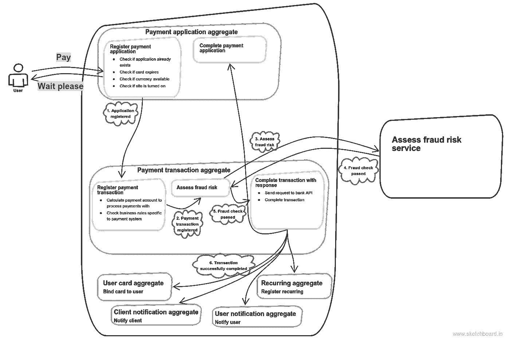

Non-3ds payment

用户发送支付命令。当然我们不会马上处理，而是注册支付申请，礼貌地回复“请稍候”。这是一个贴有“注册支付应用”标签的正方形。它和类似的东西表示一个消息端点，上面的标签上注明了应用程序逻辑(我坚持使用这些术语的[)，它涉及并通常变异了相应的](http://www.enterpriseintegrationpatterns.com/patterns/messaging/)[聚合](https://martinfowler.com/bliki/DDD_Aggregate.html)(如果您更喜欢 Udi 达汗的 SOA，那么它就是[传奇](http://udidahan.com/2009/04/20/saga-persistence-and-event-driven-architectures/) ) —在这种情况下是支付应用程序聚合。当所有的应用程序不变量被检查并且应用程序被实际注册时，我们发布一个相应的事件。然后是下一个聚合步骤——支付交易聚合。检查完所有业务规则并定义了用于处理支付的银行账户后，就该进行欺诈风险评估了。如果可以，那么向银行 API 发送请求，并使用其响应完成交易。在此基础上，还有一些工作要做:例如，我们可能希望注册一个定期支付或绑定卡给用户，我们肯定希望通知用户和我们的客户有关交易。

当我们进行 3d 安全检查时，更复杂的情况可能如下所示:

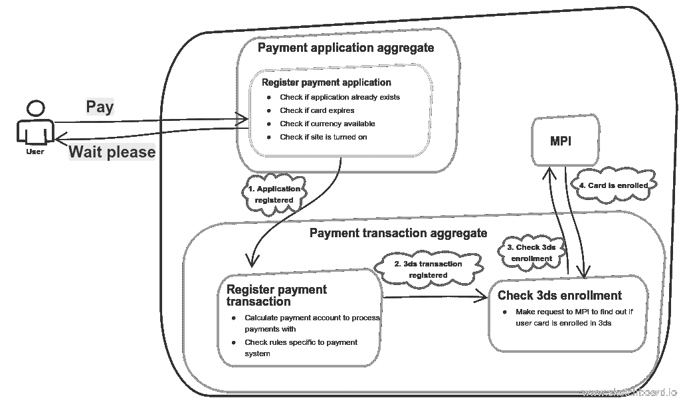

Payment with 3ds enrollment check

在发现用户卡注册了 3d-secure 程序后，我们将他重定向到特殊的访问控制服务器网页，在那里他填写了他在 sms 中收到的代码。在他完成后，该页面将用户重定向回发送“确认 3ds”请求的支付页面(简单的流程说明可在此处找到)。因此，确认请求可能是这样的:

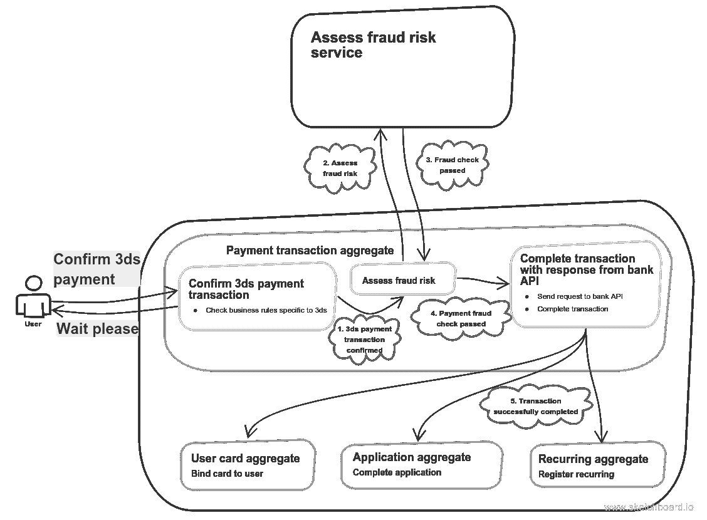

3ds payment

但是超级 PSP 整合了很多银行。此外，如果与某家银行的支付失败，下一家银行将被打开，这对用户来说是透明的。但我希望它以这样一种方式完成，即不同的银行集成互不了解，只关心一件事:处理它们自己的交易。如果一个集成代码中出现问题，其他的仍然可以工作。这就是实现的方法:

Several bank accounts take part in payment processing

下一步是按照某种特征来分割付款。比方说，没有一家银行能够处理金额超过 10000 美元的单笔支付，但是用户想要处理 20000 美元的支付。但是我们不希望他自己处理这个问题，我们不希望他用 10000 美元支付两次。我们可以自己处理。我们可以注册几个按金额划分的付款申请，这将与主要付款申请有父子关系。这可以这样实现:

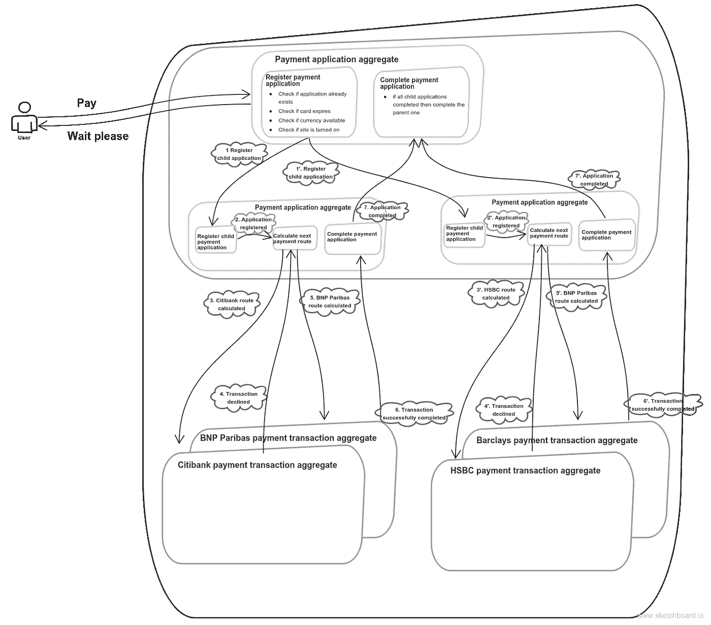

One application is split into two, resulting in two payment threads

我们可以更进一步，将支付应用拆分为不同的支付方式:银行卡、钱包、代金券、移动支付等。但是我把它作为一个练习留给读者:)

目前，整个服务只有一个数据库。但是，如果我需要扩展某个特定的银行集成，这可以毫无困难地实现:

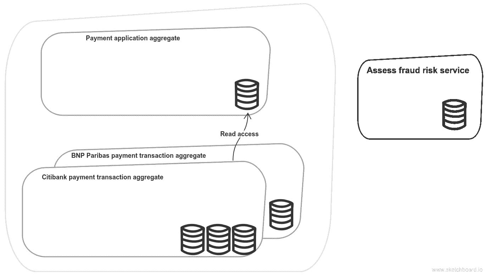

Scaling different payment integrations

但是这里有一个细微的差别。花旗银行集成代码如何了解支付应用程序数据？看，它在另一个数据库里。第一种选择是在事件中传递数据。第二种——只需连接到支付应用程序的数据库。读者权限就足够了。我倾向于第二种选择。当它在一个更高层次的服务中时，它是完全没问题的。我认为第一个选择是邪恶的，即使在一个服务中也应该有一个很好的理由去做。有两件事我想提一下。
第一个是我在一个事件中传递的数据将是对该数据进行操作的聚合的一部分。在我们的例子中，支付应用数据是支付交易的一部分。所以这个数据会有一个生命周期。它会随着一些逻辑发生变异，一些事件会被公布。数据所有权的概念将变得模糊。真理的单一来源将会模糊不清，并最终丢失。
第二个是耦合越来越紧密。几乎不可避免的是，重复的逻辑会跟随重复的数据。如果是这样，就会出现共享库。这就是我所说的耦合。
这些就是为什么[【CQRS】](http://udidahan.com/2009/12/09/clarified-cqrs/)永远不应该是更高级别的模式的原因。

正如服务是我的高层架构的构建块一样，聚合是通过消息进行通信的低层服务中的构建块。就像我的[服务架构](/@wrong.about/how-to-define-service-boundaries-251c4fc0f205)是业务-IT 一致性的更高层次的表现，[适当的 OOP](https://www.amazon.com/Elegant-Objects-1-Yegor-Bugayenko/dp/1519166915) ，其中没有愚蠢的数据结构，其中对象公开行为而不是普通数据，[领域模型不是贫血的](https://martinfowler.com/bliki/AnemicDomainModel.html)，这样的 OOP 是业务-IT 一致性的更低层次的表现。

所以我脑海中对我参与的几乎所有软件的印象都是这样的:

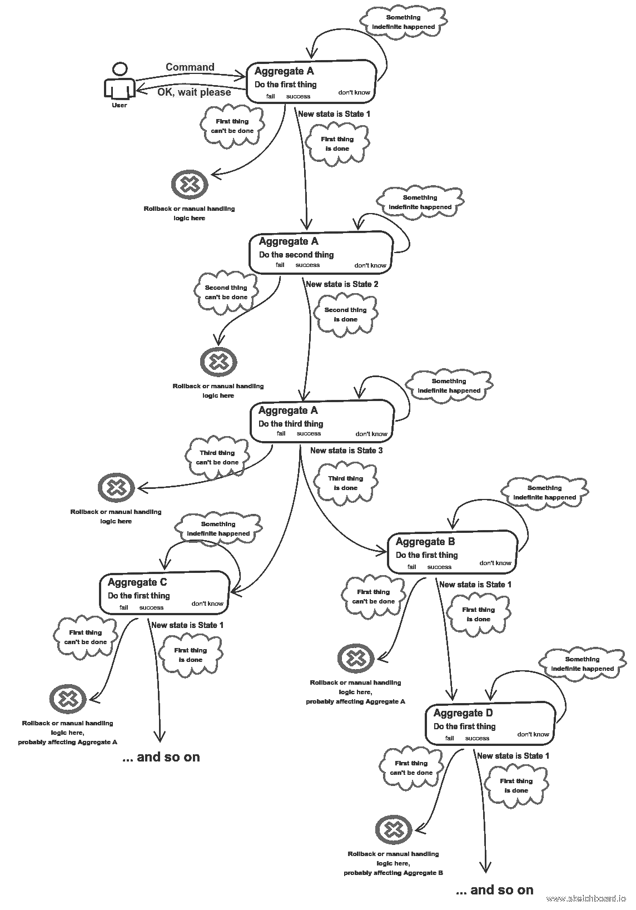

Aggregates’ (sagas’) communication

因此，实现一些用例集的聚合的边界可以表示进一步服务分解的接缝。

***对账服务*** 现在是对账付款的时候了。超级 PSP 需要确保所有的交易都有正确的状态(成功的交易才是真正的成功)，正确的金额和货币以及正确的支付日期。事实可能并非如此，因为，例如，银行 api 软件中的一些错误，后来被修复。逻辑非常简单，听起来似乎个人对账服务没有权利存在，直到我们面对[有争议的交易](http://www.financial-ombudsman.org.uk/publications/technical_notes/disputed-transactions.htm)。事务工作流可能持续几个月，并且可能相当棘手。

协调服务如何获得交易？当然，我不希望它通过数据库与处理服务集成— [共享数据库集成是邪恶的](/@wrong.about/wrong-ways-of-defining-service-boundaries-d9e313007bcc)。我不希望处理服务发布包含协调服务订阅的交易数据的事件—这是更高级别的 CQRS。我希望协调服务的事务数据本质上是暂时的和不可变的，具有尽可能短的生命周期。因此，每个月对账服务从支付处理服务加载交易数据，并开始对账过程。由于交易量可能很大，也许我们不应该使用网络。只是一堆由处理服务生成的文件并放入协调服务可能是一个更好的方法。总之，通常转移过程看起来是这样的:

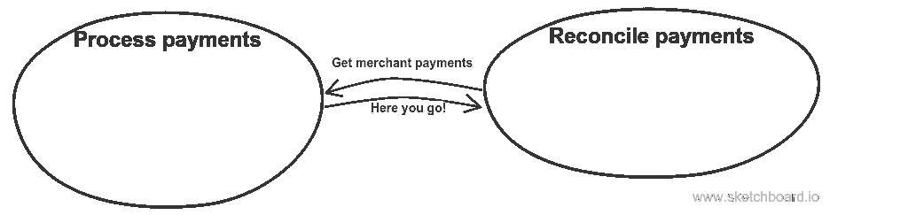

Transaction data transfer process

加载事务处理后，每个事务处理的调节过程开始。下面是一个简单的例子，没有任何[回收](http://www.investopedia.com/terms/r/reclamation.asp):

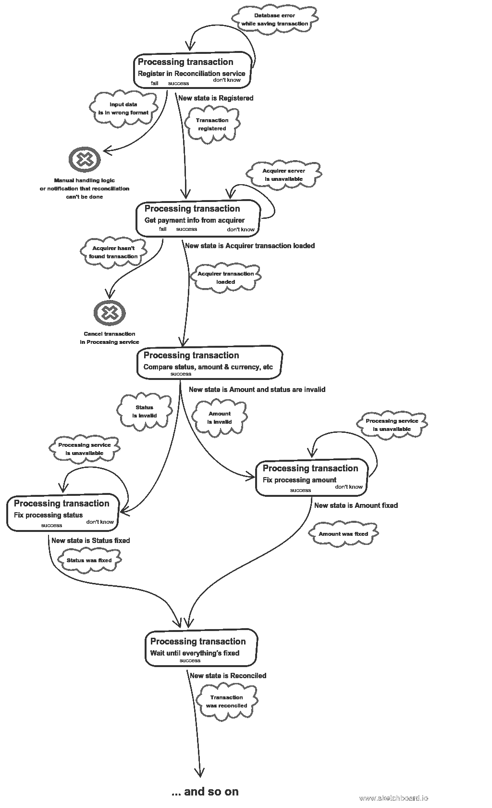

Processing transaction aggregate

让我们简单看一下这是怎么回事。首先，我们创建一个表示处理服务事务的对象。然后，我们请求收购方提供有关该交易的一些信息。然后，我们将收购方的状态、金额等与我们自己的进行比较。如果它们不同，我们会处理服务交易。每笔交易完成后，我们会通知客户计费服务部门我们已经完成了。

有趣的是，使用这种方法我们可以设计出*完全不可变的*领域模型。我将在以后的文章中分享代码。

***客户计费服务*** 当客户计费服务接收到客户交易被对账的事件时，它开始计算客户账单。同样，该服务不存储任何交易数据。事实上，它甚至没有机会这样做，因为没有更高级别的事务数据事件。因此，它以与对账服务相同的方式从处理支付服务获取交易——一次完成。同样，我不认为我需要担心这个服务需要来自其他服务的大量数据。从概念上讲，这与人工计算客户账单的情况没有什么不同。怎么会这样呢？财务经理可以要求数据库管理员查询一些商家的交易，并将这些数据放入数据库。csv 文件。之后，他可以手动计算客户账单。
另一个类比是[复合 UI 方法](http://samnewman.io/patterns/architectural/bff/)。假设你是一名销售经理。你可以设置支付账户，关税，改变一些设置，每月一次，你必须手动计算他们的账单。因此，您有一个 web 应用程序，它应该允许您查看和修改属于不同服务的数据。支付账户和交易属于支付处理服务，关税属于客户计费服务，交易的对账信息属于对账服务。为了计算客户账单，您可能不仅需要查看交易功能，还需要将所有交易导出为例如. csv 文件。这就是这个 web 应用程序的基本外观:

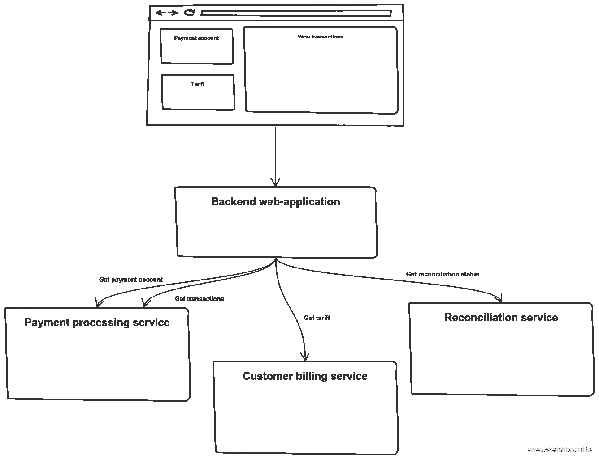

Composite UI for sales manager

查看交易没有错。微服务架构中的 UI 就是这样工作的。让软件为你做单调乏味的工作也没有错。

**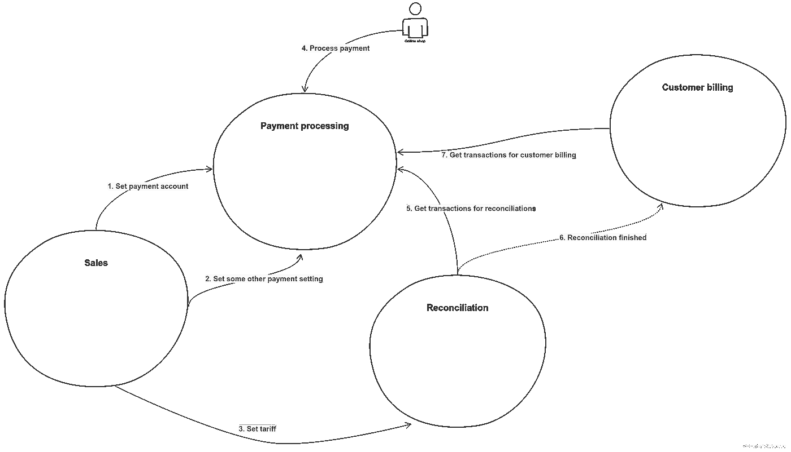**

**Higher-level services interaction**

**所以我终于完成了我的服务边界识别示例。我不仅谈到了边界标识问题，还谈到了可伸缩性问题、域设计(这可能导致不可变的模型，但在接下来的文章中会有更多的讨论)、复合 UI 和数据所有权问题，特别是您不应该使用 CQRS 作为您的高级模式。**

**希望你喜欢。**

**更新。:查看第二个例子[这里](/@wrong.about/service-boundaries-identification-example-in-e-commerce-a2c01a1b8ee9)。**