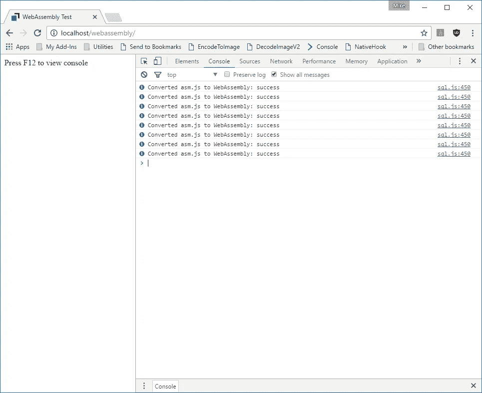
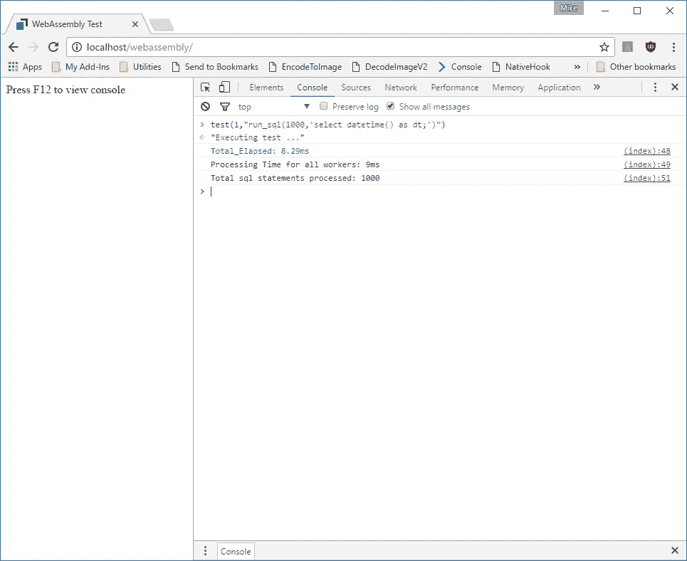
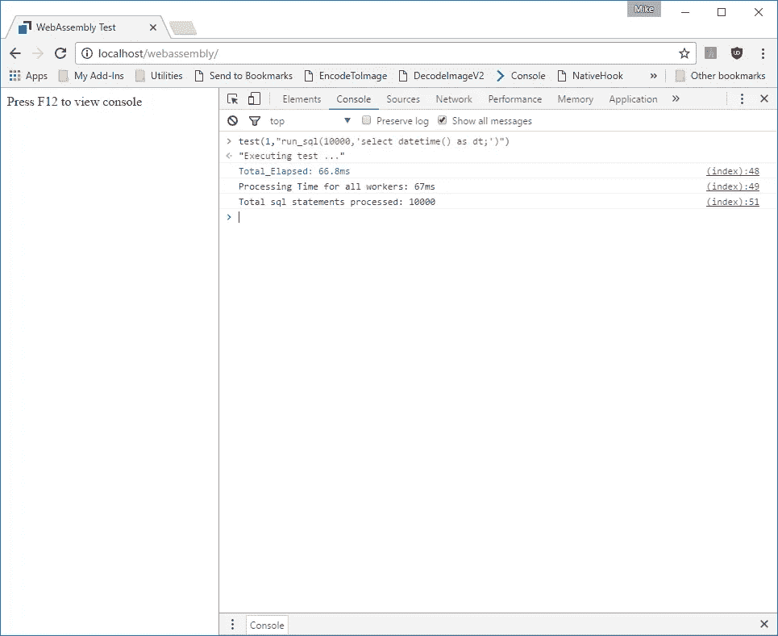
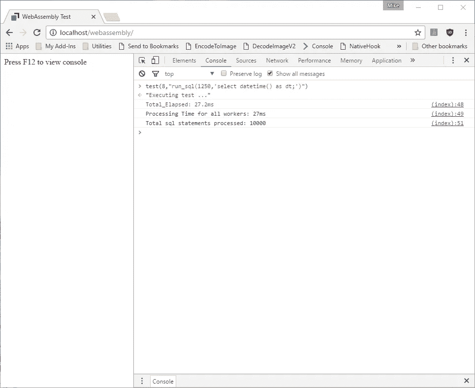
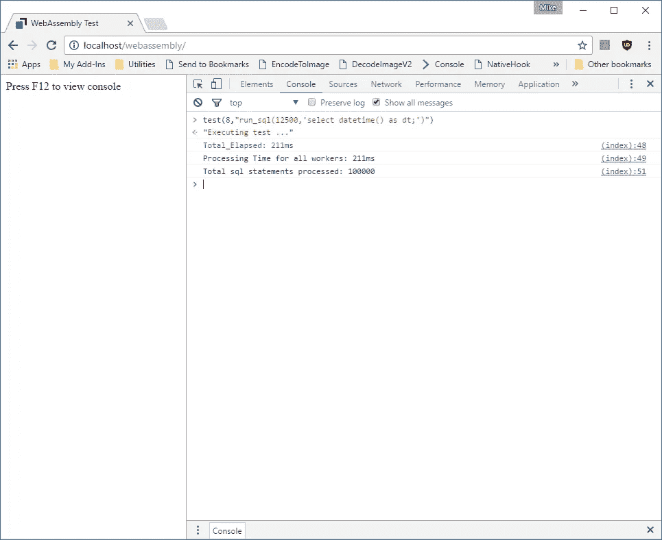
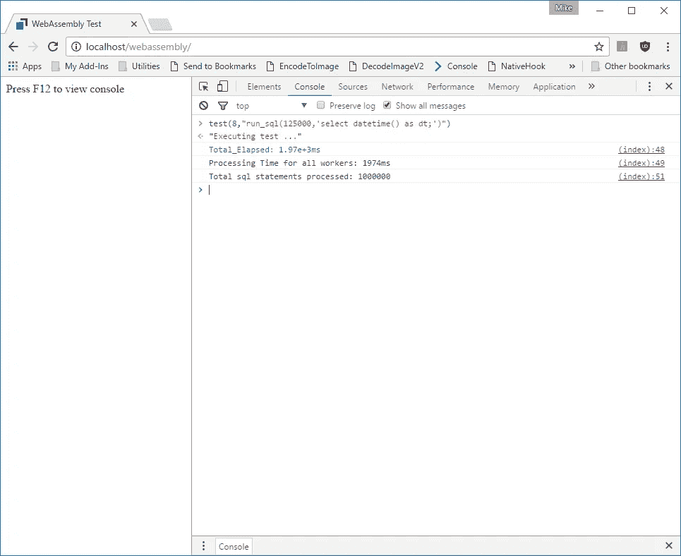
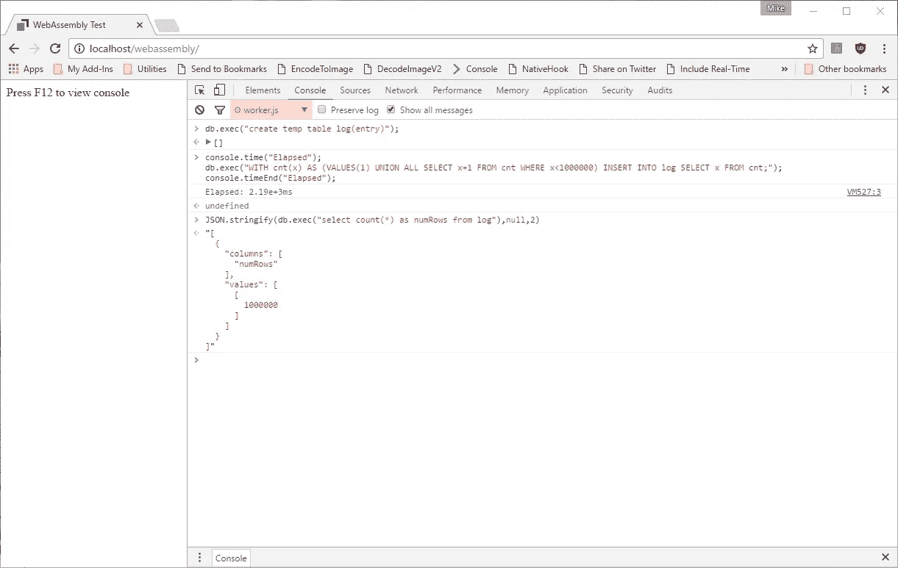

# 使用 WebAssembly 和 Web Workers 在浏览器中以毫秒为单位执行数百万条 SQL 语句。

> 原文：<https://medium.com/hackernoon/execute-millions-of-sql-statements-in-milliseconds-in-the-browser-with-webassembly-and-web-workers-3e0b25c3f1a6>

这是一个相当长的标题，但希望它能引起你的注意！

我一直着迷于在[浏览器](https://hackernoon.com/tagged/browser)中，HTML 和 [JavaScript](https://hackernoon.com/tagged/javascript) 能实现什么。浏览器供应商在 JavaScript 性能方面所做的惊人工作是不可思议的。随着 Chrome V8、微软 Chakra、Mozilla SpiderMonkey 和苹果 JavaScriptCore 的每一次迭代，JavaScript 性能都缩小了与原生代码执行的差距。

web assembly(【http://webassembly.org/】T4)是最新的创新，让我们离在浏览器中执行真正的本地代码又近了一步。我想看看我们已经走了多远，所以我拼凑了一个测试真实代码库的例子，在这个例子中，是 Sqlite 数据库—[http://sqlite.org/](http://sqlite.org/)。在我的测试中，我使用了这里找到的 Emscripten 编译版 SQLite—[https://github.com/kripken/sql.js/](https://github.com/kripken/sql.js/)。

我的测试使用的是最新版本的 Chrome Canary，下面的标志设置为 enabled:

```
chrome://flags/#enable-webassembly
```

我的测试机器是一台戴尔 XPS 台式机，配备:

```
Processor Intel(R) Core(TM) i7–4770 CPU @ 3.40GHz, 3401 Mhz, 4 Core(s), 8 Logical Processor(s)24 Gigs of RAM
256 SSD Drive
```

我创建了 2 个文件，主要的 index.html

```
<html>
<head>
<title>WebAssembly Test</title>
<script>var aListeners = [];
 var results=[];
 var times=[];
 var workers=[];

 //load up our workers
 for(var i=0;i<8;i++){
  workers[i]=new Worker("worker.js");
  workers[i].onmessage = function (oEvent) {
   if (aListeners[oEvent.data.id]) { aListeners[oEvent.data.id](oEvent.data.evaluated,this); }
   delete aListeners[oEvent.data.id];
    };
 }function getRandomWorker(arr) {
  return arr[Math.floor(Math.random()*arr.length)];
 }

 var asyncEval = (function () {
   return function (worker, sCode, fListener) {
  aListeners.push(fListener || null);
  worker.postMessage({
    "id": aListeners.length - 1,
    "code": sCode
  });
   };})();//Our test function
 function test(numReq,code) {
  console.time("Total_Elapsed");
  times=[];
  results=[];
  times.push((new Date()).valueOf());
  var num=numReq || 10000;
  for(var i=0;i<num;i++) {
     asyncEval(getRandomWorker(workers),code || "Date()", function (result,worker) {
   times.push((new Date()).valueOf());
   results.push(result);
   if(results.length==num) {
    console.timeEnd("Total_Elapsed");
    console.log("Processing Time for all workers: "+(parseInt(times[times.length-1])-parseInt(times[0])).toString()+"ms");
    var numRequests=results.length*parseInt(results[0].split(": ")[1]);
    console.log("Total sql statements processed: "+numRequests);
   }
  });
  };
  return "Executing test ...";
}
</script>
</head>
<body>
Press F12 to view console
</body>
</html>
```

和 Web Worker 脚本 worker.js

```
importScripts("sql.js");//Init sqlite database
var db = new SQL.Database();//Our test function
var run_sql=function(numReq,sql) {
 var n=numReq || 10000;
 var results=[];
 var elapsed=0;
 var stmt = db.prepare(sql || "select datetime() as dt;");

 var start = (new Date()).getTime(); 
 for(var i=0;i<n;i++) {
  var rows = stmt.getAsObject({});
  results.push(rows);
  if(results.length==n) {
      var end = (new Date()).getTime();
   elapsed="Elapsed sql statement:"+(end-start).toString()+" ms #Rows: "+results.length.toString();
  }
 }
 stmt.free();

 return elapsed;
}//Run code to init JIT compilation
run_sql();//Message Handler
onmessage = function (oEvent) {
 postMessage({
  "id": oEvent.data.id,
  "evaluated": process(oEvent.data.code) 
 });
}function process(code) {
 var result=null;
 try {
  result=eval(code);

 }
 catch(e)
 {
  result = "Error: "+e.message;
 }
 return result;
}
```

要运行测试，您需要在一个 web 服务器上托管三个文件， ***、worker.js 和 sql.js*** 。我在我的 Window 的机器上使用 IIS，但是任何操作系统上的任何静态 web 服务器都可以。

当您第一次加载 index.html 时，您会得到一条简单的消息，告诉您在浏览器中访问开发工具。在我的机器上，它看起来像这样



你会注意到的第一件事是 Chrome 的工作人员负责将 sql.js 转换成 WebAssembly。所有这些如何工作的细节超出了本文的范围，但是您可以在这里找到更多信息:

[https://github.com/kripken/sql.js](https://github.com/kripken/sql.js)

还有这里

 [## 开发者指南- WebAssembly

### 为了编译成 WebAssembly，我们现在需要从源代码编译 LLVM。需要以下工具作为…

webassembly.org](http://webassembly.org/getting-started/developers-guide/) 

为了运行我们的第一个测试，我们在开发人员控制台中键入以下内容:

```
test(1,"run_sql(1000,'select datetime() as dt;')")
```

这将执行 SQL 语句***‘select datetime()as dt；’*** 在一个 Web Worker 内循环 1000 次。我的机器上的结果如下:



所以我们在 8.29 毫秒内处理了 1000 个 SQL 请求。

让我们在一个 web worker 中尝试 10，000 个 SQL 请求:



因此，我们在 67 毫秒内处理了 10，000 个 SQL 请求。因为我的机器上有 8 个内核，所以我配置了 8 个 web worker，所以让我们在这些 web worker 之间再次运行测试:



因此，使用 web workers，我们可以在大约一半的时间内处理 10，000 个 SQL 请求。

100，000 个 SQL 请求怎么样:



不算太坏，100，000 个 SQL 请求用了大约 211 毫秒。

文章的标题谈到在几秒钟内处理数百万个 SQL 请求，所以让我们对 1，000，000 个 SQL 请求进行测试:



在我的机器上，需要

# ~ **2 秒钟运行一百万条 SQL select 语句！**

数据库插入怎么样？以下代码将一百万条记录插入 SQL 表中:



所以…

# 在一个表中插入一百万行大约需要 2.2 秒

这真是令人印象深刻，而 WebAssembly 才刚刚起步。

显然，这些测试非常简单，根据您的 SQL 应用程序的性质，您的结果可能会有所不同。然而，它确实说明了我们在浏览器中的原始 JavaScript 性能方面取得了多大的进步。

我很想听到你的反馈，所以请向你的关注者推荐这篇文章:-)

[](http://bit.ly/HackernoonFB)[](https://goo.gl/k7XYbx)[](https://goo.gl/4ofytp)

> [黑客中午](http://bit.ly/Hackernoon)是黑客如何开始他们的下午。我们是 [@AMI](http://bit.ly/atAMIatAMI) 家庭的一员。我们现在[接受投稿](http://bit.ly/hackernoonsubmission)并乐意[讨论广告&赞助](mailto:partners@amipublications.com)机会。
> 
> 如果你喜欢这个故事，我们推荐你阅读我们的[最新科技故事](http://bit.ly/hackernoonlatestt)和[趋势科技故事](https://hackernoon.com/trending)。直到下一次，不要把世界的现实想当然！

