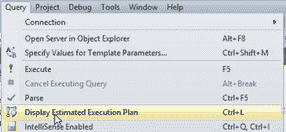
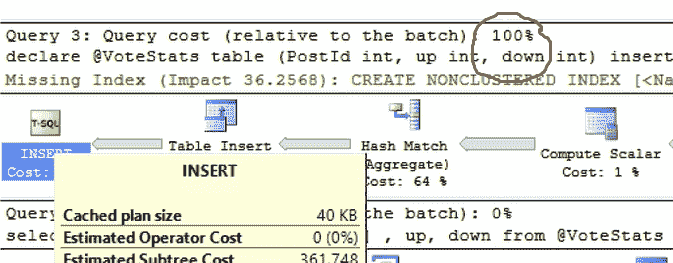
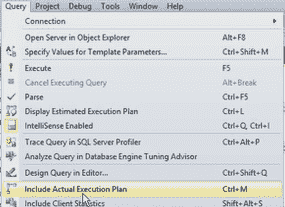
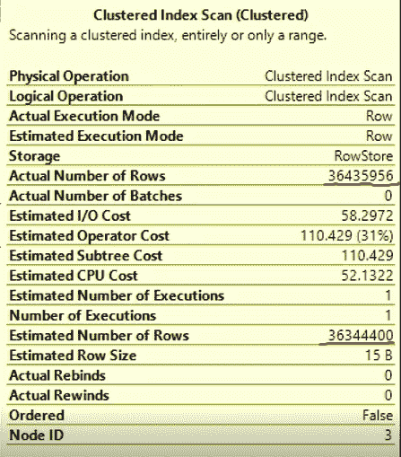
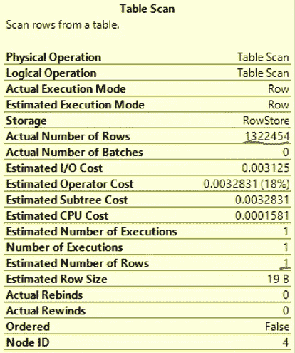
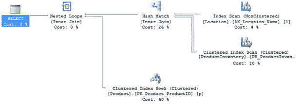
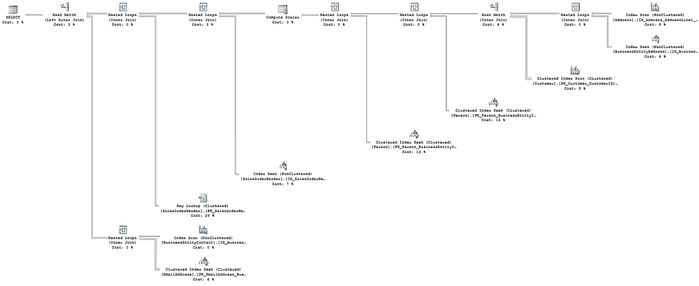
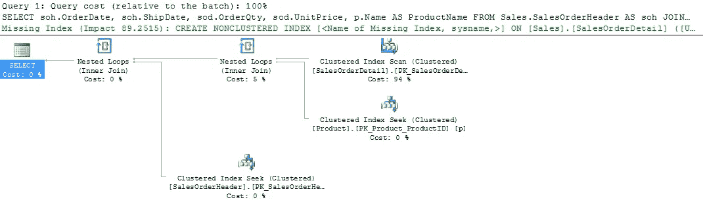
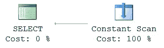

# SQL Server 中的执行计划

> 原文：<https://medium.com/hackernoon/execution-plan-in-sql-server-4a8857e4542d>


[礼遇](http://blog.teamtreehouse.com/working-in-a-flat-company)

优化查询的第一步是查看它的执行计划。执行计划是由[数据库](https://hackernoon.com/tagged/database)引擎执行的操作的可视化表示，以便返回查询所需的数据。

查询的执行计划是您对 [SQL](https://hackernoon.com/tagged/sql) 服务器查询优化器和查询引擎的看法。它将揭示查询使用了哪些**对象，例如:**

*   桌子
*   指数
*   等等。

使用类型:

*   以什么顺序
*   它们是如何被访问的(查找或扫描)
*   连接的类型
*   数据量
*   过滤
*   整理
*   聚集
*   计算列派生
*   外键访问
*   等等。

以及如何使用它们。

有 3 种类型的执行计划:

*   估计的
*   实际的
*   藏起

# 预计执行计划:

要获取查询的估计执行计划，请执行以下操作:

*   切换到相关的数据库
*   突出显示相关的查询
*   点击**查询**
*   点击**显示预计执行计划**



这种方法的快捷方式是 Ctrl+ L。当您得到这个计划时，查询的某些部分可能会显示很高的成本百分比。



请记住，这只是一个估计，很多时候，我们所看到的最昂贵的部分是最便宜或最便宜的。

顺便说一下，执行计划中的每个符号都是一个操作符，每个操作符的属性中都有额外的信息来定义该操作符执行的工作。

# 实际执行计划:

要获得查询的实际执行计划:

*   切换到相关的数据库
*   突出显示相关的查询
*   点击**查询**
*   点击**包含实际执行计划**



这种方法的快捷方式是 Ctrl+ M。其中一个查询给出了实际的执行计划。



看看实际和估计的数字，看起来估计已经足够好了。另一个查询给出了这个执行计划:



看起来估计值和实际值相差甚远。

这证明了**实际的执行计划总是比估计的好**。顺便说一下，我们从左到右，从上到下阅读执行计划。

预计的前端成本百分比**仍为预计值**。因此，为了调优查询，看起来我们需要逐个检查每个块。这看起来很痛苦。这就是第三种类型的执行计划出现的地方——**缓存执行计划**。

# 缓存的执行计划:

有一个[免费的实用工具](http://xameeramir.github.io/BlitzKrieg-SQL-Server-diagnosis/)可以找出我们实际需要调优的查询。只需点击[http://www.brentozar.com/blitzcache](http://www.brentozar.com/blitzcache)并抓取`sp_BlitzCache`。

执行这个`EXEC sp_BlitzCache @top=10, @sort_order='duration'`就行了。该查询将给出执行时间最多的前 10 个查询。在一个列中，它还显示了可能的问题，如缺少索引、下级基数估计和在**警告**列中的隐式转换。在**查询计划**栏中，给出了实际执行计划图链接，可以点击。

# 查询优化:

执行计划的最大用途是查询调优。这是了解您想要调优的内容的最常用工具。这对于识别和修复性能不佳的代码是无价的。在这里，我不能一一列举导致查询性能低下的所有潜在原因，甚至不能说得很接近，但是我们可以简要地看一下几个常见的罪魁祸首以及您将在执行计划中发现的警告信号。

**设计不佳的查询**

与任何语言一样，T-SQL 中也有共同的代码味道。我将列出其中的一些，以及您可能在执行计划中看到的内容。

**带功能的搜索条件**

将函数放在`ON`、`HAVING`或`WHERE`子句(例如`WHERE SomeFunction(Column) = @Value )`中的列上可能会导致非常差的性能，因为它会导致谓词不可搜索，这意味着 SQL Server 无法在索引查找操作中使用它。相反，它将被强制读取整个表或索引。在执行计划中，针对您希望进行查找操作的表或索引，寻找扫描运算符，即索引中的一个或一小组查找。

**嵌套视图**

拥有一个调用其他视图或者对其他视图进行`JOIN`操作的视图会导致非常差的性能。查询优化器经历了一个称为简化的过程，在这个过程中，它试图消除查询不需要的表，以帮助提高查询速度。对于涉及视图或函数的简单查询，优化器将简单地访问底层的基表，并以通常的方式执行表消除。但是，使用嵌套视图和函数将很快导致 SQL Server 中非常复杂的查询，即使该查询在 T-SQL 代码中看起来很简单。问题是，超过某一点，SQL Server 就不能执行通常的简化过程，您将最终得到大型复杂的计划，其中许多操作符不止一次地引用这些表，从而导致不必要的工作。

**不正确的数据类型使用**

当然，要做到这一点，它必须对列应用转换函数，在`ON`、`HAVING`或`WHERE`子句中，我们又回到了有一个不可搜索的谓词的情况，导致在应该看到搜索的地方进行扫描。您还可能会看到一条警告，指示正在进行隐式转换。

**逐行处理**

逐行方法通过游标表达，有时表现为`WHILE`循环，这通常会导致极差的性能。在这种情况下，您将看到循环的每次传递都有一个计划，而不是一个执行计划，SQL Server 实际上是一遍又一遍地生成相同的计划来处理每一行。

# 执行计划中的常见警告标志

**警告**

这些是叠加在运算符上的红叉或黄色感叹号。有时会出现误报，但大多数情况下，这表明存在需要调查的问题。高成本运营—运营成本是估计值，而不是实际值，但它们是提供给我们的一个数字，因此我们将使用它们。成本最高的操作通常是从哪里开始故障排除的指示

**粗管**

在执行计划中，将一个操作符连接到下一个操作符的箭头称为管道，代表数据流。粗管道表示正在处理大量数据。当然，如果查询只需处理大量数据，这是不可避免的，但这通常表明存在问题。注意从非常粗的管道到非常细的管道的过渡，这表明后期过滤以及可能需要不同的索引。从非常细的管道到粗管道的转换表明数据的倍增，即 T-SQL 中的一些操作导致越来越多的数据生成。

**额外运算符**

随着时间的推移，你会开始认识操作员，并很快理解每个人在做什么以及为什么。任何时候，当你看到一个操作符，而你不明白它是什么，或者，你不明白它为什么在那里，那么这就是一个潜在问题的标志。

**扫描**

我们一直这么说，扫描不一定是件坏事。它们只是索引或表扫描的指示。如果您的查询是`SELECT * FROM TableName`，没有`WHERE`子句，那么扫描是检索该数据的最佳方式。在其他情况下，扫描可能表明存在问题，比如隐式数据转换，或者在`WHERE`子句中的列上的函数。

让我们来看看可能出现的一些警告信号，以及我们可以做些什么来应对。

```
**DECLARE** @LocationName **AS** **NVARCHAR**(50);

**SET** @LocationName = 'Paint';

**SELECT**  **p**.**Name** **AS** ProductName ,
        **pi**.Shelf ,
        **l**.**Name** **AS** LocationName
**FROM**    Production.Product **AS** **p**
        **JOIN** Production.ProductInventory **AS** **pi** **ON** **pi**.ProductID = **p**.ProductID
        **JOIN** Production.Location **AS** **l** **ON** **l**.LocationID = **pi**.LocationID
**WHERE**   **LTRIM**(**RTRIM**(**l**.**Name**)) = @LocationName;
GO
```



这些问题如下:

1.  在`Location.Name`列上的索引扫描——在该列上有一个索引，在`WHERE`子句中，预期会有一次寻道——cul rit:`LTRIM(RTRIM(l.Name))`
2.  从 ProductInventory 表上的聚集索引扫描出来的粗管道—在本例中，它在这个阶段处理 1000 多行，最终只返回 9 行。—罪魁祸首:列中缺少索引。
3.  散列匹配连接——对于返回的行数，我期望是嵌套循环连接——问题:错误的或丢失的索引。

**分度不良**

在一些执行计划的顶部，您甚至可以看到一个明确的 **Missing Index** 建议，这表明优化器认识到，如果它有某个索引，它可能会提出一个更好的计划。注意这些，但不要认为它们是准确的。在应用它们之前进行测试。

**嵌套视图**

视图只是一个查询，优化器会像处理任何其他查询一样处理它。但是，如果您决定将一个视图联接到另一个视图，或者将视图嵌套在另一个视图中，就会给 SQL Server 带来问题。首先，随着被引用对象数量的增加，由于深度嵌套，优化器(它只有这么多时间来尝试优化查询)将放弃简化，只为定义的对象构建一个查询。对于每个对象，优化器必须估计返回的行数，并基于此估计用于返回这些行的最有效的操作。然而，一旦我们在模糊处理上超过了三个级别，优化器就会停止分配成本，并假设只返回一行。所有这些都会导致糟糕的计划选择和大量可避免的工作。

为了说明嵌套视图如何损害服务器，请考虑以下情况:

```
**SELECT**  pa.PersonName,
        pa.City,
        cea.EmailAddress,
        cs.DueDate
**FROM**    dbo.PersonAddress **AS** pa
**JOIN**    dbo.CustomerSales **AS** cs
        **ON** cs.CustomerPersonID = pa.PersonID
**LEFT** **JOIN** dbo.ContactEmailAddress **AS** cea
        **ON** cea.ContactPersonID = pa.PersonID
**WHERE**   pa.City = 'Redmond';
```

所有 3 个引用的对象都是视图。执行计划会如此复杂:



上述查询的简化可以通过实际访问底层表来完成，如下所示:

```
**SELECT**  **p**.LastName + ', ' + **p**.FirstName **AS** PersonName ,
        a.City ,
        ea.EmailAddress ,
        soh.DueDate
**FROM**    Person.Person **AS** **p**
        **JOIN** Person.EmailAddress **AS** ea
              **ON** ea.BusinessEntityID = **p**.BusinessEntityID
        **JOIN** Person.BusinessEntityAddress **AS** bea
              **ON** bea.BusinessEntityID = **p**.BusinessEntityID
        **JOIN** Person.Address **AS** a
              **ON** a.AddressID = bea.AddressID
        **LEFT** **JOIN** Person.BusinessEntityContact **AS** bec
              **ON** bec.PersonID = **p**.BusinessEntityID
        **JOIN** Sales.Customer **AS** **c**
              **ON** **c**.PersonID = **p**.BusinessEntityID
        **JOIN** Sales.SalesOrderHeader **AS** soh
              **ON** soh.CustomerID = **c**.CustomerID
**WHERE**   a.City = 'Redmond';
```

执行计划现在简化了很多:


**缺乏数据库约束**

考虑以下查询:

```
**SELECT**  soh.OrderDate ,
        soh.ShipDate ,
        sod.OrderQty ,
        sod.UnitPrice ,
        **p**.**Name** **AS** ProductName
**FROM**    Sales.SalesOrderHeader **AS** soh
        **JOIN** Sales.SalesOrderDetail **AS** sod
              **ON** sod.SalesOrderID = soh.SalesOrderID
        **JOIN** Production.Product **AS** **p** 
              **ON** **p**.ProductID = sod.ProductID
**WHERE**   **p**.**Name** = 'Water Bottle - 30 oz.'
        **AND** sod.UnitPrice < $0.0;
```

如果没有约束，该查询的执行计划将如下所示:



该查询返回零行，因为没有价格低于$0 的产品，但 SQL Server 仍然执行一次索引扫描、两次索引搜索和几个嵌套循环联接。原因是它无法知道查询将返回零行。

但是，如果我们在 SalesOrderDetail 表上设置了一个约束，要求任何行的单价都必须大于零(该约束已经存在于 AdventureWorks 数据库中)，该怎么办呢？

```
**ALTER** **TABLE** Sales.SalesOrderDetail  **WITH** **CHECK**
  **ADD**  **CONSTRAINT** CK_SalesOrderDetail_UnitPrice **CHECK**  ((UnitPrice>=(0.00)));
```

如果我们带着这个约束重新运行上面的代码，那么执行计划是有趣的:



**缺失或过期的数据库统计**

可以通过以下命令关闭或打开统计信息:

```
**SET** AUTO_UPDATE_STATISTICS **OFF** | **ON**;
```

建议不要关闭它们，以免统计数据过时。

**也许不是数据库的问题？**

也有可能数据库不是罪魁祸首，应用程序会导致性能问题。因此，也要分析应用程序代码。

**来源:**

*   [执行计划的好处](https://www.simple-talk.com/sql/performance/why-developers-need-to-understand-execution-plans)
*   [执行计划的类型](https://www.youtube.com/watch?v=XKghrpVSbc0)
*   [照片](https://goo.gl/photos/jJ1Da5nMAUMmCZr87)