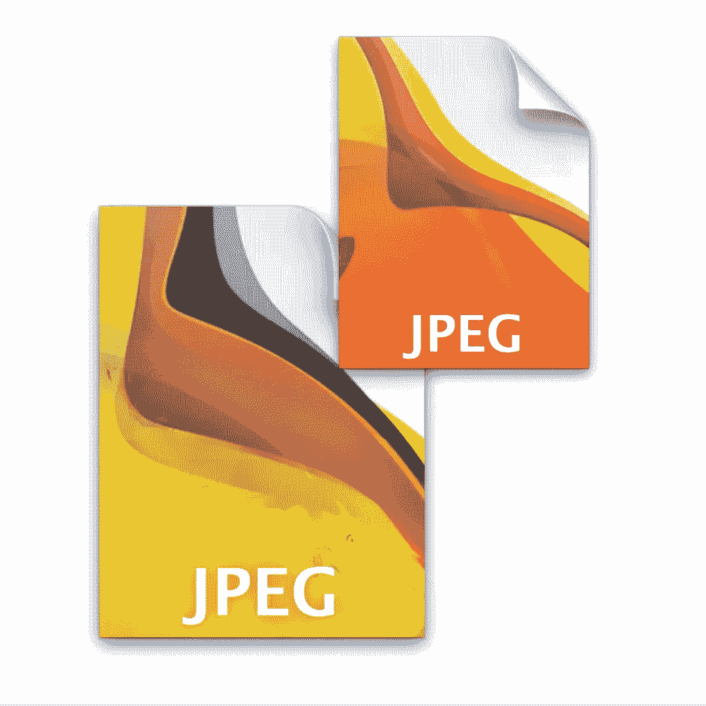
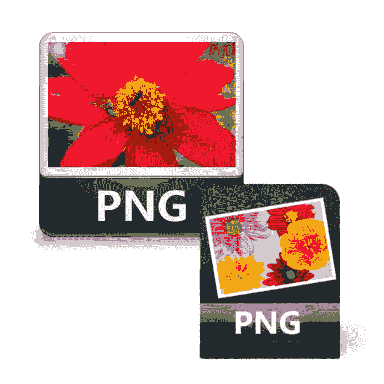

# 体验与浏览:优化你的 WordPress 网站的初学者指南

> 原文：<https://medium.com/hackernoon/experience-vs-browsing-beginners-guide-to-optimizing-your-wordpress-website-b8897f7e0b0c>

如果你已经读过我最近三篇博客中的一篇，你现在可能对[有了更多的了解，并且你愿意为你的小企业创建一个令人惊叹的网站。](https://hackernoon.com/tagged/wordpress)

这些是我最近写的主题:

[WordPress 是小型企业的完美解决方案](http://www.avalon.host/blog/why-is-wordpress-a-perfect-solution-for-your-small-business/)

[为什么选择 WordPress 而不是免费的 DIY 建站平台](http://www.avalon.host/blog/diy-website-builder-platform-pitfall-small-businesses/)

【WordPress 如何成为任何类型商业的多功能平台

今天，我想向你解释如何为你的 WordPress 网站使用图片，以便用最漂亮的方式展示你的业务。

## 为什么高质量的图像在今天如此重要？

如今，新的智能手机、笔记本电脑和平板电脑针对高像素图像进行了优化，呈现清晰的可视性，而不会出现任何模糊现象。信不信由你，人们的确是根据你在网站上展示的图片来评判你的，所以在建立网站时要考虑的一件事就是如何包含优化的图片。

模糊和像素化的图像对任何人都没有好处。如果你投资你的网站而不考虑形象，你投入的努力和金钱不会带来多大的成功。使用适当优化的照片肯定有助于转换。记住一件非常重要的事情:

## 人们想把时间花在体验而不是浏览上！

他们对情绪化的、有趣的、创造性的和有趣的图像做出反应。但是，如果你的超级酷的形象没有针对今天反应灵敏的智能手机、笔记本电脑和平板电脑进行优化，所有这些都将付诸东流。

那么，如何在你的网站上创造一个[体验](https://hackernoon.com/tagged/experience)？

首先，给你的图片赋予人情味。做机器人不再受欢迎。此外，你可以开始跳出框框思考，但在此之前，还有其他事情要考虑。

## 如何准备你的图像？

你可以在 WordPress 上使用 3 种类型的图片:

如果您在 **JPG** 中保存照片，它们将与移除的细节一起保存(压缩)，但您可以使用一些照片编辑器来控制移除多少细节。如果你仔细地这样做，并在网页上使用这些照片之前检查最终结果，这可以为你提供精细的照片和小文件大小。

## PNG

我最喜欢的是 **PNG** ，因为它可以让你使用高分辨率的照片，而不会丢失任何细节。然而，PNG 的缺点是它包含了更大的文件大小，并且它可以在新的浏览器上看到，但不能在旧的浏览器上看到。

## GIF 格式

GIF 适用于颜色有限的线条艺术(标志),它会在你的网页上看起来很可爱，并且会给它一种呼吸的能量。然而，它的最大调色板是 256 色，所以在大多数情况下，gif 看起来像一个低分辨率，像素化的照片。

## 向量

矢量图像可根据各种设备所需的分辨率轻松编辑。此外，可以添加或删除其他单个元素，而不会干扰图像中已经存在的对象。更不用说文件大小了，非常小。然而，你不能拍摄矢量，它们必须由艺术家和插画师创作。

## 使用哪种图像优化器？

为了避免降低你网站的速度，最好在上传图片到 WordPress 之前压缩它们。有几种不同的在线工具可以帮助你立刻做到这一点。今天我为你选了 8 个:

[IPI ccy](http://ipiccy.com/)——一个奇妙的图片编辑器，有定制图片的选项，也有编辑、过滤和设计的选项。类似于 Photoshop，但是没有 Photoshop 的重要功能。非常适合日常编辑。

JPEG-optimizer—这个工具可以轻松压缩你的图像，但是不要指望任何编辑

Riot —一个免费的编辑程序，你需要下载到你的电脑上。它可以帮助您直观地调整压缩参数，并保持最小的文件大小。一点也不差。

[TinyPng](https://tinypng.com/) —通过轻松压缩巨大的 Png 文件，让自己的网站运行更快的智能解决方案。还有，试试类似的，WordPress Image Shrinker。
[Compressor.io](https://compressor.io/compress) —一款在线工具，用于压缩大型图像而不损失高质量。

## 2016 年最佳 WordPress 插件

现在你已经准备好了，在你的 WordPress 网站上增加额外的功能是必须的。因此，你可能会为你的网站寻找几个插件选项。虽然有成吨的选择，但了解你可能需要什么是有好处的。

为了创建令人惊叹的响应图像和视频库，我推荐的是 T2 环境库。它将帮助你将社交媒体按钮整合到你的 WordPress 网站中，轻松组织照片，并使你的图片库 SEO 友好。

我假设你希望你的网站**在讨论社区产生评论**。因此 [Disqus 评论系统](https://wordpress.org/plugins/disqus-comment-system/)是适合你的。这是一个用户友好的内容插件，可以在你的 WordPress 网站上发表评论。这将有助于您与整个讨论社区的评论者建立联系，并使评论更具互动性。

不过对于电子邮件营销来说，WordPress 网站的一个推荐插件肯定是 Rapidology。它是免费的，可以帮助你创建漂亮的电子邮件选择表单、弹出窗口和小部件，而不需要任何编码技能。

查看 2016 年最好的 WordPress 插件[这里](http://www.wpbeginner.com/showcase/24-must-have-wordpress-plugins-for-business-websites/)，以及 2016 年最重要的[网页设计趋势](http://www.avalon.host/blog/most-important-web-design-trends-for-2016/)，由 Avalon 工作人员撰写。现在您已经准备好了，您所需要做的就是[联系我们](http://www.avalon.host/)来帮助您建立镇上最好的托管服务！

*本文原载于* [*阿瓦隆博客*](http://www.avalon.host/blog/experience-vs-browsing-beginners-guide-optimizing-wordpress-website/) *。*

> [黑客中午](http://bit.ly/Hackernoon)是黑客如何开始他们的下午。我们是这个家庭的一员。我们现在[接受投稿](http://bit.ly/hackernoonsubmission)并乐意[讨论广告&赞助](mailto:partners@amipublications.com)机会。
> 
> 如果你喜欢这个故事，我们推荐你阅读我们的[最新科技故事](http://bit.ly/hackernoonlatestt)和[趋势科技故事](https://hackernoon.com/trending)。直到下一次，不要把世界的现实想当然！

