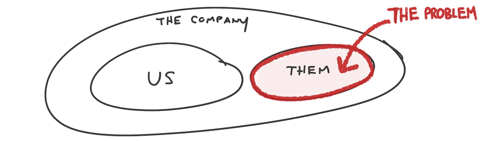
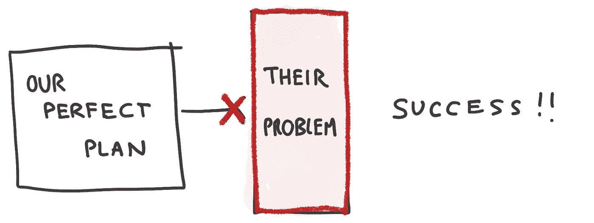
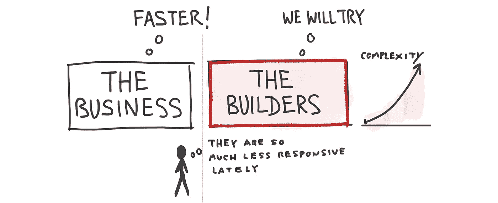
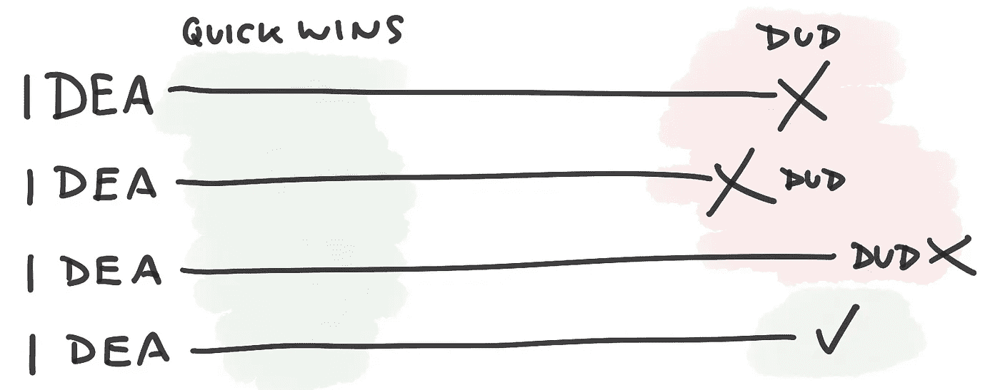
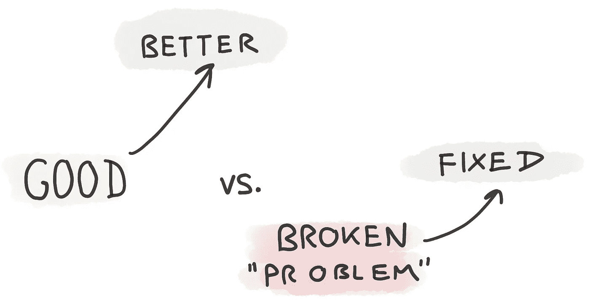

# 一起实验。共同提高。一起赢

> 原文：<https://medium.com/hackernoon/experiment-together-improve-together-win-together-8d353abd2f0f>

您组织中的人会说这样的话吗:

> 如果他们能执行，我们就没事了
> 
> 为什么**他们**移动得这么慢？"
> 
> 为什么**那个团队**不能信守承诺？"

你看到这里的问题了吗？

实际上，这个问题比这更为隐蔽。另一个团队(或部门)阻碍了一定的成功！对吗？

我经常在软件开发团队中看到这种情况。“业务”一直要求*更快*，构建者一直试图取悦(作为忠诚和务实的问题解决者)，复杂性增加，并且突然之间构建者被认为反应迟钝。**信任和信心下降。**

所有增加复杂性的工作…值得吗？它是否产生了预期的投资回报？有人测量过吗？

很有可能，那些完美的计划并不总是完美的。他们造成了“问题”。这是一个大写的“t”团队运动。

退一步讲，我们经常谈到持续改进。但是要非常注意你组织中的潜台词。这是…的情况吗

你看出区别了吗？

你是在传达这样的信息:团队天生就是好的(并期待变得更好)，还是团队天生就有缺陷和问题，只需要修复？

你在找银弹吗？

> 他们只需要 _ _ _ _ _ _ _ _ _ _ _ _ _ _ _ _ _ _
> 
> 要是他们能 _____________ 就好了

如果是这样，你需要努力改变这种思维。你可能造成了这个问题。他们可能需要你的帮助。而且总会有新的问题需要解决。

持续改进的文化就是不断追求更好，以保持竞争力并不断挑战自我。所以我们一起赢*。*

*是的，如果你让业务的一部分陷入困境(或者这部分业务恰好非常复杂和困难)，你可能会遇到瓶颈。瓶颈可能在组织的另一个部分。或者你可能是瓶颈，你只是假设它在别的地方。这其实并不重要。*

*一个以安全为前提的组织，一起试验*，一起改进*，一起赢得*。****