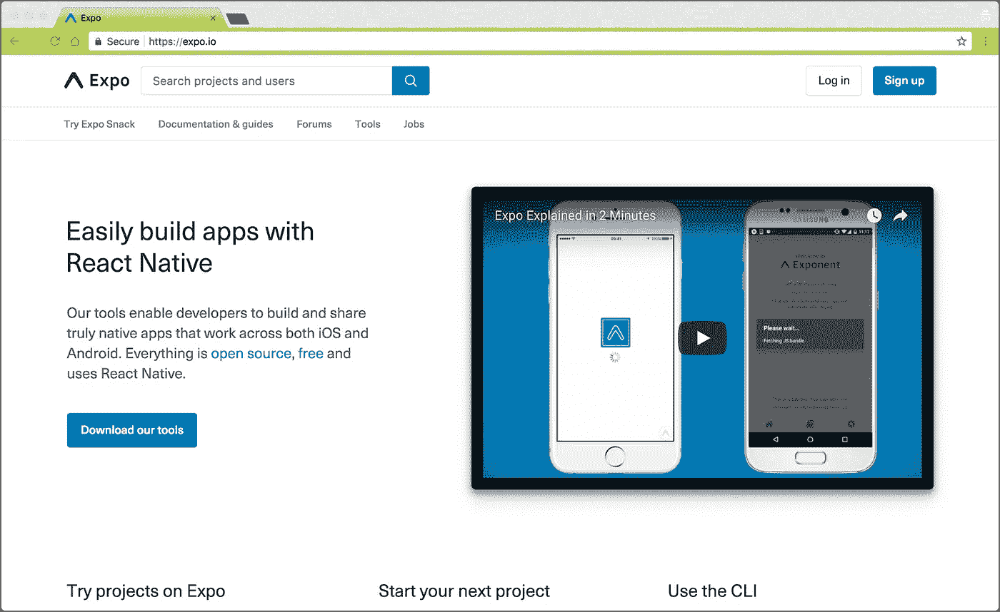
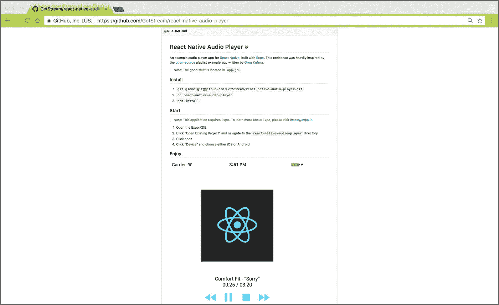

# 试用 React Native & Expo 的音频 API

> 原文：<https://medium.com/hackernoon/experimenting-with-react-native-expos-audio-api-6f13eeb729be>

在这里的 [Stream](https://getstream.io/) ，我们都在探索流行技术的最新趋势。这样做可以让我们的团队更好地了解开源社区正在发生的事情，这个社区是我们公司 DNA 的主要组成部分。

去年，Stream 发布了开源项目 [Winds](https://winds.getstream.io/) ，这是一个由 Stream 支持的聚合和个性化 RSS 阅读器。今年，我们正在进行全面更新(Winds 2.0)，将引入播客支持、增强的社交功能、原生 iOS 和 Android 应用程序等等。因此，我们决定使用 [React Native](https://facebook.github.io/react-native/) 来支持我们的 iOS 和 Android 版本——这一框架将允许我们的开发团队用纯 JavaScript 编写针对多个操作系统的应用程序。为了帮助我们进行 React 本机开发，我们求助于 [Expo](https://expo.io/) ，这是一个包装 React 本机 API 的工具，允许更快、更简化的开发过程。

为了尝试一下，我们通过构建一个简单的概念证明来挑战自己。我们决定用 Expo 强大的[音频 API](https://docs.expo.io/versions/latest/sdk/audio.html) 为 iOS 和 Android 构建一个音频播放器，当然，React Native。概念验证有一些要求(大多数在许多流行/常见的音频播放器中都有):

*   外部 URL 支持(针对音频文件)
*   播放/暂停
*   跳过/查找
*   当前位置
*   速度控制(慢速和快速)
*   肖像支架
*   音频背景

从技术角度来看，所有这些都是可行的；但是，最新的 Expo SDK(目前为 v20.0.0)尚不支持背景音频。我们在 Twitter 上联系了世博会团队，他们回复说他们正在积极为我们提供急需的音频背景支持——这被证明是一项相当困难的工作——并且他们将在继续取得进展的同时让我们保持联系。

即使没有这个功能，我们也对我们的概念验证的结果非常满意。如果没有 React Native 和 Expo 的帮助，我们将无法在我们分配的时间范围内针对多个操作系统，我们将不得不使用两个独立的代码库。通过实验和建立一个全功能的概念验证，我们现在离 Winds 2.0 更近了一步，并且非常高兴地宣布代码在 [**GitHub**](https://github.com/getstream/react-native-audio-player) 上 **100%开源。**

如果您有任何建议、评论或补充，请在下面发帖或在 GitHub 上提交 PR(我们支持开源，绝对喜欢看到来自社区的贡献)。如果你是新的流媒体用户，并且对我们的托管、可扩展的 feed 技术感兴趣，请查看我们在流媒体网站上的 [5 分钟教程，了解事情是如何工作的！](https://getstream.io/get_started)