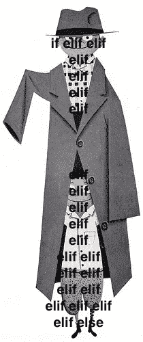

# 专家艾透露，一件风衣里堆了 100 万个 If-Else 语句

> 原文：<https://medium.com/hackernoon/expert-ai-revealed-to-be-1-000-000-if-else-statements-stacked-in-a-trenchcoat-898e59ce8efc>

让那些在国际象棋比赛中与他聊天的人感到非常震惊的是，专家系统 Eli F .最近被发现是一百万个 if-else 语句在一件风衣中堆叠在一起。

“起初，事情像往常一样进行得非常顺利——我们对最近的一场比赛进行了非常有趣的讨论，”大师卢克·金在谈到他与伊莱的最后一次对话时说。“但我问他天气后，他打了个喷嚏，立马瘫倒在地上一堆布料里。当我走近一看，我意识到外套上渗出的奇怪斑点是一个巨大级联 if 语句的分散残余。”

金停顿了一下，沉思着。“老实说，当伊莱第 42 次对我说‘对不起，我不明白’的时候，我就应该明白了。”