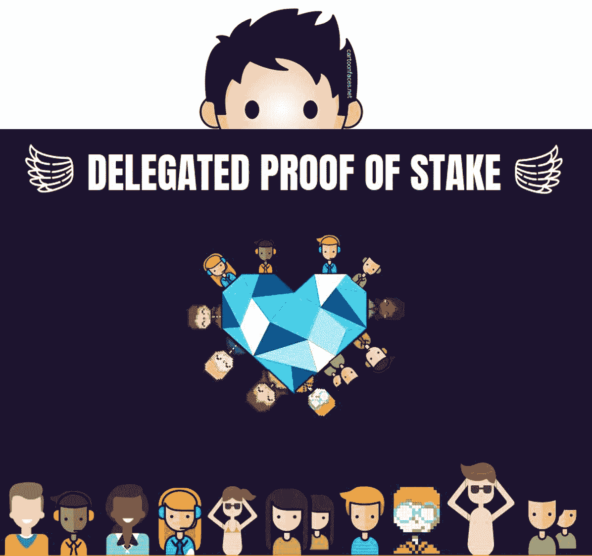
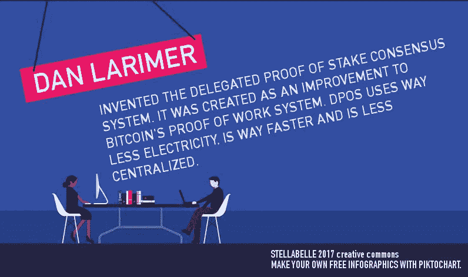
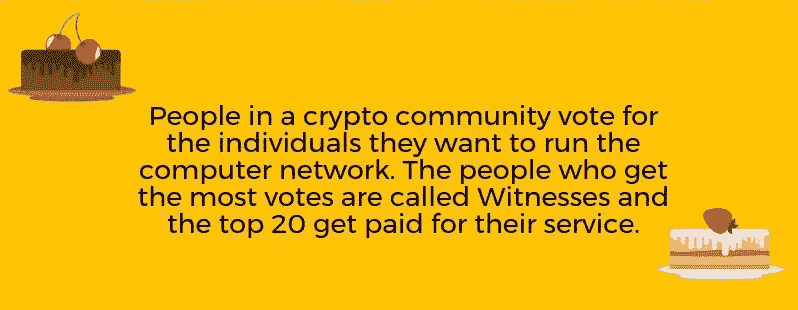
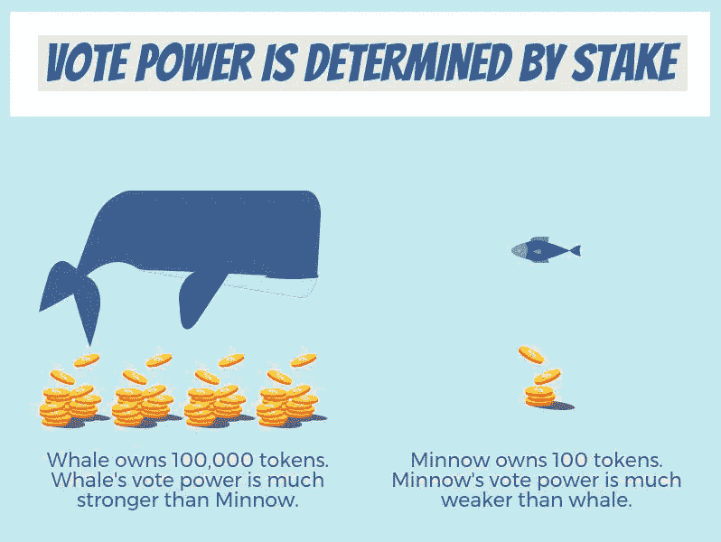

# 像我 5 岁时一样解释授权证明

> 原文：<https://medium.com/hackernoon/explain-delegated-proof-of-stake-like-im-5-888b2a74897d>

我喜欢把*授权证明*视为技术民主。想想世界上有多少混蛋老板。你曾经想要一个系统，在这个系统中，你，一个雇员，可以解雇你自己不称职的老板吗？嗯，有一个新的系统，非常接近于雇员解雇他们自己的经理的现实。它叫做*委托股权证明*。

如果你在比特币兔子洞里呆过一段时间，你可能会遇到这些术语*工作证明、股份证明、重要性证明*或其他*共识算法*。但是你猜怎么着，我在这篇文章里不打算用*算法*或者*共识*这样的词。我将尝试解释什么是*委托利益证明* (DPOS)，以使任何人，甚至是 5 岁的孩子都能理解。

# 为什么要发明授权证明？

一位名叫丹尼尔·拉里默的区块链工程师意识到比特币挖矿太浪费能源了。他还认识到，比特币开采将在未来变得集中化，巨型矿池将控制比特币网络。此外，他希望构建一个能够达到每秒 100，000 次交易速度的系统。比特币的系统由于其设计方式和使用的系统太慢:*工作证明。他决定发明并建造一个新的系统，这个系统能耗极低，速度快如闪电，而且非常安全。丹将这个新系统命名为*委托股权证明*，或者 *DPOS* 。*

# DPOS 的配料是什么？

一种加密货币，一个区块链，一个由人、计算机和规则组成的社区。

*(下面的例子摘自 Steem 区块链)*

## 特定加密货币社区的人们投票选举证人，以保护他们的计算机网络。

## 只有前 100 名证人的服务有报酬。前 20 名收入稳定。因为很多人想成为证人，所以有数百名后备证人。

## 人们的投票强度取决于他们持有多少代币。这意味着令牌多的人比令牌少的人对网络的影响更大。

## 随着社区的发展，由于竞争的加剧，成为付费证人变得越来越难。

## 如果一个证人开始表现得像个混蛋，或者停止做保护网络的优质工作，社区中的人可以取消他们的投票，实质上就是解雇这个坏演员。投票一直在进行。

这一体系之所以有效，是因为它能够淘汰不良行为者，同时发现新的有价值的成员。该系统依赖于社区中的积极选民，因此教育新成员关于该系统如何工作对于该系统的良好运行至关重要。我在 Steem 社区已经呆了一年多，我看到目击者根据他们的行为和名声来来去去。

下面的链接包含了对*利益委托证明*的更深入的描述，供那些想更深入了解它的人参考。

## 当前使用授权股权证明的加密货币项目:

**BitShares:**【https://bitshares.org/】T4

**斯蒂姆:**[https://steem.io/](https://steem.io/)

**EOS**:[https://eos.io/](https://eos.io/)

**利斯克:**https://lisk.io/

**方舟:**https://ark.io/

## 一段解释 DPOS 的视频:

## 更多阅读资料和来源:

***丹·拉里默 2014 年发明了 DPOS***:[https://bitcointalk.org/index.php?topic=558316.0](https://bitcointalk.org/index.php?topic=558316.0)

***DPOS 诉战俘，作者丹·拉里默***:[http://byte master . github . io/bit shares/2015/01/04/Delegated-Proof-of-stage-vs-Proof-of-Work/](http://bytemaster.github.io/bitshares/2015/01/04/Delegated-Proof-of-Stake-vs-Proof-of-Work/)

***DPOS 更新白皮书作者丹·拉里默***:[https://steemit . com/dpos/@丹瑟曼/dpos-consensus-algorithm-this-missing-white-paper](https://steemit.com/dpos/@dantheman/dpos-consensus-algorithm-this-missing-white-paper)

***http://docs.bitshares.org/bitshares/dpos.html***比特股份

***默克尔:***[https://themerkle.com/what-is-delegated-proof-of-stake/](https://themerkle.com/what-is-delegated-proof-of-stake/)

***关于丹尼尔·拉里默的事实，委托股权证明的发明者:***[https://steemit . com/eosio/@ xeroc/historical-Facts-about-Daniel-Larimer-and-his-contributions-to-the-the-Japan-industry](https://steemit.com/eosio/@xeroc/historical-facts-about-daniel-larimer-and-his-contributions-to-the-blockchain-industry)

***不同共识算法概述:***[https://blog . waves platform . com/review-of-区块链共识机制-f575afae38f2](https://blog.wavesplatform.com/review-of-blockchain-consensus-mechanisms-f575afae38f2)

***关于作者:***

2015 年，Stellabelle 在亚马逊上出版了她的第一本书 [Un-Crap Your Life](https://www.amazon.com/Crap-Your-Life-Navigating-Situations-ebook/dp/B017PBLZPA) 。