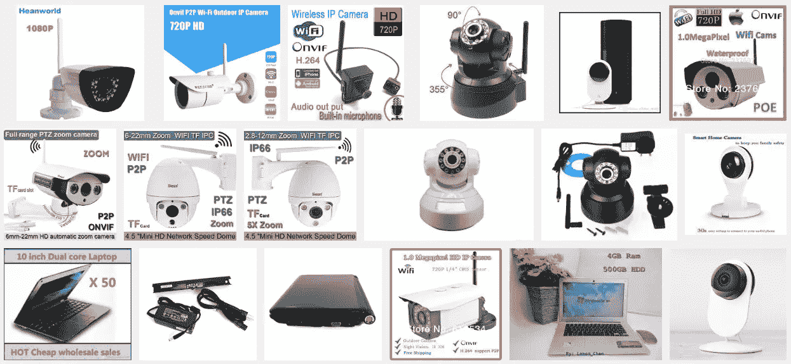

# iPhone 如何导致今天的互联网中断

> 原文：<https://medium.com/hackernoon/explaining-the-ddos-problem-its-origins-as-simply-as-i-can-8a87f7af9ea3>

One of these may have helped take down Twitter.

## 尽可能简单地解释 DDoS 问题及其起源

你可能已经注意到今天的互联网有点坏。我认为这一事件将成为一个大事件，可能会作为拒绝服务攻击而被记住，这导致了监管和更多。

通过 iMessage 讨论，一个不关注互联网[安全](https://hackernoon.com/tagged/security)(就像，你知道，正常人)的朋友让我用英语解释以上内容。我没有时间去润色它，但是我可以看到它对其他人有所帮助。所以我大致是这样写的:

1.  iPhone 发布了，Android 紧随其后，智能手机成为了*的*业务。在不到 10 年的时间里，全球大约 30%的人拥有智能手机。制造带有摄像头、中央处理器、无线网络、陀螺仪、触摸屏、电池等小设备所产生的资金数量令人难以置信。
2.  对智能手机的需求使得其零部件成本大幅下降。在中国有大量的建筑，里面装满了一箱箱的组件，设计师们可以用便宜的价格买到这些组件，然后设计出一个新的玩具。这就是为什么几乎所有的新设备类别基本上都是重新组装的智能手机内脏:动作相机、健身追踪器、无人机、悬浮板、网络摄像头等等。它们都很丰富且价格合理，因为智能手机正在为它们的部件集体付费。
3.  中国的设计师、工程师和工厂不断迭代这些产品。这是一个有机的环境，就像硅谷玩软件一样玩硬件。当一个人在预算有限的情况下快速构思、设计、生产和运输硬件时，他通常不会花时间去测试、保护或 QA 任何东西。请参见:爆炸悬浮滑板。这是另一种降低成本的方法。
4.  现在，全世界有数以亿计的这种廉价设备，可笑的是，这些设备安全措施不足，却连上了互联网。发货的公司中没有一家想要(或能够)修理它们。(对他们中的许多人来说，这种不安全感已经融入了固件中。)
5.  僵尸网络制造者没有错过这个机会。他们开发了简单的黑客技术来远程控制数百万台设备，尤其是网络摄像头和路由器。这些设备是僵尸网络的完美之选，因为它们一直在线并被广泛采用。
6.  最近，来自这些僵尸网络的攻击已经开始达到临界极限，产生了分布式拒绝服务攻击(其中大量设备尽可能快地攻击同一网站或服务，使其不堪重负)，这是比他们过去见过的攻击更大的因素。
7.  这种实力的飞跃打破了攻击者和安全公司之间针锋相对的交流。安全之神 Bruce Schneier(我一直在抄袭他的最后几发子弹。[念他](http://motherboard.vice.com/read/we-need-to-save-the-internet-from-the-internet-of-things)！)写道，“基本上，这是一个大小与大小的游戏。如果攻击者能够拼凑出超出防御者应对能力的大量数据，他们就赢了。如果防守方在面对进攻时能够提高自己的能力，他们就赢了。”由智能手机零件补贴的工厂的大规模产量，与不知情的买家组成的全球市场相连，打破了这种有利于攻击者的平衡。
8.  作为一种对付不理想媒体的工具，它已经产生了问题。安全记者 Brian Krebs 的网站遭到攻击，大型 Akamai(T2 的云主机提供商之一)[将他踢出了他们的服务器](http://www.businessinsider.com/akamai-brian-krebs-ddos-attack-2016-9?op=1)。谷歌拯救了克雷布斯，免费介入保护克雷布斯。(令人担忧的是， [Krebs 的网站目前完全瘫痪](http://www.businessinsider.com/akamai-brian-krebs-ddos-attack-2016-9?op=1)，可能与当前的攻击有关。)
9.  这些武器不仅威力惊人，而且相对容易获得。考虑到国家支持的团体可能产生的规模，这是令人痛心的。想象一下，这次网络中断影响的不仅仅是东海岸。想象一下选举当天停电。(如果说这种攻击有光明的一面，那就是它在这个问题可能被政治解释之前，建立了一些公众意识。)
10.  这次攻击意义重大，针对的是正确的人(纽约的媒体和 DC 的政客)，以引起政府的注意。因为，可悲的是，重要的监管——既要求设备具备基本的安全功能，又赋予 ISP 黑名单的权力——似乎是解决这一挑战的唯一途径。监管谁和什么可以连接到互联网似乎是必要的，但设置了一个令人担忧的预设。
11.  简而言之:互联网接入和特定网站的可用性非常脆弱，没有简单的解决办法，解决方案也很糟糕。

然而，Twitter 被网络摄像头关闭具有一定的讽刺意味。

那么是谁在做这件事？最合理也是最可怕的理论再次来自布鲁斯·施奈尔:[一个国家资助的团体正在测试互联网，以了解如何关闭它](https://www.schneier.com/blog/archives/2016/09/someone_is_lear.html)。Krebs(其网站已备份！)，[认为有人在制造疾病来出售治疗方法](https://krebsonsecurity.com/2016/10/spreading-the-ddos-disease-and-selling-the-cure/)。两种都有可能！

(有很多东西我想链接到上面，但现在不能，因为停电。抱歉)

**更新:** [这看起来真的像是针对 Krebs 和 Dyn 公司研究员的仇杀攻击](https://krebsonsecurity.com/2016/10/ddos-on-dyn-impacts-twitter-spotify-reddit/#more-36727)，Dyn 公司是攻击的主要目标。在他们两人发表演讲强调一方的不良做法几个小时后，攻击开始了。

**更新，2016 年 11 月 8 日:**看起来我们已经以一种意想不到的——然而完全*适合*的方式被拯救了。美国大选周，黑客将流量大炮对准了希拉里克林顿(Hillary Clinton)和唐纳德特朗普(Donald Trump)的网站，但都没能干掉。为什么？事实证明这个特殊的僵尸网络太容易进入了。在 10 月 21 日的袭击之后，许多团体注册了同样不安全的设备来投标。具体来说，他们希望僵尸网络攻击各种游戏主机服务器。随着成千上万的用户将同样的交通加农炮对准他们自己的宠物目标，武器的效果变得严重模糊。

一言以蔽之:互联网生活的另一天，因为太多的人想悲痛反恐精英和《我的世界》服务器。你不可能写出一个更恰当的转折。

> [黑客中午](http://bit.ly/Hackernoon)是黑客如何开始他们的下午。我们是 AMI 家庭的一员。我们现在[接受投稿](http://bit.ly/hackernoonsubmission)并乐意[讨论广告&赞助](mailto:partners@amipublications.com)机会。
> 
> 如果你喜欢这个故事，我们推荐你阅读我们的[最新科技故事](http://bit.ly/hackernoonlatestt)和[趋势科技故事](https://hackernoon.com/trending)。直到下一次，不要把世界的现实想当然！

