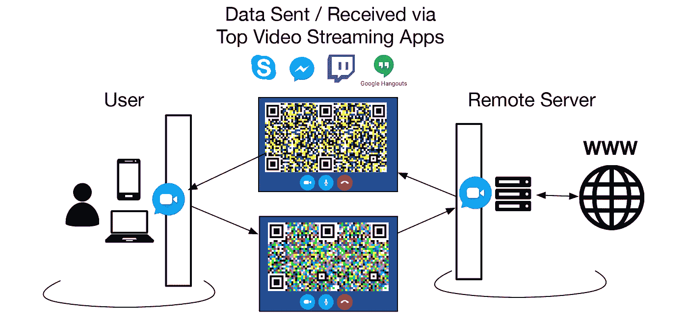
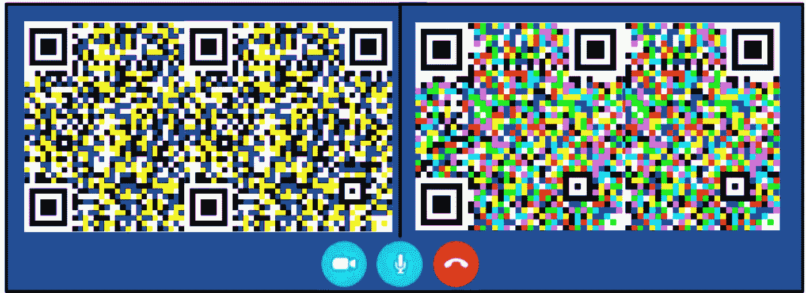
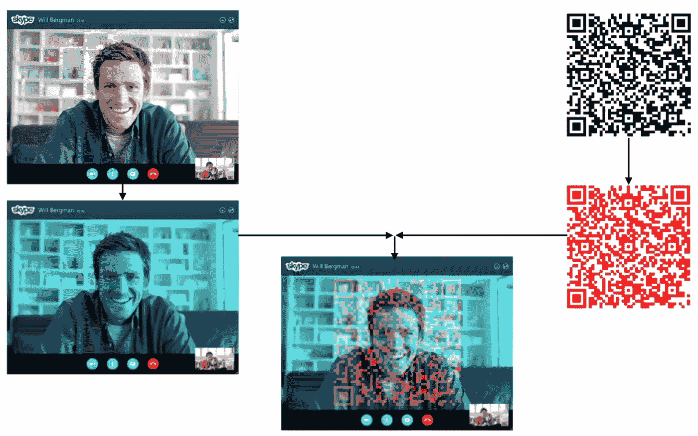
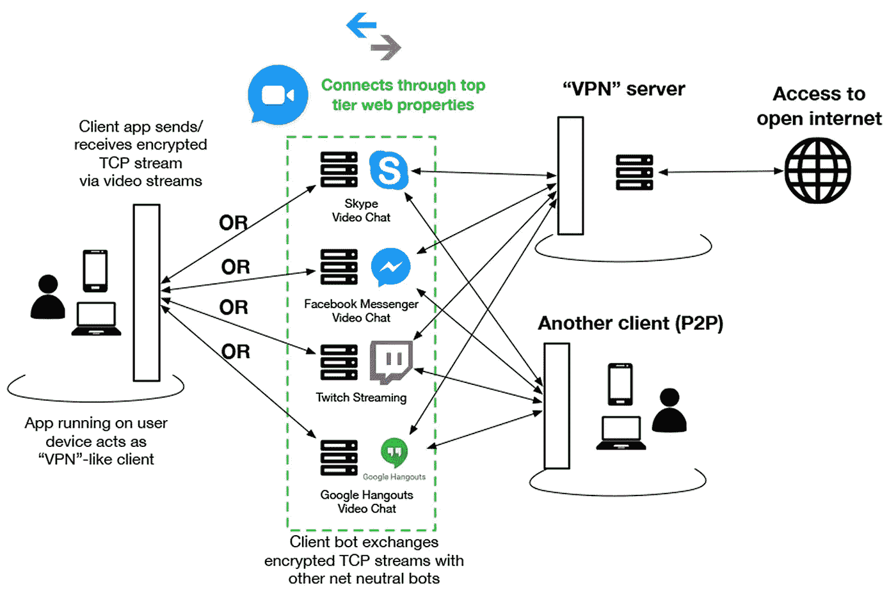
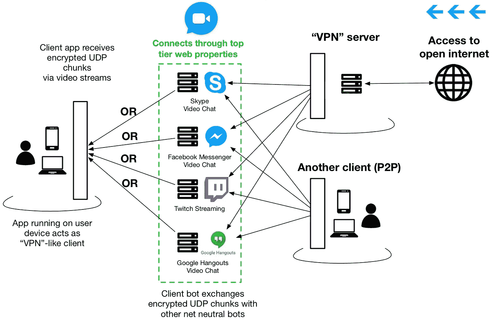
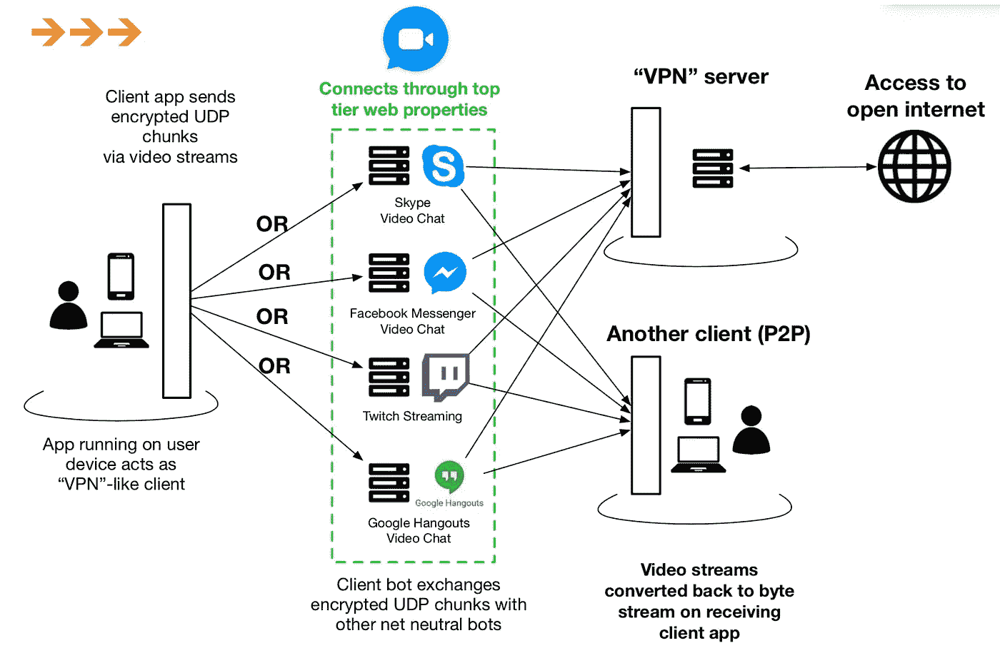
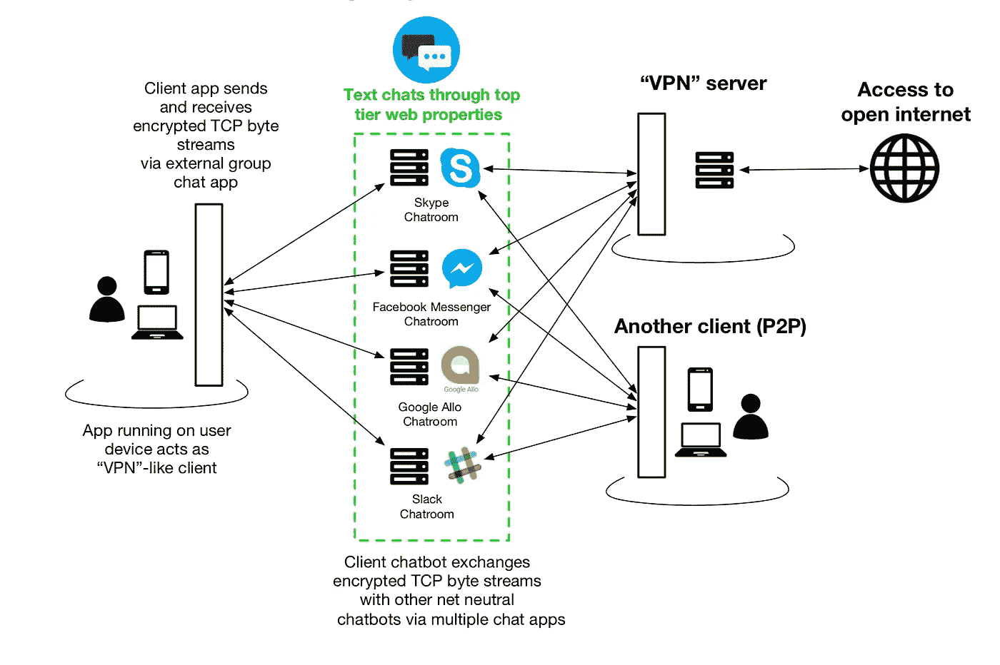
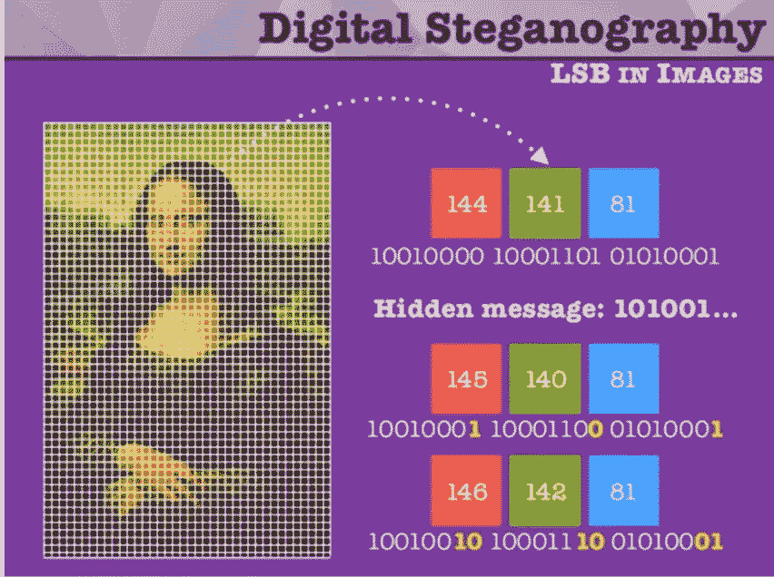
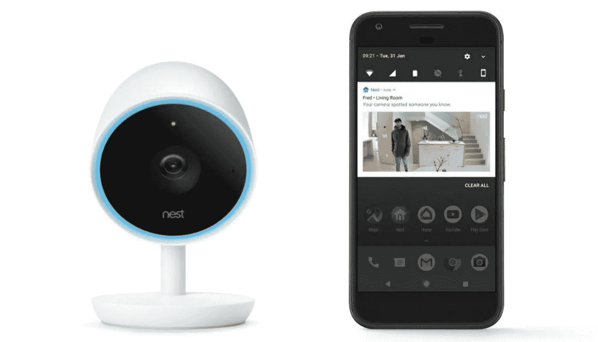
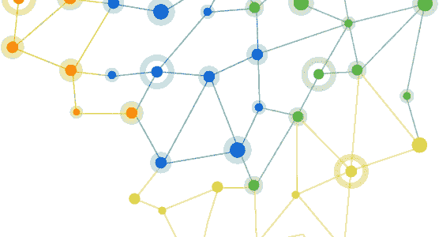

# 利用分层互联网确保网络中立

> 原文：<https://medium.com/hackernoon/exploiting-tiered-internet-to-assure-net-neutrality-17c4743b3850>

An example of routing data through apps like Skype

围绕互联网去中心化有很多讨论，从[区块链](https://hackernoon.com/tagged/blockchain)到 DIY 网状 WiFi。

但是像康卡斯特这样只有一个 ISP 选择的普通美国互联网用户怎么办？建设新的网络需要很长的时间和大量的维护，尤其是在农村的“最后一英里”地区。

> 我提出了一种方法，如果/当 ISP 可以审查、限制或以其他方式阻碍对整个互联网的平等访问时，可以利用分层的互联网视频广播流来确保网络中立性。

Sample data being sent through video frames

视频流是巨大的。从游戏到电话会议和与朋友聊天，视频广播在西方顶级互联网公司中无处不在:Skype(微软)、Twitch(亚马逊)、脸书、[谷歌](https://hackernoon.com/tagged/google)。

在用户电脑或手机上运行的应用程序可以搭载最大的视频广播提供商，以视频形式发送编码数据，并从远程服务器接收解码数据。

关键的一点是，对于康卡斯特这样的互联网服务提供商来说，你所有的数据看起来都是来自和去往谷歌、脸书和其他顶级域名的，因此很难或几乎不可能在不中断这些顶级域名的其他流量的情况下进行节流。

# 以前的案例研究

类似的研究和现实世界的实施已经在这个领域完成，以绕过审查或很少访问互联网。

菲尔·金在 2016 年展示了 *Skor* [关于正在进行的通过 Skype 视频聊天挖掘数据以规避审查的研究](https://dcaps.info/2016-2-19.html)[幻灯片](https://drive.google.com/file/d/0B5mPwitbbHj1ajkyU0JEWC1uOU0/view)。这项技术仍在开发中，需要努力提高产量。我还找不到开源的代码。

Image credit: Skor, by Phil Kim and Dave Levin

另一项在伊朗使用的服务现在叫做 [Toosheh](https://www.toosheh.org/en.html) ，通过卫星电视[传送数据](https://www.wired.com/2016/04/ingenious-way-iranians-using-satellite-tv-beam-banned-data/)让用户访问被禁止的内容。感谢 [Griffin Boyce](https://twitter.com/abditum) 提供上述参考。

# 主要互联网协议的建议方法

## 传输控制协议（Transmission Control Protocol）

就像正在进行的视频电话会议，不断解码和编码

## UDP 下载

比如看别人的直播视频流，然后解码

## UDP 上传

就像广播你自己的现场视频流，其他人观看并解码它

## TCP:替代方法

在正在进行的群组聊天室中使用文本来发送和接收数据。

# 秘密行动模式

如果 ISP 抓住这种形式的网络中立性保证，数字隐写术就是一种可靠的隐形形式。它可以在普通的图像和视频中隐藏秘密，很可能只有最终用户才能解码。

Image credit: [Raul Fraile](https://www.slideshare.net/raulfraile/steganography-hiding-your-secrets-with-php)

一周 7 天 24 小时不间断地和朋友视频聊天会引起怀疑。为了避免模式检测，预期连续的视频流可以嵌入数据。

例如，共享 Nest Cam IQ 家庭监控视频流:

家庭监控视频和音频接近静态的特性将有助于优化压缩。场景很少改变，所以嵌入额外的数据会更容易。

**网络优化**

如果实现的话，这种网络中立性保证系统可以通过在视频频道之间切换来优化网络流量，以观看或广播到与万维网链接的 P2P(对等)或 VPN 类型的服务器。

该应用程序可以作为一个依赖于区块链的程序中的一层，如 [Blockstack](https://blockstack.org/) :它位于客户端设备上，充当“分散应用程序的新互联网，用户拥有他们的数据。”

# 后续步骤

本文作为一个对话的起点，在。有了利用顶级域名的想法，在 ISP 获得对互联网的完全控制之前，还有更多的研究和实施工作要做。

我已经开始了一个新的 [GitHub repo](https://github.com/jrbaldwin/NeutralNet) 供其他人开始合作。