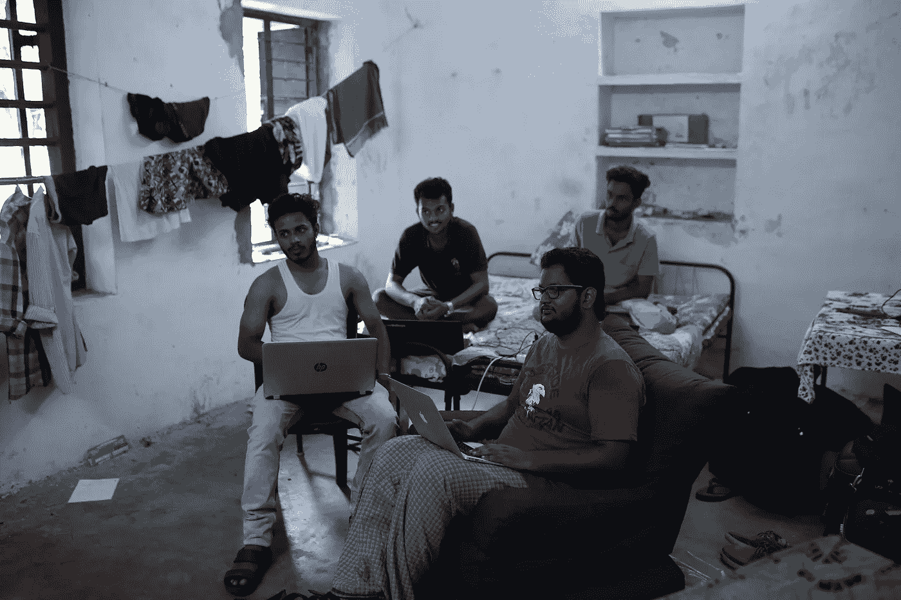
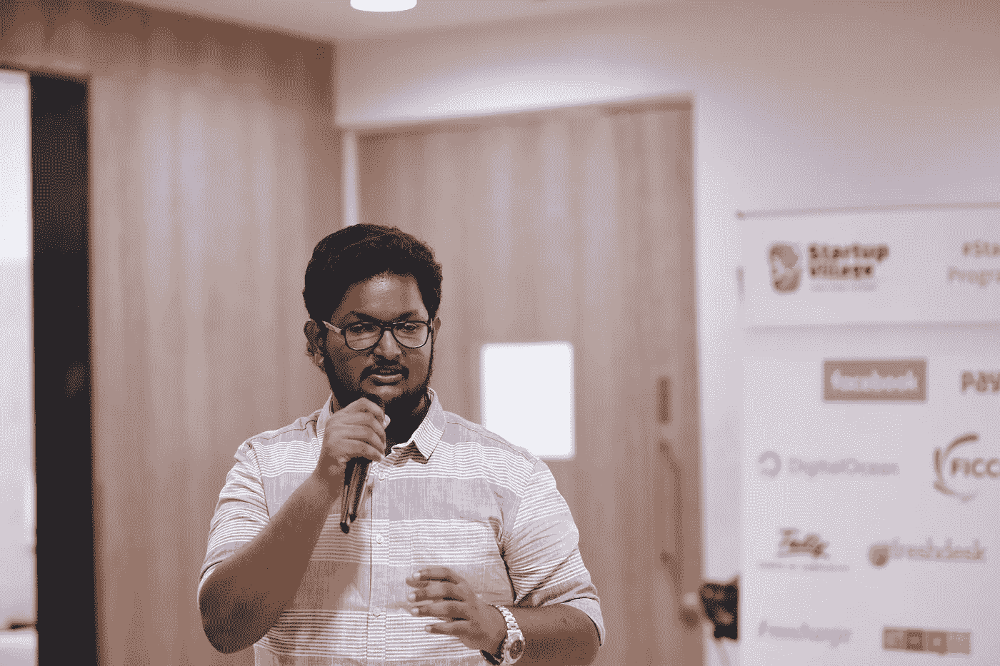
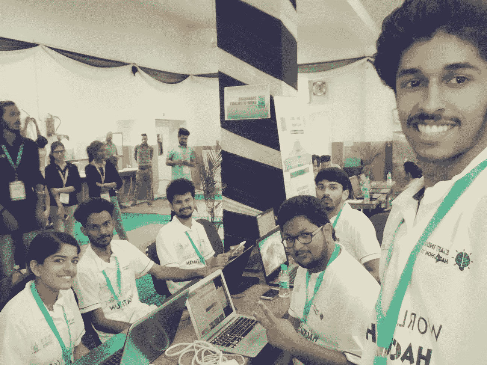
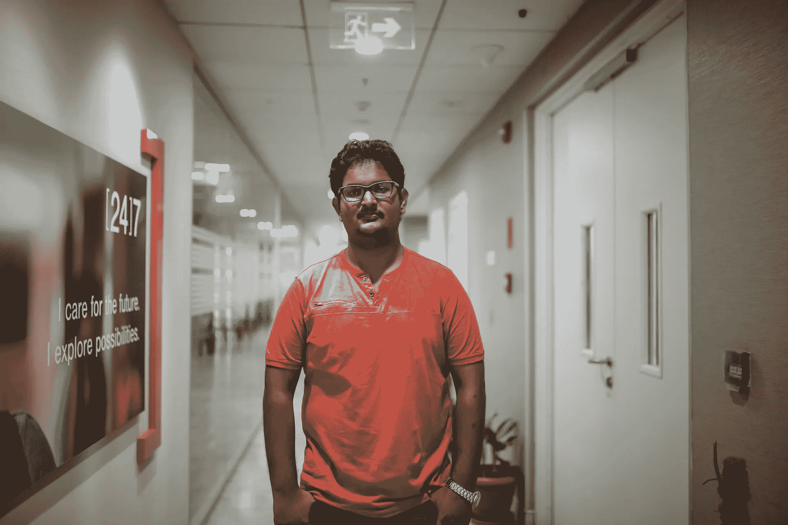
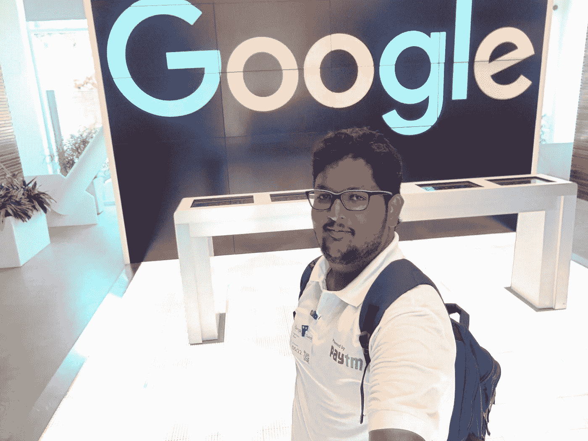
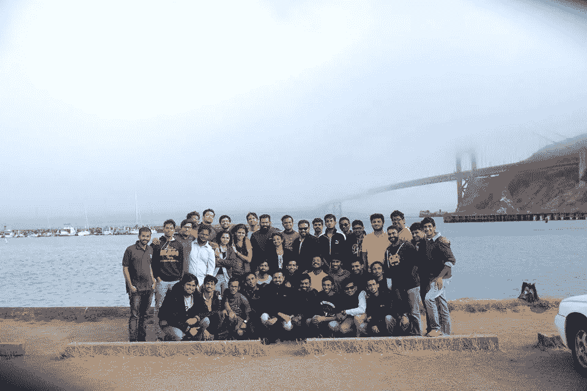
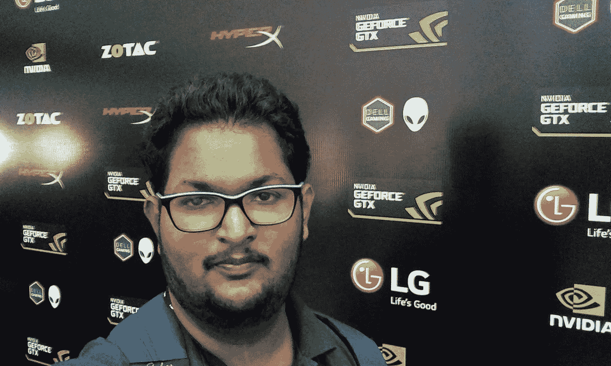
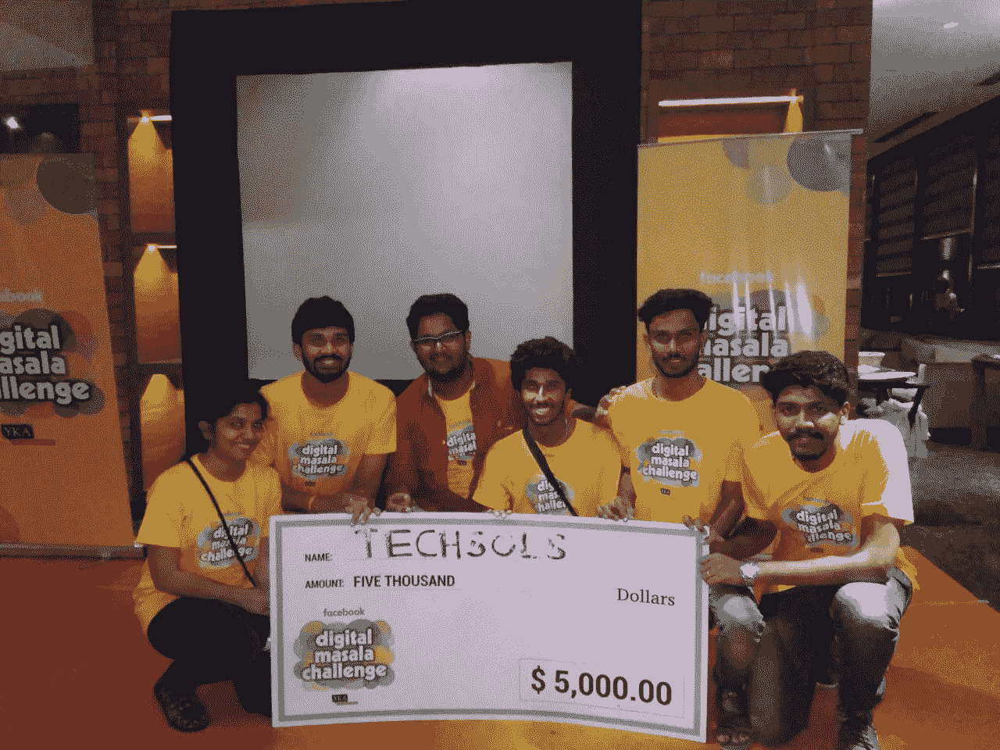

# 2017 年一名来自喀拉拉邦的工科学生的探索

> 原文：<https://medium.com/hackernoon/exploration-of-an-engineering-student-from-kerala-in-the-year-2017-e1526c1da554>

大家好...我在这里简要地谈谈 2017 年必须提供给我的经历和旅程，以及你们中的一些人如何也能实现这一点。让我提醒你，这不是什么励志故事。我在这里分享我得到的一些经验和机会，以及你如何也能容易地得到它们..

# 2016 年底

2016 年结束时，我是一名普通的计算机科学与工程学生，在印度喀拉拉邦帕拉卡德的 NSS 工程学院学习。我是我们学院创业发展小组(EDC)的积极参与者，但仅此而已。2016 年在平淡无奇中过去了。唯一的新闻是我们的 5 人团队被 SV.CO 选中参加创业培训项目，他们从一个安卓游戏中挑选出自己的安卓产品，然后参加一轮面试
一个普通的 B.Tech 孩子...

# 2017 年初

2017 年初，我们 5 个人注册了自己的私人软件创业公司，命名为“*”。我们签署了法律协议，并在 Thiruvanthapuram 注册。我联合创办了创业公司，是*首席技术官*。我们的初创公司是在 SV.CO 的数字孵化下诞生的。因此开始了我们的启动培训和会议。*

**

*Karela working in Men’s Hostel*

# *Alpha 在钦奈 FreshWorks 办公室发布*

*3 月 3 日，我们在钦奈的 FreshDesk(现为 FreshWorks)办公室举行了第一次 Alpha 产品发布会。这是我第一次亲眼目睹一家充满活力的初创软件公司是如何运作的。整个办公室充满了活力和色彩。整个设置和氛围让我希望我能当天就加入公司。*

*在 Alpha 发布日，我们在专家评审团面前展示了我们的产品，并收到了许多良好的反馈。对我来说，这也是一个结识许多乐于助人的有技能的人的机会。*

**

*Product Pitching @ Freshworks*

*这实际上是我第一次访问钦奈市。*

# *2017 年智能印度黑客马拉松，昌迪加尔*

*我认为这是今年第一次意想不到的天才之旅。我和我的 6 人团队，名为“ ***Techsols*** ”的团队因解决了***Smart India Hackathon***(SIH)2017 中陈述的一个问题而入选。SIH 是由印度政府、T21 和印度国际发展署发起的一项倡议，目的是让学生自己解决不同部委和政府部门面临的问题。*

**

*Team Techsols at SIH 2017 @ CGC,Chandigarh*

*这个选择对我们来说是个意外的惊喜。此外，我们部的计划被安排在*昌迪加尔大学集团(CGC)，昌迪加尔*。所有的旅行费用都由政府支付和报销。这对我们来说是一个机会，我们抓住了它。尽管整个黑客马拉松只有 2 天，但我们的整个旅程花了 1 周。除了活动之外，我们在火车上呆了整整 4 天，在德里呆了 2 天，在昌迪加尔呆了 1 天。
*这也是我第一次去德里或者昌迪加尔*。*

> *你仍然可以申请 SIH 2018，截止日期是 2017 年 12 月 31 日。请务必在此处应用。*

# *班加罗尔的客户洞察日*

*另一次为期一天的旅行是去班加罗尔参加 SV.CO 在大办公室[24]7 举办的客户洞察日。我们与许多专家交谈，并得到对我们产品的反馈。*

**

*Customer Insights Day at [24]7 Bangalore*

*然而，这不是我第一次访问班加罗尔:-p*

# *6 月 16 日至 28 日访问硅谷*

*这是我 2017 年的重大探索之一。作为我们在 SV.CO 培训的一部分，由喀拉拉邦政府和喀拉拉邦创业计划资助，我们被派往硅谷进行为期一周的访问。这次访问改变了我的生活。在旅途中，我们参观了脸书、谷歌和英特尔的总部。我们拜访了许多投资者、Google Launchpad、学术机构如 42 Coding USA 和东北大学。*

**

*At Google HQ, Silicon Valley*

*我也有机会参观了史蒂夫·乔布斯的房子，这都要感谢伊克巴尔和阿拉文德，这两个我们在路上随机遇到的印第安人让我们玩得很开心。整整一天，我们走遍了旧金山市，参观了金门大桥等。等等。，这样的例子不胜枚举。整个经历不止一个博客可以解释，所以我会在这里缩短它。*

**

*Golden Gate Bridge, San Fransisco*

# *2017 年 IEDC 峰会和英伟达游戏连接*

*这两件事可能看起来不像是一件大事，但这两件事都给了我一些美好的回忆。见到很多有才华的人，看到他们的优秀作品，这一切都在 IEDC 峰会上实现了。我还在 Gamer connect 上重新激活了我玩游戏的老习惯...*

**

*Nvidia Gamer Connect, Kochi*

# *赢得 2017 年加尔各答数字马萨拉挑战赛*

*当十二月到来的时候，我想也许这一年所有的乐趣都要结束了。不知何故，上帝嘲笑了我，给了我这个惊喜。
我和我的 6 人团队被选中参加由[青年 Ki Awaaz](https://medium.com/u/240f2efc3c78?source=post_page-----e1526c1da554--------------------------------) 和脸书在加尔各答组织的数字马萨拉挑战赛。这个选择让我们队里的所有人都大吃一惊。*

> *整个旅行由脸书和青年 Ki Awaaz 赞助。他们为我们预订了机票，安排我们入住五星级酒店(Lalit Great Eastern)，甚至为我们预订了出租车。我个人对所有这些款待感到震惊。尽管我参加过许多黑客马拉松和比赛，但我从未接受过如此奢华的待遇。*

*比赛持续了两天(12 月 17 日至 18 日), Idea 在 18 日晚上开始投球。在所有参赛队中，我们队是最年轻的。但不知何故，当结果出来时，我们赢得了 5000 美元的奖金，这对我们所有人来说都是一个震惊。由于时间不够，我们不能在城市里逛太多，但我们参观了特里萨修女墓、探索购物中心和伊甸园体育场。
这也是我第一次去加尔各答。*

**

*My team for DMC, Kolkate*

# *结论*

*如果你认为所有这些旅行和探索都是因为我是这样一个书呆子，那么让我告诉你一些事情，所有这些你也可以很容易地实现。你所要做的就是采取一些必要的行动。*

*我得到的所有机会仍然存在。如果你抬起眼睛寻找，你很容易就能发现它们。现在似乎有更多的礼物。*

*我独自承担的所有航行。在这一年的旅程中，除了我之外，我还有一群朋友。永远要有一个你可以依赖的团队，一个你可以称之为自己的团队。*

*我不是什么超级小孩或天才。我只是一名普通的工程系大四学生，这一年他做着自己热爱的工作，并且全心全意地去做。*

> *做你喜欢的工作，并且乐在其中。*

*引用电影《三个白痴》中阿米尔·可汗的话，*

> *不要跑在成功后面，让成功跑在你后面*

*所有这些机会，并不意味着我已经成为一些成功的人。我还是一个苦苦挣扎的工程开发人员。但我所能说的是，我去年的探索给了我一些美好的回忆和经历，这让我期待着新的一年。*

*祝大家新年快乐..*