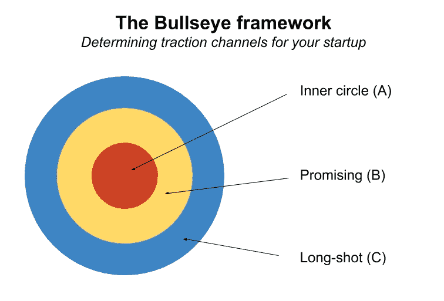

# 探索性微型创业思想第一章

> 原文：<https://medium.com/hackernoon/exploratory-micro-entrepreneurship-thoughts-chapter-1-fe6d563d05c7>

[*不要错过我们在 12 个月内打造 12 个 MVP 背后的背景。*](/digital-founder/an-experiment-in-micro-entrepreneurship-why-im-going-to-build-and-launch-a-dozen-mvps-in-2017-d3fa02ed5226#.iog4zhg29)

我真的还不知道我们需要建立的流程的范围，以真正擅长提出想法，建立 MVP 并测试它们...还没有。

具体来说，一些核心功能将意味着孤注一掷，我们需要为这些功能中的每一项构建和重复剧本:

1.  一年拿出两三次真正好的想法(慢一点，这样你就能跟上，但又不要太快，那样你会手痒)。这也意味着对积压的想法进行分类和优先排序，对规模和发布以及 ltv 可能的样子做一些初步研究。
2.  构建 MVP 依赖于 [Mubs](https://twitter.com/mubashariqbal?lang=en) 和 [Seth](https://twitter.com/sethlouey) 非常能干的人——我不确定是否有计划在某个时候创建一个泛项目框架，因为一些项目可能不涉及任何代码。无论如何，我有信心 Mubs 和 Seth 将建立和使 MVP 看起来惊人。
3.  在最初的一两年里，验证将是 Digital Founder 最紧张、最困难的活动之一。降低这一难度的解决方案是创建一个个人蹦床，每当一个新项目被创建时，我们就可以从这个蹦床上跳下来。一个*发行版*——一系列剧本，为你提供每个客户角色的质量流量样本，这样你就可以合理地测试目标客户对新产品的反应。

我们的目标是让这些剧本为明年一起尝试穿越的同伴提供安全通道(可能在我们的帮助下)。

## 你真的能在 15 天内验证一些东西吗？

从更高的层面来说，我们需要证明的商业模式假设是有道理的。

具体来说，像“15 天内验证”这样的大问题包含的风险最大。理论上这听起来不错，但这真的可行吗？

我不介意战术上可行。我的意思是，从战略上来说，我们能在这么短的时间内在 MVP 的努力上达到某种程度的统计意义吗？我如何知道现在起飞的项目以后不会失败？

我知道并且亲眼看到数据表明，那些*确实畅销* *并继续畅销*的产品往往会很早就开始畅销，尽管存在一些看似显而易见的问题。

有一个临界点，你解决的问题是如此尖锐，以至于解决方案会被接受来解决它，不管它有多丑陋或有多臭。但这并不意味着已经起飞的东西将继续起飞*或*我们应该让它成为运输丑陋和恶臭的东西的标准。

这是一个主要的关键。

## 定义“验证”,以便项目可以确定自己的范围

最初一两年的主要目标是为制造商创造直接的被动收入。这抵消了我们的燃烧，让我们继续自由探索。这时候我们可以接受更大的挑战，努力快速有效地验证*。*

做这件事不需要*数百万*——我们最初的一批数字创始人会非常乐意分享每月 5 万美元的经常性利润。这是一个非常具体的、可衡量的、可实现的和现实的目标，我们*可以*通过集中我们的人才和分散我们的资源来实现——在 12 个月内将 12 个 MVPS 排队。

我们知道电力法将推动我们的大部分收入。所以我们需要问自己，收入的大部分意味着什么？

## 在幂律和 80/20 之间——中间的某个地方

我们或许可以说，80/20 法则在某种程度上适用于此——尽管幂律更加无情，看起来更像 99/1。考虑到人才和有利的市场条件，我们可以说我们最终可能会坐在中间的某个位置。

因此，如果我们已经实现了 50，000 美元的盈亏平衡点，并且这一业绩主要是由一项资产实现的，而这项资产又提供了 80%的投资组合业绩，这将意味着我们 12 只 MVPS 中的一只——“同类中的独角兽”——将提供每月 40，000 美元的收入。相反，其他 11 种产品的总和将为投资组合带来 10，000 美元/月的收益。

然后，我们可以说 80/20 法则再次适用于 11 个“拖尾产品”，其中 11 个产品中的 1 个将提供集团收入的 80%，看起来大约为每月 8，750 美元。突然，我们看到了 11 款产品中的两款，它们在 5 万美元的收入中贡献了 4.875 万美元。

对于我们来说，就选择而言，这意味着其他 9 种产品要么提前取消，要么由于某些自然上限而缓慢被动地增长。重点是——我们知道两个产品将提供大部分价值，我们需要非常快速地确定我们每个月正在开发的产品是否是这一个产品——在它需要暂停、自动驾驶或终止之前，我给我们四周时间来确定这一点。

因此，在运行 MVP 时，我们实际上不会遇到管理问题。要么该产品将成为值得立即双倍下注的赢家，要么它不会成为赢家，而是被暂停、置于自动驾驶状态或被扼杀。更难的是 12 次尝试中只有一次成功。这是雄心勃勃的部分。

为什么不留住表现不佳的员工？有些是值得保留的，以建立投资组合收入，但其他人被丢弃，因为没有意义-我们会很早就知道一个项目是否会成为投资组合中的第 1 层、第 2 层或第 3 层项目。如果看起来也不会，考虑到我们面前的路线图和幂定律，开发那个产品就没有什么意义了。

## 根据设计，验证东西所花的时间应该很少

在 CRO，有一个重要的概念与组合测试有关。当你选择一个要改进的 KPI 时，你通常会有一个想法:为了达到你的目标，你需要改进多少。

一般来说，这种方法在早期[创业](https://hackernoon.com/tagged/startup)阶段效果很好，那里的收益需要是天文数字——但是如果你试图实现一些增量收益，它根本不起作用。

我知道这听起来违反直觉，但如果你仔细分析推理，问自己，“当我知道改变按钮的颜色会让我们更有活力时，我为什么要尝试测试那些有微小机会工作的东西？”

答案将是:*统计意义。*

当你运行一个测试的目标是实现一个非常小的改进时，测试运行所花费的时间需要*巨大*才能让你实际观察到那个小的变化，并且能够以合理的(95%)统计置信度来确认它。

相反，更有意义的是努力实现梦想，因为当你创建一个带有巨大变更请求的测试时，你是否得到你想要的变更将会很快变得很明显。

测试大创意和准确评估它是否会大的时间会大大减少，而且你不需要浪费时间(a)在微小的改进上偷懒和(b)在这个过程中浪费时间摆弄你的拇指。

所以对我们来说，重要的是这些想法要大胆而富有戏剧性，以某种方式回答一个我们感觉到的或者我们可以观察和交流的明确问题。如果我们需要快速、合理、可靠地交付月价值的东西来填补排名第二或第三的位置，那么做小应用是没问题的。但是一般来说，我们应该在每一次产品尝试中努力达到 4 万美元的产品目标，如果没有达到这个目标，那么*和*可以考虑保持这个目标。

## 操作

下一个问题与运营有关，实际上*运行*这 12 个 MVP，如上所述。我们将如何通过研发活动来管理日益庞大的投资组合？

在失败的理论中，我们可能会用一生的时间来尝试制造微型产品，但从来没有一个赢家。对于一个经验丰富的团队来说，这似乎不太可能。

在获胜理论中，我们需要花 1 到 12 个月的时间进行“自我反省”，然后其中一个项目才能清楚地表明它能够实现我们的年度 MRR 目标(即它是本年度的独角兽)。

当然，有可能我们做得很糟糕，所有 12 种产品都会失败。但实际上我们很擅长我们的工作。毕竟，这就是为什么我们首先要接受这个危险的挑战——我们相信我们可以在 12 次尝试中创造出一个赢家。

因此，我们需要解决潜在的问题，比如说，如果我们在第 10 个月，我们仍然没有推出能够提供独角兽潜力的产品(在第 1 年，我们的独角兽地位是 4 万美元/月)，并且说产品组合中的其他业务开始提供大量客户支持，而这些业务还没有提供这种价值。

我们仍然是自由职业者，在我们观察到 4 万美元/月的产品即将成为现实的快速指标之前，我们中的许多人都依赖于将时间转化为金钱来继续这样做。老掉牙的鸡和蛋的问题。

那么，我们究竟应该如何在不占用 R&D 时间的情况下解决这个问题呢？

## 暂停、自动驾驶或取消

这就是为什么每一个想法都必须非常大，并且在你暂停它、让它自动运行或扼杀它之前，需要快速测试。

> 它还显示了测试需要有多专注，以便在那个时间框架内实际交付流量，以及提供暂停、自动驾驶或杀死所需的重要性的适当转换数量——每个月的尝试只是试图*验证*，它不是为了在一个月内达到 4 万美元而设计的。

暂停一个产品意味着我们只是让它看不见。如果我们暂停一个产品，这意味着它从未能够赢得任何客户，或者技术难度突然成为游戏规则的改变者，或者任何其他阻碍因素，这意味着我们还不能这样做。

将产品置于自动驾驶状态意味着我们将尽一切努力来最大化管理产品的被动本质；从安装自助问答、聊天系统、[营销](https://hackernoon.com/tagged/marketing)自动化等等，以确保我们的产品能够在专注于其他领域的同时保持缓慢增长。

对于一个不值得花时间的产品来说，扼杀一个产品确实是最后也是最快的选择。对于那些无法创造收入、产生真正价值或实际解决问题的产品，我们会将其淘汰。否则，值得开源，免费提供，或者干脆暂停。

## 牛眼框架

我喜欢想起加布里埃尔·温伯格的牵引方法，他认为初创公司往往会死亡，因为他们没有时间去寻找一个能为他们的大部分增长负责的渠道。我同意这种方法，并倾向于在尝试与客户或自己达成市场/契合时使用这种方法。

听起来熟悉吗？

这非常接近我们将在 Digital Founder 使用的产品规模模型，而不是渠道规模模型。我怀疑每个产品都有自己的靶心框架需要填充——但是整个投资组合可以寻求填充一些非常类似于[靶心跟踪表](http://tractionbook.com/Bullseye.xlsx)的东西。

牛眼框架背后的基本故事是，在任何给定的时刻，你的初创公司可能有 20 个渠道可以尝试不同的市场和进入市场的方式。当然，作为营销领导者，你的目标是以尽可能低的每次收购成本获得尽可能多的用户/客户。

我们将采用类似的方法—再次稍微修改一个已知的配方:

我们不会列出长远的、有前途的和圈内的*渠道*，我们会列出长远的创业想法、有前途的想法和我们现在应该关注的想法。我们知道在接下来的 12 个月里我们将会开发什么样的产品，但是还不清楚我们应该先开发哪一个*，我们应该按照牛眼框架想要达到的相同标准进行排序和优化。*

*也就是说，对于我们的每一个创业想法，我们需要按照以下方式进行排序:*

*   *状态*
*   *潜在收入*
*   *无论我们认为它是一级、二级还是三级项目*
*   *我们认为今年能够实际获得的客户数量*
*   *如果涉及付费媒体，每个用户的大概费用*
*   *测试想法所需的预期努力*

***状态**让我们表明这是否只是一个想法(1)，我们是否正在测试它(2)，它是否已经测试并暂停(3)，我们是否正在积极地专注于构建它(4)或者它是否已经被扼杀(5)。*

***潜在收入**与我们的年度目标相关。我们认为这种产品实际上能取得多大的收益(不是利润)?*

*答案告诉我们这是一个第一层(4 万美元)、第二层(10K)还是第三层(2.5 万美元)的项目。创意层应遵循潜在收入和预期的测试工作。*

*对于一些想法，如电子商务，有办法从字面上把美分变成美元的好内容。如果我们以前在某个领域有经验，并且有一个想法，那么明智的做法是了解每个用户的**近似每次收购成本**。*

*最后，当谈到 MVP 的复杂性时，我们需要与现实保持一致。第一层的想法可能值得建立，但是它们必须遵守 v1 交付的两周期限，否则整个路线图将处于危险之中。*

*因此，大的想法仍然可以被测试，但是它们在不同的块中被测试，并且可能按顺序发布。这实际上有一些营销上的好处——不过这是另一天的故事了。*

*我们可能应该计划每个月做一次这样的练习，这样我们就可以确保突出任何新的可能性的变化。*

*鉴于我们的集体经验，在不久的将来，开始考虑我们应该在哪些重点领域开展工作将是重要的。但在此之前，我应该先介绍一下我的同谋。我下次会这么做的。*

*你喜欢这篇课文吗？确保❤️这个职位，以便其他人可以从中受益。*

******

> *[黑客中午](http://bit.ly/Hackernoon)是黑客如何开始他们的下午。我们是 [@AMI](http://bit.ly/atAMIatAMI) 家庭的一员。我们现在[接受投稿](http://bit.ly/hackernoonsubmission)并乐意[讨论广告&赞助](mailto:partners@amipublications.com)机会。*
> 
> *如果你喜欢这个故事，我们推荐你阅读我们的[最新科技故事](http://bit.ly/hackernoonlatestt)和[趋势科技故事](https://hackernoon.com/trending)。直到下一次，不要把世界的现实想当然！*

**