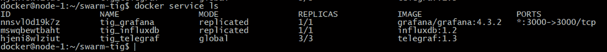
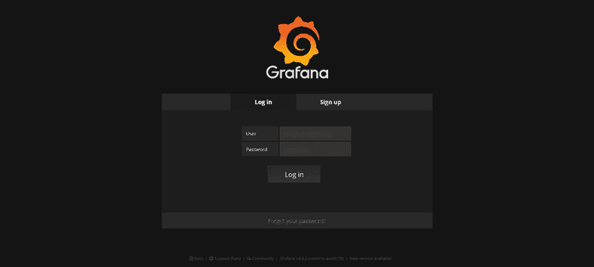
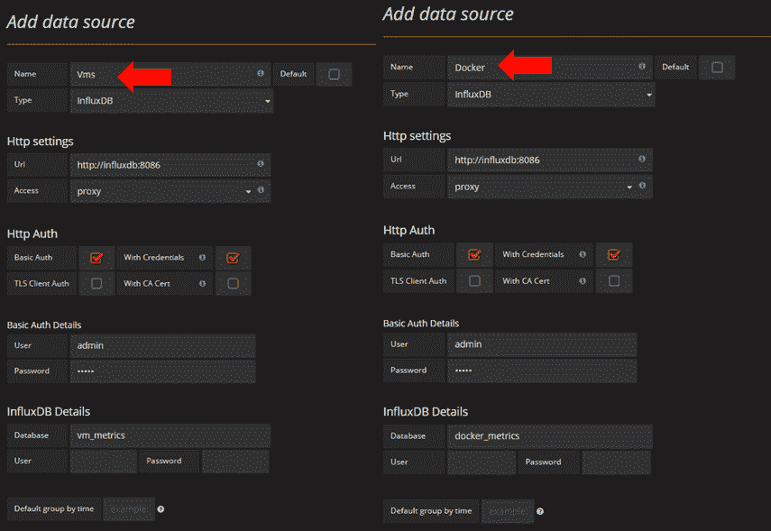
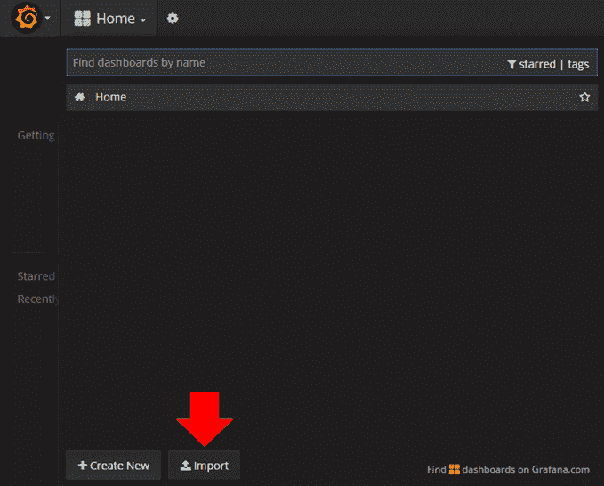
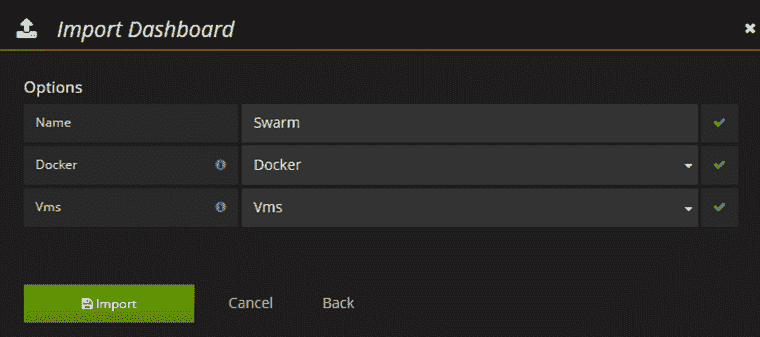
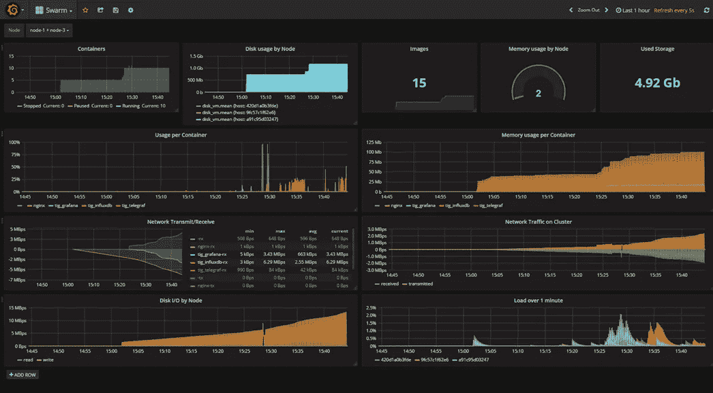

# 探索 Grafana 中的 Swarm & Container 概览仪表板

> 原文：<https://medium.com/hackernoon/exploring-swarm-container-overview-dashboard-in-grafana-ba9621c876c9>

在我之前的帖子中，你学习了如何用 [**标记栈**](https://hackernoon.com/monitor-swarm-cluster-with-tick-stack-slack-3aaa6483d44a?source=user_profile---------8----------------) 来监控你的**蜂群**。在这一部分中，我将向您展示如何使用相同的堆栈，但我们将使用 **Grafana** 而不是使用 **Chronograf** 作为我们的可视化和探索工具。

通过 **SSH** 连接到您的**管理器**节点，并克隆以下[**Github**](https://github.com/mlabouardy/swarm-tig)**仓库:**

> **https://github.com/mlabouardy/swarm-tig.git**

**使用下面的 *docker-compose.yml* 设置监控堆栈:**

**然后，发出以下命令来部署堆栈:**

> **docker stack deploy-compose-file docker-compose . yml TIG**

**部署后，您应该会看到集群上运行的服务列表:**

****

**将你的浏览器指向 [**http://IP:3000** ，](http://IP:3000,)你应该可以到达 **Grafana 仪表盘:****

****

**默认用户名和密码是 *admin。继续并登录。***

**转到**数据源**并创建 2 个 **InfluxDB** 数据源:**

*   ****虚拟机**:指向您的**集群节点**度量数据库。**
*   ****Docker** :指向你的 **Docker 服务**度量数据库。**

****

**最后，点击“**导入**”按钮导入仪表板:**

****

**从这里，您可以上传 *dashboard.json* ，然后选择您之前创建的数据源:**

****

**您最终将获得一个交互式动态仪表盘:**

****