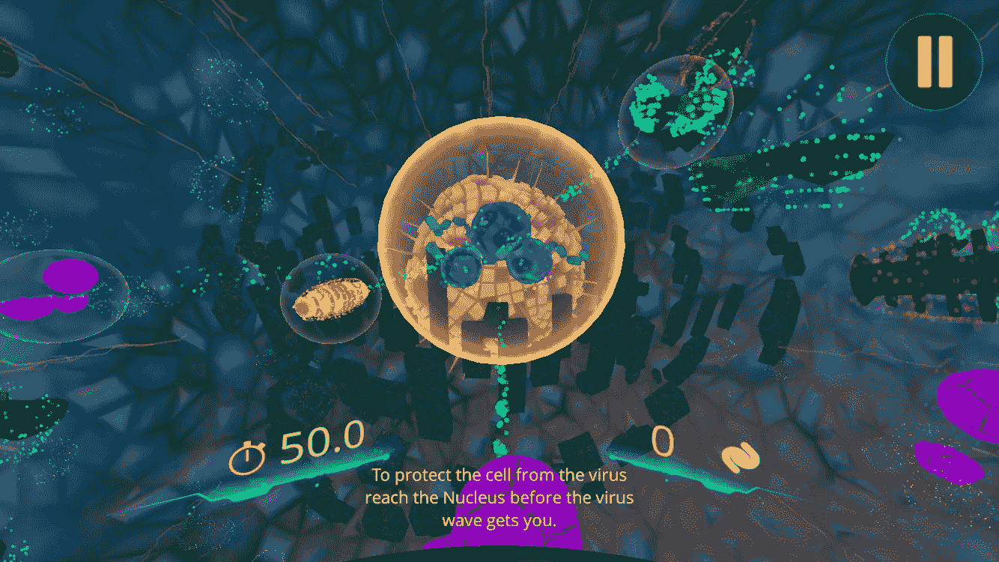
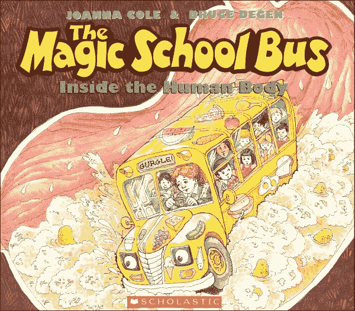
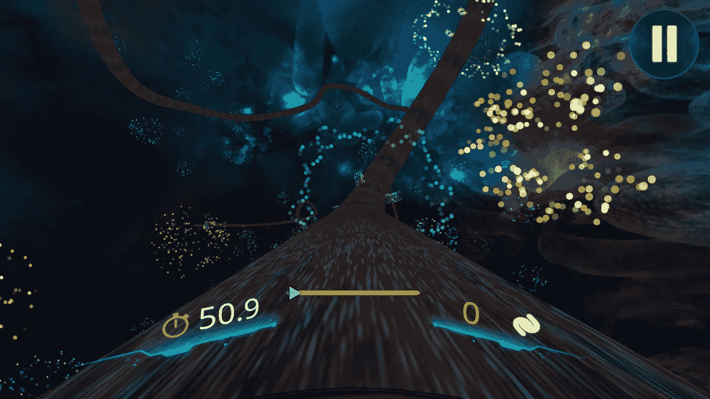
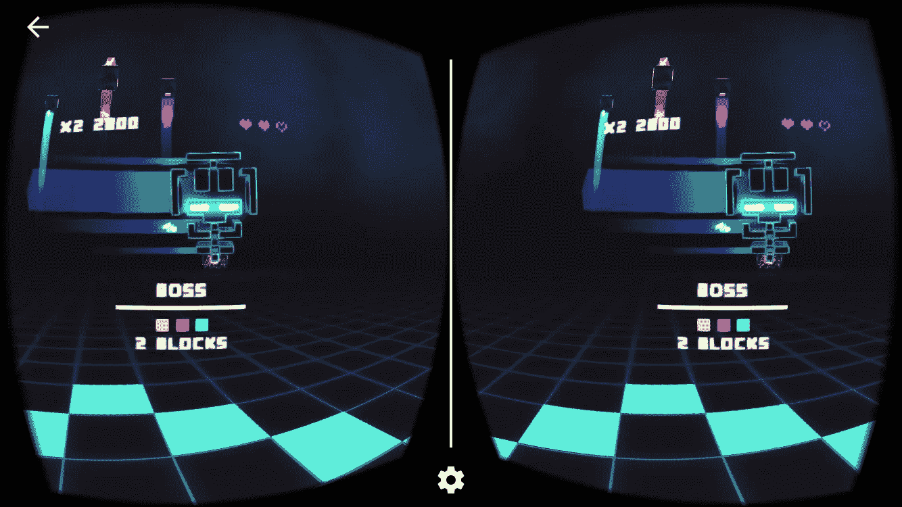
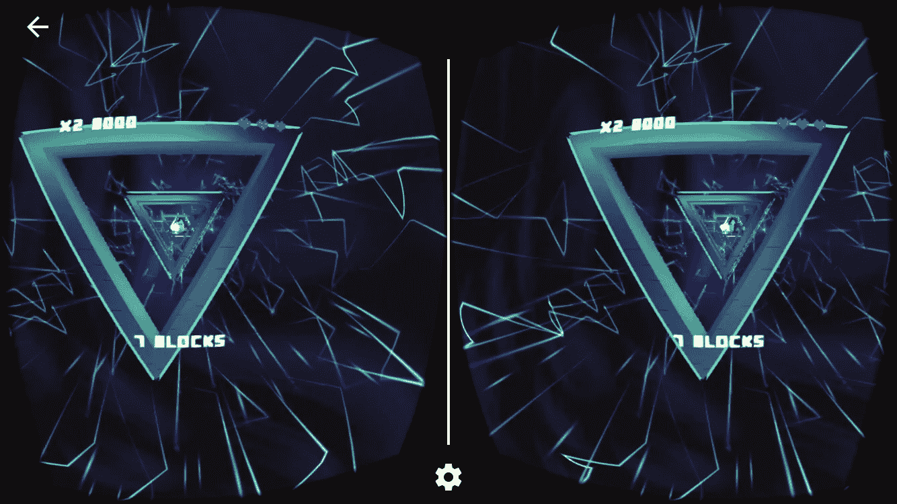

# 探索虚拟现实的媒介

> 原文：<https://medium.com/hackernoon/exploring-the-medium-of-virtual-reality-41f13e756ffb>

作为一名有抱负的[移动](https://hackernoon.com/tagged/mobile)虚拟现实开发者，花时间在我的设备上参与 VR 游戏和体验是有意义的。所以在过去的几天里，我就这样做了，用 InCell VR 和 MAX VR，这两款游戏在不同的博客中都受到了好评。

虽然这些游戏在美学和游戏性上各不相同，但在机械上却很相似。因为我使用的是[谷歌](https://hackernoon.com/tagged/google) Cardboard 耳机，所以我只有一个按钮用于交互，大部分游戏都是由我凝视的方向驱动的。这是 InCell 和 MAX 之间的重叠，也是我在 iPhone 上玩 VR 中其他游戏时注意到的。

# 在单元格中

The Magic School Bus meets Sonic the Hedgehog

《神奇之旅》远在我的时代之前，但对于那些在我这个年龄看着神奇的校车长大的人来说，你会熟悉因塞尔的前提:缩小到足以进入人体进行探索和冒险。

Ms. Frizzle contemplating the exit

作为 InCell 的主角，你的任务是冲向细胞核，击退病毒，保护身体免受疾病的侵害。这是通过沿着微管的 360 度轨迹移动，收集白色蛋白质和绿色加速物质，同时避开使你减速的红色障碍来实现的。有时游戏有点令人眼花缭乱，我认为对于那些完全不熟悉虚拟现实的人来说，这将是一个粗略的介绍。玩家永远保持向前的动力，就像被绑在过山车上一样。它们控制微管上的角度，但它们永远不会完全停下来。这种游戏机制结合了收集蛋白质和避免障碍，让人想起早期的刺猬索尼克游戏，其中主人公的任务是收集戒指和避免刺。

Aiming for that green speed boost

因塞尔是一个有趣的游戏，虽然比赛会很累。然而，我向那些有兴趣在智能手机上体验比照片或视频更吸引人的虚拟现实体验的人推荐它。

# 马克斯(男子名ˌ等于 Maximilian)

Synthesizers & Space Invaders

MAX 是 RetroView VR 的第一款游戏，某种程度上是对太空入侵者的 VR 探索。80 年代街机游戏中的外星人卷土重来，这次击败他们需要射他们的眼睛。马克斯的游戏要求用你的目光瞄准激光，并管理来自不同方向的所有敌人。虽然这听起来好像很快就会变得无聊，但这个游戏找到了一种让你保持参与的方式。复古的外观和令人敬畏的背景合成器真的让体验变得栩栩如生，给你感觉你和《创》中的杰夫·布里吉斯没有太大的不同。关卡结束时的 boss 战本身也很刺激，而且结局也非常漂亮。

Through the Triangles of Triumph

《麦克斯》是一个有着很棒配乐的美丽游戏，但我认为它本可以受益于一个背景故事。这并不是游戏有趣的必要条件，但在某种程度上，InCell 背后的故事让它看起来比一个小应用程序更有深度。有了虚拟现实，让你觉得你口袋里的这些世界比第一人称视角更深入将是很重要的。我认为叙述会比图片更能让人沉浸其中。

# 反射

玩这些游戏，批判性地思考是什么让它们起作用，以及如何让它们变得更好，是一个很好的反思练习。我还没有完全从零开始制作自己的 VR 游戏，因为我一直在他们的 VR 开发者课程中使用 Udacity 的模板。但是我可以从这两个游戏中看出，精心制作一个强有力的小故事，一个很酷的声音轨道，和稳定的摄像机会让用户对虚拟现实体验产生兴趣。

> [黑客中午](http://bit.ly/Hackernoon)是黑客如何开始他们的下午。我们是 [@AMI](http://bit.ly/atAMIatAMI) 家庭的一员。我们现在[接受投稿](http://bit.ly/hackernoonsubmission)，并乐意[讨论广告&赞助](mailto:partners@amipublications.com)机会。
> 
> 如果你喜欢这个故事，我们推荐你阅读我们的[最新科技故事](http://bit.ly/hackernoonlatestt)和[趋势科技故事](https://hackernoon.com/trending)。直到下一次，不要把世界的现实想当然！

