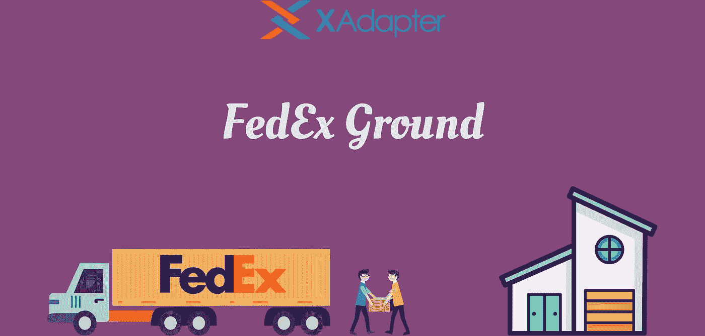
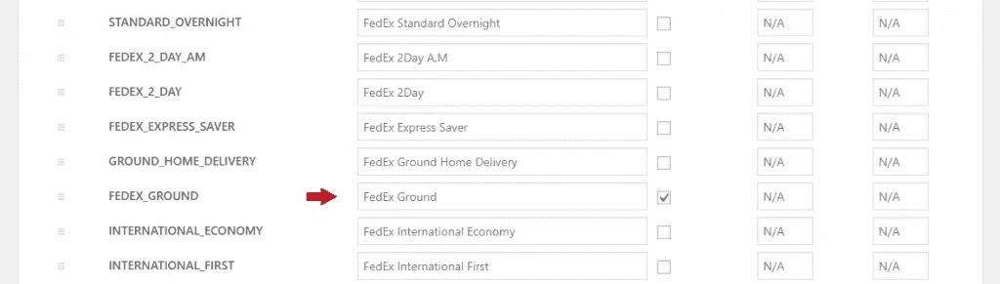
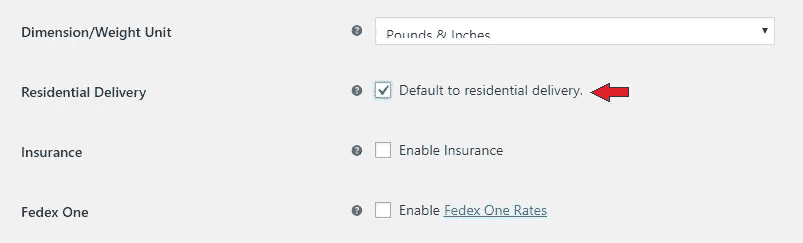
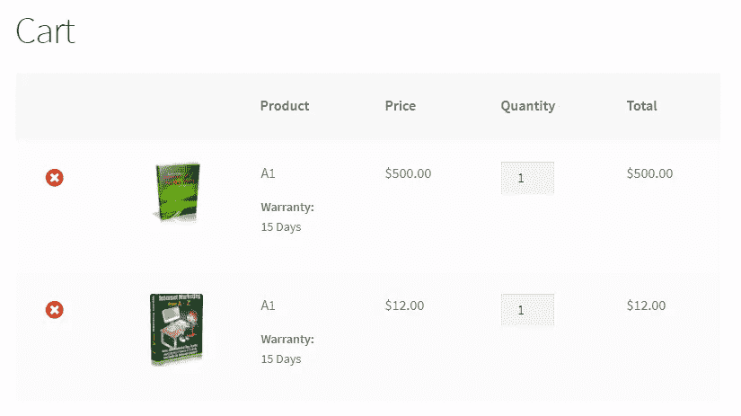
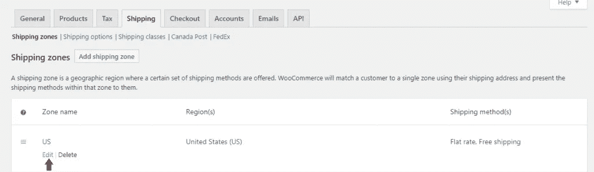
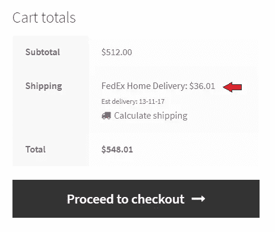
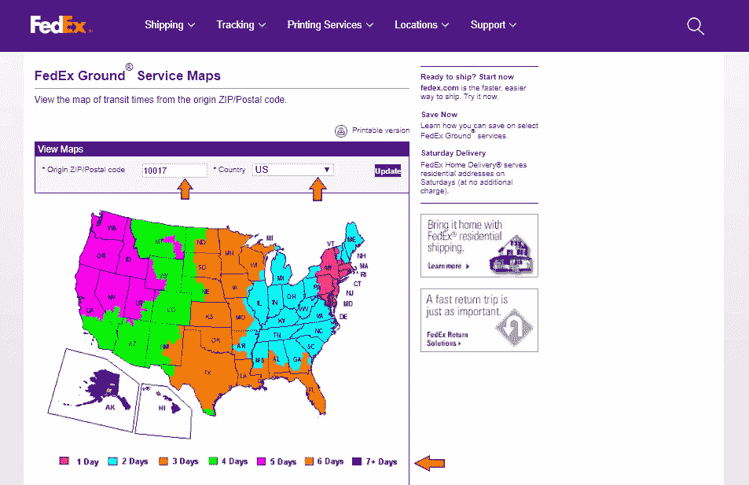

# 探索 WooCommerce 联邦快递地面运输服务

> 原文：<https://medium.com/hackernoon/exploring-the-woocommerce-fedex-ground-shipment-service-15556d40c559>

FedEx Ground

说到订单运输，联邦快递被证明是线上和线下企业的绝佳选择。与其他航运服务相比，它们快捷、可靠，而且运费略低。联邦快递地面运输服务是他们最著名和最广泛使用的服务之一。这种联邦快递递送服务在指定的日期和时间或之前运输货物，这是一个加分点。此外，如今许多店主都在使用这项服务，以便接触到美国越来越多的消费者。

如果你是一个 [WooCommerce](https://hackernoon.com/tagged/woocommerce) 店主，我们的 WooCommerce 联邦快递运输插件将帮助你向顾客提供联邦快递地面服务。由于这项服务的受欢迎程度和质量，这将有助于您锁定更多的客户。在本文中，我们将看到一些现实生活中的商业案例，并找出这个插件是如何执行的。因此，没有任何进一步的拖延，让我们看看吧。

# 什么是联邦快递地面服务？

联邦快递地面运输是联邦快递为商业运输提供的运输服务之一。也就是说，这种服务是由某种类型的企业选择的，以便将产品交付给他们的客户或其他公司。这项服务不包括住宅地址。关于这项联邦快递运输服务的另一个有趣的事实是，它只在工作日运送，即周一至周五。此外，许多来自美国的企业和商店业主使用联邦快递国际地面服务将货物运送到加拿大。

# 一个真实的场景

詹姆斯现在是我们的顾客之一。但在他开始使用我们的 WooCommerce FedEx 插件之前，他对它的功能以及它将如何帮助他有点怀疑。你看，他是一家经营陶器的小而成功的 WooCommerce 商店的老板。他自己制作陶器，并把它们运到全国各地的其他大商店。此外，他想只提供联邦快递地面运输服务给他的客户。这是因为它提供了更便宜的价格，而且送货人对他的包裹格外关注。但很快，他厌倦了单独联系联邦快递，为每一份订单提供联邦快递地面服务。因为这个原因，他过去常常比预期晚一点把包裹送到顾客手中。最终，有一天，他发现我们的插件提供这种运输服务，他可以选择提供给他的客户。为了方便起见，他还可以使用联邦快递的取件服务。通过使用这项服务，联邦快递的送货代理人可以到他的商店，包装物品，并带走包裹进行进一步的送货过程。

现在，让我们看看这个插件在这种情况下如何帮助他。

# WooCommerce 联邦快递插件中的联邦快递

一旦你在你的 WooCommerce 商店里设置了这个插件，使用起来就非常容易了。你只需要进入你的 WooCommerce 的仪表盘，打开设置选项。在这里，你可以在联邦快递设置页面找到联邦快递地面。它看起来类似于下图。

FedEx Services

如你所见，联邦快递的地面服务和其他运输服务一起提供。如果你只是想为你的客户提供联邦快递地面服务，那么你可以取消选中除地面服务之外的所有其他服务。完成此操作后，您必须向下滚动页面并保存您所做的更改。

联邦快递地面服务也可以用于住宅地址。您可以通过启用联邦快递运输插件中的一个选项，强制将您的产品送到客户的住宅。

Residential Delivery for FedEx Ground

你一进入联邦快递设置页面，就可以向下滚动，看到选项写着**住宅递送。**在上图中，您可以点击红色箭头所指的勾选选项。这样做之后，您必须进入页面并保存您所做的更改。

现在，您已经选择了这项服务，您可以继续从您的商店订购商品。您可以在测试模式下执行此操作。

Cart page

假设一位顾客想从您的商店订购这两件商品。如果您成功启用了联邦快递地面服务，那么他们应该会在结账页面看到该选项。它看起来类似于下图。

您可以禁用除联邦快递地面运输以外的其他运输选项。为此，你必须进入 WooCommerce 设置页面中的运输设置页面。你甚至可以参考下图。

Editing Shipping zones for FedEx ground

只需转到此页面，然后单击发货区域(美国)下的编辑选项。您可以进一步禁用统一费率和免运费选项。这样做的结果是，您将只能向您的客户提供联邦快递地面服务。

如果你成功地完成了上面的步骤，那么 WooCommerce 购物车看起来会像这样。

WooCommerce cart page for FedEx Shipping

# 联邦快递地面服务地图

使用联邦快递运送包裹的另一个令人惊讶的功能是服务地图。这是一张虚拟地图，可以帮助您估计包裹送达客户的时间和到达日期。这张地图在很多情况下都非常有用。让我们看一看。

FedEx Ground Service Map

如果你去这个[网站](http://www.fedex.com/grd/maps/MapEntry.do)(联邦快递官方网站)，就可以直观的了解到在途时间。这是图像，如果你输入纽约的 pin 码，并设置国家为美国，你可以看到不同的时间区域。这些区域显示了联邦快递将您的包裹递送到各个州所需的时间。在地图的底部，你可以看到代表过境日的不同颜色。例如，俄亥俄州将需要大约 2 天的交货时间。

# 总之…

FedEx Ground 在美国的许多企业中非常受欢迎，WooCommerce FedEx 插件使这项服务更加贴近店主。还有许多其他有用的功能，可以在许多方面为您的企业带来好处。

这篇文章让你对插件中的联邦快递地面功能有了一些了解。我们希望它在某种程度上对你有所帮助。请在下面的评论区告诉我们你对这篇文章的看法。

*原载于 2017 年 11 月 7 日*[*【www.xadapter.com】*](https://www.xadapter.com/woocommerce-fedex-ground-shipment-service/)*。*

*本文由*[*Devesh Rajarshi*](/@devesh_92870)撰写