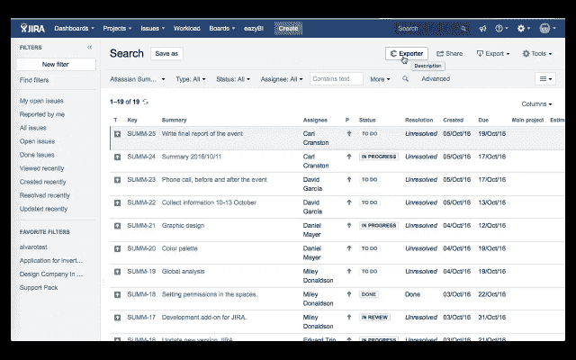

# 出口商回来更新！

> 原文：<https://medium.com/hackernoon/exporter-comes-back-renewed-e5820ca0460>

我们对这一消息感到非常兴奋，我们从几个月前就开始致力于此，我们对所取得的成果感到非常自豪:一个更新的附加组件，具有更多导出功能，您会发现它更加有用。相信我们，这太棒了。

# 这是怎么回事？

这是关于用于服务器和云**的新的 2.0 版本的 [Exporter](https://marketplace.atlassian.com/plugins/com.deiser.jira.exporter/server/overview) ，它提供了许多新的关键功能，将使您的导出体验更有效率、充满信息，而且没有痛苦。

## 让我们告诉你为什么！

现在，除了导出 JIRA 问题，您还可以选择您想要的所有问题，包括注释、过渡、链接、附件和任何其他自定义字段，以便将您的报告导入与任何其他兼容工具兼容的 Excel 和 CSV 文件。
的重要特性，鉴于 [JIRA 已经停产](http://blog.deiser.com/excel-exports-in-jira-are-gone/)，到现在为止，这个动作。

嗯，是的，我们忘了告诉你:你也可以出口超过 1000 期！！

Export to Excel, CSV and now you can link to other issues.

## 主要特点:

*   导出到 Excel 和 CSV。
*   把你的出口和另一个 JIRA 问题联系起来。**
*   将附件、注释和过渡导出到您的项目中以获取更多信息。
*   出口 1000 多期
*   非常有用的 SLA 管理附加软件。
*   在服务器和云中可用。

Discover the new functionalities of Exporter.

我们想促进你的出口过程，使它更无痛、更愉快；这就是为什么 *#DEISERteam* 为此准备了一个 Spotify 播放列表。我们真心希望您喜欢:

[”<a](”<a)

https://embed.spotify.com/?uri = Spotify % 3a user % 3a deiserteam % 3a playlist % 3a 1 gbqtrarllnazuqrv 3 ndub" width = " 300 " height = " 380 " frame border = " 0 " allow transparency = " true "></iframe>

** *注意:今年 4 月 25 日，我们将更新云版本，除了“问题链接”功能之外，其他功能都相同。无论哪种方式，为了获得更好的性能，我们建议更新到*[*Atlassian market place*](https://marketplace.atlassian.com/plugins/com.deiser.jira.exporter/cloud/overview)*上提供的新版本。请留意我们的社交媒体渠道，了解更多信息！*

> [黑客中午](http://bit.ly/Hackernoon)是黑客如何开始他们的下午。我们是 [@AMI](http://bit.ly/atAMIatAMI) 家庭的一员。我们现在[接受投稿](http://bit.ly/hackernoonsubmission)，并乐意[讨论广告&赞助](mailto:partners@amipublications.com)机会。
> 
> 如果你喜欢这个故事，我们推荐你阅读我们的[最新科技故事](http://bit.ly/hackernoonlatestt)和[趋势科技故事](https://hackernoon.com/trending)。直到下一次，不要把世界的现实想当然！

