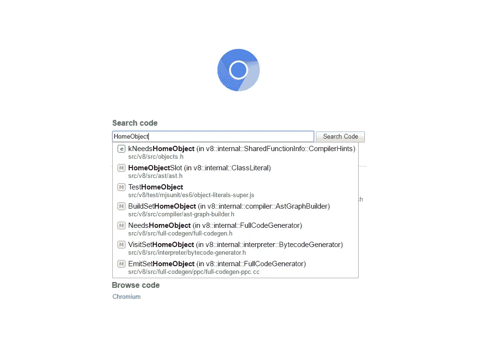
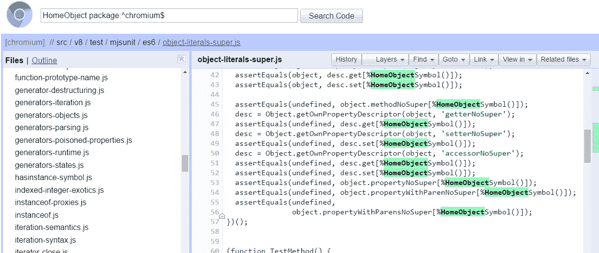
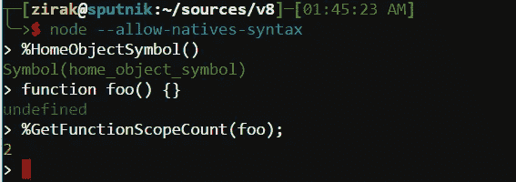
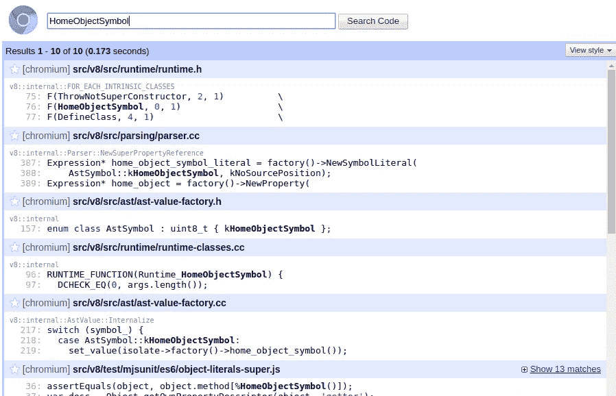
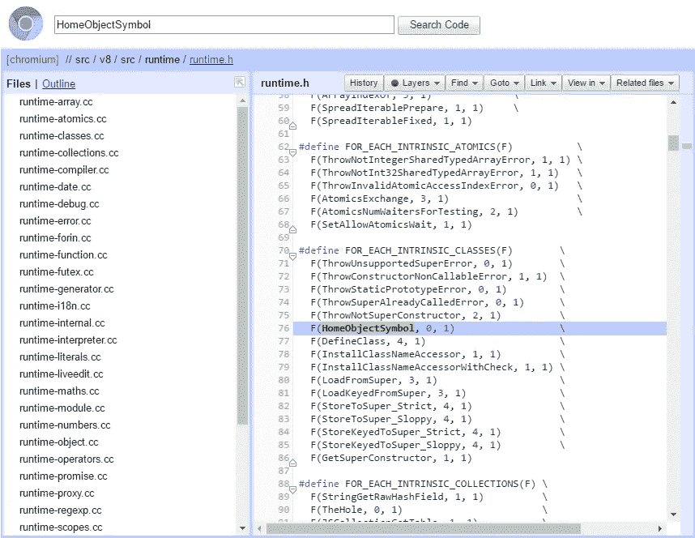
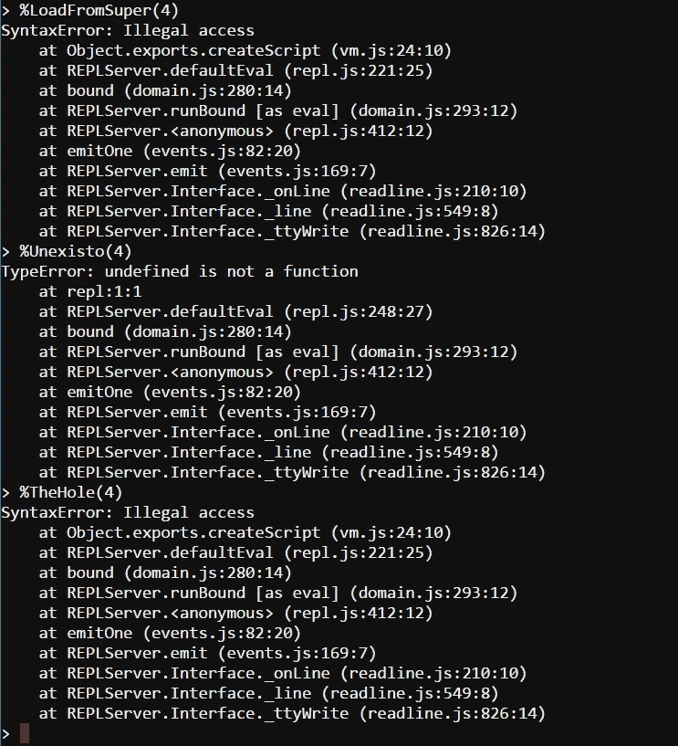
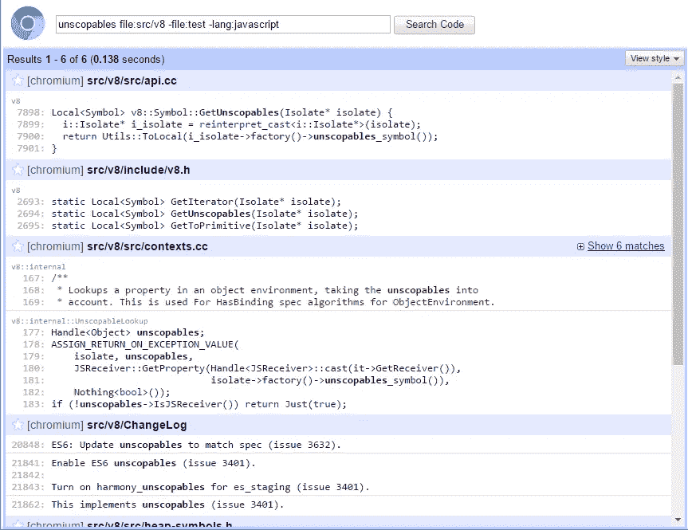
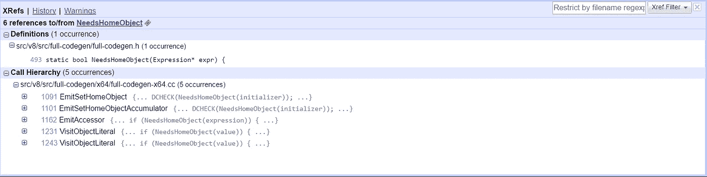

# 暴露 HomeObject

> 原文：<https://medium.com/hackernoon/exposing-homeobject-e61061cbfe17>

随着我阅读更多的规范，我对`super`关键字所使用的`[[[HomeObject]]](https://tc39.github.io/ecma262/#table-16).` `[[HomeObject]]`变得更加好奇:

```
let parent = {
    x: 'parent'
};
let child = {
    x: 'child',
    papaX() { return super.x; }
};child.papaX(); // undefined
Object.setPrototypeOf(child, parent);
child.papaX(); // 'parent'
```

`super`在`child`的一个方法中使用时，基本上相当于`Object.getPrototypeOf(child)`，它的值可以在调用之间改变。然而，要做到这一点，一个方法(澄清:一个方法是一个类似于`papaX`的函数，用简写符号声明)需要知道它是在哪个对象中定义的。众所周知，这可能与函数的`this`值大相径庭——`this`可以随着`call`和朋友以及无数其他原因而改变。

输入`[[HomeObject]]`。这是一个在创建时分配给方法的神奇属性，指的是创建它们的对象。在上面的例子中，`papaX`内的`super.x`实际上转化为:

```
Object.getPrototypeOf(papaX.[[HomeObject]]).x
```

当然，除了访问函数的`[[HomeObject]]`超出了常规 JavaScript 代码的能力之外。

这引起了我的兴趣。如果我们*有权力访问函数的`[[HomeObject]]`会怎么样？如果函数确实与创建它们的对象有一个常量绑定？我不是说拥有一个是个好主意，事实上我是说这是个坏主意，但这是个有趣的 T21。*

所以问一个问题:我们如何在不同的引擎中实现对`[[HomeObject]]`的访问？

我假设没有 JavaScript 引擎的先验知识，它们是如何实现的，C++，对鲸鱼的理解，呼吸的专业知识，以及大多数一般的东西。如果你曾经想知道发动机内部，我希望这将娱乐和惊喜！

# V8

让我们从问 V8 的来源到底在哪里开始。你可能会忍不住回答说是 github 上的。虽然这(部分)是真的，但让我给你介绍互联网上最好的网站:https://cs.chromium.org

让我们从乐观地搜索`HomeObject`开始



看起来很有希望！我们可以继续搜索以查看所有搜索结果，但是让我们看看我们面前的内容:

*   我们现在听起来并不感兴趣，因为它可能只会检查一个函数是否是一个方法。
*   听起来更好，听起来像是在`HomeObject`的地方，所以也许我们可以去那里找应召者？
*   哦，`TestHomeObject`！测试永远是了解像 v8 这样复杂的庞然大物如何工作的最佳场所之一，[让我们打开那个](https://cs.chromium.org/chromium/src/v8/test/mjsunit/es6/object-literals-super.js?l=8&rcl=8dd39fe35df127390b0f1de3e236c39cd9222697):



嗯，太奇怪了。这个`%HomeObjectSymbol()`是怎么回事？那个`%`在那里做什么，为什么他们把`HomeObject`叫做一个符号？

事实证明，v8 有一部分是用 JavaScript 编写的(例如 [Array.prototype.reduce](https://cs.chromium.org/chromium/src/v8/src/js/array.js?l=1222&rcl=8dd39fe35df127390b0f1de3e236c39cd9222697) 以及许多其他函数！)有时需要使用不能用普通 js 编写的特性(例如，运行 GC、优化这个函数等等)，或者出于性能原因应该用本机代码完成的特性。[那些特殊功能](https://github.com/v8/v8/wiki/Built-in-functions)用前缀`%`表示。通过传递一个特殊的`--allow-natives-syntax`标志，我们实际上可以将它们与可信的 ol’node(运行在 v8 上)一起使用:



I should probably go to sleep!

这有点酷！嘿，让我们把这些功能都列出来。我们碰巧已经看到了其中一个的名字，`HomeObjectSymbol`，所以让我们[搜索一下那个](https://cs.chromium.org/search/?q=HomeObjectSymbol&type=cs):



只有十个结果，所以没有什么明显的不太坏，我们可以一个一个来。你知道吗…第一个结果看起来很有希望:



让我们看看它们是真的都是内置的，还是只是用来戏弄我们的。检查上面列表中的两个可能内置的:



第二个是测试如果我们尝试运行一个不存在的内置会发生什么，看起来其他两个确实是内置的，所以我们有了它，所有内置的列表！

但是等等，是什么把我们带到这个兔子洞的？我们在看`HomeObject`是如何被访问的，并发现了`%HomeObjectSymbol`。让我们回到我们的搜索，看看它是在哪里实现的:


`[runtime-classes.cc](https://cs.chromium.org/chromium/src/v8/src/runtime/runtime-classes.cc?l=96&rcl=06d36330e481d098c19fe047809d45955837ee46)`里面的宏调用`[RUNTIME_FUNCTION](https://cs.chromium.org/chromium/src/v8/src/runtime/runtime-classes.cc?l=96&rcl=06d36330e481d098c19fe047809d45955837ee46)` [看起来很有前途，尤其是在`runtime.h`中声明该函数的时候。让我们看看！](https://cs.chromium.org/chromium/src/v8/src/runtime/runtime-classes.cc?l=96&rcl=06d36330e481d098c19fe047809d45955837ee46)

```
[R](https://cs.chromium.org/chromium/src/v8/src/runtime/runtime-classes.cc?l=96&gs=cpp%253Av8%253A%253Ainternal%253A%253ARuntime_HomeObjectSymbol(int%252C%2Bv8%253A%253Ainternal%253A%253AObject%2B**%252C%2Bv8%253A%253Ainternal%253A%253AIsolate%2B*)%253A%253Aargs%2540chromium%252F..%252F..%252Fv8%252Fsrc%252Fruntime%252Fruntime-classes.cc%253A4294967295%257Cdef&gsn=R&ct=xref_usages)UNTIME_FUNCTION([Runtime_**HomeObjectSymbol**](https://cs.chromium.org/chromium/src/v8/src/runtime/runtime-classes.cc?l=96&gs=cpp%253Av8%253A%253Ainternal%253A%253ARuntime_HomeObjectSymbol(int%252C%2Bv8%253A%253Ainternal%253A%253AObject%2B**%252C%2Bv8%253A%253Ainternal%253A%253AIsolate%2B*)%2540chromium%252F..%252F..%252Fv8%252Fsrc%252Fruntime%252Fruntime-classes.cc%257Cdef&gsn=Runtime_HomeObjectSymbol&ct=xref_usages)) {
  [D](https://cs.chromium.org/chromium/src/v8/src/runtime/runtime-classes.cc?l=97&gs=cpp%253Av8%253A%253Ainternal%253A%253A__RT_impl_Runtime_HomeObjectSymbol(v8%253A%253Ainternal%253A%253AArguments%252C%2Bv8%253A%253Ainternal%253A%253AIsolate%2B*)%253A%253A_msg%2540chromium%252F..%252F..%252Fv8%252Fsrc%252Fruntime%252Fruntime-classes.cc%253A4294967295%257Cdef&gsn=D&ct=xref_usages)CHECK_EQ(0, [args](https://cs.chromium.org/chromium/src/v8/src/runtime/runtime-classes.cc?l=96&ct=xref_jump_to_def&gsn=args).[length](https://cs.chromium.org/chromium/src/v8/src/arguments.h?l=62&ct=xref_jump_to_def&gsn=length)());
  return [isolate](https://cs.chromium.org/chromium/src/v8/src/runtime/runtime-classes.cc?l=96&ct=xref_jump_to_def&gsn=isolate)->[heap](https://cs.chromium.org/chromium/src/v8/src/isolate.h?l=856&ct=xref_jump_to_def&gsn=heap)()->[home_object_symbol](https://cs.chromium.org/chromium/src/v8/src/heap/heap-inl.h?l=139&ct=xref_jump_to_def&gsn=home_object_symbol)();
}
```

这并不能告诉我们太多，让我们点击`home_object_access`和[，看看它会把我们带到哪里](https://cs.chromium.org/chromium/src/v8/src/heap/heap-inl.h?l=139&rcl=06d36330e481d098c19fe047809d45955837ee46):

```
#define [SYMBOL_ACCESSOR](https://cs.chromium.org/chromium/src/v8/src/heap/heap-inl.h?l=137&gs=cpp%253Amacro-SYMBOL_ACCESSOR()%2540chromium%252F..%252F..%252Fv8%252Fsrc%252Fheap%252Fheap-inl.h%257Cdef&gsn=SYMBOL_ACCESSOR&ct=xref_usages)(name) \
  Symbol* Heap::name() { return Symbol::cast(roots_[k##name##RootIndex]); }
[P](https://cs.chromium.org/chromium/src/v8/src/heap/heap-inl.h?l=139&gs=cpp%253Av8%253A%253Ainternal%253A%253Aclass-Heap%253A%253Aarray_iteration_kind_symbol()%2540chromium%252F..%252F..%252Fv8%252Fsrc%252Fheap%252Fheap-inl.h%257Cdef&gsn=P&ct=xref_usages)RIVATE_SYMBOL_LIST([SYMBOL_ACCESSOR](https://cs.chromium.org/chromium/src/v8/src/heap/heap-inl.h?l=137&ct=xref_jump_to_def&gsn=SYMBOL_ACCESSOR))
#undef [SYMBOL_ACCESSOR](https://cs.chromium.org/chromium/src/v8/src/heap/heap-inl.h?l=137&ct=xref_jump_to_def&gsn=SYMBOL_ACCESSOR)
```

所以我不知道你，但我不是一个 C 预处理器，所以所有这些对我来说就像一堆胡言乱语。然而，看着它让我想到:齐拉克，你这个英俊的生物，你这个黑暗宇宙中光明的化身，我早上醒来的原因，我的馅饼中的核桃和我牙齿中的金块，如果它像任何其他符号一样是一个符号，那么要怎样才能揭露它，我们才能做`func[Symbol.homeObject]`？

为了回答这个问题，让我们看看其他符号是如何声明并复制它们的。当我们这样做的时候，记住我们在上面看到的代码行:`[isolate](https://cs.chromium.org/chromium/src/v8/src/runtime/runtime-classes.cc?l=96&ct=xref_jump_to_def&gsn=isolate)->[heap](https://cs.chromium.org/chromium/src/v8/src/isolate.h?l=856&ct=xref_jump_to_def&gsn=heap)()->[home_object_symbol](https://cs.chromium.org/chromium/src/v8/src/heap/heap-inl.h?l=139&ct=xref_jump_to_def&gsn=home_object_symbol)()`。我们不需要了解它是做什么的，只需要了解它的整体感觉。我们将选择一个较少使用的符号，这样我们可以更容易地搜索，`[unscopables](https://developer.mozilla.org/en-US/docs/Web/JavaScript/Reference/Global_Objects/Symbol/unscopables)`和[将搜索范围缩小到仅在 v8 中搜索，并排除测试和 javascript 文件](https://cs.chromium.org/search/?q=unscopables+file:src/v8+-file:test+-lang:javascript&type=cs):



酷，只有 6 个结果，很容易就能全部看完。让我们看看:

*   `api.cc`看起来不相关，我们正在寻找实施和`GetUnscopables`不是。
*   `v8.h`相同，只声明`GetUnscopables`。
*   `contexts.cc`中的所有结果都与`UnscopablesLookup`相关。
*   变更日志。的确很吸引人，但不是为了我们的目的。
*   看起来刚刚好。还记得上面那行吗？通过获取一些堆，我们得到了对`home_object_symbol`的引用。让我们在另一个选项卡中打开它，看看最终的结果。
*   `bootstrapper.cc`多么奇怪的名字，但是在一个名为`InitializeGlobal`的函数中调用`InstallConstant`足以让我在一周的任何一天都感兴趣！在另一个标签中打开它。

所以让我们[看看这个堆是关于什么的](https://cs.chromium.org/chromium/src/v8/src/heap-symbols.h?l=238&rcl=f7036b132f6bcce9312b52a9ba386ae487280713):

```
#define [PRIVATE_SYMBOL_LIST](https://cs.chromium.org/chromium/src/v8/src/heap-symbols.h?l=190&gs=cpp%253Amacro-PRIVATE_SYMBOL_LIST()%2540chromium%252F..%252F..%252Fv8%252Fsrc%252Fheap-symbols.h%257Cdef&gsn=PRIVATE_SYMBOL_LIST&ct=xref_usages)(V)              \
  V(array_iteration_kind_symbol)            \
  V(array_iterator_next_symbol)             \
  // ...
  V(home_object_symbol)                     \
  // ...
  V(uninitialized_symbol)

#define [PUBLIC_SYMBOL_LIST](https://cs.chromium.org/chromium/src/v8/src/heap-symbols.h?l=228&gs=cpp%253Amacro-PUBLIC_SYMBOL_LIST()%2540chromium%252F..%252F..%252Fv8%252Fsrc%252Fheap-symbols.h%257Cdef&gsn=PUBLIC_SYMBOL_LIST&ct=xref_usages)(V)                    \
  V(async_iterator_symbol, Symbol.asyncIterator) \
  V(iterator_symbol, Symbol.iterator)            \
  // ...
  V(to_primitive_symbol, Symbol.toPrimitive)     \
  V(**unscopables**_symbol, Symbol.**unscopables**)
```

漫游到我们的城镇是两个列表，一个`PRIVATE`和一个`PUBLIC`符号列表。我们看到亲爱的`unscopables`在`PUBLIC`列表中，但是我们的门徒`home_object`在`PRIVATE`列表中！在这一集“内向者到外向者:极端符号改造”中，是时候摇摇它害羞的举止，把它暴露给世界了:

只需将符号向下移动到`PUBLIC`列表，并给它那个奇怪的第二个参数，`PUBLIC`列表现在看起来像:

```
#define [PUBLIC_SYMBOL_LIST](https://cs.chromium.org/chromium/src/v8/src/heap-symbols.h?l=228&gs=cpp%253Amacro-PUBLIC_SYMBOL_LIST()%2540chromium%252F..%252F..%252Fv8%252Fsrc%252Fheap-symbols.h%257Cdef&gsn=PUBLIC_SYMBOL_LIST&ct=xref_usages)(V)                    \
  V(async_iterator_symbol, Symbol.asyncIterator) \
  V(iterator_symbol, Symbol.iterator)            \
  V(intl_fallback_symbol, IntlFallback)          \
  V(match_symbol, Symbol.match)                  \
  V(replace_symbol, Symbol.replace)              \
  V(search_symbol, Symbol.search)                \
  V(species_symbol, Symbol.species)              \
  V(split_symbol, Symbol.split)                  \
  V(to_primitive_symbol, Symbol.toPrimitive)     \
  V(home_object_symbol, Symbol.homeObject)       \
  V(unscopables_symbol, Symbol.unscopables)
```

酷毙了。然而，我们只是使这个符号成为“公共的”，不管这意味着什么，我们还是要以某种方式公开它的`Symbol`功能！还记得我们上面看到的`InstallConstant`结果吗？让我们来看看这段代码。

```
// Install well-known symbols.
InstallConstant(isolate, symbol_fun, "hasInstance",
                factory->has_instance_symbol());
InstallConstant(isolate, symbol_fun, "isConcatSpreadable",
                factory->is_concat_spreadable_symbol());
// ...
InstallConstant(isolate, symbol_fun, "unscopables",
                factory->unscopables_symbol());
```

好了…这些就是`Symbol`的全部属性。我们自己加吧！

我们准备好了！

## 让我们玩 v8 吧

一方面，编译 v8 并不难，但另一方面，开始时会有点麻烦，所以让我们来完成这些步骤。我将使用 Linux，OSX 的指令应该是非常相似的(wooo shells！)，文档链接提供了 Windows 的安装说明。

反正！谷歌有许多大型的、相互关联的项目，以及他们自己的一套工具来管理这些项目，这套工具叫做 [depot_tools](http://dev.chromium.org/developers/how-tos/depottools) 。它包含帮助者克隆回购，保持第三方依赖关系最新，创建问题和补丁等。它们还包含必要的构建系统( [ninja](https://ninja-build.org/) )和 makefile 生成器( [gn](https://chromium.googlesource.com/chromium/src/tools/gn/) )。谁说软件开发不好玩？

我们将从[安装 depot_tools](https://www.chromium.org/developers/how-tos/install-depot-tools) 开始:

```
$ mkdir awesome-v8-playground && cd awesome-v8-playground
$ git clone [https://chromium.googlesource.com/chromium/tools/depot_tools.git](https://chromium.googlesource.com/chromium/tools/depot_tools.git)
$ export PATH=”$(pwd)/depot_tools”:”$PATH”
$ which gn
/home/zirak/awesome-v8-playground/depot_tools/gn
```

库里奥。如果你计划大量使用 v8 或 chromium，我建议你把这个`export`放到你最喜欢的 shell 配置文件中。让我们看看这给我们带来了什么:

```
$ ls depot_tools | wc
165
```

呀，真多。我们将使用的是:

*   fetch:用于下载 Chromium 系列项目。
*   gclient:依赖管理器，类似于子模块包装/替换
*   忍者:建造系统，一个`make`选择
*   gn: makefile(确切地说，ninja 文件)生成器

现在让我们[获取 v8 源](https://github.com/v8/v8/wiki/Building-from-Source#getting-the-v8-source-tldr):

```
$ fetch v8
Running: gclient root
Running: gclient config --spec 'solutions = [
  {
    "url": "[https://chromium.googlesource.com/v8/v8.git](https://chromium.googlesource.com/v8/v8.git)",
    "managed": False,
    "name": "v8",
    "deps_file": "DEPS",
    "custom_deps": {},
  },
]
'
Running: gclient sync --with_branch_heads
... take time to contemplate your existence ...... did you contemplate? maybe it'll go faster if you do ...... maybe reconsider software dev. pick up the viola ...... the viola is a great instrument ...... such a tender sound, and a greater amplitude than the violin ...... hey remember that guy you saw at the gas station that one time who looked kinda weird and preoccupied? wonder what's up with him ...... maybe he's a viola player wondering what's up with violottas ...... oh look it finished ...Running: git submodule foreach 'git config -f $toplevel/.git/config submodule.$name.ignore all'
Running: git config --add remote.origin.fetch '+refs/tags/*:refs/tags/*'
Running: git config diff.ignoreSubmodules all
```

维奥拉。现在让我们[跳一下构建工具舞](https://www.youtube.com/watch?v=VCTOpdlZJ8U):

```
$ gclient sync
... maybe pmj are hiring...
$ tools/dev/v8gen.py x64.release
```

下一步是汇编。在修改源代码之前，我们先做一个干净的构建:(给`make`爱好者的提示:你不需要通过`-j`，忍者很聪明)

```
$ ninja -C out.gn/x64.release/
ninja: Entering directory `out.gn/x64.release/'
[88/1475] CXX obj/src/inspector/inspector/violas.o
```

如果你在 x86 系统上，你应该重新考虑一些生活选择，把上面几个命令中的`x64.release`替换成`ia32.release`，即

```
# Note: only for x86 compilations
$ tools/dev/v8gen.py ia32.release
$ ninja -C out.gn/ia32.release/
```

我们还可以看到可能的编译目标列表:

```
$ tools/dev/v8gen.py list
arm.debug
arm.optdebug
arm.release
arm64.debug
arm64.optdebug
arm64.release
ia32.debug
ia32.optdebug
ia32.release
mips64el.debug
mips64el.optdebug
mips64el.release
...
```

我们正在编译以发布，因为我们不打算调试 v8 的本机代码。如果你喜欢冒险，想要调试符号，除了编译到一个`debug`目标，我建议将`is_component_build`标志传递给`gn`来加速每次重新编译。跳过`v8gen.py`步骤，然后[运行类似下面的](https://www.youtube.com/watch?v=4Cnm0tdkJEU):

```
# Note: This is for debug builds. I'll get on with the regular
# article after this!
$ gn gen out.gn/awesome --args='is_debug=true target_cpu="x64" is_component_build=true'
$ ninja -C out.gn/awesome/
```

## 它完成编译了！

万岁！编译 v8 给了我们一些很酷的玩具，首先也是最重要的`d8`，一个基本的 javascript repl:

```
$ out.gn/x64.release/
V8 version 5.9.0 (candidate)
d8> 4 + 4
8
d8>
```

性感。让我们应用我们的补丁( [bootsrapper.cc](https://gist.github.com/Zirak/f166cd9a724d855e05aa6a62f6f84d98) ， [heap-symbols.h](https://gist.github.com/Zirak/562560509d15bc5d37e5962a888923f2) )。将它们下载到本地目录并`git apply`:

```
$ git apply heap-symbols.h.diff
$ git apply bootstrapper.cc.diff
```

注意`apply`非常非常敏感，省略`diff`的某些部分可能会冒犯它，导致它哭着冲出房间。此外，我预计这些差异现在随时会打破，所以不要依赖它们:如果`apply`抛出一个合适的没关系，没有理由放弃，你可以手动进行这些编辑。

让我们重新编译一下，看看是什么情况:

```
$ ninja -C out.gn/x64.release/
ninja: Entering directory `out.gn/x64.release/’
[12/751] CXX obj/v8_base/life-regret-analysis.o
```

在编译的同时，我们来回顾一下中的[和](https://cs.chromium.org/chromium/src/v8/src/bootstrapper.cc?l=1174&rcl=4e3e384275b567b0b518412e7c78cb25dd3f1782)`[bootstrapper.cc](https://cs.chromium.org/chromium/src/v8/src/bootstrapper.cc?l=1174&rcl=4e3e384275b567b0b518412e7c78cb25dd3f1782)`中的`[InitializeGlobal](https://cs.chromium.org/chromium/src/v8/src/bootstrapper.cc?l=1174&rcl=4e3e384275b567b0b518412e7c78cb25dd3f1782)`和[。我发现这是一个很好的剧本，偶尔看看，了解新的或模糊的功能。比如你知道](https://cs.chromium.org/chromium/src/v8/src/bootstrapper.cc?l=1174&rcl=4e3e384275b567b0b518412e7c78cb25dd3f1782)[关于](https://cs.chromium.org/chromium/src/v8/src/bootstrapper.cc?l=1539&rcl=4e3e384275b567b0b518412e7c78cb25dd3f1782)T2 的事情吗？我当然没有！不过显然它是 ES2015 的一部分( [mdn](https://developer.mozilla.org/en-US/docs/Web/JavaScript/Reference/Global_Objects/Number/isSafeInteger) ， [spec](https://tc39.github.io/ecma262/#sec-number.issafeinteger) )。大致浏览一下这个文件，还蛮有意思的。

哦看，它完成编译了。让我们快速看一下…

```
$ out.gn/x64.release/d8
V8 version 5.9.0 (candidate)
d8> Symbol.homeObject
Symbol(Symbol.homeObject)
```

成功！是时候试试这个坏男孩了。记住，`super`应该是作为某种

```
Object.getPrototypeOf(func.[[HomeObject]])
```

所以`HomeObject`应该是函数上的一个属性。

```
d8> var o = { f() {} };
d8> o.f[Symbol.homeObject]
undefined
```

嗯，太奇怪了。让我们多玩一会儿，也许我们错过了什么？让我们再试一次。退出 d8，并使用作弊代码再次运行:

```
$ out.gn/x64.release/d8 --allow-natives-syntax 
V8 version 5.9.0 (candidate)
d8> %HomeObjectSymbol() === Symbol.homeObject // sanity
true
d8> var o = { f() {} }; 
undefined 
d8> o.f[%HomeObjectSymbol()] 
undefined
```

看来我们有更深层次的问题。我们的`Symbol.homeObject`补丁可以用，但是似乎`o.f`没有`HomeObject`！花几分钟时间看看你是否能找到原因。

我会等的。

(｡◕‿‿◕｡)

༼ʘ̚ل͜ʘ̚༽

所以！什么会出错？我一开始写了几行*需要*使用`HomeObject`的内容:

```
d8> var parent = { x: 4 };
d8> var child = { __proto__: parent, whatsX() { return super.x; } };
d8> child.whatsX[Symbol.homeObject]
{whatsX: whatsX() { return super.x; }}
```

这很有效，所以区别似乎源于使用`super`。哦，等等，还记得我们第一次搜索`HomeObject`吗？


看到那个`NeedsHomeObject`方法了吗？听起来现在很重要！让我们[来看看](https://cs.chromium.org/chromium/src/v8/src/full-codegen/full-codegen.h?l=493&rcl=bac1574dc0e70844dac5fd210df041061b2b430b):

```
static [bool](https://cs.chromium.org/chromium/usr/lib/clang/google3-trunk/include/stdbool.h?l=37&ct=xref_jump_to_def&gsn=bool) [Needs**HomeObject**](https://cs.chromium.org/chromium/src/v8/src/full-codegen/full-codegen.h?l=493&gs=cpp%253Av8%253A%253Ainternal%253A%253Aclass-FullCodeGenerator%253A%253ANeedsHomeObject(v8%253A%253Ainternal%253A%253AExpression%2B*)%2540chromium%252F..%252F..%252Fv8%252Fsrc%252Ffull-codegen%252Ffull-codegen.h%257Cdef&gsn=NeedsHomeObject&ct=xref_usages)([Expression](https://cs.chromium.org/chromium/src/v8/src/ast/ast.h?l=289&ct=xref_jump_to_def&gsn=Expression)[*](https://cs.chromium.org/chromium/src/out/Debug/GENERATED/figments/cpp/PointerTo/start-with-v8/v8/internal/class-Expression.cc?l=3&ct=xref_jump_to_def&gsn=*) [expr](https://cs.chromium.org/chromium/src/v8/src/full-codegen/full-codegen.h?l=493&gs=cpp%253Av8%253A%253Ainternal%253A%253Aclass-FullCodeGenerator%253A%253ANeedsHomeObject(v8%253A%253Ainternal%253A%253AExpression%2B*)%253A%253Aparam-expr%2540chromium%252F..%252F..%252Fv8%252Fsrc%252Ffull-codegen%252Ffull-codegen.h%257Cdef&gsn=expr&ct=xref_usages)) {
    return [FunctionLiteral](https://cs.chromium.org/chromium/src/v8/src/ast/ast.h?l=2549&ct=xref_jump_to_def&gsn=FunctionLiteral)::[Needs**HomeObject**](https://cs.chromium.org/chromium/src/v8/src/ast/ast.cc?l=347&ct=xref_jump_to_def&gsn=NeedsHomeObject)([expr](https://cs.chromium.org/chromium/src/v8/src/full-codegen/full-codegen.h?l=493&ct=xref_jump_to_def&gsn=expr));
}
```

嗯，间接……点击`NeedsHomeObject`,出于某种原因，它将*几乎*带到[正确的位置](https://cs.chromium.org/chromium/src/v8/src/ast/ast.cc?l=355&rcl=f8189977d2cf40ce3c0b1e1d10f0717c2e2a3e7a):

```
[bool](https://cs.chromium.org/chromium/usr/lib/clang/google3-trunk/include/stdbool.h?l=37&ct=xref_jump_to_def&gsn=bool) [FunctionLiteral](https://cs.chromium.org/chromium/src/v8/src/ast/ast.h?l=2549&ct=xref_jump_to_def&gsn=FunctionLiteral)::[NeedsHomeObject](https://cs.chromium.org/chromium/src/v8/src/ast/ast.cc?l=352&gs=cpp%253Av8%253A%253Ainternal%253A%253Aclass-FunctionLiteral%253A%253ANeedsHomeObject(v8%253A%253Ainternal%253A%253AExpression%2B*)%2540chromium%252F..%252F..%252Fv8%252Fsrc%252Fast%252Fast.cc%257Cdef&gsn=NeedsHomeObject&ct=xref_usages)([Expression](https://cs.chromium.org/chromium/src/v8/src/ast/ast.h?l=289&ct=xref_jump_to_def&gsn=Expression)[*](https://cs.chromium.org/chromium/src/out/Debug/GENERATED/figments/cpp/PointerTo/start-with-v8/v8/internal/class-Expression.cc?l=3&ct=xref_jump_to_def&gsn=*) [expr](https://cs.chromium.org/chromium/src/v8/src/ast/ast.cc?l=352&gs=cpp%253Av8%253A%253Ainternal%253A%253Aclass-FunctionLiteral%253A%253ANeedsHomeObject(v8%253A%253Ainternal%253A%253AExpression%2B*)%253A%253Aparam-expr%2540chromium%252F..%252F..%252Fv8%252Fsrc%252Fast%252Fast.cc%257Cdef&gsn=expr&ct=xref_usages)) {
  if ([expr](https://cs.chromium.org/chromium/src/v8/src/ast/ast.cc?l=347&ct=xref_jump_to_def&gsn=expr) == nullptr || ->[IsFunctionLiteral](https://cs.chromium.org/chromium/src/v8/src/ast/ast.h?l=3639&ct=xref_jump_to_def&gsn=IsFunctionLiteral)()) return [false](https://cs.chromium.org/chromium/usr/lib/clang/google3-trunk/include/stdbool.h?l=38&ct=xref_jump_to_def&gsn=false);
  [DCHECK_NOT_NULL](https://cs.chromium.org/chromium/src/v8/src/base/logging.h?l=225&ct=xref_jump_to_def&gsn=DCHECK_NOT_NULL)([expr](https://cs.chromium.org/chromium/src/v8/src/ast/ast.cc?l=347&ct=xref_jump_to_def&gsn=expr)->[AsFunctionLiteral](https://cs.chromium.org/chromium/src/v8/src/ast/ast.h?l=3639&ct=xref_jump_to_def&gsn=AsFunctionLiteral)()->[scope](https://cs.chromium.org/chromium/src/v8/src/ast/ast.h?l=2567&ct=xref_jump_to_def&gsn=scope)());
  return [expr](https://cs.chromium.org/chromium/src/v8/src/ast/ast.cc?l=347&ct=xref_jump_to_def&gsn=expr)->[AsFunctionLiteral](https://cs.chromium.org/chromium/src/v8/src/ast/ast.h?l=3639&ct=xref_jump_to_def&gsn=AsFunctionLiteral)()->[scope](https://cs.chromium.org/chromium/src/v8/src/ast/ast.h?l=2567&ct=xref_jump_to_def&gsn=scope)()->[NeedsHomeObject](https://cs.chromium.org/chromium/src/v8/src/ast/scopes.h?l=643&ct=xref_jump_to_def&gsn=NeedsHomeObject)();
}
```

好了，[再点击](https://cs.chromium.org/chromium/src/v8/src/ast/scopes.h?l=643&rcl=f8189977d2cf40ce3c0b1e1d10f0717c2e2a3e7a)`[NeedsHomeObject](https://cs.chromium.org/chromium/src/v8/src/ast/scopes.h?l=643&rcl=f8189977d2cf40ce3c0b1e1d10f0717c2e2a3e7a)`:

```
// src/scopes.h [bool](https://cs.chromium.org/chromium/usr/lib/clang/google3-trunk/include/stdbool.h?l=37&ct=xref_jump_to_def&gsn=bool) [NeedsHomeObject](https://cs.chromium.org/chromium/src/v8/src/ast/scopes.h?l=643&gs=cpp%253Av8%253A%253Ainternal%253A%253Aclass-DeclarationScope%253A%253ANeedsHomeObject()-const%2540chromium%252F..%252F..%252Fv8%252Fsrc%252Fast%252Fscopes.h%257Cdef&gsn=NeedsHomeObject&ct=xref_usages)() const {
    return [scope_uses_super_property_](https://cs.chromium.org/chromium/src/v8/src/ast/scopes.h?l=882&ct=xref_jump_to_def&gsn=scope_uses_super_property_) ||
           ([inner_scope_calls_eval_](https://cs.chromium.org/chromium/src/v8/src/ast/scopes.h?l=553&ct=xref_jump_to_def&gsn=inner_scope_calls_eval_) && ([IsConciseMethod](https://cs.chromium.org/chromium/src/v8/src/globals.h?l=1151&ct=xref_jump_to_def&gsn=IsConciseMethod)([function_kind](https://cs.chromium.org/chromium/src/v8/src/ast/scopes.h?l=632&ct=xref_jump_to_def&gsn=function_kind)()) ||
                                        [IsAccessorFunction](https://cs.chromium.org/chromium/src/v8/src/globals.h?l=1166&ct=xref_jump_to_def&gsn=IsAccessorFunction)([function_kind](https://cs.chromium.org/chromium/src/v8/src/ast/scopes.h?l=632&ct=xref_jump_to_def&gsn=function_kind)()) ||
                                        [IsClassConstructor](https://cs.chromium.org/chromium/src/v8/src/globals.h?l=1189&ct=xref_jump_to_def&gsn=IsClassConstructor)([function_kind](https://cs.chromium.org/chromium/src/v8/src/ast/scopes.h?l=632&ct=xref_jump_to_def&gsn=function_kind)())));
}
```

头奖！介质可能会弄乱一些缩进，但这看起来很有希望。v8 是一个喜欢优化的生物，只想把`HomeObject`放在需要它的函数上。卑鄙的动物。

一个有趣的话题是发现`NeedsHomeObject`在哪里被使用，以及它如何影响函数，我就不赘述了。如果你想走那条路，我个人建议你去[原来的调用点](https://cs.chromium.org/chromium/src/v8/src/full-codegen/full-codegen.h?l=493&rcl=f8189977d2cf40ce3c0b1e1d10f0717c2e2a3e7a)点击方法名。这将显示该方法的外部参照(交叉参照)列表:



ooohhh, fancy

(关于 chromium 的源代码浏览器有一点需要注意(除了它有多棒之外),那就是它通过索引一个编译目标来工作，我怀疑是 x64 linux。这意味着有些事情可能无法正常工作，比如检查 Windows 专用函数的外部引用，或者在这种情况下，检查非 x64 架构(如 mips)的 codegen 的外部引用。我们现在不必在意，只要记住一件事。)

对于所有重视他们的理智并如此渴望继续这一危险旅程的人，继续钻研吧！

## 修补需要对象

这是一个简单的区别，真的:

本地保存并进行修补/重新编译:

```
$ git apply scopes.h.diff
$ ninja -C out.gn/x64.release/
ninja: Entering directory `out.gn/x64.release/'
[175/175] STAMP obj/going.postal.aarrgghhh
$ out.gn/x64.release/d8
V8 version 5.9.0 (candidate)
d8> var o = { f() {} };
undefined
d8> o.f[Symbol.homeObject]
{f: f() {}}
d8>
```

̿̿ ̿̿ ̿̿ ̿’̿’\̵͇̿̿\з= ( ▀ ͜͞ʖ▀) =ε/̵͇̿̿/’̿’̿ ̿ ̿̿ ̿̿ ̿̿

# 跳舞

我们今天学了什么？

*   Chromium 的全部源代码都有索引，可以通过[https://cs.chromium.org/](https://cs.chromium.org/)轻松访问
*   我们可以通过猜测和谷歌搜索来理解代码的特定部分是如何工作的，而不需要确切知道*如何*或*为什么*它们是如何工作的
*   此外，我们可以使用源代码中的知识来修改现有的部分
*   测试是一个惊人的知识宝库
*   编译 v8 没那么糟糕
*   ASCII 脸很有趣

最后，完成`git diff`:

我们有一个暴露的`homeObject`。我称之为胜利。

[](http://bit.ly/HackernoonFB)[](https://goo.gl/k7XYbx)[](https://goo.gl/4ofytp)

> [黑客中午](http://bit.ly/Hackernoon)是黑客如何开始他们的下午。我们是 [@AMI](http://bit.ly/atAMIatAMI) 家庭的一员。我们现在[接受投稿](http://bit.ly/hackernoonsubmission)并乐意[讨论广告&赞助](mailto:partners@amipublications.com)机会。
> 
> 如果你喜欢这个故事，我们推荐你阅读我们的[最新科技故事](http://bit.ly/hackernoonlatestt)和[趋势科技故事](https://hackernoon.com/trending)。直到下一次，不要把世界的现实想当然！

