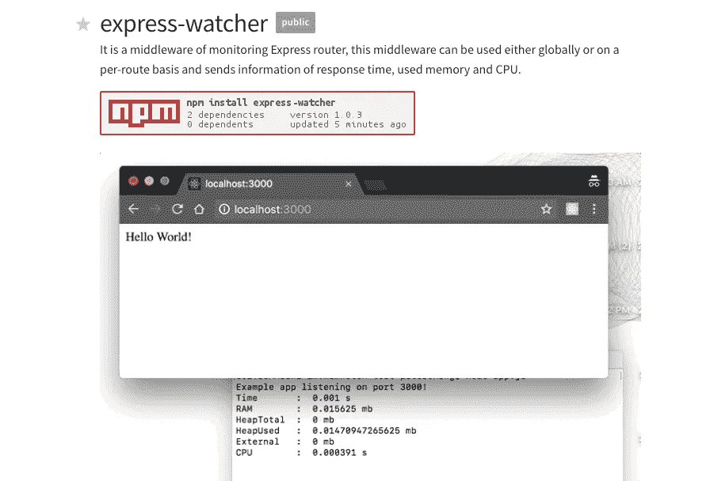
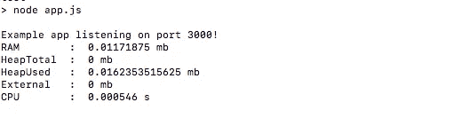
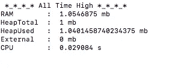

# [Express.js]测量 HTTP 请求的性能

> 原文：<https://medium.com/hackernoon/express-js-measuring-performance-of-http-request-nodejs-javascript-react-redux-testing-time-speed-web-f7b7ceb6f586>



`express-watcher`是一个监控快速路由器的中间件，帮助观察 R **响应时间**、 **RAM、堆内存**和 **CPU** 的信息。

在开发同构应用程序(React-Redux-ServerRendering)的过程中，跟踪性能问题变得越来越困难，因为性能会受到很多因素的影响:
— Express 服务器性能
— API
—组件设计(React)
—算法
—浏览器性能

这是一个帮助我在开发阶段(**不是生产阶段)发现性能问题的工具！！！**)。

# 安装

```
$ npm install --save express-watcher
```

# 使用

打印每个请求

```
**var resourceMonitorMiddleware = require('express-watcher').resourceMonitorMiddleware***// example without callback function***app.use(resourceMonitorMiddleware)**
```

从每个请求中获取监控数据

```
**var resourceMonitorMiddlewareCB = require('express-watcher').resourceMonitorMiddlewareCB***// example with callback function*app.use(function(req, res, next){**resourceMonitorMiddlewareCB(req, res, next, function(diffJson){
      console.log(' diffJson : ', diffJson)
   })
}**)
```

## 1-监控每个响应

将对象作为回调返回:

```
{ diffRss: 0.0078125,
  diffHeapTotal: 0,
  diffHeapUsed: 0.012725830078125,
  diffExternal: 0,
  diffCpu: 0.000427 }
```

和自动打印:



## 2-监控所有时间高位信息

关闭(CRT+c)节点过程时，打印所有高电平信息

和自动打印:



# 参考

[https://www.npmjs.com/package/js-meter](https://www.npmjs.com/package/js-meter)

[https://www.npmjs.com/package/express-watcher](https://www.npmjs.com/package/express-watcher)