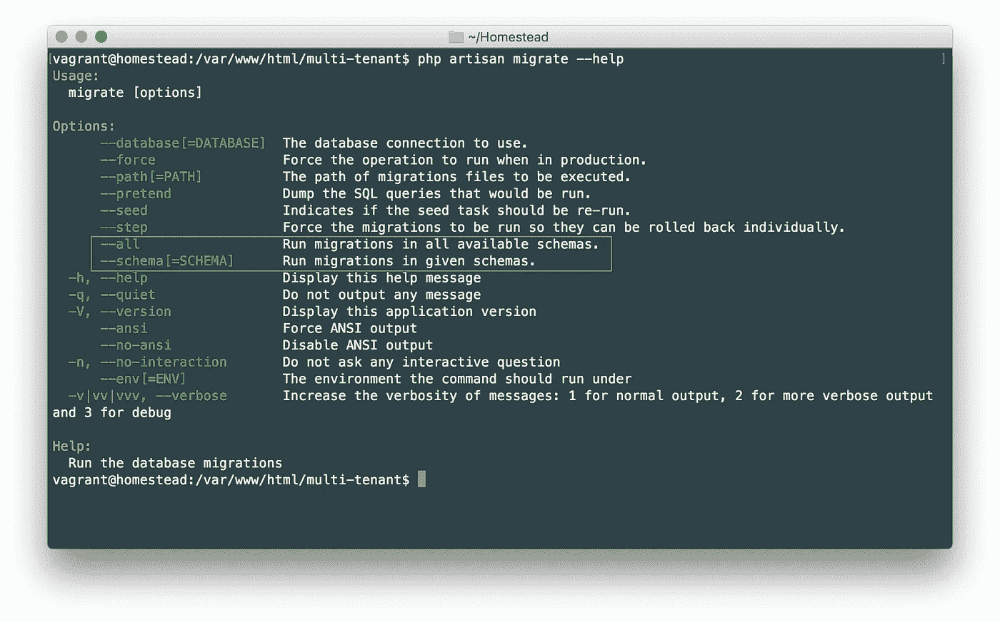
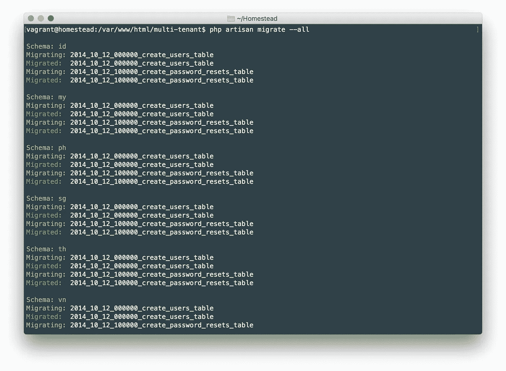
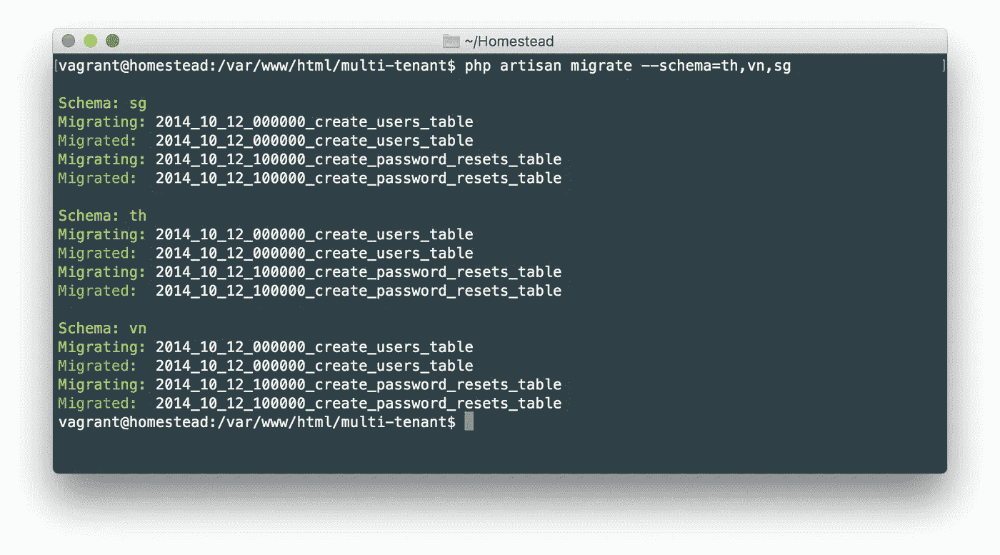
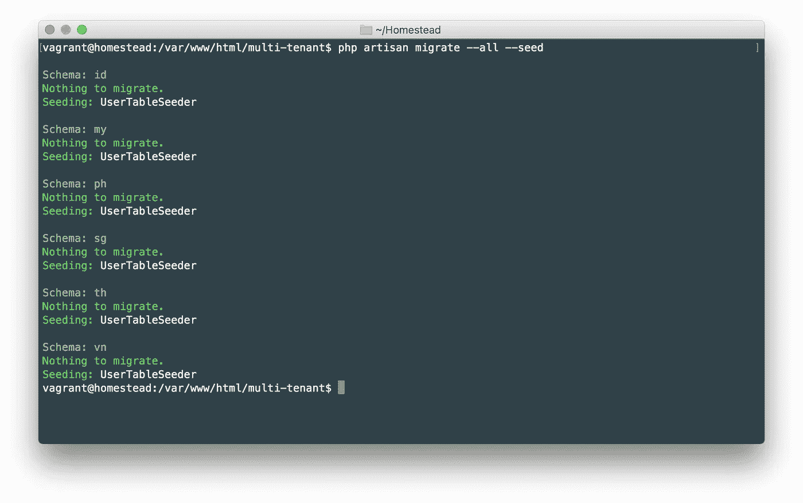
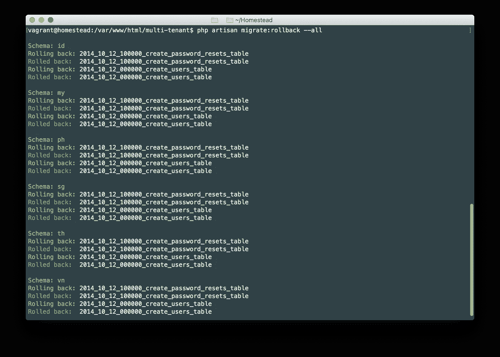
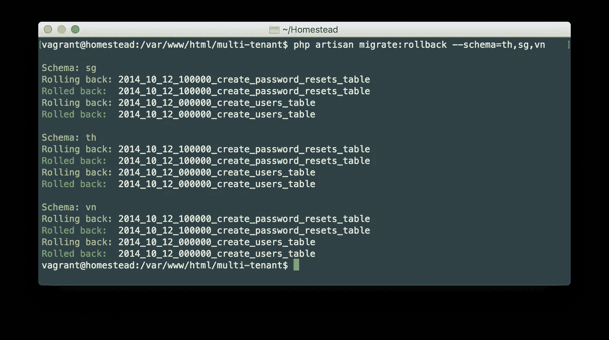
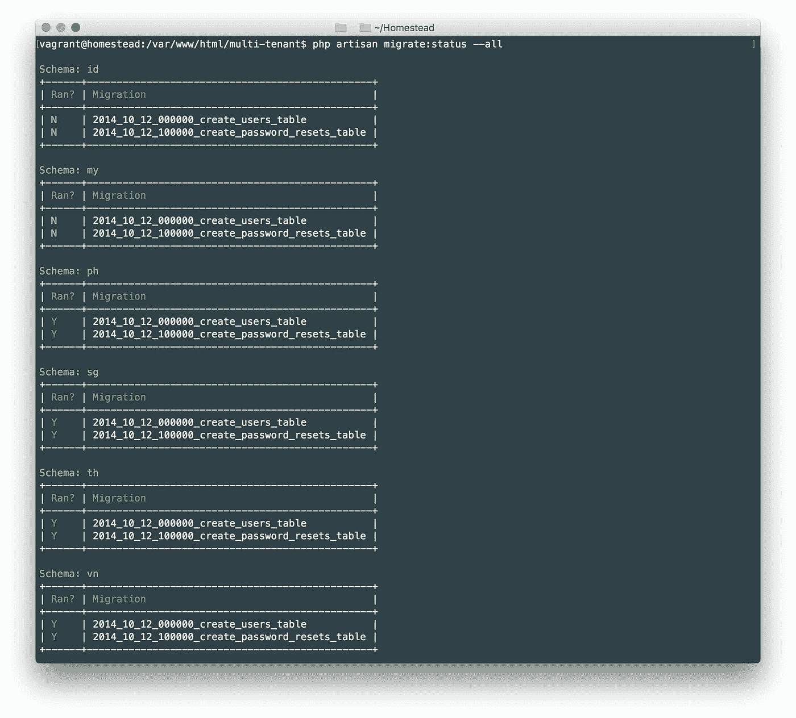
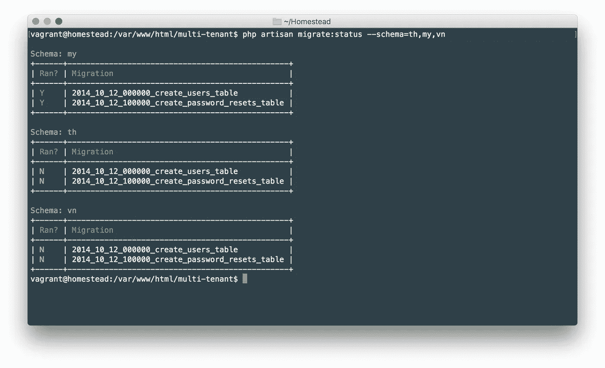

# 扩展 Laravel 的迁移命令以添加新选项

> 原文：<https://medium.com/hackernoon/extending-laravels-migration-command-to-add-new-options-90b5a0fc4ef4>

> 这是我的[上一篇文章](https://hackernoon.com/multi-tenant-application-with-laravel-and-postgres-abbb137bdbc8)的延续，在那篇文章中，我们讨论了使用 Laravel 和 Postgres 创建多租户应用。我建议您在阅读本文之前先阅读那篇文章。

由于我们的多租户应用程序已经就绪，我们希望利用 Laravel 的控制台命令来处理我们的迁移。在本文中，我们将看到如何扩展 Laravel 的迁移实现，以优雅地处理多租户应用程序[的所有模式的迁移。](https://hackernoon.com/tagged/app)

# 概观

[Laravel](https://hackernoon.com/tagged/laravel) 在`migrate`名称空间中提供简单的控制台命令来处理迁移。例如:

```
$ php artisan migrate
$ php artisan migrate:rollback
...
```

但是，您可能已经注意到，这些命令将只在默认模式下运行迁移，在我们的例子中，需要为所有模式运行。我们将扩展 Laravel 提供的命令，添加两个新选项:

*   `--all`
*   `--schema=[SCHEMA]`

因此，我们将能够:

```
# Run migrations in all available schemas.
$ php artisan migrate --all# Run migrations in given schemas.
$ php artisan migrate --schema=th,vn,ph# Rollback migrations in all available schemas.
$ php artisan migrate:rollback --all# Rollback migrations in given schemas.
$ php artisan migrate:rollback --schema=th,vn,ph
```

> 我使用 Laravel 5.5 和 PostgreSQL 9.5 进行设置。

# Laravel 控制台命令

Laravel 中的控制台命令实现基本上是一个[命令设计模式](https://www.sitepoint.com/understanding-the-command-design-pattern/)的实现。每个命令都有它自己的`handle`方法，每当一个命令被调度时就会被触发。

> 命令模式是一种行为设计模式，其中使用一个对象来表示和封装稍后调用方法所需的所有信息。这些信息包括方法名称、拥有该方法的对象以及方法参数的值。—维基百科

Laravel 中的数据库命令可以在`Illuminate\Database\Console\Migrations`名称空间中找到。我们只需要用自己的实现来覆盖它们。

# 添加新选项

在`app/Console`中创建一个名为`Migration`的文件夹。我们将把所有的迁移命令放在这个文件夹中。创建一个名为`MigrateCommand.php`的文件。

app/Console/Migration/MigrateCommand.php

这个类扩展了`Illuminate\Database\Console\Migrations\MigrateCommand`，它基本上是实现`migrate`命令(`php artisan migrate`)的类。注意，在构造函数中，我们通过添加选项`--all`和`--schema`来扩展它的签名。然后我们用所需的参数调用父构造函数。

我们现在需要将它注册为 Laravel 的默认`migrate`命令。为此，在`app/Http/Providers`目录中创建一个名为`VentureMigrationServiceProvider`的服务提供者，并在`config/app.php`中注册它。

注意，这个服务提供者扩展了 Laravel 的迁移服务提供者`Illuminate\Database\MigrationServiceProvider`，而不是默认的`Illuminate\Support\ServiceProvider`。

app/Http/Providers/`VentureMigrationServiceProvider.php`

`registerMigrateCommand`扩展别名`command.migrate`中可用的 singleton 对象，并返回我们自己的 *MigrateCommand* 。`command.migrate` 别名指向`Illuminate\Database\Console\Migrations\MigrateCommand`对象。所以覆盖`command.migrate`也将覆盖 Laravel 的默认 *MigrateCommand* 。

运行`php artisan migrate --help`。您可以看到我们之前添加的两个新选项。



# 该处理方法

每当我们运行`php artisan migrate`时，`MigrateCommand`中的`handle`方法就会被执行。让它响应我们新添加的选项。

app/Console/Migration/MIgrateCommand.php

`handle`方法很简单。如果`--all`方案通过，我们将为所有可能的企业进行迁移。如果传递了`--schema`选项，我们将为给定的模式运行它，否则我们将只调用默认的父处理程序。`runFor`方法存在于`MigrationTrait`中，稍后我会解释。

# 迁移特性

因为当我们覆盖像`migrate:rollback`和`migrate:status`这样的命令时，我们会经常使用一些公共方法，所以我们将提取特征中的一些公共方法。姑且称之为`MigrationTrait`。

> 注意，您也可以为此创建一个 AbstractClass。你想如何实现这一点取决于你。在本教程中，我将使用 trait。

app/Console/Migration/MigrationTrait.php

`connectUsingSchema`方法根据传递的参数切换模式。该方法中的第一行覆盖全局配置，下一行将清除当前数据库连接。断开数据库是必要的，因为 Laravel 缓存连接并再次使用它。因此，在这种情况下，只更改全局配置是行不通的。重新连接是由 Laravel 自己完成的，所以在我们的方法中我们不需要重新连接数据库。在重新连接期间，Laravel 将使用基于当前我们传递的模式的配置的模式。

`getValidSchemas`顾名思义，将从传递的参数中返回所有有效的模式。记住我们将以`--schema=th,vn,sg`格式从命令行传递模式。我们首先需要用逗号展开参数，并从我们的冒险列表中返回有效的模式。

`runFor`方法循环通过我们在参数中传递的所有冒险，并运行命令(migrate，rollback，等等)。).方法的第一行保存默认模式，该模式用于在方法结束时重置模式。然后，我们遍历 ventures，切换模式，并运行当前模式的父处理程序。

# 测试迁移命令

在这个阶段，我们的`MigrateCommand`已经准备好为所有企业处理迁移事宜。让我们使用`--all`选项运行一些迁移。



注意，运行`php artisan migrate`将只运行默认模式中的迁移，默认模式可以在`.env`中定义，正如在[上一篇文章](http://hackernoon.com/multi-tenant-application-with-laravel-and-postgres-abbb137bdbc8)中提到的。

现在，尝试用`php artisan migrate --schema=th,sg,vn`运行特定模式的迁移。这将为*泰国*、*新加坡*和*越南*的企业进行迁移。



> 以这种方式扩展迁移的主要优点是，我们仍然可以链接由 Laravel migrate 名称空间中的命令提供的所有其他选项。例如，你可以运行`php artisan migrate --all --seed`。很酷吧。



# 回滚命令

现在让我们扩展`migrate:rollback`命令。在`app/Console`中创建一个名为`RollbackCommand.php`的文件。这个类将扩展`Illuminate\Database\Console\Migrations\RollbackCommand`，这是 Laravel 对`migrate:rollback`命令的实现。

`handle`方法与我们之前讨论的相同。

与`MigrateCommand`类不同，我们需要覆盖`RollbackCommand`类中的`getOptions`方法，以便向列表中添加新选项。

app/Console/Migration/RollbackCommand.php

你可能会想为什么我们需要在`RollbackCommand`中覆盖`getOptions`，而不是在`MigrateCommand`中。它就是这样实现的。貌似[泰勒奥特威尔](https://medium.com/u/d694c31ce941?source=post_page-----90b5a0fc4ef4--------------------------------)不知什么原因在最近的版本里改了。检查[这个提交](https://github.com/laravel/framework/commit/7052fe0aca07b2cd931bd19928db3264472c286a)。如果你知道他为什么这么做，请在评论中回答；)

此时，我们的回滚命令几乎准备好了。我们现在需要做的就是告诉 Laravel 使用这个类，而不是默认的类。我们可以在我们之前创建的`VentureMigrationServiceProvider`中这样做。

app/Http/Providers/`VentureMigrationServiceProvider.php`

`registerMigrateRollbackCommand`扩展别名`command.migrate.rollback`中可用的 singleton 对象，并返回我们自己的`RollbackCommand`。

# 测试回滚命令

我们现在可以用`php artisan migrate:rollback --all`全部回滚。



要回滚特定模式，请使用`php artisan migrate:rollback --schema=th,sg,vn`。



# 状态命令

Status 命令显示您的迁移状态。当您想要检查哪些迁移已经运行，哪些尚未执行时，此命令通常很有帮助。我们可以像扩展`RollbackCommand`一样扩展`StatusCommand`。

app/Console/Migration/StatusCommand.php

同样，在`VentureMigrationServiceProvider`中，将`App\Console\Migration\StatusCommand`注册为 Laravel 的默认状态命令。

app/Http/Providers/`VentureMigrationServiceProvider.php`

`registerMigrateStatusCommand`扩展别名`command.migrate.status`中可用的 singleton 对象，并返回我们自己的`StatusCommand`。

# 测试状态命令

要查看我们所有模式的状态，运行`php artisan migrate:status --all`。



要查看特定模式的状态，请运行`php artisan migrate:status --schema=th,my,vn`。



# 最后的话

同样，我们可以覆盖剩余的命令:`migrate:fresh`、`migrate:reset`、`migrate:refresh`和`migrate:install`。扩展默认迁移而不是创建一个新的迁移的一个主要优点是，我们仍然可以链接其他有用的选项，如`--force`、`--seed`、`--database`等。

下一步:你能让`--path`选项为企业定义不同的迁移路径吗？在评论中让我知道你的实现:)

当前和[先前教程](http://hackernoon.com/multi-tenant-application-with-laravel-and-postgres-abbb137bdbc8)中使用的所有代码都可以在这个 [Github repo](https://github.com/ankitpokhrel/laravel-multitenant) 中找到。

仅此而已！编码快乐！