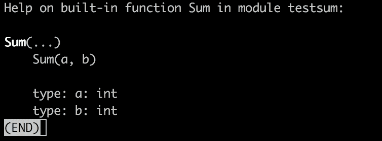
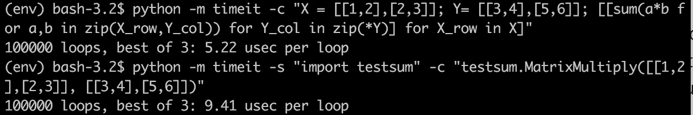

# 在 Go 中扩展 Python 3

> 原文：<https://medium.com/hackernoon/extending-python-3-in-go-78f3a69552ac>

几十年来，扩展 Python 一直是该平台的核心功能，Python 运行时提供了一个“C API”，它是一组头文件和核心类型，用于用 C 编写扩展并将它们编译成 Python 模块。

但是，你 ***真的*** 要用 C 写 Python 的扩展吗？为什么我们不能用更现代的方法，比如围棋。

# 背景调查——以前没人做过吗？

我发现了一些 2015 年写的旧文章，要么是为 **Python 2** 写的，要么是为 Go 1.5 写的。自那以后，围棋发生了很大的变化，所以很难找到一些最新的和维护良好的东西。

[本文](https://blog.filippo.io/building-python-modules-with-go-1-5/)是针对 Go 1.5 的，混合使用了 C 宏和 Go。另外，`cgo`而不是原生 Go 函数的一个很大的限制是它不支持 variadics(即`*args`)，这在大多数 Python 模块中都是一个大问题。

[gopy](https://github.com/go-python/gopy) ，一个从 Go 包自动创建模块的工具。乍看之下，这似乎会导致问题，因为它在编译时需要一个特定的[标志，而这在生产中是不推荐的。还有，它](https://github.com/go-python/gopy/issues/83)[不支持 Python 3](https://github.com/go-python/gopy/blob/master/gen.go#L81) 。

[go-python 看起来](https://github.com/sbinet/go-python)像是一个不错的候选，但它是为 Python 2 绑定而写的。

py 看起来很不完整，只覆盖了一些基本的 Python API。

我发现的其他例子[使用了 cffi 包](https://dustymabe.com/2016/09/13/sharing-a-go-library-to-python-using-cffi/)，所以代码的消耗感觉不像一个模块，它只是一种调用 Go 编译方法的方式。它也没有本机绑定。

# 在 Go 中构建共享库

在 Go SDK 中，有一个叫做`cgo`的工具集，这是一种导入 C 头文件和访问外部库中描述的类型和方法的方法。

它还使您能够从 Go 构建共享库，并从 Go lang 中的方法自动构建 C 头文件

拿着这个非常简单的 Go 包

然后运行`go build -buildmode=c-shared -o sum.so sum.go`

你会看到 3 个文件，`sum.go sum.h and sum.so`。sum.so 文件是编译后的二进制文件，`sum.h`是描述二进制文件中定义了哪些方法和类型的文件头。

要通过用 C 编写模块来扩展 Python，你需要从导入`Python.h`开始，并用 C 描述一组 boiler plate 代码。因为我们是在 Go 中，这变得更加棘手，正如之前的作者所展示的，需要在 Go 中使用 C 宏，或者大量的 Go 代码来包装方法。

是吗？

# 派宾根

Filippo 原始文章中的许多工作都是关于绑定的。绑定就像使用 HTTP REST API 一样，您需要知道方法的名称、预期的参数和响应。

[PyBindGen](http://pybindgen.readthedocs.io/en/latest/tutorial/#supported-python-versions.) ，一个已经存在很久的工具，可以基于 C 或 C++头文件创建 2 或 3 的 Python 模块绑定。您可以将源代码包含在您的包中，甚至可以编译并嵌入到 setuptools 中。

如前所示，我们已经从 Go 编译器中构建了头文件。

通过编写一个简单的`build.py`脚本，导入 PyBindGen，我们可以让它加载`sum.h`。将其作为导入添加，并在模块中描述一个名为 Sum 的方法，该方法接受两个整数 a 和 b，并返回一个整数值。

调用 build.py 会用 C 写一个 Python 模块到屏幕上。一旦这个模块被编译，它将导入 Go 编译的二进制文件并作为一个本地 Python 模块提供。通过管道将其传递给`sum.c`来创建源代码，将我们的二进制文件包装到 Python 模块中。先确定你`pip install pybindgen`。

`python build.py > sum.c`

# 编译模块

海湾合作委员会需要比联合国大门更多的旗帜，所以让我们开始收集吧。我们的 Python 运行时的路径和选项，在我的例子中是 Python 3.6，可以通过运行`python3.6-config --cflags`和`python3.6-config --ldflags`获取

然后调用 GCC 编译器编译 C 代码，由 PyBindGen 生成，它导入 sum.h 中定义的方法，这些方法又在 sum.so 二进制中。

`gcc sum.c -dynamiclib sum.so -o testsum.so {python-flags}`

# 导入和测试模块

我们的模块有一个方法，它将两个数相加并返回一个数。简单明了。

`(env) bash-3.2$ python
Python 3.6.1 (v3.6.1:69c0db5050, Mar 21 2017, 01:21:04)
[GCC 4.2.1 (Apple Inc. build 5666) (dot 3)] on darwin
Type “help”, “copyright”, “credits” or “license” for more information.
>>> import testsum
>>> testsum.Sum(1,2)
3`

有用！还有，`help(testsum.Sum)`其实是告诉你参数是什么，是什么类型。

# 更复杂一点的东西

所有的在线教程都展示了一个基本的求和或算术函数，这并不是很有用。如果你阅读了 C-API 文档，你会发现你可以访问常见的 Python 类型。

`cgo`的一个很大的限制是不能从函数中导出像`struct`这样的复杂类型，但是谁在乎呢！我们有 Python 令人敬畏的 PyObject 类型，它可以做几乎任何事情..

这一次我们将编写一个返回 Python 字典的函数。返回类型仍然是 PyObject 指针，这是一个总括。这一次我们需要导入类型，以便 Go 编译器知道它们是什么，这是来自 pkg-config(我们前面在 Gcc 中提到过)。此外，因为 [PyUnicode_FromString](https://docs.python.org/3/c-api/unicode.html#c.PyUnicode_FromString) 需要一个`char *`，所以我们使用一个函数来转换 Go 字符串。

我们将创建一个`str` Unicode 类型的键和值(毕竟这是 Python 3)。

让我们测试一下，我们需要用新方法更新 build.py 文件并重新构建库

我们已经指定被调用的不拥有返回值(即内存)，但是关于如何处理垃圾收集的更多信息可以在[文档](http://pybindgen.readthedocs.io/en/latest/tutorial/#memory-management-for-pointer-types)中找到。

`(env) bash-3.2$ python
Python 3.6.1 (v3.6.1:69c0db5050, Mar 21 2017, 01:21:04)
[GCC 4.2.1 (Apple Inc. build 5666) (dot 3)] on darwin
Type “help”, “copyright”, “credits” or “license” for more information.
>>> import testsum
>>> testsum.NewDictionary()
{‘key’: ‘value’}`

接下来，为什么不看看 Go 中有哪些 API 和包可以移植到 Python 呢？

你能用 Goroutines 实现什么？Python 3.6 中的异步 API 呢？我认为这是可能的

# 性能呢？

我把这个简单的函数放在一起乘 2 个矩阵

有趣的是，Go/CGo 中的 ***比纯 CPython 中的*** 要慢。

我可能犯了一些明显的错误。我也开始了解 C-API，所以这段代码需要类型检查和空引用检查，但是这个想法是存在的。

## 还卡在 Python 2 上？

[查看我在 Pluralsight 上关于从 Python 2 迁移到 3 的新课程。](https://www.pluralsight.com/courses/python-2-to-python-3)