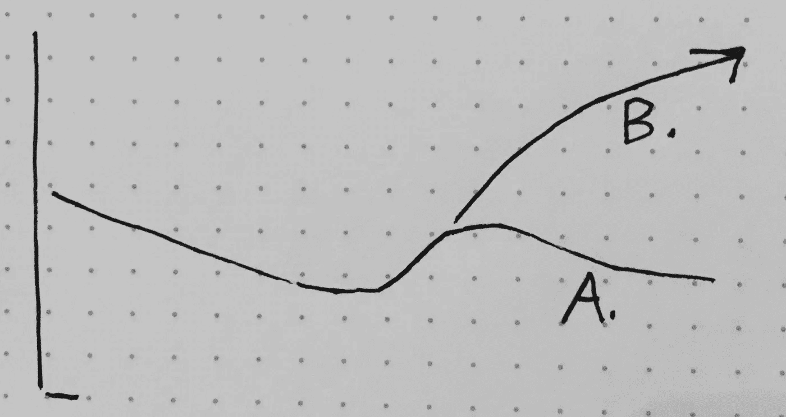

# 额外力量 5 小时敏捷

> 原文：<https://medium.com/hackernoon/extra-strength-5-hour-agile-746178e9305a>

它会让你度过一天。

今天我想讨论一下 5hr 敏捷，也就是快速修复敏捷，也就是我们现在需要走得更快的敏捷。

我担心的是。

我们对公司(如果我们是内部人员，就是我们的公司)负有责任，诚实地对待从根本上改变事物所需的投资。安装[某种工具/方法]永远不够。没有一些认真的工作，你不会从 4 分(1-10 分)升到 9 分。转变需要几年时间，而不是几个月。你可能需要做一些重组和雇佣/解雇。

如果你的公司做得很好，而你不愿意真的承诺…你可能会做得更好，以节省资金和中断，并保持现状。我们都读过关于[上市公司](http://www.businessinsider.com/us-companies-are-dying-faster-than-ever-2015-8)死亡率加速的报道，所以也许你正在打一场硬仗。半心半意地尝试精益/敏捷并不会真正改变什么(见下面的 A)。

就像每周去一次健身房。你最好保住你的膝盖。

如果你在一家做“改变之光”的公司工作过，你就会知道这是多么令人沮丧。一线团队匆忙采用新的方式，管理和领导保持不变。你失去了你最好的人才，因为改变是无效的。“让我们实验一下”并不能解决问题。

要完成这项工作，您需要…

*   雇佣那些适应“新”工作方式的人
*   付钱让那些对“新”工作方式不感兴趣的人离开
*   将持续改进植入组织的 DNA 中
*   转变传统思维方式，特别关注领导力和高层管理
*   放慢速度，限制正在进行的工作，降低利用率
*   将工艺和质量放在首位
*   将安全作为先决条件(参见[现代敏捷](http://modernagile.org/))
*   雇佣教练和辅导员
*   拉近个人贡献者与客户/用户的距离
*   让团队致力于成果/收益(而不是仅仅致力于“运输项目”)
*   尽可能停止使用代理指标(如“速度”)
*   去除管理层(或重新培训新角色)
*   改变管理文化、期望和要求
*   合并某些部门(如运营和工程)
*   在产品开发团队中嵌入 UX、数据科学和质量保证
*   重塑 QA 在整个组织中的角色，消除交接
*   解决依赖性(可能涉及招聘)
*   改变您资助/资源计划和团队的方式
*   改变您设计和部署产品/服务的方式
*   可视化项目组合/项目/团队级别的工作并解决瓶颈
*   更加开放和透明
*   还有更多…

不琐碎，是吧？

我们投入了大量的资金来建立不会带来麻烦的敏捷实践。我认为你应该做的就是改变现状。