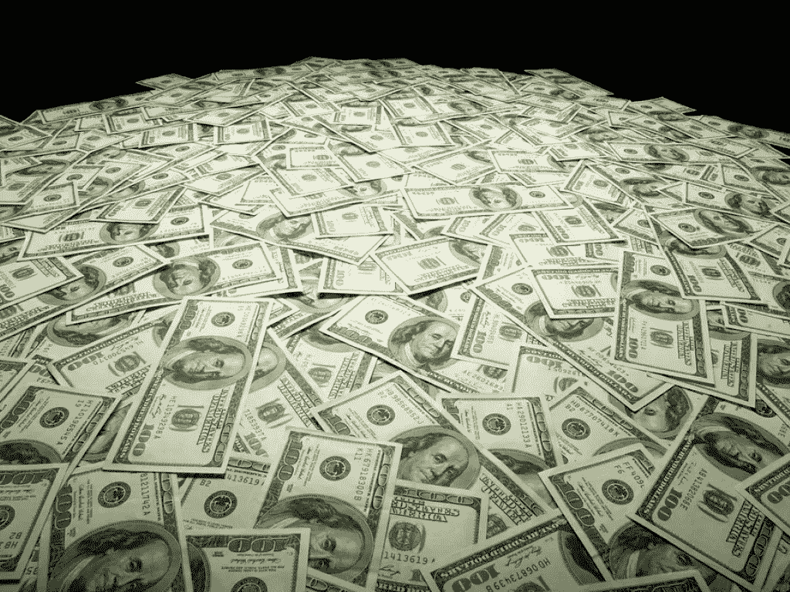
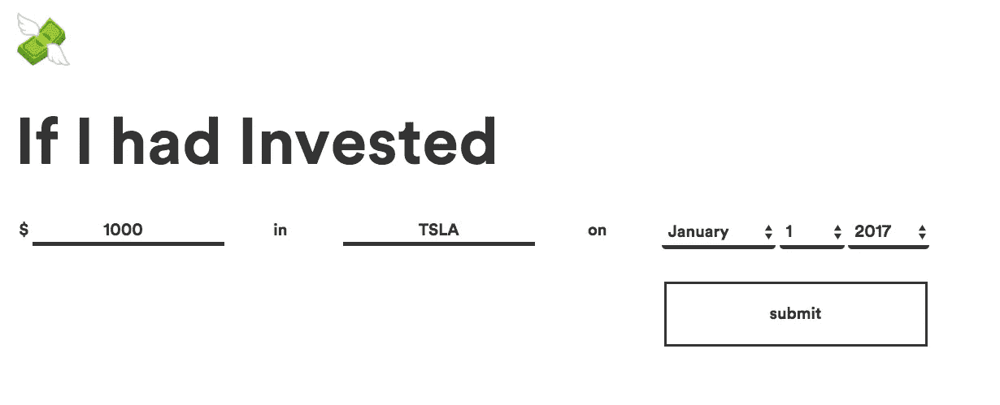

# ExtremeFOMO💸

> 原文：<https://medium.com/hackernoon/extremefomo-19a852fea4ff>

## 投资苹果、脸书、特斯拉和 Snapchat，你会赚多少钱？

## 你所做的事情有百分之多少是受社会影响的？

在中学操场上，同龄人的压力不会消失。我们都做出重大决定，这些决定通常在某种程度上是由他人的行动所推动的。

派对。购物。体育。结婚。我们支出的很大一部分可以归因于“害怕错过”(FOMO)。

> 佛墨
> 
> ˇfūm/，发音
> 
> *名词，非正式*
> 
> 对某个令人兴奋或有趣的事件可能正在别处发生的焦虑，通常是在社交媒体网站上看到的帖子引起的。

FOMO 是真实的，它被数字世界放大了。

你现在不能登录 Snapchat 或脸书，否则你会开始嫉妒你朋友的杰出习惯。

那你会怎么做呢？很可能，你被鼓励多出去走走。人们鼓励你花更多的钱——因为害怕错过机会。

这同样适用于投资领域💰。没有人想错过赚钱的机会。而投资股票让它看起来如此容易！

## 自 2012 年以来:

*   特斯拉(TSLA):上涨 **1075.35%**
*   脸书:上涨 **301.52%**
*   波音(BA):上涨 **242.91%**

事后看来，这一切看起来是如此简单。如果我们都在“那时”投资，我们现在就是百万富翁了！

我的朋友 Shiv 和我一起开发了这个小小的网络应用程序，让你看到(并哭泣)在过去的 15 年里你投资赚了多少钱。TL；DR——这通常是一大笔钱。

ExtremeFOMO.com

FOMO 是真实的。

你可以通过这个网站查看投资脸书、特斯拉、苹果、Snapchat、脸书、GoPro 和许多其他股票会赚多少钱。

## 在[产品搜寻](https://www.producthunt.com/posts/extremefomo)上查看 [ExtremeFOMO](http://www.extremefomo.com/)

但是回到一个更严肃的话题——我是“独立思考”的忠实拥护者

外面有太多的噪音告诉你在生活中应该做什么和不应该做什么。(我有时会为此做出贡献，并且我总是试图记下这些都不是规定性的)。

说到底，没有人能完全理解你的生活。我们都是个体。这是一个单人游戏。

**你做你的。**

# End #extremefomo

# 去哭吧😭在[http://www.extremefomo.com/](http://www.extremefomo.com/)