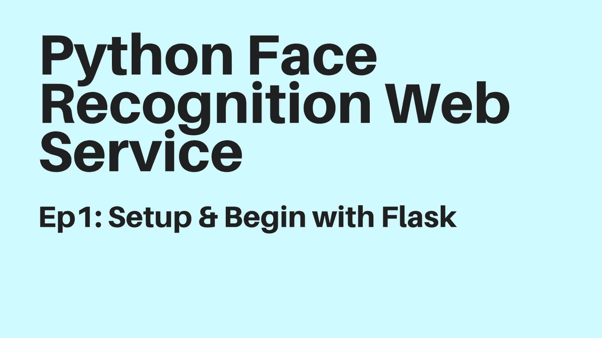

# 使用 Python Dlib Flask 的人脸识别服务

> 原文：<https://medium.com/hackernoon/face-recognition-service-with-python-dlib-flask-ca33d335fa26>



当在相机直播服务工作时，我决定将机器学习加入到这个项目中。这意味着我们的相机可以学习知道谁是家庭成员，在视频流中，如果相机中的人不是家庭成员，就向主人发出警告。这只是一个想法，你可能有更多的想法，用于其他设备，也许门开着…

## Python 开发 Pycharm

我推荐下载用于 Python 开发的 [Pycharm](https://www.jetbrains.com/pycharm/download/) 工具。

## Python 虚拟环境安装

```
sudo pip install virtualenv
```

## 创建新的 python 项目

```
mkdir projectcd projectvirtualenv venv
```

## 设置 Boost Python

当我们为 python 模块编译 [Dlib](https://github.com/davisking/dlib) c++时，我们需要 boost python

来编译 Boost。Python 自己从 http://boost.org[下载 boost](http://boost.org)然后进入 boost 根文件夹

```
./bootstrap.sh --with-libraries=python
./b2
sudo ./b2 install
```

## 安装 dlib C++库

Dlib 是一个现代 C++工具包，包含机器学习算法和工具，用于用 C++创建复杂的软件来解决现实世界的问题。[https://github.com/davisking/dlib](https://github.com/davisking/dlib)

```
brew install cmakegit clone https://github.com/davisking/dlib.gitcd dlib
mkdir build; cd build; cmake .. -DDLIB_USE_CUDA=0 -DUSE_AVX_INSTRUCTIONS=1; cmake --build .
```

在我们的 Python 项目中激活 Python 虚拟环境

```
cd /PATH-OUR-PROJECT
cd venv
source bin/activatepython setup.py install --yes USE_AVX_INSTRUCTIONS --no DLIB_USE_CUDA
```

## 瓶

使用 flask 作为 Python 框架构建 api 服务。API[http://flask.pocoo.org/docs/0.12/api](http://flask.pocoo.org/docs/0.12/api)

```
from flask import Flask,Response,json
app = Flask(__name__)

@app route('/', methods=['GET'])
def home():
  return Response(json.dumps({"api": "1.0"}), status=200, mimetype='application/json')

if __name__ == "__main__":

  app.run()
```

## 数据库ˌ资料库

我们可以使用任何数据库来存储用户信息。在这个项目中，我只使用 Python 的 sqlite3 默认支持。设计 slqlite[http://sqlitebrowser.org/](http://sqlitebrowser.org/)的工具

## 录像

Part 1: Setup and begin with Flask

## 第 2 部分:人脸识别

## 第 3 部分:基本前端

> 请在 [Youtube](https://www.youtube.com/channel/UCtS27upPphvp_lH_ttXsANA) 上为我订阅下一部分。
> 
> github:[https://github.com/tabvn/face-recognition-service](https://github.com/tabvn/face-recognition-service)