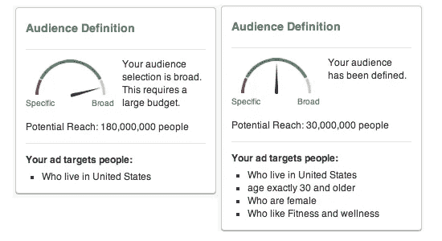
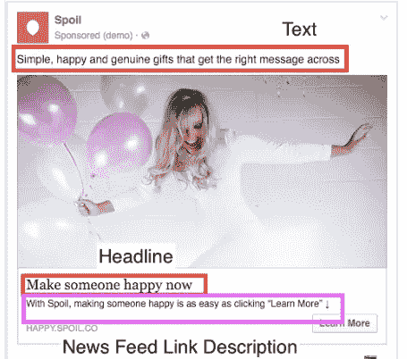
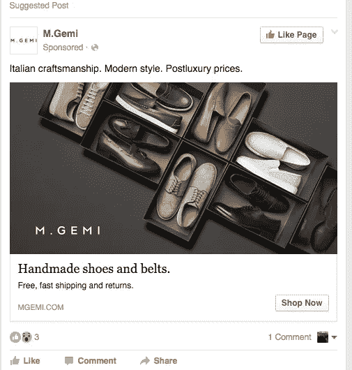
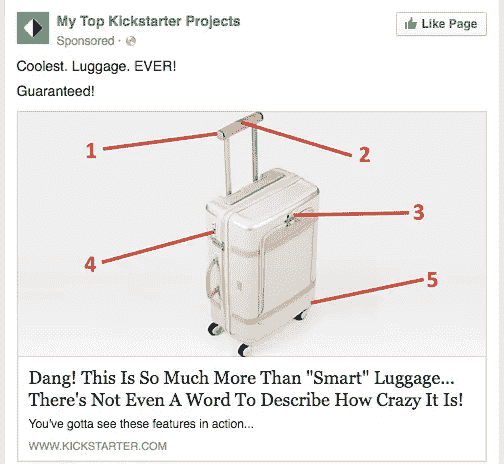
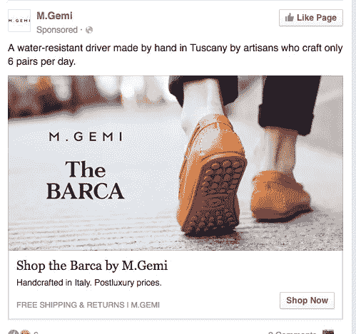
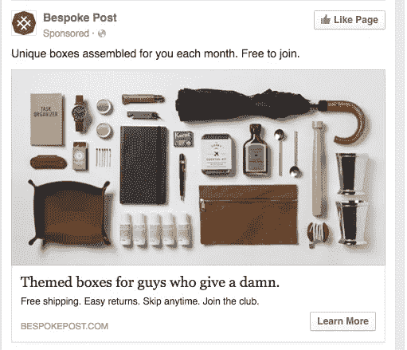

# noobs 的脸书广告

> 原文：<https://medium.com/hackernoon/facebook-ads-for-noobs-5c6bcd48cd93>

在运行我的[初创公司](https://hackernoon.com/tagged/startup) ( [宠坏](https://www.spoil.co))时，获取流量这一令人敬畏的(理解为*挑战)*任务是我决定要解决的事情。像几乎所有人一样，我直接跳进了脸书的广告。运行脸书广告的基础很简单，但我缺少的是一些“最佳实践”的提示。多亏了牛逼的杰弗里·塔拉吉奇、一点点研究和大量的反复试验，我总结了一些基本的经验法则，帮助我开始(并开展一些非常积极的投资回报率活动)脸书广告。希望它们也能帮助你🙂

哦，在你开始之前，帮你自己一个忙，学会使用 [**强大的编辑器**](https://www.facebook.com/business/help/162528860609436) ，它将为你节省大量的广告管理时间。

## 观众规模

虽然脸书给了你一个关于你的观众规模的可爱的小图表，但是很难确定“最佳点”。200 万观众真的比 3000 万观众好定义吗？

180 000 000 is too broad? You don’t say

我发现观众人数在 20 万到 200 万之间对我最合适。这后来让我可以钻得更深，把它们分割得更细。

## 永远学习

你可以在 24 小时内开始学习，或者花 100 美元左右。等到你达到 200-300 次印象时，再开始下结论。

广告的保质期在 3-14 天之间，并且需要不断变化(这使得脸书广告非常耗时，尤其是如果你没有一个可靠的路线图)。免费的建议、照片和图像**将成为你最大的阻碍。**

## 写作文案

写**你的文案**的时候，不要矫情，不要白兰地。只要确保你明白你在做什么。

AdEspresso 有一篇关于脸书广告的很棒的文章。这是我从中提取的一些东西。

标题应该在 5 个字左右。
帖子文字和链接描述可以稍微长一点。广告帖文字要在 **14 字**左右，链接描述在 **18 字**左右。

Anatomy of an ad

在你的文本中用一些流行的词来吸引人们的注意力:

*   你(我们喜欢在广告中看到“你”这个词)
*   免费(我们喜欢免费的东西)
*   因为(我们想要我们问题的答案。我们天生好奇。)
*   立即/现在(现在就给对方提供一些东西！立即给出报价。)
*   新(我们是追求新奇的人)

Free?! Fast?! Italian craftmanship?!?! Holy moly, this ad is awesome!

积极一点，用这样的词:

*   惊险的
*   勇敢的
*   超级美味
*   伟大的

Awesome Kickstarter ad. Clear messaging, with very strong wording.

你的广告文案应该宣传一些具体的东西，而不是你的整个网站或整个服务。不要告诉用户“你的网站上有好看的衣服”，让他们知道他们可以买一双 [**杀手袜**](https://www.google.com/imgres?imgurl=http%3A%2F%2Fi.imgur.com%2FCfIVi.jpg&imgrefurl=https%3A%2F%2Fwww.reddit.com%2Fr%2Fpics%2Fcomments%2F13vf9g%2Fkiller_socks%2F&docid=tplxNxHOCJPf8M&tbnid=-Fud1n5qMbMrVM%3A&w=500&h=468&bih=801&biw=1440&ved=0ahUKEwj27PWTltDNAhUP22MKHTGtA14QMwhhKAAwAA&iact=mrc&uact=8) **！！！**

## 保持措辞简单，重点突出

当你做广告时，不要使用让用户困惑的超长标语。用户不阅读。你必须马上站出来。

想出三个词来描述你的提议，并以此作为开场白！

关键在于:广告听起来越不像广告越好。

所以你的文案不应该听起来像是在你当地的睡眠世界卖床垫。真实一点。要真实。

选择一个主要的好处，并把它放在前面和中心。然后在广告的其他地方重复。然后把同样的好处和你的其他好处放在你的登陆页面上(创建[挤压页面](http://www.wordstream.com/blog/ws/2013/09/16/squeeze-page)是关键，但那是另一个故事了)。人们懒惰，不读书，广告就是重复。不要羞于告诉他们同样的事情 10 次。

## 点击率很重要

*   2%+ =向你的首席执行官要更多的预算，你正在扼杀它🚀
*   1–2% =非常好，您可以在此范围内开展一些非常有利于投资回报的活动。
*   < 1% =取消广告，有问题。

总的来说，点击率是煤矿里的金丝雀，你的漏斗顶端的指示器告诉你你的广告表现如何。

## CPC 不重要

怎么了？太疯狂了，对吧？不完全是。你要问自己的问题是:“一次点击对你来说值多少钱？”。

答案是视情况而定，所以当你建立新的活动时，不要担心这个指标，给你的广告团队空间。

总的来说，以 1 美元一次的点击开始你的活动，然后看看效果如何。获得零体积？提高你的出价。CTR 通过屋顶和音量是真棒？降低你的出价。冲洗并重复。

如果你的网站转换率非常高，那么为点击量出价就没有问题。当你可以花 100 美元点击赚 2000 美元时，为什么要花 5 美元点击赚 100 美元。KACHING🤑💸

## CPM 是给笨蛋用的

除非你的广告非常有针对性，你的受众非常明确，否则不要做傻瓜，不要用 CPM 竞价。

## 按平台和设备竞价

桌面端的转化率高于移动端，平板电脑介于两者之间。因为转换率根据人们使用的设备不同而不同，这些点击对你来说价值也不同。

对于转化，对桌面点击的出价要高于移动点击。

一旦你的移动结账流程得到优化，我们也可以开始引入移动流量。

## 按性别出价

男人和女人可能都喜欢你的产品，但是他们会以同样的速度在网站上改变吗？大概不会。所以这些点击对你来说价值不同。

## 按年龄出价

根据你的产品，年龄范围可以发挥很大的作用。试图让人们安装你的应用程序，下一个 Snapchat 是什么？试试 20-30 岁的人群。

卖退休计划？跳过一二十年，用 45+去

## 按位置投标

如果你正在经营一个电子商务，这是特别有用的，但是即使你不是，你仍然可以应用这个概念。

我发现在“不酷”的州竞争较少，比如 T2、威斯康辛、内布拉斯加和俄亥俄州。现实是，在纽约和旧金山，每个人和他们的狗都在争夺眼球。当别人摇摆不定时，你就摇摆不定。

## 天哪，看看这些利益😱

如果你的产品与某个行业有明显的关联，那么一定要通过兴趣竞标。举例来说，如果你在卖蛋白质，你可能想要对有兴趣的观众出价。只是要小心，投标的兴趣可以是一个巨大的时间吮吸，因为有这么多。

## IOS vs Android

如果你是在手机 app 上要钱，我建议先瞄准 IOS 用户。他们花 moola，我们安卓用户不花。

## 价格是最有力的关卡

你的财务模式可能不喜欢 50%的促销，你的品牌经理也不想建立一个基于大折扣的公司。然而，如果我们正在做一个宣传片或一个特殊的，这需要在我们的广告前面和中心。Psst 记住上面的“使用免费单词”提示。

## 价格之后，工作的排他性角度

有几种方法可以做到这一点，但总的想法是，如果你给人的印象是某样东西卖得很快，人们会喜欢它，但一旦你的神奇产品消失了，它就会永远消失，它会扰乱人们的头脑，他们将不得不拥有它。

然而，消费者并不愚蠢。这些项目必须是唯一的。说你是卖球鞋的，说它是独家的是不行的(Yeezys 另一方面…)

A great example of exclusivity and luxury

## 形象就是一切

一些关于图像的好建议:

*   鲜艳的颜色
*   辣妹/帅哥
*   高调
*   黑色和白色。

想想那些让你印象深刻的图像。它们是什么？它们有什么独特之处？

A great example of showing a lot of items but in a compelling and clean way.

## 独立于右栏竞价新闻订阅

为新闻订阅中的点击支付更多费用。购买右扶手和其他位置的费用要低得多。

## 哦，不，我的嘘！t 不起作用

当某样东西不起作用时，你怎么知道是你的观众还是你的广告？这里有一个窍门。如果受众非常广泛，那么很可能是广告。如果受众真的很窄(例如，威斯康星州阿伯茨福德 25-29 岁之间喜欢骑自行车的人)，那么很可能就是受众。

## 我的广告无人问津

有时脸书只是太早放弃广告。

有时是因为你的广告与你广告集中的其他广告太相似，有时只是脸书把它展示给 10 个人看，如果没有点击就放弃了。

有点令人沮丧，但你可以用核武器攻击广告，再试一次。

## 最后

在创造投资回报积极的脸书活动方面，还有很多事情要做(创造看起来相似的受众，根据在你网站上采取的行动重新定位，扩大广告支出……)，但这是一个良好的开端。

让我知道你们对这篇文章的看法，让我知道什么对你们有用🤗

如果你喜欢这篇文章，请点击下面的❤️，这样其他人会在媒体上看到。

[我的推特:@ mlevkov](https://twitter.com/mlevkov)

在下面加入我的时事通讯，获得更多酷的东西👇

> [黑客中午](http://bit.ly/Hackernoon)是黑客如何开始他们的下午。我们是 [@AMI](http://bit.ly/atAMIatAMI) 家庭的一员。我们现在[接受投稿](http://bit.ly/hackernoonsubmission)并乐意[讨论广告&赞助](mailto:partners@amipublications.com)机会。
> 
> 如果你喜欢这个故事，我们推荐你阅读我们的[最新科技故事](http://bit.ly/hackernoonlatestt)和[趋势科技故事](https://hackernoon.com/trending)。直到下一次，不要把世界的现实想当然！

