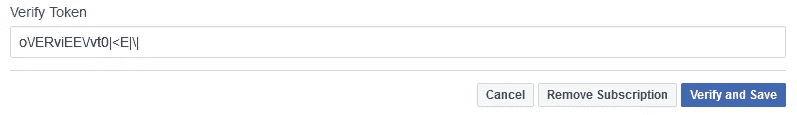
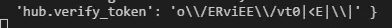

# 脸书 API 无法验证该 URL。回调验证失败，出现以下错误

> 原文：<https://medium.com/hackernoon/facebook-api-the-url-couldnt-be-validated-c1980581587b>


credit: [https://my.kualo.com/uk/knowledgebasekualo.php?kbcat=0&article=120](https://my.kualo.com/uk/knowledgebasekualo.php?kbcat=0&article=120)

试图[用强验证令牌设置 FB messenger webhook](https://developers.facebook.com/docs/messenger-platform/getting-started/app-setup/#webhook_setup) 。有点像这样:`o\/ERviEE\/vt0|<E|\|`



代码中也验证了这一点:

```
req.query['hub.verify_token'] === 'o\/ERviEE\/vt0|<E|\|'
```

但是，从 FB 收到的值是:`o\\/ERviEE\\/vt0|<E|\\|`



**这是奇怪的**。似乎没有关于[脸书](https://hackernoon.com/tagged/facebook)如何对特殊字符进行转义以验证令牌之类的[文档](https://hackernoon.com/tagged/document)参考。不确定其他实体是否也会出现这种情况。

结论:在使用特殊字符作为验证标记时，需要稍微小心一点。

*最初发布于*[*xameeramir . github . io*](http://xameeramir.github.io/)*。*